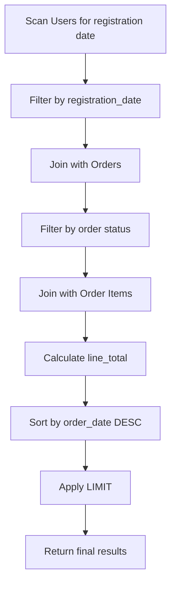

## Reading EXPLAIN ANALYZE plans
### Core Concepts

*   **`EXPLAIN ANALYZE` Overview:** A PostgreSQL command that executes a SQL query and returns its actual execution plan along with runtime statistics. It provides granular details on how the database processed the query.
*   **Purpose:** To identify performance bottlenecks, inefficient operations (e.g., full table scans, suboptimal joins), and validate the effectiveness of indexing strategies or query rewrites.
*   **Output Components:** Shows a tree structure of operations (plan nodes), their estimated costs (from `EXPLAIN`), and critically, their actual runtime statistics after execution (from `ANALYZE`).

### Key Details & Nuances

*   **Cost vs. Actual Time:**
    *   `cost`: The planner's *estimate* of resources needed (arbitrary units, not time).
    *   `actual time`: The *real* measured time (in milliseconds) spent executing that specific node. **Focus on `actual time` to find bottlenecks.**
*   **Rows vs. Actual Rows:**
    *   `rows`: The planner's *estimated* number of rows output by a node.
    *   `actual rows`: The *real* number of rows output by a node. Significant discrepancies indicate inaccurate planner estimates, often due to outdated table statistics (run `ANALYZE TABLE <table_name>;` or `VACUUM ANALYZE;`).
*   **Loops:** Indicates how many times a plan node was executed. Especially important for inner operations of `Nested Loop` joins. `actual time` shown is per loop. Total time for a node = `actual time` * `loops`.
*   **Plan Node Types (Common & Important):**
    *   **`Seq Scan` (Sequential Scan):** Full table scan. Often a bottleneck on large tables if an index could be used.
    *   **`Index Scan`:** Uses an index to fetch specific rows. Efficient.
    *   **`Bitmap Heap Scan`:** Two-step process: `Bitmap Index Scan` finds block locations, then `Bitmap Heap Scan` fetches rows from those blocks. Efficient for retrieving many rows via index (e.g., non-unique index, multiple `AND` conditions).
    *   **`Nested Loop Join`:** For each row from the outer relation, it scans/indexes the inner relation. Efficient when the outer relation is small and the inner has a suitable index.
    *   **`Hash Join`:** Builds a hash table on the smaller relation, then probes it with rows from the larger relation. Good for large, unsorted relations with equality conditions.
    *   **`Merge Join`:** Requires both relations to be sorted (or sorts them). Then merges the sorted streams. Efficient for large, already-sorted relations or when sorting costs are low.
    *   **`Sort`:** Explicit sorting operation. Can be very expensive for large datasets, especially if it spills to disk.
    *   **`Aggregate`:** Performs grouping and aggregation operations (e.g., `SUM`, `COUNT`, `GROUP BY`).
*   **`BUFFERS` Option:** Include `EXPLAIN (ANALYZE, BUFFERS)` to see I/O statistics (shared hits/reads, temp written). Crucial for diagnosing disk I/O bottlenecks.
*   **`WAL` Option:** Include `EXPLAIN (ANALYZE, WAL)` for Write-Ahead Log (WAL) record generation details. Useful for write-heavy operations.
*   **`VERBOSE` Option:** Provides more detail, including output column list for each node.

### Practical Examples

```sql
EXPLAIN (ANALYZE, BUFFERS)
SELECT u.username, o.order_date, oi.quantity * oi.price AS line_total
FROM users u
JOIN orders o ON u.user_id = o.user_id
JOIN order_items oi ON o.order_id = oi.order_id
WHERE u.registration_date >= '2023-01-01'
  AND o.status = 'completed'
ORDER BY o.order_date DESC
LIMIT 10;
```

**Simplified Execution Flow (Mermaid Diagram):**



### Common Pitfalls & Trade-offs

*   **Misinterpreting `cost`:** `cost` is an estimate for the planner's internal optimization, not a direct measure of time. A lower cost doesn't *guarantee* faster execution. Always prioritize `actual time`.
*   **Ignoring `actual rows` vs. `rows`:** Large discrepancies suggest out-of-date statistics. This can lead the planner to choose suboptimal join methods or scan types.
*   **Focusing only on total `Execution Time`:** While important, the true value of `EXPLAIN ANALYZE` is identifying the *individual slow nodes* within the plan. Drill down into the tree.
*   **Blindly adding indexes:** An index isn't always used or beneficial. `EXPLAIN ANALYZE` validates if a new index improves a query's plan and performance. Over-indexing can slow down writes.
*   **Not using `ANALYZE` (command):** PostgreSQL relies on statistics for query planning. If data changes significantly, `ANALYZE TABLE` or `VACUUM ANALYZE` is critical to update these statistics.
*   **Not using `BUFFERS`:** Without `BUFFERS`, you miss critical insights into disk I/O, which is often a major bottleneck.

### Interview Questions

1.  **What's the fundamental difference between `EXPLAIN` and `EXPLAIN ANALYZE`, and when would you use each in a performance tuning scenario?**
    *   **Answer:** `EXPLAIN` shows the *estimated* execution plan without running the query. It's useful for quick checks, understanding potential plans, or on DML statements you don't want to execute. `EXPLAIN ANALYZE` *executes* the query and provides the *actual* execution plan with detailed runtime statistics (actual time, actual rows, loops, buffers). It's indispensable for pinpointing true bottlenecks and verifying plan efficiency. Use `EXPLAIN ANALYZE` for deep dives into slow `SELECT` queries.

2.  **You're analyzing an `EXPLAIN ANALYZE` plan and observe a `Seq Scan` on a very large table that you expected to use an index. What are your immediate thoughts, and what steps would you take to investigate?**
    *   **Answer:** A `Seq Scan` on a large table is a major red flag, indicating a potential performance issue. My immediate thoughts would be:
        1.  **Missing/Unused Index:** Is there an appropriate index on the `WHERE` or `JOIN` clause column(s)? If yes, why isn't it used?
        2.  **Outdated Statistics:** `ANALYZE` might not have been run recently, leading to inaccurate cardinality estimates (e.g., planner thinks the filter will return most rows, making a `Seq Scan` seem cheaper).
        3.  **Ineffective Query:** The query might be written in a way that prevents index usage (e.g., using functions on indexed columns, `OR` conditions that span multiple non-covering indexes, `LIKE '%value'`).
        4.  **Data Distribution:** If the `WHERE` clause selects a very large percentage of the table, a `Seq Scan` might actually be optimal.
    *   **Steps:**
        1.  Verify index existence: `\d <table>`.
        2.  Run `ANALYZE TABLE <table_name>;` to update statistics.
        3.  Review the `WHERE` clause for index-inhibiting patterns. Can it be rewritten?
        4.  Consider creating a new index, partial index, or expression index if appropriate.
        5.  Re-run `EXPLAIN ANALYZE` to see if the plan changes.

3.  **How do `actual time`, `rows`, and `loops` within an `EXPLAIN ANALYZE` output help you pinpoint performance bottlenecks in a query plan?**
    *   **Answer:**
        *   **`actual time`:** This is the most crucial metric. A node with a high `actual time` is where the query is spending most of its execution time, indicating the primary bottleneck.
        *   **`rows` (estimated) vs. `actual rows`:** Comparing these for each node reveals if the query planner made accurate cardinality estimates. A significant difference means the planner might have chosen a suboptimal strategy (e.g., a `Hash Join` instead of `Nested Loop` due to underestimating filter selectivity). Large discrepancies often point to stale statistics.
        *   **`loops`:** This is key for understanding operations that run multiple times, especially the inner loop of a `Nested Loop Join`. The `actual time` for such a node is the time per loop. If `loops` is very high, even a fast inner operation can become a bottleneck due to its cumulative cost (`actual time` * `loops`). It helps identify operations that are run too frequently.

4.  **Describe the characteristics you would look for in an `EXPLAIN ANALYZE` plan to differentiate between a `Nested Loop Join`, `Hash Join`, and `Merge Join`. When is each generally preferred?**
    *   **Answer:**
        *   **`Nested Loop Join`:**
            *   **Characteristics:** Appears as an outer node, with an inner node that is executed `loops` times. The inner node often involves an `Index Scan` on the inner table for each row of the outer table.
            *   **Preferred When:** The outer relation is small, and the inner relation has a highly selective index on the join key. Very efficient for OLTP queries fetching a few specific rows.
        *   **`Hash Join`:**
            *   **Characteristics:** Shows a `Hash` operation (building a hash table from one relation) followed by a `Hash Join` node. Look for `Hash Cond` showing the equality join predicate. Might include `materialize` or `work_mem` usage if the hash table spills to disk.
            *   **Preferred When:** Joining two large, unsorted relations on an equality condition. It's often the fastest join method in these scenarios as it doesn't require sorting.
        *   **`Merge Join`:**
            *   **Characteristics:** Preceded by `Sort` nodes on one or both relations if they are not already sorted. The `Merge Join` node itself will show `Merge Cond` for the join predicate.
            *   **Preferred When:** Both relations are already sorted on the join key (e.g., from an `Index Scan` returning sorted data) or when the cost of sorting is lower than other join methods, especially for very large datasets where `Hash Join` might spill to disk extensively. It's good for inequality joins too.