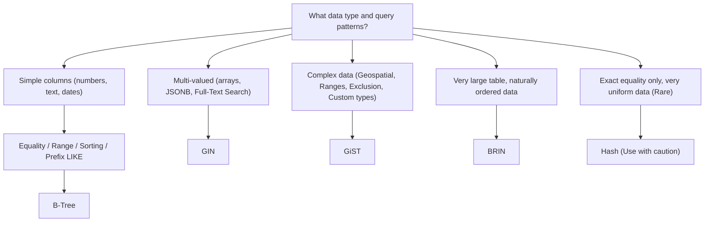

## Index Types (B-Tree, Hash, GIN, GiST, BRIN) and Use Cases
### Core Concepts

*   **Indexes:** Database objects that improve the speed of data retrieval operations on a database table. They provide quick lookup access to rows based on the values in one or more columns.
*   **Trade-off:** Indexes speed up `SELECT` queries but add overhead to `INSERT`, `UPDATE`, and `DELETE` operations because the index must also be updated. They also consume disk space.
*   **Postgres Default:** `B-Tree` is the default index type, suitable for most common use cases.

### Key Details & Nuances

PostgreSQL supports several index types, each optimized for specific data types and query patterns:

*   **B-Tree (Balanced Tree)**
    *   **Structure:** Default, general-purpose, self-balancing tree.
    *   **Use Cases:**
        *   Equality (`=`) and range (`<`, `>`, `<=`, `>=`) comparisons.
        *   `LIKE` patterns (if the pattern does not start with a wildcard, e.g., `WHERE name LIKE 'John%'`).
        *   Sorting (`ORDER BY`), `MIN`, `MAX` queries.
        *   `IS NULL` / `IS NOT NULL` checks.
        *   Used implicitly for `PRIMARY KEY` and `UNIQUE` constraints.
    *   **Strengths:** Excellent for a wide range of queries, highly efficient for point lookups and range scans.
    *   **Weaknesses:** Not ideal for multi-valued data or complex spatial/geometric queries.

*   **Hash Index**
    *   **Structure:** Hash table.
    *   **Use Cases:** Only for equality comparisons (`=`).
    *   **Strengths:** Can be faster for exact equality lookups on very uniform data than B-Tree, especially with many distinct values.
    *   **Weaknesses:**
        *   Historically problematic in Postgres (not WAL-logged, not crash-safe, required manual `REINDEX`).
        *   **Postgres 10+ improvements:** Now WAL-logged and crash-safe.
        *   Still **cannot** be used for range scans, sorting, or `LIKE` operations.
        *   Performance degrades with many duplicate keys (hash collisions).
        *   Generally **not recommended** over B-Tree in most scenarios due to its limited utility and historical baggage.

*   **GIN (Generalized Inverted Index)**
    *   **Structure:** Inverted index, storing a list of row IDs for each key value.
    *   **Use Cases:**
        *   Indexing **multi-valued** data (e.g., arrays, `jsonb` documents).
        *   Full-Text Search (FTS) in combination with `tsvector`.
        *   Efficiently querying for elements **within** a complex data type.
    *   **Strengths:**
        *   Excellent for `jsonb` operators (`?`, `?|`, `?&`, `@>`, `@@`).
        *   Fast for lookups on multiple items within a single column.
    *   **Weaknesses:**
        *   Slower to build and update compared to B-Tree.
        *   Can be significantly larger than B-Tree indexes.
        *   Read performance is generally faster than GiST for similar data types.

*   **GiST (Generalized Search Tree)**
    *   **Structure:** Balanced, tree-like structure, highly extensible. Not strictly an inverted index.
    *   **Use Cases:**
        *   Indexing **complex data types** and query patterns that don't fit B-Tree.
        *   Geometric and Geographic data (PostGIS for points, polygons, lines).
        *   Range types (`int4range`, `daterange`).
        *   Exclusion constraints.
        *   Some Full-Text Search (though GIN is often preferred for FTS).
    *   **Strengths:** Highly flexible due to its generalized nature and ability to define operator classes for custom data types.
    *   **Weaknesses:** Generally slower for lookups and larger than B-Tree indexes for simple data. Can be slower for updates and queries than GIN for multi-valued data.

*   **BRIN (Block Range INdex)**
    *   **Structure:** Stores summary metadata (e.g., min/max values) for physical block ranges on disk. Very small index size.
    *   **Use Cases:**
        *   **Very large tables** where data is **naturally ordered** on disk (e.g., time-series data, `id` columns from sequential inserts).
        *   When a small number of queries access a specific range of rows.
    *   **Strengths:**
        *   Extremely compact index size (often just a few kilobytes even for terabytes of data).
        *   Very low insert/update overhead.
    *   **Weaknesses:**
        *   **Highly dependent on physical data order.** If data is not naturally ordered (e.g., random UUIDs, frequent updates causing fragmentation), BRIN indexes are ineffective.
        *   Not suitable for highly selective queries or small tables.

### Practical Examples

**1. Basic B-Tree Index**

```sql
CREATE INDEX idx_users_email ON users (email);
CREATE INDEX idx_products_price_category ON products (price, category_id);
```

**2. GIN Index for JSONB data**

```sql
-- Assume a 'documents' table with a 'content' jsonb column
CREATE INDEX idx_documents_content_gin ON documents USING GIN (content);

-- Example query benefiting from GIN index
SELECT * FROM documents WHERE content ? 'tags' AND content ->> 'status' = 'active';
```

**3. GiST Index for PostGIS (Spatial Data)**

```sql
-- Requires PostGIS extension
CREATE EXTENSION IF NOT EXISTS postgis;

-- Assume a 'locations' table with a 'geom' geometry column
CREATE INDEX idx_locations_geom_gist ON locations USING GIST (geom);

-- Example query benefiting from GiST index (finding points within a bounding box)
SELECT * FROM locations WHERE ST_Contains(ST_MakeEnvelope(0, 0, 10, 10, 4326), geom);
```

**4. BRIN Index for Time-Series Data**

```sql
-- Assume a 'sensor_readings' table with a 'recorded_at' timestamp column
CREATE INDEX idx_sensor_readings_recorded_at_brin ON sensor_readings USING BRIN (recorded_at);

-- Example query benefiting from BRIN index (if data is physically ordered by recorded_at)
SELECT * FROM sensor_readings WHERE recorded_at BETWEEN '2023-01-01' AND '2023-01-31';
```

**5. Index Type Selection Flow**



### Common Pitfalls & Trade-offs

*   **Over-indexing:** Too many indexes lead to increased write overhead, larger database size, and can sometimes confuse the query planner. Test with `EXPLAIN ANALYZE`.
*   **Indexing the wrong columns:** Indexing columns that are rarely queried, have low cardinality (few distinct values), or are frequently updated might not provide benefit or even degrade performance.
*   **Ignoring `EXPLAIN ANALYZE`:** Always use `EXPLAIN ANALYZE` to verify if an index is being used effectively and to understand query execution plans.
*   **Index selectivity:** An index is most useful when it significantly reduces the number of rows the database has to scan. For columns with very few distinct values (e.g., `boolean` flags), a full table scan might be faster.
*   **Write Overhead:** All indexes impose a performance penalty on `INSERT`, `UPDATE`, and `DELETE` operations. This overhead varies significantly by index type (e.g., GIN has higher write overhead than B-Tree).
*   **Disk Space:** Indexes consume significant disk space. Consider storage costs and backup times.

### Interview Questions

1.  **Q:** When would you choose a GIN index over a B-Tree index, and what are the associated trade-offs?
    **A:** I'd choose a GIN index when querying multi-valued data types like `JSONB` or arrays, or for full-text search. B-Tree is for single-value column lookups and ranges. The trade-offs are that GIN indexes are typically larger and slower to update/build than B-Tree indexes, but provide superior performance for complex queries involving the internal structure of multi-valued data.

2.  **Q:** Explain the ideal use case for a BRIN index. Why is it not suitable for all tables?
    **A:** A BRIN index is ideal for very large tables where data is naturally and consistently ordered on disk, such as time-series data or sequentially inserted IDs. It's not suitable for all tables because its effectiveness critically depends on the physical order of data. If the data is randomly ordered, or frequently updated leading to fragmentation, a BRIN index will provide little to no benefit as it only stores summary information (like min/max) for contiguous block ranges.

3.  **Q:** You have a `products` table with a `description` column where you need to perform full-text search. Which index type would you recommend and why?
    **A:** I would recommend using a GIN index on a `tsvector` column derived from the `description`. GIN indexes are specifically designed for inverted index structures, which are highly efficient for full-text search operations where you need to find documents containing specific words or phrases. While GiST can also be used for FTS, GIN is generally faster for lookup performance in this context.

4.  **Q:** What are some common reasons an index might not be used by the PostgreSQL query planner, even if one exists for the columns in the `WHERE` clause?
    **A:** Common reasons include:
    *   **Low Cardinality:** The column has too few distinct values (e.g., a boolean column), making a sequential scan faster than an index scan + table lookup.
    *   **Too Many Rows:** The query returns a large percentage of the table rows (e.g., `WHERE status = 'active'` on a table where 90% are active).
    *   **Unsupported Operators/Functions:** The query uses operators or functions not supported by the index type (e.g., `LIKE '%pattern'` on a B-Tree index).
    *   **Type Mismatch:** Implicit type conversions prevent index usage.
    *   **Optimizer Cost Estimate:** The query planner estimates that a sequential scan is cheaper than an index scan (considering disk I/O, CPU, etc.).
    *   **Outdated Statistics:** `ANALYZE` hasn't been run recently, leading to inaccurate statistics.