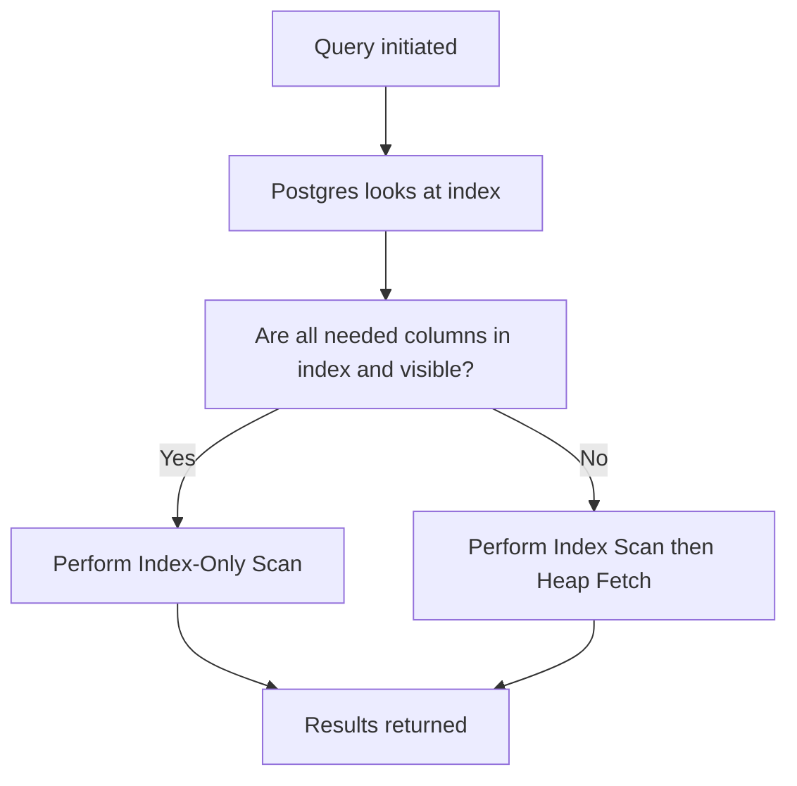

## Partial Indexes and Index-Only Scans
### Core Concepts

*   **Partial Indexes:**
    *   An index that only includes a subset of rows from a table, defined by a `WHERE` clause in its creation statement.
    *   **Purpose:** To create smaller, more efficient indexes for frequently queried data subsets, reducing index size, maintenance overhead, and improving query performance by indexing fewer rows.
*   **Index-Only Scans:**
    *   A PostgreSQL optimization where the database can retrieve all necessary data for a query directly from an index without accessing the main table (the "heap").
    *   **Purpose:** To drastically reduce I/O by avoiding costly heap fetches, leading to significant performance improvements for read-heavy workloads where all required columns are present in the index.

### Key Details & Nuances

*   **Partial Indexes:**
    *   **Syntax:** `CREATE INDEX <index_name> ON <table_name> (<column_list>) WHERE <condition>;`
    *   **Usage:** The query optimizer will only consider using a partial index if its `WHERE` clause is met or implied by the query's `WHERE` clause.
    *   **Benefits:**
        *   **Smaller Size:** Fewer entries mean less disk space and less memory for caching.
        *   **Faster Scans:** Less data to scan within the index itself.
        *   **Reduced Maintenance:** Less overhead for `INSERT`/`UPDATE`/`DELETE` operations on the unindexed portion of the table.
        *   **Optimized for Sparse Data:** Ideal for tables where a specific state or subset of data is queried frequently (e.g., `status = 'active'`, `is_deleted = false`).
*   **Index-Only Scans:**
    *   **Prerequisites:**
        1.  **Index Coverage:** All columns specified in the `SELECT` clause and any `WHERE` conditions (or other clauses like `ORDER BY`) must be present in the index.
        2.  **Visibility Map (VM):** PostgreSQL uses a "visibility map" to track pages in the heap that contain only tuples visible to all current transactions. For an index-only scan to occur without *any* heap fetches, all tuples returned by the index scan must reside on pages marked as "all-visible" in the VM.
    *   **`VACUUM`'s Role:** Regular `VACUUM` operations are crucial for maintaining and updating the Visibility Map. Without sufficient `VACUUM` activity, pages might not be marked as all-visible, forcing PostgreSQL to perform heap fetches even if the index covers all columns, thus preventing a true index-only scan.
    *   **Performance Impact:** Eliminating heap fetches reduces random I/O, which is typically the slowest part of database operations, leading to faster query execution.

### Practical Examples

**1. Partial Index Creation**

```sql
-- Assume a 'users' table with millions of records, but only a fraction are 'active'.
-- Queries often filter by 'status = 'active''.
CREATE INDEX idx_users_active_email ON users (email) WHERE status = 'active';

-- Example query that would benefit from the partial index:
SELECT email, username FROM users WHERE status = 'active' AND email = 'john.doe@example.com';
```

**2. Index-Only Scan Demonstration**

```sql
-- Create a table
CREATE TABLE products (
    id SERIAL PRIMARY KEY,
    name VARCHAR(255) NOT NULL,
    price DECIMAL(10, 2) NOT NULL,
    is_available BOOLEAN DEFAULT TRUE
);

-- Populate with some data
INSERT INTO products (name, price, is_available)
SELECT 'Product ' || i, (random() * 100)::numeric(10,2), (random() < 0.8)
FROM generate_series(1, 100000) AS i;

-- Create a covering index for name and is_available, including price
CREATE INDEX idx_products_name_available_price ON products (name, is_available, price);

-- Analyze a query that could use an Index-Only Scan
-- This query only needs columns present in the index and filters by indexed columns.
EXPLAIN (ANALYZE, BUFFERS)
SELECT name, price FROM products WHERE is_available = TRUE AND name LIKE 'Product 1%';

-- Expected EXPLAIN output snippet (look for "Index Only Scan"):
-- ->  Index Only Scan using idx_products_name_available_price on products  (cost=0.42..8.44 rows=1 width=32) (actual time=0.010..0.021 rows=1 loops=1)
--       Index Cond: ((is_available = true) AND (name ~~ 'Product 1%'::text))
--       Buffers: shared hit=4
```

**3. Conceptual Flow of an Index-Only Scan**



### Common Pitfalls & Trade-offs

*   **Partial Indexes:**
    *   **Query Mismatch:** If the query's `WHERE` clause does not precisely match or imply the index's `WHERE` condition, the partial index will not be used, leading to an inefficient full table scan or a less optimal full index scan.
    *   **Over-Indexing:** Creating too many partial indexes for slightly different conditions can complicate maintenance and increase storage overhead across the entire database.
    *   **Maintenance Overhead:** While smaller, `INSERT`/`UPDATE`/`DELETE` operations that modify rows falling *into* or *out of* the partial index's condition still incur index maintenance costs.
*   **Index-Only Scans:**
    *   **Index Bloat:** To achieve an Index-Only Scan, you might need to include more columns in an index than strictly necessary for ordering or uniqueness. This increases the index's size, potentially making it slower to build and update, and consuming more disk space.
    *   **Visibility Map Dependency:** If the Visibility Map is not sufficiently updated by `VACUUM`, PostgreSQL might still have to visit the heap to check tuple visibility, even if all columns are present in the index, degrading performance.
    *   **No `NULL`s for `PRIMARY KEY`s:** While a `PRIMARY KEY` *is* a unique index, it cannot contain `NULL` values. If a query needs to check for `NULL` in a column that is part of a `PRIMARY KEY`, an Index-Only Scan might not be possible if that `NULL` state requires a heap fetch for visibility. (This is a subtle point often overlooked).

### Interview Questions

1.  **When would you consider using a partial index over a regular B-tree index, and what are the primary benefits?**
    *   **Answer:** A partial index is beneficial when only a subset of rows in a table is frequently queried or where a specific condition is highly common (e.g., `is_active = true`, `status = 'pending'`). Primary benefits include significantly reduced index size, faster index scans, and lower maintenance overhead (for inserts/updates to rows *outside* the indexed subset) compared to a full index.
2.  **Explain what an Index-Only Scan is in PostgreSQL. What are the essential prerequisites for PostgreSQL to perform such a scan?**
    *   **Answer:** An Index-Only Scan is an optimization where PostgreSQL retrieves all data required by a query directly from an index without needing to access the main table (heap). The essential prerequisites are: (1) All columns needed for the `SELECT` list and `WHERE` clause (or other query conditions like `ORDER BY`) must be present within the index. (2) All tuples retrieved from the index must be visible to the current transaction, and preferably, the corresponding heap pages should be marked as "all-visible" in the Visibility Map, which `VACUUM` helps maintain.
3.  **How does PostgreSQL's Visibility Map relate to Index-Only Scans, and why is `VACUUM` important for their efficiency?**
    *   **Answer:** The Visibility Map (VM) tracks which heap pages contain only tuples visible to all concurrent transactions. For a true Index-Only Scan to occur, all returned tuples must be on "all-visible" pages, avoiding a trip to the heap for visibility checks. `VACUUM` is crucial because it updates this Visibility Map by marking pages as all-visible once older, potentially invisible versions of tuples are cleaned up. Without regular `VACUUM`, even if an index covers all columns, PostgreSQL might still perform heap fetches to verify tuple visibility if VM entries are outdated.
4.  **Describe a scenario where creating a partial index could prevent an Index-Only Scan from being used, and how you might resolve it.**
    *   **Answer:** A partial index inherently limits the rows it covers. If a query's `WHERE` clause extends beyond the partial index's defined condition, or if `SELECT`ed columns are not fully covered within the partial index's definition, an Index-Only Scan won't be possible. For instance, if you have `CREATE INDEX on users (email) WHERE status = 'active'`, and a query is `SELECT email, name FROM users WHERE status = 'active'`, an Index-Only Scan for `email, name` is not possible because `name` is not in the index.
    *   **Resolution:** To enable an Index-Only Scan, either: (1) Adjust the query to only request columns present in the *existing* partial index. (2) Create a *new* covering index (either partial or full) that explicitly includes all necessary columns in its definition, possibly using `INCLUDE` clause for non-ordered columns. For the example, `CREATE INDEX ON users (email) INCLUDE (name) WHERE status = 'active'` would allow the Index-Only Scan.