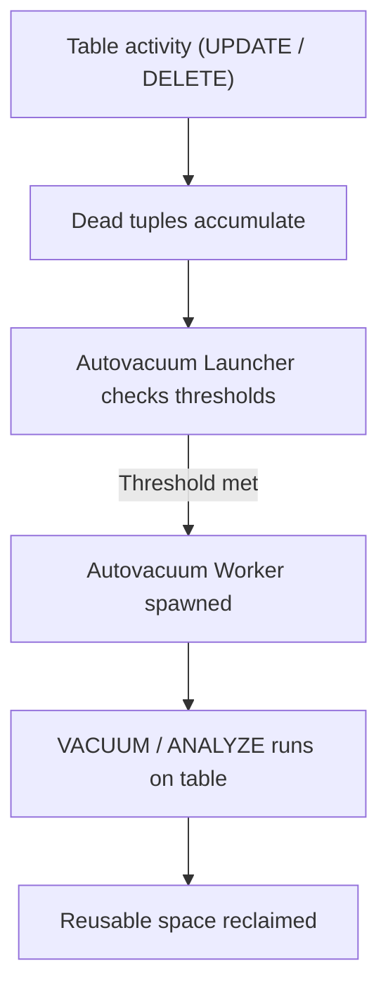

## Vacuuming, Autovacuum, and Table Bloat
### Core Concepts

*   **Multi-Version Concurrency Control (MVCC):** Postgres uses MVCC to allow multiple transactions to access data concurrently without locking. When a row is updated or deleted, Postgres doesn't physically remove or modify the old version. Instead, it marks the old version as "dead" and creates a new version (for updates) or just marks (for deletes).
*   **Dead Tuples:** These are the old, invisible row versions left behind by UPDATEs and DELETEs. While invisible to active transactions, they still occupy disk space.
*   **Table Bloat:** The accumulation of dead tuples leads to table bloat, where a table consumes significantly more disk space than its "live" data requires. This bloat negatively impacts performance:
    *   Increased disk I/O for scans.
    *   Larger working sets, impacting cache efficiency.
    *   Slower index lookups (indexes can also bloat).
*   **VACUUM:** The process of reclaiming space occupied by dead tuples. `VACUUM` marks the space as reusable for new data within the same table/index, but does *not* immediately return space to the operating system (OS).
*   **Autovacuum:** A background process in Postgres that automatically runs `VACUUM` and `ANALYZE` on tables when certain thresholds of dead tuples are met. Essential for maintaining database health and performance.

### Key Details & Nuances

*   **VACUUM vs. VACUUM FULL:**
    *   **`VACUUM` (Standard):** Reclaims space within the table's existing file, making it available for reuse. It does *not* acquire an `ACCESS EXCLUSIVE` lock, allowing concurrent read/write operations. It doesn't shrink the file size on disk.
    *   **`VACUUM FULL`:** Rewrites the entire table into a new, compact file. It *does* acquire an `ACCESS EXCLUSIVE` lock, blocking all other operations (reads and writes) on the table until complete. It releases space back to the OS. Use sparingly and typically only for extreme bloat on low-traffic tables.
*   **`ANALYZE`:** Gathers statistics about the contents of tables and columns (e.g., data distribution, common values). This information is crucial for the query planner to generate efficient execution plans. `VACUUM` often implicitly runs `ANALYZE` or can be run explicitly (`VACUUM ANALYZE`).
*   **Autovacuum Process:**
    *   **Launcher:** A daemon process that wakes up periodically, scans `pg_database` and `pg_stat_database` to determine if any databases need to be vacuumed.
    *   **Workers:** Spawned by the launcher for each database/table needing attention. They perform the actual `VACUUM` and `ANALYZE` operations.
    *   **Triggers:** Autovacuum is triggered when the number of dead tuples exceeds `autovacuum_vacuum_scale_factor` * `relpages` + `autovacuum_vacuum_threshold`. Similar thresholds exist for `ANALYZE`.
*   **Visibility Map and All-Frozen:** `VACUUM` updates the visibility map, which tracks which pages contain only "all visible" tuples (no dead or in-progress tuples), speeding up index scans. `VACUUM FREEZE` (often part of standard `VACUUM`) marks old tuples as "frozen" to prevent Transaction ID Wraparound, a critical issue where the transaction ID counter cycles and older, unfrozen transactions become invisible, potentially leading to data loss.
*   **Long-Running Transactions:** A long-running transaction (e.g., an open `BEGIN` block, a streaming replication slot) can prevent `VACUUM` from reclaiming space, as dead tuples cannot be removed until *all* transactions that could potentially "see" them have finished. This is a common cause of severe bloat.
*   **Index Bloat:** Just like tables, indexes can also accumulate dead entries. While `VACUUM` reclaims space in indexes, it doesn't always shrink them effectively. `REINDEX` is often required to rebuild an index entirely and reclaim all its space, but it also applies locks.

### Practical Examples

**1. Check Table Bloat (Approximate):**

```sql
SELECT
    relname AS table_name,
    pg_size_pretty(pg_relation_size(c.oid)) AS table_size,
    pg_size_pretty(pg_total_relation_size(c.oid) - pg_relation_size(c.oid)) AS index_size,
    n_dead_tup AS dead_tuples,
    last_vacuum,
    last_autovacuum,
    last_analyze,
    last_autoanalyze
FROM
    pg_class c
JOIN
    pg_stat_user_tables s ON c.oid = s.relid
WHERE
    c.relkind = 'r' -- 'r' for regular table
ORDER BY
    n_dead_tup DESC;
```

**2. Manually Trigger Vacuum and Analyze:**

```sql
VACUUM ANALYZE my_large_table;
```

**3. Configure Autovacuum Parameters for a Specific Table:**

```sql
-- Increase autovacuum frequency for 'my_frequently_updated_table'
ALTER TABLE my_frequently_updated_table SET (
    autovacuum_vacuum_scale_factor = 0.05, -- Trigger at 5% dead tuples
    autovacuum_vacuum_threshold = 50        -- Trigger if at least 50 dead tuples
);

-- Disable autovacuum for a specific table (use with extreme caution!)
ALTER TABLE my_archive_table SET (autovacuum_enabled = off);
```

**4. Autovacuum Process Flow:**



### Common Pitfalls & Trade-offs

*   **Ignoring Autovacuum:** Disabling or poorly configuring autovacuum is a primary cause of severe performance degradation and potential transaction ID wraparound issues.
*   **Over-reliance on `VACUUM FULL`:** Running `VACUUM FULL` frequently on production tables causes significant downtime due to its exclusive lock. It should be a last resort for extreme bloat or planned maintenance.
*   **Long-Running Transactions:** This is a silent killer. An idle client with an open transaction, a stuck migration, or a replication slot that's not being consumed can prevent dead tuple cleanup, leading to massive bloat.
*   **Misunderstanding Thresholds:** `autovacuum_vacuum_scale_factor` works on a percentage of the table size. Small tables might need a higher `autovacuum_vacuum_threshold` to prevent frequent, unnecessary vacuums, while very large tables might need a lower `scale_factor` to ensure timely cleanup.
*   **Under-vacuuming Indexes:** While `VACUUM` helps, severely bloated indexes often require `REINDEX` for full space reclamation. `REINDEX` also causes locks. Postgres 12+ introduced `REINDEX CONCURRENTLY` for less impactful index rebuilds.
*   **Not Monitoring:** Without monitoring `pg_stat_user_tables` and `pg_stat_bgwriter`, it's hard to diagnose bloat issues or determine if autovacuum is working effectively.

### Interview Questions

1.  **Explain Postgres's MVCC and how it necessitates Vacuuming. What are "dead tuples"?**
    *   **Answer:** MVCC allows concurrent reads/writes without locks by creating new row versions for updates/deletes instead of overwriting. Old versions become "dead tuples," invisible to new transactions but still occupying space. This space needs to be reclaimed by `VACUUM` for reuse to prevent bloat and maintain performance.

2.  **Differentiate between `VACUUM` and `VACUUM FULL`. When would you use each, and what are their primary trade-offs?**
    *   **Answer:** `VACUUM` reclaims space *within* the table file for reuse; it's non-blocking, but doesn't shrink the file on disk. `VACUUM FULL` rewrites the entire table, shrinking the file, but requires an `ACCESS EXCLUSIVE` lock, blocking all operations. Use `VACUUM` (via Autovacuum) for routine maintenance; `VACUUM FULL` sparingly for severe bloat on low-traffic tables or during planned downtime.

3.  **Describe how Autovacuum works. What are the key configuration parameters you'd consider tuning, and why?**
    *   **Answer:** Autovacuum is a background process that automatically runs `VACUUM` and `ANALYZE`. A launcher spawns workers when dead tuple or insert counts exceed configured thresholds. Key parameters: `autovacuum_vacuum_scale_factor` (percentage of table size for vacuum trigger), `autovacuum_vacuum_threshold` (minimum dead tuples for vacuum trigger), `autovacuum_analyze_scale_factor`/`_threshold` (for analyze), `autovacuum_max_workers` (number of concurrent workers), and `autovacuum_naptime` (how often launcher checks). Tuning helps balance resource usage with timely bloat prevention.

4.  **You're diagnosing a Postgres database with rapidly increasing disk usage and slow query performance, despite significant data deletions. What's your diagnostic approach, and what are the most likely culprits related to vacuuming?**
    *   **Answer:** Check `pg_stat_user_tables` for `n_dead_tup` to identify bloated tables and `last_autovacuum` to see if autovacuum is running. Look for long-running transactions (using `pg_stat_activity` with `state='idle in transaction'`) as they prevent dead tuple cleanup. Check `autovacuum_log_min_duration` for autovacuum logs. Most likely culprits: disabled/misconfigured autovacuum, or long-running transactions preventing vacuum from operating effectively.

5.  **What is Transaction ID Wraparound, and how does `VACUUM` help prevent it?**
    *   **Answer:** Transaction ID Wraparound is a critical condition where the internal transaction ID counter exceeds its maximum value and "wraps around" to zero. If old, unfrozen transactions exist with IDs higher than the wrapped current ID, Postgres incorrectly assumes they are in the future, making their data invisible and potentially leading to data loss or database shutdown. `VACUUM` (specifically the `FREEZE` aspect) marks old tuples as "frozen," ensuring they are permanently visible regardless of transaction ID wraparound.