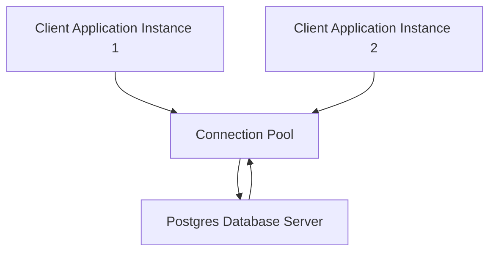

## Connection Pooling
### Core Concepts

*   **Definition:** Connection pooling is a technique used by applications to manage and reuse database connections, rather than opening a new connection for every request. It involves creating a set of open connections that can be shared among multiple clients or threads.
*   **Purpose:**
    *   **Reduce Overhead:** Opening and closing database connections (TCP handshake, authentication, resource allocation) is resource-intensive and slow. Pooling eliminates this overhead for each new request.
    *   **Resource Management:** Limits the total number of concurrent connections to the database, preventing the database server from being overwhelmed and ensuring stable performance.
    *   **Improved Latency:** Subsequent requests can immediately acquire an existing, idle connection from the pool, significantly reducing response times.

### Key Details & Nuances

*   **Cost of New Connections:** Each new connection to Postgres incurs overhead:
    *   **Network Latency:** TCP/IP handshake.
    *   **Authentication:** User/password validation.
    *   **Server Resources:** Postgres allocates memory, background processes, and file descriptors per connection (`backend process`).
*   **Pool Parameters:** Key configuration settings:
    *   **`min` / `max`:** Minimum number of idle connections kept in the pool, and maximum total connections allowed.
    *   **`idleTimeoutMillis`:** How long an idle connection can remain in the pool before being closed.
    *   **`connectionTimeoutMillis`:** Maximum time to wait for a connection to become available from the pool.
*   **Connection Lifecycle:**
    1.  **Request:** Application requests a connection.
    2.  **Acquire:** If an idle connection exists, it's returned. Otherwise, a new one is created (up to `max`), or the request waits.
    3.  **Use:** Connection is used for queries.
    4.  **Release:** Connection is returned to the pool (marked as idle) upon completion of operations, not closed.
*   **Types of Connection Pooling:**
    *   **Application-Level:** Integrated into the application code or ORM (e.g., `pg` module in Node.js, HikariCP in Java). Simple to set up but pool is local to each application instance.
    *   **External/Proxy-Level:** A dedicated process or service sits between the application and the database (e.g., PgBouncer, Odyssey). Offers advanced features like multiplexing, better resource management across multiple application instances, and transparent failover.
        *   **PgBouncer Modes:** Crucial for understanding external pooling:
            *   **Session Pooling (default):** Connection is assigned to a client until the client disconnects. Most similar to direct connections.
            *   **Transaction Pooling:** Connection is returned to the pool after each transaction (`COMMIT` or `ROLLBACK`). Offers high multiplexing but can break session-specific features (e.g., `SET search_path`).
            *   **Statement Pooling:** Connection returned after each statement. Most aggressive multiplexing, rarely used due to high risk of breaking multi-statement transactions.

### Practical Examples

#### Conceptual Flow of a Connection Pool



#### Node.js `pg` Pool Example

```typescript
import { Pool } from 'pg';

const pool = new Pool({
  user: 'your_user',
  host: 'localhost',
  database: 'your_database',
  password: 'your_password',
  port: 5432,
  max: 20, // max number of clients in the pool
  idleTimeoutMillis: 30000, // how long a client is allowed to remain idle before being closed
  connectionTimeoutMillis: 2000, // how long the pool will try to connect before erroring
});

async function queryDatabase() {
  const client = await pool.connect(); // Acquire a connection from the pool
  try {
    const res = await client.query('SELECT NOW()');
    console.log('Current time:', res.rows[0].now);
  } catch (err) {
    console.error('Error executing query', err);
  } finally {
    client.release(); // Release the connection back to the pool
  }
}

queryDatabase();
```

### Common Pitfalls & Trade-offs

*   **Under-pooling (`max` too low):** Leads to connection waiting queues, increased latency, and potential application timeouts under load.
*   **Over-pooling (`max` too high):** Can exhaust database server resources (memory, file descriptors), leading to slow queries, connection failures, or even server crashes. Optimal `max` depends on database resources, workload, and query complexity.
*   **Connection Leakage:** Forgetting to release connections back to the pool (`client.release()` or similar). Leads to pool exhaustion, application freezes, and eventual database connection limits being hit.
*   **`SET` Commands with Transaction/Statement Pooling:** Using `SET` commands (e.g., `SET search_path = ...`, `SET TIME ZONE = ...`) in PgBouncer's transaction or statement pooling mode can lead to unexpected behavior or data integrity issues, as the connection state might persist across different client transactions. Session pooling is safer for such cases.
*   **Additional Latency/Complexity:** External poolers like PgBouncer introduce an extra network hop and another point of failure. While usually negligible, it's a trade-off for their benefits.
*   **Monitoring Challenges:** Understanding the health and performance of the connection pool itself requires specific metrics (e.g., active vs. idle connections, queue length).

### Interview Questions

1.  **Explain the primary benefits of using connection pooling in a Postgres application. What problems does it solve?**
    *   **Answer:** Connection pooling primarily solves the overhead associated with establishing and tearing down database connections. Benefits include significantly reduced latency for database operations, improved resource utilization on both application and database servers by limiting concurrent connections, and increased stability under high load by preventing the database from being overwhelmed.

2.  **Differentiate between application-level and external (proxy-level) connection pooling, providing an example for each. When would you choose one over the other?**
    *   **Answer:** Application-level pooling (e.g., Node.js `pg` module, Java HikariCP) is integrated directly into the application code and manages connections specific to that application instance. It's simpler for single-application deployments. External pooling (e.g., PgBouncer) is a separate proxy service sitting between the application and database. It centralizes connection management across multiple application instances, offers advanced features like multiplexing (transaction/statement pooling), and can provide better resource isolation. Choose external pooling for large-scale microservices architectures, to consolidate connections from many applications, or when specific multiplexing features are required.

3.  **You're using PgBouncer in `transaction` pooling mode. What are the potential pitfalls or side effects you need to be aware of, especially concerning database session state?**
    *   **Answer:** In transaction pooling, a connection is returned to the pool immediately after each transaction (`COMMIT`/`ROLLBACK`). The primary pitfall is that session-specific state (e.g., `SET search_path`, `SET TIME ZONE`, temporary tables, advisory locks) is *not* guaranteed to be reset or cleared for the next client that acquires that connection. This can lead to unexpected behavior, data corruption, or security issues if not explicitly managed by the application or by using connection hooks in PgBouncer to reset state. Session pooling avoids this.

4.  **How would you determine the optimal `max` connection pool size for a given application and Postgres instance? What factors would you consider?**
    *   **Answer:** Determining `max` is an iterative process based on:
        *   **Database Resources:** CPU, RAM, and I/O capacity of the Postgres server.
        *   **Query Complexity:** Complex, long-running queries consume more resources per connection. Simple, fast queries allow for more concurrent connections.
        *   **Workload:** Number of concurrent users/requests, transaction volume.
        *   **Application Behavior:** How frequently connections are acquired and released, and how long they are held.
        *   **Monitoring:** Start with an educated guess, then monitor Postgres metrics (e.g., active connections, wait events, CPU usage, I/O bottlenecks) and application metrics (e.g., connection acquisition time, queue length, response times). Adjust `max` until a balance is found where throughput is maximized without saturating the database. Rule-of-thumb formulas (e.g., `(cores * 2) + connection_overhead`) can be a starting point but require validation.

5.  **Describe connection leakage. What are its symptoms, and how can it be prevented or debugged in an application using a connection pool?**
    *   **Answer:** Connection leakage occurs when an application acquires a connection from the pool but fails to release it back, often due to unhandled errors, forgotten `finally` blocks, or incorrect resource management.
    *   **Symptoms:**
        *   Application eventually hangs or throws "No more connections available" errors.
        *   Connection pool size (active connections) continuously grows towards `max` and stays there.
        *   Database server shows an increasing number of active connections from the application.
    *   **Prevention/Debugging:**
        *   **`try...finally` blocks:** Always ensure `release()` is called in a `finally` block or equivalent cleanup mechanism.
        *   **ORM/Library Guarantees:** Use ORMs or database libraries that automatically manage connection release (e.g., `knex.transaction(trx => { ... })`).
        *   **Monitoring:** Instrument the connection pool to track active/idle connections and the number of acquired vs. released connections. Alert on anomalies.
        *   **Logging:** Log connection acquisition and release events (for debugging purposes).
        *   **Connection Timeout:** Set a `connectionTimeoutMillis` in the pool to prevent indefinite waits.
        *   **Idle Timeout:** Set `idleTimeoutMillis` on connections within the pool to recycle truly inactive ones, though this doesn't prevent active leaks.