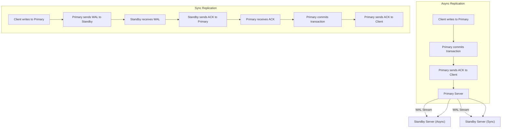

## Streaming Replication (Asynchronous vs. Synchronous)
### Core Concepts

*   **Streaming Replication**: PostgreSQL's native method for continuously sending Write-Ahead Log (WAL) records from a **primary** (master) server to one or more **standby** (replica) servers. Standbys apply these WAL records to maintain an up-to-date copy of the primary's data.
    *   **Purpose**: High Availability (HA), Read Scaling, Disaster Recovery, Backup.
*   **Asynchronous Streaming Replication**:
    *   **Commit Behavior**: The primary server commits a transaction and sends a success acknowledgment to the client *before* the WAL records for that transaction are guaranteed to be received or applied by the standby(s).
    *   **Latency**: Lowest write latency on the primary.
    *   **Data Loss Risk**: Prone to data loss if the primary fails before WAL records are replicated to standbys.
*   **Synchronous Streaming Replication**:
    *   **Commit Behavior**: The primary server waits for confirmation from at least one designated standby that the WAL records for a transaction have been received (and optionally flushed/applied) *before* committing the transaction and acknowledging success to the client.
    *   **Latency**: Higher write latency on the primary due to network round-trip and standby processing.
    *   **Data Loss Guarantee**: Guarantees zero data loss (RPO = 0) upon primary failure, provided a synchronous standby is available.

### Key Details & Nuances

*   **WAL (Write-Ahead Log)**: The immutable, sequential record of all changes to the database. Essential for replication and crash recovery.
*   **`wal_level = replica` (or higher)**: Required setting on the primary to enable WAL streaming.
*   **`max_wal_senders`**: On the primary, defines the maximum number of concurrent connections for sending WAL data to standbys.
*   **`hot_standby = on`**: Required on standbys to allow read-only queries while applying WAL records.
*   **Asynchronous Details**:
    *   **Trade-off**: High throughput, but potential for data inconsistency between primary and standby during replication lag.
    *   **Monitoring**: `pg_stat_replication` view on the primary provides replication lag information (`write_lag`, `flush_lag`, `replay_lag`).
*   **Synchronous Details**:
    *   **`synchronous_commit`**: Primary setting to control how strictly "synchronous" the commit is:
        *   `off`/`local`: Default (asynchronous).
        *   `on`/`remote_write`: Primary waits for WAL to be *written* to disk on at least one synchronous standby.
        *   `remote_apply`: Primary waits for WAL to be *applied* (replayed) on at least one synchronous standby (highest durability, highest latency).
    *   **`synchronous_standby_names`**: Primary setting to specify which standby server(s) must confirm WAL receipt/application.
        *   Can use `FIRST N (standby_name_1, standby_name_2, ...)` or `ANY N (standby_name_1, standby_name_2, ...)` for quorum. E.g., `ANY 1 (replica_a, replica_b)` means any one of `replica_a` or `replica_b` is sufficient.
    *   **Blocking Risk**: If all designated synchronous standbys become unavailable, transactions on the primary can block indefinitely until a standby recovers or `synchronous_standby_names` is reconfigured.

### Practical Examples

**1. Primary Configuration (`postgresql.conf`)**

```ini
# Core replication settings (required for both async & sync)
wal_level = replica       # Must be 'replica' or higher
max_wal_senders = 10      # Max number of concurrent wal sender processes
listen_addresses = '*'    # Allow connections from standbys

# Asynchronous Replication (no additional synchronous settings needed)

# Synchronous Replication (additional settings on primary)
synchronous_commit = on   # Options: off, local, on (default), remote_write, remote_apply
synchronous_standby_names = 'ANY 1 (standby_server_1, standby_server_2)'
# This means any 1 of 'standby_server_1' OR 'standby_server_2' must confirm.
# 'standby_server_1' and 'standby_server_2' are application_name values from standbys.
```

**2. `pg_hba.conf` on Primary**

```
# Allow replication connections from standbys
host    replication     replication_user    192.168.1.0/24    md5
```

**3. Standby Configuration (`postgresql.conf`)**

```ini
# Core standby settings
hot_standby = on
primary_conninfo = 'host=primary_ip port=5432 user=replication_user password=your_password application_name=standby_server_1'
# The 'application_name' here must match one of the names in primary's synchronous_standby_names if sync rep is used.
```

**4. Replication Flow**



### Common Pitfalls & Trade-offs

*   **Asynchronous Data Loss**: The most significant pitfall. If a primary fails, recent committed transactions may be lost if not yet replicated.
    *   **Trade-off**: High throughput and low latency. Good for read replicas or less critical data.
*   **Synchronous Performance Bottleneck**: A single slow or unavailable synchronous standby can significantly degrade or halt the primary's write performance.
    *   **Trade-off**: Zero data loss (RPO=0) vs. increased write latency and potential availability issues if standbys are not robust.
*   **Replication Lag (Asynchronous)**: Can lead to "read-after-write" consistency issues where a client writes to the primary, then immediately reads from a standby and sees stale data.
    *   **Mitigation**: Route critical reads to the primary, or accept eventual consistency.
*   **WAL Archiving**: While streaming replication streams WAL, WAL archiving (e.g., to S3) is crucial for point-in-time recovery (PITR) and is separate but complementary. Not having it can be a pitfall for full disaster recovery.
*   **Failover Complexity**: Setting up replication is one thing; automated failover and promotion of a standby requires external tools (e.g., Patroni, Repmgr) and careful planning, especially for synchronous setups.

### Interview Questions

1.  **Q**: Explain the core difference between asynchronous and synchronous streaming replication in PostgreSQL, and when you would choose one over the other.
    **A**: Asynchronous allows the primary to commit transactions before confirming WAL receipt by standbys, prioritizing write speed but risking data loss. Synchronous waits for confirmation from standbys, guaranteeing zero data loss but increasing write latency. Choose asynchronous for read scaling and less critical data; choose synchronous when data durability and zero data loss are paramount (e.g., financial transactions).
2.  **Q**: You have a critical application that cannot tolerate any data loss. How would you configure PostgreSQL replication to achieve this, and what are the main implications?
    **A**: I would use synchronous streaming replication. This involves setting `synchronous_commit = on` (or `remote_apply`) and `synchronous_standby_names` on the primary to ensure transactions are not committed until WAL is confirmed by a standby. The main implications are increased write latency on the primary and the risk of the primary blocking if the designated synchronous standby(s) become unavailable.
3.  **Q**: A client writes data to your PostgreSQL primary, then immediately tries to read it from a replica. What consistency issue might arise with asynchronous replication, and how can it be mitigated?
    **A**: This can lead to a "read-after-write" consistency issue, where the client reads stale data from the replica because the transaction hasn't yet been applied there. Mitigation strategies include routing all reads for a session to the primary after a write, accepting eventual consistency, or using synchronous replication for such critical paths.
4.  **Q**: How does `synchronous_standby_names` work, and how can it be used to achieve N+1 redundancy?
    **A**: `synchronous_standby_names` on the primary specifies the `application_name` of the standby server(s) that must confirm WAL receipt/application for a transaction to commit. To achieve N+1 redundancy, you would set `synchronous_standby_names = 'ANY N (standby1, standby2, ...)'`. For example, `ANY 1 (replica_a, replica_b)` means any one of `replica_a` or `replica_b` is sufficient, providing redundancy if one standby fails.
5.  **Q**: What happens to the primary if the only synchronous standby specified in `synchronous_standby_names` becomes unavailable?
    **A**: If the designated synchronous standby becomes unavailable, all new write transactions on the primary will block indefinitely, waiting for confirmation from that standby. The primary effectively stalls. To resume operations, the standby must recover, or `synchronous_standby_names` on the primary must be reconfigured (e.g., to an alternate standby or temporarily set to `''` for asynchronous mode).