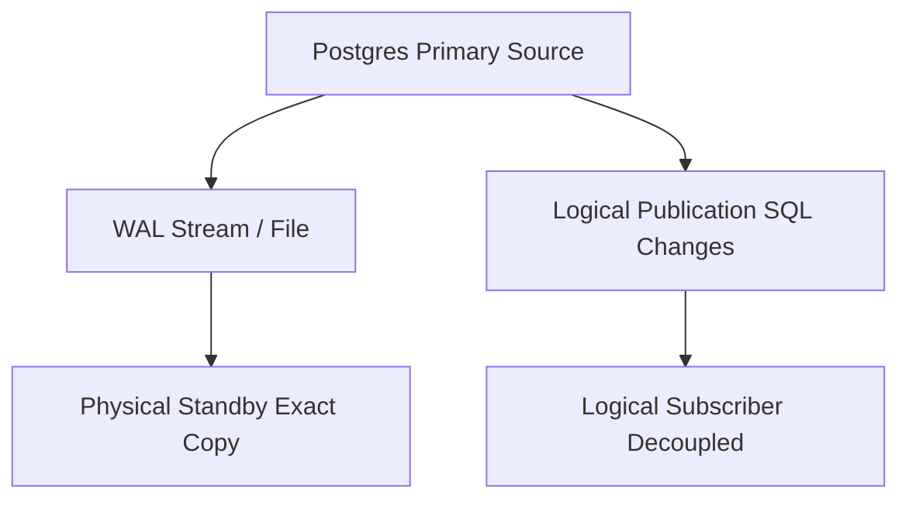

## Logical vs. Physical Replication: Trade-offs
### Core Concepts

*   **Physical Replication (Streaming Replication):**
    *   Copies the raw data blocks and Write-Ahead Log (WAL) records from a primary database to one or more standbys.
    *   Creates an *exact binary copy* of the primary.
    *   Primarily used for **High Availability (HA)**, disaster recovery, and read-scaling by offloading read-only queries.
*   **Logical Replication:**
    *   Replicates data changes (INSERT, UPDATE, DELETE, TRUNCATE) at the row level.
    *   Decouples the source and target databases, allowing different PostgreSQL versions, architectures, or even other databases (via tools).
    *   Based on a "publish and subscribe" model.

### Key Details & Nuances

*   **Physical Replication:**
    *   **Granularity:** Block-level / WAL record transfer.
    *   **Consistency:** Byte-for-byte exact copy. Standby is always consistent with the primary up to the last replicated WAL record.
    *   **Use Cases:** Read replicas, Hot Standby for HA (failover), disaster recovery.
    *   **Schema Changes:** Automatically propagated (since it's a block-level copy).
    *   **Version Compatibility:** Requires identical *major* PostgreSQL versions on primary and standbys.
    *   **Control:** Less granular control over what gets replicated; it's all or nothing.
    *   **Overhead:** Generally lower CPU overhead once established, as it's raw binary copying.

*   **Logical Replication:**
    *   **Granularity:** Row-level DML operations (INSERT, UPDATE, DELETE, TRUNCATE). DDL is *not* replicated.
    *   **Consistency:** Eventual consistency. Requires careful handling of schema changes and sequence values.
    *   **Use Cases:** Selective replication, data warehousing, data migration (cross-version/platform), multi-master setups (with external conflict resolution), integrating with non-PostgreSQL systems.
    *   **Schema Changes:** *Not* automatically replicated. Must be applied manually on the subscriber.
    *   **Version Compatibility:** Supports replication between different *major* PostgreSQL versions (e.g., 12 to 15).
    *   **Control:** Highly granular; select specific tables, schemas, or even subsets of columns (via publication definition).
    *   **Overhead:** Higher CPU overhead due to parsing WAL records into logical changes and then applying them. Can incur significant network traffic for initial sync of large tables.
    *   **Identity:** Replicates `PRIMARY KEY` or `REPLICA IDENTITY` for updates/deletes. If not defined, full row values are used.

### Practical Examples

The following diagram illustrates the fundamental difference in data transfer mechanisms between Physical and Logical PostgreSQL replication.

### Common Pitfalls & Trade-offs

*   **Physical Replication:**
    *   **Major Version Upgrades:** Requires re-initialization of standbys or using tools like `pg_upgrade` on primary and then recreating standbys, leading to downtime or complex orchestrations. No direct in-place upgrade path for the entire replica cluster.
    *   **No Selective Replication:** Cannot exclude specific tables or databases.
    *   **Coupling:** Tightly coupled with the primary (same OS, architecture often implied for direct binary compatibility).
*   **Logical Replication:**
    *   **DDL and Sequences:** DDL (schema changes) and sequence updates are *not* replicated automatically. Requires manual management.
    *   **Conflict Resolution:** Potential for conflicts if both publisher and subscriber allow writes (e.g., in multi-master setups). Requires careful design and external tools or manual intervention.
    *   **Initial Sync Overhead:** Initial data synchronization for large tables can be resource-intensive (CPU, network, disk).
    *   **Performance:** Can have higher latency and resource consumption compared to physical replication, especially with high transaction volumes, due to parsing and applying logical changes.
    *   **Not for HA Hot Standby:** While it can keep a copy, it's not designed for seamless, fast failover like physical replication due to potential lag, DDL handling, and conflict resolution complexities.

### Interview Questions

1.  **When would you choose physical replication over logical replication for a new PostgreSQL setup, and why?**
    *   **Answer:** Primarily for High Availability (HA) and disaster recovery, where a near real-time, byte-for-byte exact replica is needed for fast failover. Also for read-scaling when an identical copy is sufficient and version compatibility is not an issue. It's simpler to set up for HA and has lower operational overhead for basic read replicas.

2.  **Describe a scenario where logical replication is indispensable, and physical replication would not be a suitable choice.**
    *   **Answer:** Data migration between different major PostgreSQL versions (e.g., upgrading from PG12 to PG15 with minimal downtime by replicating), selective replication of specific tables to a data warehouse, or cross-platform/cross-database integration where only specific row-level changes are needed. It's crucial when you need decoupled systems or finer control over what data is replicated.

3.  **What are the main challenges or complexities when implementing logical replication, especially compared to physical replication?**
    *   **Answer:** The primary challenges are handling DDL (schema changes) and sequence updates, which are not replicated and must be managed manually. Conflict resolution is another major complexity, especially in multi-master or bi-directional scenarios. Initial data synchronization for large datasets can be resource-intensive, and overall performance might be lower than physical replication under heavy load.

4.  **How does a major PostgreSQL version upgrade typically affect a physical replication setup, and what's an alternative approach using logical replication for such upgrades?**
    *   **Answer:** For physical replication, a major version upgrade usually requires stopping replication, upgrading the primary, and then re-initializing (rebuilding) all standbys from scratch, which can incur significant downtime. An alternative using logical replication involves setting up a logical publisher on the old-version primary and a logical subscriber on a new-version instance. Once the new instance is fully synced, traffic can be cut over, enabling a near-zero downtime upgrade.

5.  **Explain the `REPLICA IDENTITY` property in the context of logical replication. Why is it important?**
    *   **Answer:** `REPLICA IDENTITY` dictates how rows are identified for `UPDATE` and `DELETE` operations on the subscriber. It specifies which columns will be used to uniquely identify a row. If not set to `FULL` (all columns), `NOTHING`, or a `PRIMARY KEY`/`UNIQUE INDEX`, logical replication may fail for `UPDATE`/`DELETE` operations or fallback to `FULL` (more expensive). It's crucial for efficient and correct application of changes, ensuring the right row is updated/deleted on the subscriber.