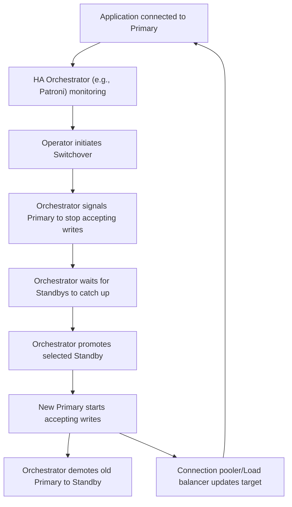

## Failover and Switchover Strategies

### Core Concepts

- **Failover:** An _unplanned_ process triggered by a primary database server failure (e.g., hardware crash, network outage). The goal is to promote a standby server to be the new primary automatically or semi-automatically to restore service availability with minimal downtime. It may involve a risk of data loss (uncommitted transactions) depending on the replication mode.
- **Switchover:** A _planned_, controlled process to gracefully transfer the primary role from one server to another (e.g., for scheduled maintenance, upgrades, or load balancing). The goal is to achieve zero data loss and minimal to no downtime through careful orchestration and synchronization.

### Key Details & Nuances

- **Replication Modes Impact:**
  - **Asynchronous:** Lower write latency but higher RPO (Recovery Point Objective) – potential for data loss on failover due to uncommitted WAL segments on the primary.
  - **Synchronous (Quorum Commit):** Zero RPO (no data loss) but higher write latency and reduced throughput, as the primary waits for transaction confirmation from at least one standby. Requires careful configuration and multiple standbys for true high availability.
- **Split-Brain Avoidance:** Crucial for automated failover.
  - **Quorum:** Requires a majority of nodes to agree on primary election (e.g., 2 of 3 votes) to prevent multiple primaries in a partitioned network.
  - **Fencing (STONITH - Shoot The Other Node In The Head):** Mechanism to ensure the old primary is truly isolated or shut down before a new primary is promoted, preventing it from causing data inconsistencies. Often involves power cycling or network isolation.
- **Orchestration Tools:**
  - **Patroni:** A robust and widely used Python-based solution leveraging distributed consensus (etcd, Zookeeper, Consul) for cluster state. Provides automatic failover, controlled switchover, and integrates well with connection poolers.
  - **repmgr:** A PostgreSQL-native tool that facilitates replication management, including manual/semi-automatic failover/switchover, monitoring, and cloning. Often requires external scripting or cluster managers (e.g., Pacemaker) for full automation and fencing.
  - **Pacemaker/Corosync:** General-purpose cluster resource managers providing highly configurable HA for various services, including PostgreSQL. More complex to set up.
- **Client Redirection:** After a role change, client applications must be directed to the new primary. This is typically handled by:
  - **Connection Poolers (PgBouncer, Odyssey):** Dynamically reconfigured by the HA tool to point to the new primary.
  - **Load Balancers (HAProxy, Envoy):** Perform health checks and route traffic to the active primary.
  - **DNS Updates:** Less ideal due to caching, but dynamic DNS updates can point to the new primary's IP.

### Practical Examples

**PostgreSQL Switchover Process (Conceptual with Patroni/HA Orchestration):**

### Common Pitfalls & Trade-offs

- **Split-Brain:** The most critical issue in HA, where multiple nodes believe they are the primary, leading to data divergence. Mitigated by robust quorum and fencing mechanisms.
- **False Positives:** Overly sensitive health checks can trigger unnecessary failovers due to transient network issues or temporary resource spikes, leading to more downtime than the perceived issue.
- **RPO vs. RTO:** A key trade-off. Synchronous replication ensures zero data loss (RPO=0) but can increase RTO due to write latency. Asynchronous replication offers better write performance but a non-zero RPO.
- **Network Partitioning:** Can lead to split-brain or isolation of the primary, preventing failover. Proper network design and robust detection are crucial.
- **Complexity:** Fully automated failover systems are complex to design, implement, test, and maintain. Testing failover scenarios thoroughly in a non-production environment is critical but often overlooked.

### Interview Questions

1.  **Differentiate between failover and switchover in PostgreSQL, providing scenarios where each is preferred.**

    - **Answer:** Failover is an _unplanned_ recovery of a failed primary (e.g., hardware failure), typically automatic, prioritizing RTO but risking RPO. Switchover is a _planned_, controlled role reversal (e.g., maintenance), prioritizing zero RPO and minimal RTO, usually manual or automated. Failover is for disaster recovery; switchover for planned operations.

2.  **Explain the concept of 'split-brain' in a PostgreSQL HA setup and how it's mitigated.**

    - **Answer:** Split-brain occurs when two nodes simultaneously believe they are the primary, leading to data divergence and corruption. It's mitigated by: 1) **Quorum:** Requiring a majority vote to elect a new primary, preventing election if network partitions isolate nodes. 2) **Fencing (STONITH):** Physically isolating or shutting down the old primary to ensure it cannot continue operating or accept writes.

3.  **What role does synchronous replication play in a high-availability strategy, and what are its trade-offs?**

    - **Answer:** Synchronous replication ensures a transaction is not committed on the primary until confirmed written to disk on at least one standby. This achieves an RPO of zero (no data loss) on failover, critical for sensitive data. Trade-offs include increased write latency, reduced write throughput, and potential for writes to block if the synchronous standby becomes unavailable.

4.  **Describe how client applications typically handle failover in a PostgreSQL HA environment.**

    - **Answer:** Client applications typically connect through an intermediary layer that abstracts the primary's location. This is usually a connection pooler (like PgBouncer) or a load balancer (like HAProxy), which monitors the cluster and dynamically redirects connections to the active primary. This avoids application-side changes during a failover, minimizing downtime for the application.

5.  **You've set up a PostgreSQL HA cluster, but during a test failover, you notice clients occasionally connect to the old primary briefly. What are potential causes and solutions?**
    - **Answer:** Potential causes include:
      - **DNS Caching:** If using DNS for primary resolution, client DNS caches might not update quickly enough. Solution: Use shorter TTLs or dynamic DNS updates, but better to rely on connection poolers/load balancers.
      - **Connection Pooler/Load Balancer Configuration:** The pooler/load balancer might not have updated its target quickly, or its health checks are too slow/incorrect. Solution: Optimize health check frequency/logic, ensure the HA orchestrator correctly notifies/reconfigures the pooler.
      - **Fencing Issues:** The old primary might not be fully isolated before the new one is promoted, briefly accepting connections. Solution: Ensure robust fencing mechanisms (STONITH) are in place and working correctly.
