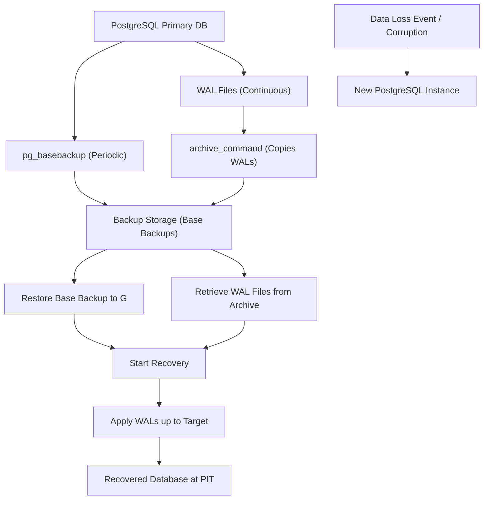

## Backup and Point-in-Time Recovery (PITR)
### Core Concepts
*   **Base Backup:** A complete snapshot of the PostgreSQL data directory at a specific point in time. It's the foundation for any recovery. It's *not* a logical dump (like `pg_dump`), but a physical copy of data files.
*   **Write-Ahead Log (WAL):** PostgreSQL's transactional log. Every change to the database is first written to WAL before being applied to data files. This ensures atomicity and durability. WAL segments are typically 16MB files.
*   **WAL Archiving (Continuous Archiving):** The process of continuously copying completed WAL segments to a persistent, separate storage location (e.g., S3, NFS). This is crucial for PITR.
*   **Point-in-Time Recovery (PITR):** The ability to restore a database to *any* specific transactionally consistent state, either a timestamp, a transaction ID, or a Log Sequence Number (LSN), after a base backup was taken and WAL archiving began. This is achieved by restoring a base backup and then replaying archived WAL segments up to the desired recovery target.

### Key Details & Nuances
*   **Enabling PITR:** Requires specific `postgresql.conf` settings:
    *   `wal_level = replica` (or `logical`): Ensures sufficient WAL information for recovery. `replica` is standard for physical replication and PITR.
    *   `archive_mode = on`: Enables WAL archiving.
    *   `archive_command = 'cp %p /path/to/wal_archive/%f'`: A shell command executed for each completed WAL segment. It *must* return 0 on success.
    *   `archive_timeout`: (Optional) Forces a WAL segment switch after a specified duration, even if the current segment isn't full, to reduce data loss exposure.
*   **`pg_basebackup`:** The standard utility for creating a consistent base backup. It can stream the backup directly or create it in a local directory. It implicitly records the WAL file name and LSN at the end of the backup, which is vital for recovery.
*   **Recovery Process:**
    1.  Restore the chosen base backup to a new, empty data directory.
    2.  Create a `recovery.signal` file (or `standby.signal` for standby servers) in the new data directory.
    3.  In `postgresql.conf` (or `postgresql.auto.conf`) or `recovery.conf` (for older versions), specify:
        *   `restore_command = 'cp /path/to/wal_archive/%f %p'`: Command to retrieve required WAL segments during recovery.
        *   `recovery_target_time = 'YYYY-MM-DD HH:MI:SS TZ'`: Restore to a specific timestamp.
        *   `recovery_target_xid = 'transaction_id'`: Restore just before a specific transaction commits.
        *   `recovery_target_lsn = 'LSN_value'`: Restore to a specific LSN.
        *   `recovery_target_name = 'restore_point_name'`: Restore to a named restore point created earlier (`pg_create_restore_point('name')`).
        *   `recovery_target_action = pause | promote | shutdown`: What to do after reaching the target. `promote` (default for time/LSN) converts the instance to a primary.
    4.  Start the PostgreSQL server. It will automatically enter recovery mode, restore the base backup, and apply WALs.
*   **Timeline History:** When PITR is performed to a point *before* the current primary's latest transaction, a new "timeline" is created. This ensures that subsequent WAL archives from the recovered database don't conflict with the original primary's WALs. `pg_wal/` (or `pg_xlog/`) contains a `.history` file for each timeline branch.

### Practical Examples

```sh
# 1. Configuration (snippet for postgresql.conf)
# wal_level = replica
# archive_mode = on
# archive_command = 'test ! -f /mnt/wal_archive/%f && cp %p /mnt/wal_archive/%f'
# archive_timeout = 60s # Optional: force WAL segment switch every minute

# 2. Creating a Base Backup
# Assumes pg_hba.conf allows replication connection for 'postgres' user
pg_basebackup -h localhost -p 5432 -U postgres -D /var/lib/postgresql/data_backup -Ft -Xf -P -v

# -D: Destination directory for the backup
# -Ft: Tar format (single tarball per tablespace)
# -Xf: Include required WAL files in the backup (for immediate recovery from backup only)
# -P: Show progress
# -v: Verbose output

# 3. Performing Point-in-Time Recovery
# (Example: restore to a specific time after a base backup in /var/lib/postgresql/data_backup
# and WAL archives in /mnt/wal_archive)

# Stop the original server (if running) or use a new server
# rm -rf /var/lib/postgresql/data_recovered/* # Clear target directory if not new

# Extract the base backup
tar xvf /var/lib/postgresql/data_backup/base.tar -C /var/lib/postgresql/data_recovered/

# Create recovery.signal file and configure recovery options
# For PostgreSQL 12+, use recovery.signal and postgresql.auto.conf
# For PostgreSQL 11 and below, use recovery.conf
cat <<EOF > /var/lib/postgresql/data_recovered/postgresql.auto.conf
restore_command = 'cp /mnt/wal_archive/%f %p'
recovery_target_time = '2023-10-27 10:30:00.000 +0000'
recovery_target_action = promote
EOF
touch /var/lib/postgresql/data_recovered/recovery.signal

# Start the PostgreSQL server (pointing to the new data directory)
# PostgreSQL will automatically enter recovery mode and replay WALs.
# Example: pg_ctl -D /var/lib/postgresql/data_recovered start

```



### Common Pitfalls & Trade-offs
*   **RPO vs. RTO:**
    *   **Recovery Point Objective (RPO):** The maximum tolerable data loss (how far back in time data might be lost). Driven by `archive_timeout` and the frequency of WAL archiving. Shorter `archive_timeout` means less data loss, but more I/O and network traffic.
    *   **Recovery Time Objective (RTO):** The maximum tolerable downtime. Influenced by base backup size, network speed for transfer, and the amount of WAL to replay.
*   **Backup Validation:** Backups are useless if they're corrupt. Regularly test your PITR process by restoring to a separate environment to ensure validity.
*   **WAL Archiving Failures:** If `archive_command` fails, WALs accumulate on the primary, potentially filling disk space and halting the database. Robust error handling and monitoring for `archive_command` are essential.
*   **Storage Costs:** WAL archives can consume significant storage, especially for high-transaction workloads. Consider data retention policies and compression.
*   **`restore_command` Robustness:** The `restore_command` must be reliable and handle cases where a WAL file might not exist (e.g., if recovery target is before some WALs were generated, or the archive is incomplete).
*   **Security:** Ensure the WAL archive location is secure and has appropriate access controls, as it contains all database changes.

### Interview Questions
1.  **Explain the core components and process of Point-in-Time Recovery (PITR) in PostgreSQL. How does it differ from a simple `pg_dump` restore?**
    *   **Answer:** PITR relies on a full **base backup** and continuous **WAL archiving**. The process involves restoring the base backup and then replaying subsequent WAL segments up to a desired point in time (timestamp, LSN, XID, or restore point). `pg_dump` creates a logical backup (SQL statements) which can lead to logical inconsistencies if restored on a different schema or with concurrent DDL, and it doesn't offer granular time-based recovery; PITR provides physical, transactionally consistent recovery to *any* point.

2.  **What is the role of WAL segments in PITR, and how do `archive_mode` and `archive_command` facilitate this? Describe a scenario where `archive_command` failure could lead to production issues.**
    *   **Answer:** WAL segments record every database change. For PITR, they act as the "redo log" allowing reconstruction of the database state. `archive_mode = on` enables the system to notify `archive_command` when a WAL segment is complete. `archive_command` is a shell command that copies the completed WAL segment to a safe, persistent archive. If `archive_command` fails repeatedly (e.g., due to permission issues, full archive disk, network problems), WAL segments will accumulate in `pg_wal/`, potentially filling the primary's disk space, which would then halt the database and cause downtime.

3.  **You need to restore a PostgreSQL database to a specific transaction before a major data corruption event. How would you approach this using PITR, and what parameters would you use?**
    *   **Answer:** I would first identify the approximate timestamp or, ideally, the Transaction ID (XID) of the last "good" transaction or the XID of the corrupting transaction. I would then:
        1.  Choose a base backup taken before the corruption.
        2.  Restore this base backup to a new data directory.
        3.  Configure `restore_command` to retrieve WAL segments from my archive.
        4.  Set `recovery_target_xid` to the transaction ID *immediately preceding* the corrupting transaction, or `recovery_target_time` to a timestamp just before the event.
        5.  Set `recovery_target_action = promote` (or `shutdown` to inspect) to bring the recovered instance online as a primary.
        6.  Start the PostgreSQL server; it will replay WALs up to the specified target.

4.  **How do you ensure the integrity and recoverability of your PostgreSQL backups, especially those used for PITR?**
    *   **Answer:** Ensuring integrity is paramount. Key strategies include:
        *   **Regular Testing:** Periodically perform full recovery tests from your base backups and WAL archives to a separate environment. This validates both the backup's integrity and the `restore_command`'s functionality.
        *   **Checksums:** Ensure your `archive_command` copies WALs with integrity checks (e.g., comparing checksums after transfer).
        *   **Monitoring:** Monitor the `archive_command` for failures, WAL disk usage on the primary, and the age of the oldest unarchived WAL file.
        *   **Backup Location Redundancy:** Store base backups and WAL archives in multiple, geographically separate locations (e.g., S3 buckets in different regions).
        *   **Read-Only Access:** Set up the WAL archive location with write-once/append-only permissions for the `archive_command` to prevent accidental deletion or corruption.

5.  **What are the primary trade-offs when configuring `archive_timeout` in PostgreSQL for PITR, and how does it relate to RPO?**
    *   **Answer:** `archive_timeout` defines the maximum time PostgreSQL will wait before forcing a switch to a new WAL segment and archiving it, even if the current segment is not full.
    *   **Trade-off 1 (RPO vs. I/O/Network):** A shorter `archive_timeout` (e.g., 30s) means a smaller potential data loss (lower RPO) because WALs are archived more frequently. However, it leads to more frequent disk I/O and network transfers (if archiving to remote storage), potentially increasing overhead on the primary and archive storage. A longer `archive_timeout` (e.g., 5min) reduces this overhead but increases the potential data loss window.
    *   **Trade-off 2 (Completeness vs. Overhead during Low Activity):** In periods of low transaction activity, WAL segments might not fill quickly. Without `archive_timeout`, these segments would not be archived until they are full or the server restarts/promotes. `archive_timeout` ensures that even during quiet periods, WALs are regularly flushed to the archive, reducing data loss exposure.