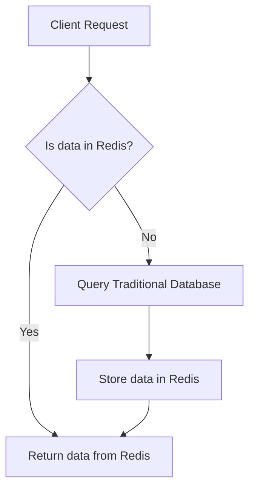

## Redis vs. Traditional Databases/Caches
### Core Concepts
*   **Redis (REmote DIctionary Server):** An open-source, in-memory data structure store, used as a database, cache, and message broker. It stores data primarily in RAM, enabling extremely low-latency operations. Offers diverse data structures (strings, hashes, lists, sets, sorted sets, streams, etc.).
*   **Traditional Databases (e.g., RDBMS like PostgreSQL, MySQL; NoSQL like MongoDB, Cassandra):**
    *   **RDBMS:** Disk-based, ACID-compliant (Atomicity, Consistency, Isolation, Durability), strong schema, support for complex queries and JOINs. Optimized for data integrity and complex relationships.
    *   **NoSQL:** Diverse models (document, key-value, column-family, graph), schema-less or flexible schema. Optimized for scalability, high availability, and specific data access patterns (e.g., large datasets, high write throughput).
*   **Traditional Caches (e.g., Ehcache, Guava Cache, in-memory object caches):** Typically in-process or local to an application instance. Store frequently accessed data closer to the application to reduce latency to the primary data store. Limited by application memory, not easily shared across services, and require explicit invalidation logic.

### Key Details & Nuances
*   **Performance:**
    *   **Redis:** Orders of magnitude faster (microseconds) due to in-memory operations and single-threaded design (minimizes context switching). Excellent for read-heavy, low-latency use cases.
    *   **Traditional DBs:** Slower (milliseconds to seconds) due to disk I/O, complex query processing, and transactional overhead.
    *   **Traditional Caches:** Fast for hits (in-process), but limited scope and scaling.
*   **Data Persistence:**
    *   **Redis:** Primarily in-memory but offers persistence options:
        *   **RDB (Redis Database):** Point-in-time snapshots of the dataset. Good for backups.
        *   **AOF (Append Only File):** Logs every write operation. Offers better durability.
        *   Can be run without persistence for pure caching (volatile).
    *   **Traditional DBs:** Designed for full durability. Data is persistently stored on disk, ensuring data integrity even after crashes (ACID properties for RDBMS).
*   **Data Model & Querying:**
    *   **Redis:** Simple key-value store with rich data structures. Operations are atomic at the command level. Limited querying capabilities; no complex JOINs or aggregation like SQL.
    *   **Traditional DBs:**
        *   **RDBMS:** Relational model, strong schema, SQL for complex queries, transactions, JOINs.
        *   **NoSQL:** Flexible schemas, various query APIs tailored to their data models.
*   **Scalability:**
    *   **Redis:** Scales horizontally via sharding (Redis Cluster) or master-replica setups for reads. Vertical scaling (more RAM) is common for single instances.
    *   **Traditional DBs:** RDBMS often scale vertically initially, then horizontally via replication, sharding (complex). NoSQL databases are typically designed for horizontal scaling from the start.
*   **Atomicity & Transactions:**
    *   **Redis:** Operations are atomic. Supports `MULTI`/`EXEC` for basic transactions, but without rollback for all command types. Pipelining groups commands for efficiency.
    *   **Traditional DBs:** Full ACID transactions in RDBMS. NoSQL databases have varying levels of transaction support, often prioritizing availability and partition tolerance (CAP theorem).
*   **Use Cases:**
    *   **Redis:** Caching, session management, real-time analytics, leaderboards, message queues/pub-sub, rate limiting, distributed locks.
    *   **Traditional DBs:** System of record, complex data relationships, financial transactions, auditing, long-term data storage.

### Practical Examples

**Read-Through Cache Pattern with Redis:**

### Common Pitfalls & Trade-offs
*   **Cache Invalidation:** A fundamental challenge. Stale data in Redis can lead to inconsistencies. Strategies include TTL (Time-To-Live), write-through/write-back, or explicit invalidation.
*   **Memory Limits (Redis):** As an in-memory store, Redis is constrained by available RAM. Large datasets require sharding or careful data eviction policies.
*   **Single-Threaded Nature (Redis):** While beneficial for performance, long-running commands (e.g., `KEYS *`, `LRANGE` on huge lists) can block the entire server. Design critical applications to avoid such commands on production instances.
*   **Over-reliance on Redis:** Not a primary data store for critical, durable data without robust persistence and backup strategies. Always pair with a traditional database for system-of-record needs.
*   **Cost:** Large Redis instances with significant RAM can be expensive.
*   **Complexity:** Introducing Redis adds another layer of infrastructure, requiring monitoring, management, and understanding of its specific operational characteristics.

### Interview Questions

1.  **"When would you choose Redis over a traditional relational database for data storage, and what are the main trade-offs?"**
    *   **Answer:** Choose Redis for performance-critical, read-heavy scenarios (caching, real-time analytics, session stores) where sub-millisecond latency is crucial and data consistency requirements are more relaxed (eventual consistency is often acceptable). Trade-offs include limited querying capabilities (no complex JOINs), primarily in-memory storage (memory constraints, potential data loss without proper persistence), and lack of full ACID transactions (compared to RDBMS). It's typically used *with* a traditional DB, not as a replacement for system-of-record needs.

2.  **"Describe how Redis ensures data durability, given it's an in-memory store. Compare its durability guarantees with a typical RDBMS."**
    *   **Answer:** Redis offers durability through **RDB (snapshots)**, which periodically saves the dataset to disk, and **AOF (Append Only File)**, which logs every write operation. AOF offers higher durability (can lose only a few seconds of data), while RDB is better for point-in-time backups. A typical RDBMS, however, is inherently designed for strong durability, writing changes to transaction logs and then to data files on disk, guaranteeing full ACID properties (including Durability) by default, even in the event of crashes. Redis's durability is configurable and often a trade-off with performance, whereas an RDBMS prioritizes durability.

3.  **"Imagine you need to store user sessions for a high-traffic web application. Would you use Redis, a traditional database, or a local application cache? Justify your choice and explain how you'd handle scalability."**
    *   **Answer:** I would choose **Redis**.
        *   **Why Redis:** User sessions require fast read/write access (for every request), shared state across multiple application instances, and quick expiry. Redis excels here due to its in-memory speed, distributed nature (easily accessible by all app servers), and native TTL (Time-To-Live) support for session expiration. A traditional DB would introduce too much latency and I/O overhead for every request. A local cache wouldn't work as sessions need to be shared across multiple application servers.
        *   **Scalability:** For scalability, I would deploy Redis in a **master-replica setup** for read scaling and high availability, and potentially use **Redis Cluster** for horizontal scaling (sharding) if the session data grows very large, distributing keys across multiple Redis nodes.

4.  **"What are the major performance implications of Redis being single-threaded, and when might this be a limitation?"**
    *   **Answer:** Redis being single-threaded means it processes commands one at a time, sequentially. This simplifies its design and removes overheads associated with locking and context switching, contributing to its extreme speed. The major implication is that **any long-running command will block all other commands** until it completes. This becomes a limitation when:
        *   Using commands that operate on very large data structures (e.g., `SMEMBERS` on a set with millions of members, `KEYS *` on a large dataset).
        *   Executing Lua scripts that perform complex or time-consuming operations.
        *   During persistence operations (RDB/AOF sync) if not configured carefully.
    *   Such operations can introduce noticeable latency spikes, impacting the overall responsiveness of the Redis instance. Careful monitoring and avoiding blocking commands in production are essential.