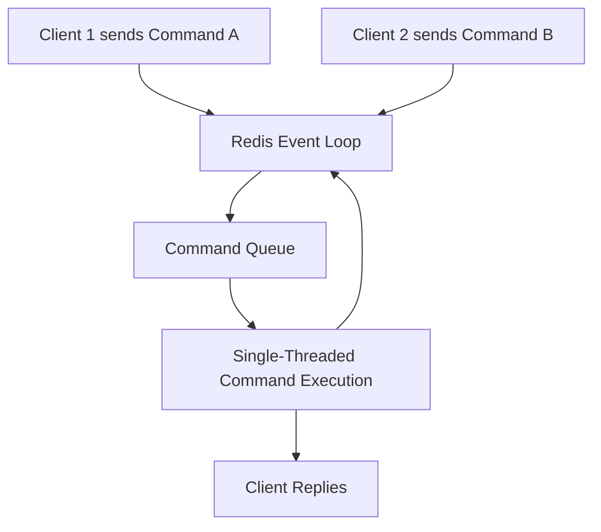

## Single-Threaded Nature & Concurrency
### Core Concepts
*   **Single-Threaded Command Execution:** Redis processes all commands sequentially on a single main thread. This means one command is fully executed before the next one begins.
*   **Event Loop Model:** Redis uses a non-blocking I/O multiplexing model (like `epoll`, `kqueue`, `select`) to handle multiple client connections concurrently. Incoming commands are queued and processed by the single thread.
*   **In-Memory Design:** Its primary dataset resides in RAM, making most operations extremely fast and CPU-bound rather than I/O-bound. This speed allows the single thread to serve a large number of requests per second.
*   **Atomicity:** Due to its single-threaded nature, every individual Redis command is guaranteed to be atomic. There are no race conditions between concurrent commands.

### Key Details & Nuances
*   **Why Single-Threaded?**
    *   **Simplicity:** Avoids complex locking mechanisms and concurrency control issues (e.g., deadlocks, race conditions) inherent in multi-threaded data stores, leading to a simpler, more robust codebase.
    *   **Performance:** For in-memory operations, the overhead of context switching between threads often outweighs the benefits of parallelization. A well-optimized single thread can be faster.
    *   **Predictable Latency:** Provides consistent low latency because command execution is not interrupted by other commands.
*   **Role of I/O Multiplexing:** While command execution is single-threaded, Redis leverages I/O multiplexing to manage thousands of concurrent client connections efficiently. It waits for I/O events (new connections, incoming commands, data to send) and processes them as they arrive.
*   **Redis 6+ Multi-threading:** Introduced for **I/O operations (reading from/writing to sockets)**, not for command execution. The core command processing engine remains single-threaded. This improves performance for workloads with many small commands by offloading network I/O to multiple threads, freeing the main thread to process commands faster.
*   **Pipelining & Transactions (MULTI/EXEC):**
    *   **Pipelining:** Allows clients to send multiple commands to Redis without waiting for the reply to each, significantly reducing network round-trip time. Commands are still executed sequentially on the server.
    *   **Transactions:** `MULTI` and `EXEC` block of commands are guaranteed to execute atomically as a single, uninterruptible unit. No other commands can interleave within a transaction block.

### Practical Examples

#### Redis Single-Threaded Event Loop
This diagram illustrates how Redis processes commands one by one using its single thread.



#### Atomic Increment Example
When multiple clients try to increment a counter simultaneously, Redis's single-threaded nature guarantees that each `INCR` operation is atomic.

```typescript
// Client 1
const redisClient1 = createRedisClient();
redisClient1.incr('my_counter'); // Will be processed fully before next command

// Client 2
const redisClient2 = createRedisClient();
redisClient2.incr('my_counter'); // Waits in queue, then processed fully

// Even if called "simultaneously" from client perspective,
// Redis processes them sequentially, ensuring `my_counter` is always correct.
```

### Common Pitfalls & Trade-offs
*   **Blocking Operations:** Long-running commands (e.g., `KEYS`, `FLUSHALL`, `LRANGE` on huge lists, complex Lua scripts, `BLPOP`/`BRPOP` without timeout on empty lists) can block the single thread, preventing all other commands from being processed. This leads to increased latency and timeouts for all connected clients.
    *   **Mitigation:** Use `SCAN` instead of `KEYS`. Limit operations on large data structures. Use `Lua` scripts judiciously, profiling their execution time. Use `BLPOP/BRPOP` with a reasonable timeout.
*   **CPU-Bound Operations:** While Redis is fast, if a command involves significant computation on the main thread (e.g., large sort operations), it will consume CPU and block other operations.
*   **Trade-off:** The simplicity and atomicity gained from being single-threaded come at the cost of limited vertical scalability for inherently CPU-bound tasks. For CPU-intensive use cases, other architectures might be more suitable or Redis Cluster can be used to shard data across multiple Redis instances.

### Interview Questions
1.  **Why is Redis single-threaded, and how does it achieve such high performance despite this design choice?**
    *   **Answer:** Redis is single-threaded to simplify its design, avoid complex concurrency issues (locks, deadlocks), and ensure atomicity of commands. It achieves high performance because it's an in-memory database, which makes most operations CPU-bound and extremely fast. It uses a non-blocking I/O event loop (`epoll`, `kqueue`) to efficiently handle thousands of concurrent client connections. For I/O, Redis 6+ introduced multi-threading to offload network operations, further boosting throughput.
2.  **What are the implications of Redis's single-threaded nature for long-running commands or operations? How can you mitigate potential issues?**
    *   **Answer:** Long-running commands (e.g., `KEYS`, `FLUSHALL`, `LRANGE` on very large lists, CPU-intensive Lua scripts) will block the single Redis thread. This means all other client commands will be queued and experience increased latency or even timeouts until the blocking command completes. Mitigation strategies include: using `SCAN` instead of `KEYS` for iterating keys, breaking down large Lua scripts, setting appropriate timeouts for blocking list operations (`BLPOP`), and sharding data across multiple Redis instances (Redis Cluster) to distribute the load.
3.  **Redis 6+ introduced multi-threading. Does this mean Redis is no longer single-threaded? Explain the difference.**
    *   **Answer:** Redis 6+ introduced multi-threading, but only for **I/O operations** (reading from and writing to network sockets). The core command execution engine remains strictly single-threaded. This design allows Redis to offload the network I/O burden to multiple threads, freeing the main thread to process commands more quickly, thus improving overall throughput, especially for workloads with many small requests. It does not change the fundamental atomicity of command execution.
4.  **Explain how individual Redis commands are guaranteed to be atomic. Provide an example where this atomicity is crucial.**
    *   **Answer:** Individual Redis commands are atomic because Redis processes all commands sequentially on a single thread. There are no pre-emptions or context switches between different client commands during the execution of a single command. Once a command starts, it runs to completion before the next command from the queue is processed. This inherent sequential execution eliminates race conditions at the command level. A crucial example is using `INCR` for a counter: if multiple clients send `INCR` commands simultaneously, the single-threaded nature ensures that each `INCR` is fully applied before the next, guaranteeing the counter's final value is always correct without external locking.