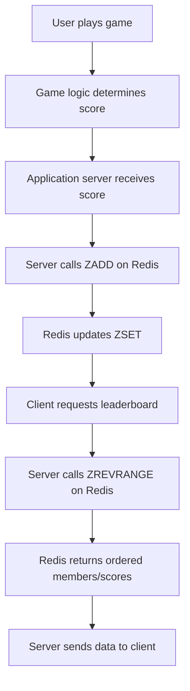

## Sorted Sets (ZSETs) Use Cases (e.g., Leaderboards)
### Core Concepts
*   **Redis Sorted Sets (ZSETs):** A non-repeating collection of unique `members` (strings) where each member is associated with a `score` (a floating-point number).
*   **Ordered by Score:** Members are always kept sorted by their scores. If scores are identical, members are sorted lexicographically.
*   **Primary Use Cases:** Ideal for scenarios requiring ordered lists, rankings, or time-series data, such as:
    *   **Leaderboards:** Ranking players by their game scores.
    *   **Rate Limiting:** Tracking user activity timestamps to enforce limits.
    *   **Recent Items:** Storing recently viewed items by timestamp.
    *   **Priority Queues:** Elements processed based on priority (score).

### Key Details & Nuances
*   **Internal Representation:** ZSETs are implemented using a combination of a skip list (for fast lookups by score/rank) and a hash table (for fast `O(1)` lookups by member).
*   **Atomic Operations:** Most ZSET commands are atomic, ensuring consistency.
*   **Time Complexity:**
    *   `ZADD`: `O(log N)` where N is the number of elements in the ZSET.
    *   `ZREM`: `O(log N)`
    *   `ZSCORE`: `O(1)`
    *   `ZRANK`/`ZREVRANK`: `O(log N)`
    *   `ZRANGE`/`ZREVRANGE`: `O(log N + K)` where K is the number of elements returned.
*   **Score Ties:** When multiple members have the same score, their relative order is determined lexicographically by the member string itself. This is crucial for consistent rankings.
*   **Memory Usage:** Each member-score pair consumes memory for both the skip list node and the hash table entry. Can be significant for very large ZSETs.

### Practical Examples

#### Leaderboard Implementation
```typescript
// Example using ioredis client for Node.js

import Redis from 'ioredis';
const redis = new Redis(); // Connects to localhost:6379 by default

async function updatePlayerScore(playerId: string, score: number): Promise<void> {
    // ZADD <key> <score> <member>
    // Adds or updates a member's score. If member exists, score is updated.
    await redis.zadd('game_leaderboard', score, playerId);
    console.log(`Player ${playerId} score updated to ${score}`);
}

async function getTopPlayers(count: number): Promise<Array<[string, string]>> {
    // ZREVRANGE <key> <start> <stop> WITHSCORES
    // Returns elements from the sorted set in descending order by score.
    // WITHSCORES returns score along with member.
    return redis.zrevrange('game_leaderboard', 0, count - 1, 'WITHSCORES');
}

async function getPlayerRank(playerId: string): Promise<number | null> {
    // ZREVRANK <key> <member>
    // Returns the 0-based rank of member in the sorted set, ordered from highest to lowest score.
    const rank = await redis.zrevrank('game_leaderboard', playerId);
    // ZREVRANK returns null if member doesn't exist.
    return rank !== null ? rank + 1 : null; // Convert to 1-based rank
}

async function runLeaderboardExample() {
    console.log("--- Initializing Leaderboard ---");
    await redis.del('game_leaderboard'); // Clear previous data

    await updatePlayerScore('player:alice', 1500);
    await updatePlayerScore('player:bob', 1200);
    await updatePlayerScore('player:charlie', 2000);
    await updatePlayerScore('player:david', 1200); // Same score as Bob
    await updatePlayerScore('player:eve', 1800);

    console.log("\n--- Top 3 Players ---");
    const topPlayers = await getTopPlayers(3);
    topPlayers.forEach(([member, score], index) => {
        console.log(`#${index + 1}: ${member} (Score: ${score})`);
    });

    console.log("\n--- Player Ranks ---");
    console.log(`Alice's rank: ${await getPlayerRank('player:alice')}`);
    console.log(`Bob's rank: ${await getPlayerRank('player:bob')}`);
    console.log(`Charlie's rank: ${await getPlayerRank('player:charlie')}`);
    console.log(`David's rank: ${await getPlayerRank('player:david')}`); // David's rank might be different from Bob's due to lexicographical tie-breaking
    console.log(`Eve's rank: ${await getPlayerRank('player:eve')}`);

    await redis.quit();
}

runLeaderboardExample();
```

#### Leaderboard Update Flow


### Common Pitfalls & Trade-offs
*   **Large ZSETs & Memory:** Storing millions of elements can consume significant RAM. Consider sharding or using `ZREM` to prune old/low-score entries.
*   **Score Resolution:** Scores are floating-point numbers. Be mindful of precision issues for extremely granular scores. For integer scores, this is less of an issue.
*   **Lexicographical Tie-breaking:** While useful, be aware that players with identical scores are ordered by their member string. This might mean `player_a` ranks higher than `player_b` if both have score 100, purely due to alphabetical order. If exact ties need custom handling, additional logic is required (e.g., composite scores, or separate tie-breaker ZSETs).
*   **Distributed Leaderboards:** Scaling leaderboards across multiple Redis instances requires careful design (e.g., consistent hashing, application-level sharding) to ensure a unified view or localized leaderboards.
*   **Concurrent Updates:** While `ZADD` is atomic, a sequence of operations (e.g., fetch score, calculate new score, update score) might not be. Use `WATCH`/`MULTI`/`EXEC` or Lua scripts for multi-command atomicity.

### Interview Questions
1.  **Why are Redis Sorted Sets particularly well-suited for implementing leaderboards compared to a simple Redis List or Hash?**
    *   **Answer:** ZSETs uniquely combine ordering by score with efficient member lookup. Lists are ordered but lack efficient random access by value or score. Hashes provide O(1) lookup but no inherent ordering by value. ZSETs offer `O(log N)` for adding/updating members and retrieving ranks, and `O(log N + K)` for range queries, which is ideal for dynamic leaderboards.

2.  **How would you handle a scenario where multiple players have the exact same score? What factors determine their relative ranking in a Redis Sorted Set?**
    *   **Answer:** When scores are identical, Redis Sorted Sets use lexicographical ordering of the member strings as a tie-breaker. This means 'alice' might rank higher than 'bob' if they have the same score. If a different tie-breaking rule is needed (e.g., by the time they achieved the score), you'd need a custom score (e.g., `score * 10000000000 + (MAX_TIMESTAMP - current_timestamp)`) or implement secondary ranking logic in the application.

3.  **Describe the time complexity of the most common Redis ZSET operations (`ZADD`, `ZRANK`/`ZREVRANK`, `ZRANGE`/`ZREVRANGE`) and explain why these complexities are acceptable for typical leaderboard use cases.**
    *   **Answer:** `ZADD` is `O(log N)` because it involves inserting into a skip list and a hash table. `ZRANK`/`ZREVRANK` is `O(log N)` due to skip list traversal. `ZRANGE`/`ZREVRANGE` is `O(log N + K)` (where K is elements returned) for traversing the skip list and fetching K elements. These logarithmic complexities are highly efficient, allowing leaderboards with millions of entries to perform operations quickly, as `log N` grows much slower than `N`.

4.  **A highly active game leaderboard needs to support millions of players with frequent score updates. What are the potential challenges with using a single Redis ZSET, and how might you address them?**
    *   **Answer:**
        *   **Memory Usage:** Millions of entries can consume significant RAM on a single Redis instance.
        *   **Network Bottleneck:** High write concurrency could saturate network bandwidth to a single Redis instance.
        *   **Single Point of Failure:** The sole Redis instance becomes a critical dependency.
        *   **Solutions:**
            *   **Sharding/Clustering:** Distribute the leaderboard across multiple Redis instances using Redis Cluster or application-level sharding (e.g., sharding by player ID range).
            *   **Time-based Pruning:** For historical leaderboards, remove old or irrelevant entries using `ZREMRANGEBYRANK` to keep the size manageable.
            *   **Tiered Leaderboards:** Maintain a "global" leaderboard for top players and smaller, localized leaderboards (e.g., by region, by friend group) for most players.
            *   **Asynchronous Updates:** For very high throughput, scores might be batched or processed asynchronously before updating Redis.

5.  **How would you implement fetching a player's score and rank simultaneously using Redis ZSET commands, ensuring atomicity?**
    *   **Answer:** You can use `MULTI`/`EXEC` to batch the commands or, more robustly, a Lua script.
    *   **Using `MULTI`/`EXEC`:**
        ```redis
        MULTI
        ZSCORE game_leaderboard player:alice
        ZREVRANK game_leaderboard player:alice
        EXEC
        ```
        This ensures that the score and rank are fetched as they existed at the moment `MULTI` was called, without interleaving operations from other clients.
    *   **Using Lua Script (more powerful for complex logic):** A Lua script would fetch both values and return them as a single atomic operation, reducing round trips and ensuring consistency.