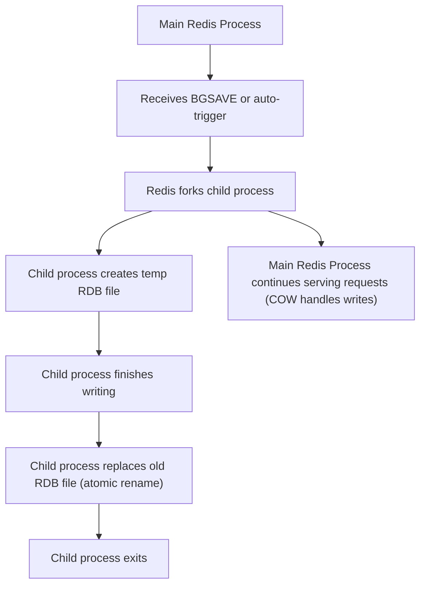

## RDB (Redis Database) Snapshots
### Core Concepts
*   **Point-in-Time Snapshots:** RDB (Redis Database) persistence creates binary, compressed snapshots of the entire Redis dataset at a specific moment.
*   **Backup & Recovery:** Primarily used for full backups, disaster recovery, and transferring data between Redis instances.
*   **Compact Format:** RDB files (`dump.rdb` by default) are highly optimized for disk space and fast loading during Redis startup.

### Key Details & Nuances
*   **Triggering Snapshots:**
    *   **Manual:** `SAVE` (blocking) or `BGSAVE` (non-blocking).
    *   **Automatic:** Configured in `redis.conf` (e.g., `save 900 1`, `save 300 10`, `save 60 10000`). These automatically trigger `BGSAVE`.
    *   **Shutdown:** If RDB is enabled, a `BGSAVE` is automatically performed on a clean shutdown.
*   **`SAVE` Command:**
    *   **Blocking:** The Redis server stops processing client commands while saving the RDB file. This is rarely used in production due to potential downtime.
*   **`BGSAVE` Command (Background Save):**
    *   **Non-Blocking:** The main Redis process forks a child process. The child process writes the RDB file. The main process continues to serve client requests.
    *   **Copy-On-Write (COW):** When `BGSAVE` forks, the child process initially shares the parent's memory pages. If the parent process modifies a shared memory page, the OS duplicates that page for the parent, ensuring the child sees the state *at the time of the fork*. This minimizes memory usage and ensures data consistency for the snapshot.
*   **Advantages:**
    *   Very compact RDB files.
    *   Fast recovery (quick loading into memory).
    *   Excellent for disaster recovery backups.
*   **Disadvantages:**
    *   **Data Loss Window:** Data written between the last successful RDB snapshot and a server crash is lost. This is the primary trade-off.
    *   **Forking Overhead:** For very large datasets, the initial `fork()` operation can be CPU-intensive and temporarily block the main Redis process, though usually for milliseconds.
    *   **Disk I/O:** Saving the RDB file can cause significant disk I/O, potentially impacting performance during the save operation.

### Practical Examples

**1. `redis.conf` RDB Configuration:**

```conf
# Save the DB on disk:
#   save <seconds> <changes>
#   Will save the DB if both the given number of seconds and the given
#   number of write operations against the DB occurred.
#
# Examples:
# save 900 1      # Save if 900 seconds (15 minutes) and 1 write operation
# save 300 10     # Save if 300 seconds (5 minutes) and 10 write operations
# save 60 10000   # Save if 60 seconds (1 minute) and 10000 write operations

# Disable RDB persistence (default in some versions for security/AOF preference)
# save "" 
```

**2. Manual `BGSAVE` Command:**

```sh
redis-cli BGSAVE
```

**3. `BGSAVE` (Background Save) Process Flow:**



### Common Pitfalls & Trade-offs
*   **Ignoring Data Loss Window:** Relying solely on RDB for critical data without understanding its data loss implications can lead to data loss. The window is from the last successful snapshot to the crash time.
*   **Frequent `BGSAVE` on Large Datasets:** While `BGSAVE` is non-blocking, too frequent saves with very large datasets can lead to increased memory usage (due to COW pages) and repeated CPU spikes from forking, impacting overall performance.
*   **Disk Space Issues:** Not monitoring disk space can lead to `BGSAVE` failures if there isn't enough free space to write the new RDB file.
*   **Overlapping Backups:** Running other disk-intensive backups concurrently with RDB saves can saturate I/O.
*   **AOF vs. RDB:** Choosing one without considering the use case. AOF (Append Only File) offers better durability but larger files and potentially slower recovery. Many production setups use both for comprehensive durability and faster backups/restores.

### Interview Questions
1.  **Explain the RDB snapshotting process, especially for `BGSAVE`, and how it achieves non-blocking saves.**
    *   **Answer:** `BGSAVE` is non-blocking because the main Redis process forks a child process. The child process is then responsible for writing the entire dataset to a temporary RDB file on disk. The critical mechanism is Copy-On-Write (COW): the child initially shares memory pages with the parent. If the parent receives a write operation that modifies a shared page, the OS duplicates that specific page, allowing the parent to write to its copy while the child retains the original page's state for the snapshot, ensuring data consistency for the point-in-time snapshot without blocking the main process.

2.  **What are the primary advantages and disadvantages of using RDB persistence?**
    *   **Answer:** **Advantages:** Very compact binary files, fast for full backups, very fast recovery/loading on startup. **Disadvantages:** Inherent data loss window (data written since the last snapshot is lost on crash), initial forking for large datasets can cause a brief CPU spike, and disk I/O during saving can impact performance.

3.  **When would you choose RDB over AOF, or recommend using both?**
    *   **Answer:** Choose **RDB alone** for: disaster recovery, periodic backups where some data loss is acceptable (e.g., cached data), or when speed of recovery is paramount. Choose **AOF alone** for: maximum data durability (no data loss window) where every write must be persisted. **Use both** (recommended for most critical applications) for: achieving the best of both worlds – RDB provides fast, compact full backups for quick recovery, while AOF (especially with `fsync=everysec`) minimizes data loss to about one second on crash.

4.  **How does Copy-On-Write (COW) specifically relate to RDB persistence and what problem does it solve?**
    *   **Answer:** COW is fundamental to `BGSAVE`. When `BGSAVE` forks, the child process and parent process initially share the same memory pages. COW solves the problem of keeping the snapshot consistent while the parent continues to modify data. If the parent modifies a shared page, the OS copies that page, so the parent writes to its new copy, leaving the original page intact for the child to include in the snapshot. This allows the child to create a consistent snapshot of the data *at the time of the fork* without the parent blocking or needing to duplicate the entire dataset upfront.

5.  **Describe the "data loss window" in RDB persistence and how it can be mitigated.**
    *   **Answer:** The data loss window in RDB refers to the period between the last successfully completed RDB snapshot and the moment a Redis server crashes or is unexpectedly shut down. Any data changes made during this window are lost because they were not yet persisted to disk. It can be mitigated by:
        *   **More frequent `BGSAVE`s:** Reducing the `save` interval in `redis.conf` reduces the window, but increases fork/I/O overhead.
        *   **Using AOF persistence:** AOF, especially with `appendfsync everysec`, logs every write operation, significantly reducing the data loss window to typically one second or less.
        *   **Sentinel/Cluster for High Availability:** While not directly persistence, these provide failover, reducing downtime and impact, often combined with AOF for durability.