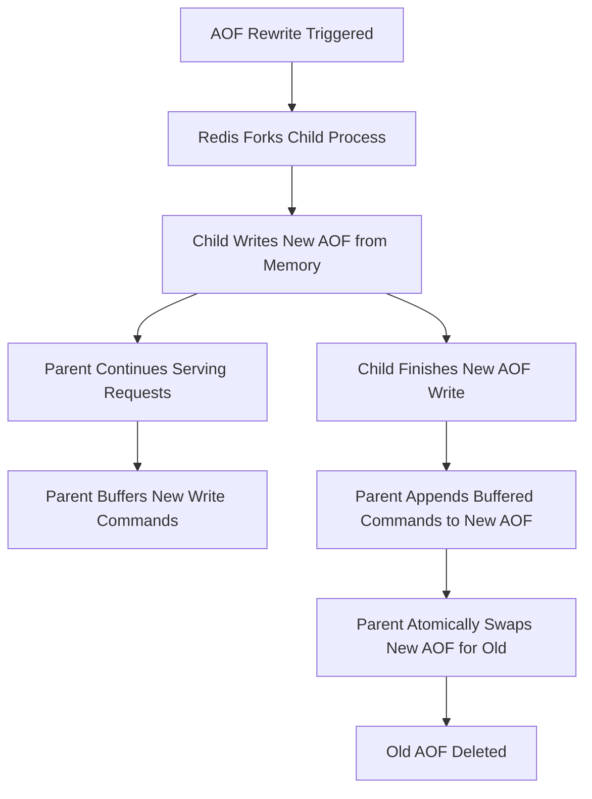

## AOF (Append Only File) Logging
### Core Concepts

*   **Append Only File (AOF):** A persistence strategy where Redis logs every write operation received by the server. It's akin to a database transaction log.
*   **Durability:** Achieves high data durability by replaying the sequence of commands logged in the AOF file during server startup to reconstruct the dataset. This minimizes data loss compared to RDB snapshots.
*   **Human-Readable (mostly):** The AOF file contains a sequence of Redis commands in a format that is generally human-readable, making debugging or understanding changes easier.

### Key Details & Nuances

*   **Logging Process:** Redis appends commands to the AOF file in an event loop, before the command is actually executed by the server. This ensures that the command is logged even if the server crashes right after processing.
*   **`fsync` Policies (`appendfsync`):** Controls how often Redis writes changes from the OS buffer to disk, impacting durability and performance:
    *   `always`: fsyncs every command to disk.
        *   **Pro:** Maximum durability (no data loss in case of crash).
        *   **Con:** Slowest performance, especially for high write loads.
    *   `everysec` (Default): fsyncs once per second.
        *   **Pro:** Good balance of durability (up to 1 second of data loss) and performance.
        *   **Con:** Small window of potential data loss.
    *   `no`: Redis lets the OS decide when to fsync (typically 30 seconds or more).
        *   **Pro:** Fastest performance.
        *   **Con:** Highest potential for data loss (up to tens of seconds).
*   **AOF Rewrite (Compaction):**
    *   **Purpose:** The AOF file can grow very large due to redundant commands (e.g., multiple `INCR` operations on the same key, expired keys). Rewrite compacts the file, creating a new, optimized AOF containing only the commands necessary to rebuild the current dataset.
    *   **Process:** Triggered automatically (based on size increase) or manually (`BGREWRITEAOF`). Redis forks a child process to write the new AOF file based on the current in-memory dataset, while the parent continues serving requests and buffering new commands. Once the child finishes, the parent appends its buffer to the new AOF and atomically swaps the files.
    *   **Configuration:** Controlled by `auto-aof-rewrite-percentage` and `auto-aof-rewrite-min-size`.

### Practical Examples

**Redis AOF Configuration (`redis.conf`):**

```conf
# Enable AOF persistence
appendonly yes

# The name of the append only file (default: "appendonly.aof")
appendfilename "appendonly.aof"

# fsync policy: always, everysec, or no
appendfsync everysec

# Automatic AOF rewrite trigger conditions
# Redis will rewrite the AOF file if the current AOF file size is
# at least 100% larger than the last rewrite size, and
# the current AOF file size is at least 64mb.
auto-aof-rewrite-percentage 100
auto-aof-rewrite-min-size 64mb
```

**AOF Rewrite Process Flow:**



### Common Pitfalls & Trade-offs

*   **Performance vs. Durability:** This is the core trade-off with AOF. `appendfsync always` provides maximum durability but can severely impact write throughput. `everysec` is often the sweet spot. `no` offers high performance but significant data loss risk.
*   **AOF File Size:** Without proper AOF rewrite configuration, the AOF file can grow unbounded, consuming excessive disk space and slowing down startup recovery (as more commands need to be replayed).
*   **Startup Time:** Replaying a very large AOF file during server startup can be slow, especially compared to loading an RDB snapshot.
*   **AOF vs. RDB:**
    *   **AOF:** Higher durability (minimal data loss), larger file size, potentially slower write/startup.
    *   **RDB:** Point-in-time snapshots, smaller file size, faster startup, less data durability (potential for more data loss).
    *   **Best Practice:** Often, both AOF and RDB are used together (hybrid persistence) for comprehensive data safety, with AOF providing the primary recovery mechanism and RDB acting as a robust backup for disaster recovery or faster cold starts.

### Interview Questions

1.  **Explain the purpose of Redis AOF and how it achieves data durability. How does it differ fundamentally from RDB persistence?**
    *   **Answer:** AOF (Append Only File) achieves durability by logging every write operation (command) received by Redis. Upon restart, Redis replays these commands to reconstruct the dataset. This provides higher durability than RDB, which takes point-in-time snapshots of the dataset. AOF is a sequential log of operations, while RDB is a compact binary representation of the dataset's state.

2.  **Describe the different `appendfsync` policies and their trade-offs. When would you choose one over another in a production environment?**
    *   **Answer:** The policies are `always` (fsyncs every command), `everysec` (fsyncs once per second), and `no` (OS handles fsync). `always` offers maximum durability with highest performance cost. `everysec` (default) is a balance, losing at most 1 second of data. `no` is fastest but risks significant data loss. For most production systems, `everysec` is preferred for its balance. `always` is for critical, zero-data-loss scenarios with acceptable performance impact. `no` is generally avoided unless Redis is used as a cache with no persistence requirements.

3.  **How does AOF rewrite work, and why is it necessary? What are the implications if AOF rewrite fails or is not configured properly?**
    *   **Answer:** AOF rewrite compacts the log by creating a new, optimized AOF file that contains only the current state of the data, eliminating redundant commands. It's necessary because the AOF file can grow very large over time. If it fails or isn't configured, the AOF file will grow indefinitely, consuming disk space, slowing down startup recovery, and potentially exceeding available memory during replay.

4.  **In a scenario where Redis is critical for an application, would you recommend using AOF, RDB, or both? Justify your choice.**
    *   **Answer:** For critical applications, using *both* AOF and RDB is generally recommended (hybrid persistence). AOF provides granular data durability, minimizing data loss to seconds or less, and is the primary recovery mechanism. RDB serves as a robust point-in-time backup, faster for full dataset restoration (e.g., cold starts or disaster recovery) and generally more compact. This combination offers the best balance of data safety and recovery flexibility.

5.  **What are the potential performance implications of using AOF, especially with the `appendfsync always` policy, and how can they be mitigated?**
    *   **Answer:** The `appendfsync always` policy forces a disk sync for every write operation, leading to significantly higher latency and lower throughput, especially for applications with high write loads. This can become a bottleneck. Mitigation involves:
        *   Switching to `appendfsync everysec` for a better performance-durability trade-off.
        *   Using fast SSDs for the AOF file.
        *   Considering a master-replica setup where the master uses a less strict policy, and replicas handle full persistence if needed, or by distributing write load.
        *   Optimizing application write patterns to reduce the sheer volume of individual writes.