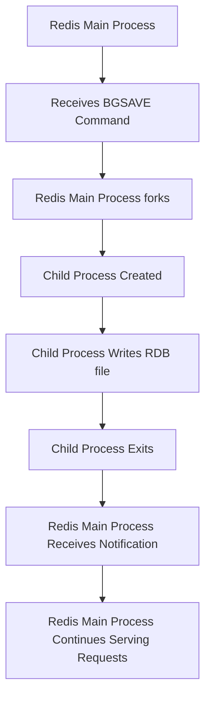

## RDB vs. AOF: Trade-offs (Performance vs. Durability)
### Core Concepts
*   **Redis Persistence:** Mechanisms to save the in-memory dataset to disk, ensuring data durability and recovery upon restart. Without persistence, all data is lost if the Redis server crashes or is shut down.
*   **RDB (Redis Database File):** Provides a point-in-time snapshot of the dataset. It's a highly compact, binary representation of the data.
*   **AOF (Append Only File):** Logs every write operation received by the server. Redis replays these commands upon restart to reconstruct the dataset.

### Key Details & Nuances
*   **RDB Specifics:**
    *   **Snapshotting:** Can be triggered manually (`SAVE`, `BGSAVE`) or automatically based on configured save points (`save 900 1`, `save 300 10`, etc.).
    *   **`SAVE` (Blocking):** Executes synchronously, blocking the Redis server until the snapshot is complete. Rarely used in production due to downtime.
    *   **`BGSAVE` (Non-Blocking):** Redis forks a child process. The child process writes the RDB file while the parent continues to serve requests. Utilizes copy-on-write semantics for memory efficiency during the fork.
    *   **File Format:** Compressed binary format, optimized for fast loading.
    *   **Durability:** Data loss potential exists for operations that occur between the last successful snapshot and a crash.
    *   **Use Cases:** Excellent for backups, disaster recovery, and data analysis due to its compact nature and fast loading.

*   **AOF Specifics:**
    *   **Logging:** Appends every write command received by Redis to the AOF file.
    *   **Human-Readable:** Commands are stored in a format similar to the Redis protocol.
    *   **`appendfsync` Modes:** Controls how often data is flushed from the OS buffer to disk:
        *   `no`: Never explicitly `fsync`, relies on OS. Fastest, least durable.
        *   `everysec`: `fsync` every second (default). Good balance of performance and durability (up to 1 second data loss).
        *   `always`: `fsync` on every write. Slowest, most durable (guarantees durability).
    *   **AOF Rewrite (`BGREWRITEAOF`):** Periodically compacts the AOF file by generating a new, smaller AOF that contains only the necessary commands to reconstruct the current dataset. This process is non-blocking, similar to `BGSAVE`.
    *   **Durability:** Higher than RDB, as every command is logged. Minimal data loss depending on `appendfsync` settings.
    *   **Use Cases:** Primary mechanism for high durability scenarios where minimal data loss is acceptable.

*   **RDB vs. AOF Trade-offs (Performance vs. Durability):**
    | Feature         | RDB                                        | AOF                                                               |
    | :-------------- | :----------------------------------------- | :---------------------------------------------------------------- |
    | **Durability**  | Low (data loss up to last snapshot)        | High (configurable: 0-1 second, or per-write data loss)           |
    | **Performance** | Low overhead during normal operations (`BGSAVE` uses fork, minimal impact). Fast recovery time for large datasets. | Higher overhead due to logging every write (`fsync` overhead). Slower recovery for large datasets (replaying commands). |
    | **File Size**   | Compact binary format, smaller file.       | Larger file (logs all writes), though `BGREWRITEAOF` helps.      |
    | **Recovery**    | Faster loading due to compact binary.      | Slower (commands replayed).                                     |
    | **Data Integrity** | Snapshot can be corrupted if not handled correctly. | File corruption can be fixed with `redis-check-aof`.             |

*   **Redis 4.0+ Hybrid Persistence:** Combines RDB and AOF. The AOF file starts with an RDB preamble (snapshot), followed by incremental AOF writes. This offers faster restarts (loads RDB portion) with good durability (AOF for recent changes). This is often the recommended default.

### Practical Examples

**Redis Configuration Snippets:**

```ini
# RDB Configuration (redis.conf)
save 900 1    # Save every 900 seconds if at least 1 key changed
save 300 10   # Save every 300 seconds if at least 10 keys changed
save 60 10000 # Save every 60 seconds if at least 10000 keys changed

dbfilename dump.rdb
dir ./

# AOF Configuration (redis.conf)
appendonly yes        # Enable AOF
appendfilename "appendonly.aof"

# appendfsync always | everysec | no
appendfsync everysec  # Default and recommended for balanced performance/durability
no-appendfsync-on-rewrite yes # Prevent fsync during AOF rewrite to avoid I/O blocking
auto-aof-rewrite-percentage 100 # Trigger rewrite if AOF size doubles since last rewrite
auto-aof-rewrite-min-size 64mb  # Minimum AOF file size for rewrite to trigger
```

**Manual Persistence Commands (Redis CLI):**

```sh
127.0.0.1:6379> SAVE           # Synchronously saves the dataset to disk (blocks Redis)
OK
127.0.0.1:6379> BGSAVE         # Asynchronously saves the dataset to disk (non-blocking)
Background saving started
127.0.0.1:6379> BGREWRITEAOF   # Asynchronously rewrites the AOF file (non-blocking)
Background append only file rewriting started
```

**`BGSAVE` Process Flow:**



### Common Pitfalls & Trade-offs

*   **RDB Pitfalls:**
    *   **Data Loss Window:** Unacceptable for scenarios requiring zero data loss.
    *   **`SAVE` Blocks:** Never use `SAVE` in production for a running server.
    *   **Forking Overhead:** For very large Redis instances (e.g., 100GB+), forking a child process for `BGSAVE` or `BGREWRITEAOF` can temporarily consume significant memory (due to copy-on-write, but still copies page tables) and CPU, potentially causing brief latency spikes.
    *   **Corrupted RDB:** An RDB file might get corrupted if the server crashes while writing it.

*   **AOF Pitfalls:**
    *   **Performance Overhead:** `appendfsync always` significantly impacts write performance. `everysec` is usually a good compromise.
    *   **Larger File Sizes:** AOF files can grow very large without regular `BGREWRITEAOF`. This can consume significant disk space.
    *   **Slower Restarts:** Replaying a very large AOF file can take a long time, leading to longer recovery times.
    *   **AOF Rewrites:** While non-blocking, rewrites still consume CPU and I/O resources on the server.

*   **Choosing a Strategy:**
    *   **RDB Only:** Suitable for scenarios where some data loss is acceptable (e.g., caching layers that can be rebuilt), and fast restarts are crucial. Simplest to manage.
    *   **AOF Only:** Provides higher durability. Good if disk space and restart time are less critical than preventing data loss.
    *   **Both (Recommended):** The most common and robust approach. AOF (with `everysec`) provides primary durability, while RDB snapshots provide a compact backup for faster full recovery or archival. Redis 4.0+ hybrid AOF simplifies this.

### Interview Questions

1.  **"Compare RDB and AOF persistence in Redis, focusing on their trade-offs regarding performance and data durability. Which would you choose for a critical financial application?"**
    *   **Answer:** RDB offers fast recovery and low operational overhead but has a data loss window. AOF offers higher durability (down to per-write with `always` `fsync`, or 1-second with `everysec`) but higher write overhead and slower recovery. For a critical financial application, AOF with `appendfsync everysec` or even `always` (if write throughput permits) would be preferred due to its superior durability. Combining both (Redis 4.0+ hybrid AOF) is often the best approach, leveraging RDB for faster initial load and AOF for recent changes.

2.  **"Describe the `BGSAVE` process in Redis. How does it ensure the main thread remains non-blocked, and what are the potential side effects for a very large dataset?"**
    *   **Answer:** `BGSAVE` achieves non-blocking behavior by forking a child process. The main Redis process continues to serve requests, while the child process writes the RDB file. This relies on the operating system's copy-on-write (CoW) mechanism: initially, parent and child share memory pages. When the parent modifies a page, a copy of that page is made for the parent, ensuring the child sees the consistent state at the time of the fork. For very large datasets, the initial `fork()` call can be time-consuming, and if many pages are modified by the parent, significant memory can be consumed due to CoW (memory duplication for modified pages), potentially leading to latency spikes or out-of-memory issues if not properly sized.

3.  **"Explain the purpose of AOF rewriting. Why is it necessary, and what are its implications for Redis performance?"**
    *   **Answer:** AOF rewriting is necessary because the AOF file grows by simply appending every write operation. Over time, many commands become redundant (e.g., multiple `SET` operations on the same key, `DEL` operations). Rewriting compacts the AOF by creating a new, optimized file that contains only the current state of the data, similar to a point-in-time snapshot of the commands. This process (`BGREWRITEAOF`) is non-blocking, using a fork. While non-blocking, it still consumes CPU and I/O resources for the child process and can increase memory usage temporarily due to CoW, potentially impacting overall system performance during the rewrite period.

4.  **"What are the different `appendfsync` options for AOF, and how do they impact the trade-off between performance and durability?"**
    *   **Answer:** The `appendfsync` option determines how often Redis flushes the AOF buffer to disk.
        *   `no`: Relies solely on the OS to flush data (typically every 30 seconds or more). Highest performance, but highest data loss potential (seconds to minutes).
        *   `everysec`: Redis `fsync`s the AOF file every second. Good balance of performance and durability; data loss is limited to at most 1 second of writes. This is often the default and recommended setting.
        *   `always`: Redis `fsync`s on every write operation. Highest durability (near zero data loss) but significantly degrades write performance, making it unsuitable for high-throughput applications.

5.  **"You've chosen to use both RDB and AOF persistence in Redis. How does Redis recover data upon startup in this scenario, and what are the benefits of this combined approach?"**
    *   **Answer:** When both RDB and AOF are enabled, Redis prioritizes the AOF file for recovery. If the AOF file exists and is not empty, Redis will load the AOF file to reconstruct the dataset, as it is generally more up-to-date and provides higher durability. The RDB file would only be used if the AOF file is missing or explicitly disabled. The benefit of this combined approach (especially Redis 4.0+ hybrid AOF) is that it leverages RDB's fast loading (RDB preamble in AOF) for initial state and AOF's granular logging for high durability of recent changes, providing the best of both worlds: fast restart times combined with minimal data loss. RDB can also serve as an independent backup or for disaster recovery in case AOF corruption is severe.