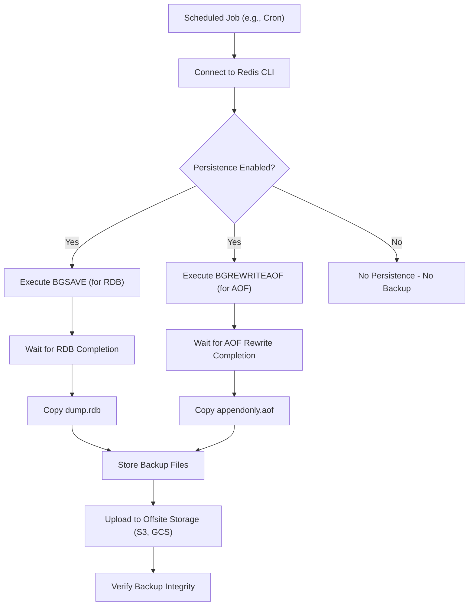

## Backup and Restore Strategies
### Core Concepts

*   **Persistence Mechanisms:** Redis offers two primary ways to persist data to disk, crucial for durability and backup.
    *   **RDB (Redis Database):** A point-in-time snapshot of the dataset. It's a compact, binary file (`dump.rdb`) representing the Redis data at a specific moment.
    *   **AOF (Append Only File):** Logs every write operation received by the server. Redis replays these commands on startup to reconstruct the dataset, providing higher durability.
*   **Backup:** The process of copying these persistence files (RDB, AOF, or both) from the Redis server's data directory to a secure, often offsite, location.
*   **Restore:** The process of placing the backed-up persistence files into the Redis data directory of a new or existing server and restarting Redis, which will load the data.

### Key Details & Nuances

*   **RDB Backup Strategy:**
    *   Triggered manually via `BGSAVE` command or automatically based on `save` configuration rules.
    *   `BGSAVE` forks a child process to write the snapshot, minimizing impact on the main Redis process.
    *   After `BGSAVE` completes, the `dump.rdb` file can be safely copied.
    *   **Trade-off:** Data loss window exists between the last successful snapshot and a crash.
*   **AOF Backup Strategy:**
    *   The `appendonly.aof` file is continuously updated with write commands.
    *   Can be copied directly, but it's recommended to run `BGREWRITEAOF` first to compact the file and remove redundant commands.
    *   **Trade-off:** AOF files can be significantly larger than RDB and take longer to load on startup.
*   **Hybrid (RDB + AOF):**
    *   **Recommended for maximum durability and fast restores.** RDB provides fast point-in-time recovery, while AOF minimizes data loss.
    *   Backup involves copying both `dump.rdb` and `appendonly.aof`. Redis prioritizes AOF if both are present.
*   **Automated vs. Manual Backups:**
    *   **Automation:** Essential for production. Use cron jobs, dedicated backup scripts, or cloud-native solutions (e.g., AWS Lambda, Kubernetes CronJobs) to periodically trigger `BGSAVE` (and `BGREWRITEAOF`), copy files, and upload to remote storage (e.g., S3, Google Cloud Storage).
    *   **Manual:** Only for ad-hoc or testing scenarios.
*   **Restore Process:**
    1.  Stop the Redis server.
    2.  Place the desired `dump.rdb` and/or `appendonly.aof` files into the configured Redis data directory.
    3.  Ensure file permissions are correct.
    4.  Start the Redis server. It will automatically load the persistence files.
*   **Distributed Redis (Cluster/Replication):**
    *   Each primary (master) node in a Redis Cluster needs to be backed up independently.
    *   For replicated setups, backups are typically taken from replicas to offload the primary, but ensure the replica is fully synced before initiating a backup.

### Practical Examples

**1. Automated RDB Backup Script (Linux/Unix)**

```sh
#!/bin/bash

# Configuration
REDIS_CLI="redis-cli"
REDIS_DATA_DIR="/var/lib/redis" # Default Redis data directory
BACKUP_BASE_DIR="/mnt/redis_backups"
RDB_BACKUP_DIR="${BACKUP_BASE_DIR}/rdb"
TIMESTAMP=$(date +"%Y%m%d%H%M%S")
BACKUP_FILENAME="dump_${TIMESTAMP}.rdb"
REMOTE_BACKUP_LOCATION="s3://your-s3-bucket/redis-backups/" # Example for S3

# Create backup directories if they don't exist
mkdir -p "$RDB_BACKUP_DIR"

echo "Step 1: Initiating Redis BGSAVE..."
$REDIS_CLI BGSAVE

# Optional: Poll INFO persistence to wait for BGSAVE to complete
# A more robust script would check the rdb_last_save_time_dt from INFO persistence
echo "Waiting for BGSAVE to complete (check Redis logs for exact completion)..."
sleep 10 # Adjust sleep based on dataset size and system performance

echo "Step 2: Copying RDB file to local backup directory..."
cp "${REDIS_DATA_DIR}/dump.rdb" "${RDB_BACKUP_DIR}/${BACKUP_FILENAME}"

if [ $? -eq 0 ]; then
    echo "Local RDB backup complete: ${RDB_BACKUP_DIR}/${BACKUP_FILENAME}"
    echo "Step 3: Uploading RDB backup to remote storage (e.g., S3)..."
    # Example using AWS CLI (ensure 'aws cli' is installed and configured)
    aws s3 cp "${RDB_BACKUP_DIR}/${BACKUP_FILENAME}" "${REMOTE_BACKUP_LOCATION}"

    if [ $? -eq 0 ]; then
        echo "Remote upload successful."
    else
        echo "ERROR: Remote upload failed!"
        exit 1
    fi
else
    echo "ERROR: Local RDB backup failed!"
    exit 1
fi

# Optional: Clean up old backups (e.g., keep last 7 days)
# find "$RDB_BACKUP_DIR" -type f -name "dump_*.rdb" -mtime +7 -delete
```

**2. Redis Backup Flow (Mermaid Diagram)**



### Common Pitfalls & Trade-offs

*   **Data Loss Window (RDB):** Relying solely on RDB means all data written between the last `BGSAVE` and a crash is lost. For critical data, combine with AOF.
*   **Forking Overhead (RDB):** On very large datasets (10s of GBs to TBs), `BGSAVE` requires Redis to fork. This can cause temporary spikes in memory usage (due to copy-on-write) and latency, especially on systems with limited RAM or slow disks.
*   **AOF File Size & Load Time:** AOF files can grow very large without regular `BGREWRITEAOF`, leading to longer startup times during recovery.
*   **Backup Frequency vs. Cost/Performance:**
    *   **Too frequent:** Increased resource usage (CPU, disk I/O, network for upload).
    *   **Too infrequent:** Higher risk of data loss on failure.
    *   **Trade-off:** Balance RPO (Recovery Point Objective - how much data loss is acceptable) with resource cost and performance impact.
*   **Restore Downtime:** Restoring Redis always involves stopping the server, placing files, and restarting, incurring downtime. Plan for maintenance windows.
*   **Storage Location:** Never store backups on the same machine as the primary Redis instance. Use separate storage (NAS, SAN, Cloud Object Storage) for disaster recovery.
*   **Security:** Ensure backup files are encrypted at rest and in transit, and access is restricted.
*   **Verification:** Backups are useless if they are corrupt. Periodically test restore procedures to ensure backups are valid.

### Interview Questions

1.  **"How would you implement a robust backup strategy for a large, production Redis instance with minimal impact on application performance?"**
    *   **Answer:** I would leverage a combination of RDB and AOF. For RDB, I'd trigger `BGSAVE` periodically (e.g., daily) during off-peak hours using a cron job. The `BGSAVE` command is non-blocking, minimizing impact. After it completes, I'd copy the `dump.rdb` file to a local staging area, then upload it to an offsite object storage like S3, ensuring encryption. For AOF, I'd ensure `appendfsync everysec` is configured for high durability. A separate cron job would periodically trigger `BGREWRITEAOF` to compact the AOF file, followed by copying the `appendonly.aof` to the same offsite storage. If a replica is available, backups can be taken from the replica to further offload the primary.

2.  **"Compare RDB and AOF persistence methods specifically for their suitability in a disaster recovery scenario. When would you prefer one over the other, or use both?"**
    *   **Answer:**
        *   **RDB:** Ideal for faster full data recovery. It produces a compact, single file that loads quickly. Best for scenarios where a small data loss window is acceptable, or as a primary for "cold" backups. The downside is the data loss between snapshots and the `fork()` overhead for large datasets.
        *   **AOF:** Provides better durability, typically losing at most one second of data (with `everysec` fsync). It's an operational log, ensuring near real-time persistence. However, AOF files can be larger and take longer to replay on startup.
        *   **Recommendation:** For robust disaster recovery, using **both RDB and AOF** is the best practice. RDB provides quick recovery from a known good state, while AOF can then be used to recover the most recent transactions, minimizing data loss. This offers a balance of fast restore times and high data durability.

3.  **"Your Redis cluster experiences a catastrophic failure, and you need to restore it from backups. Outline the steps you would take to restore the cluster."**
    *   **Answer:** First, I'd identify the most recent valid backup files (RDB and/or AOF) for *each master node* in the cluster. Next, I'd provision new Redis instances, ideally with the same configuration and capacity as the original masters and a proportionate number of replicas. For each new master, I would place its respective backup files into its data directory and start it as a standalone Redis instance, verifying data integrity. Once all master data is restored and running as standalone servers, I would then use `redis-cli --cluster create` to re-form the cluster, specifying the restored master instances. After the cluster is formed and slots are correctly assigned, I would add replicas to the new masters for high availability, allowing the cluster to re-sync. Finally, update application configurations to point to the new cluster endpoints.

4.  **"What considerations are unique to backing up Redis when running on a cloud platform like AWS, compared to an on-premise setup?"**
    *   **Answer:** Cloud platforms introduce several specific considerations:
        *   **Managed Services:** If using AWS ElastiCache, backups are often automated and integrated, simplifying the process but offering less granular control.
        *   **Storage:** Leverage cost-effective, durable object storage services like S3 for storing backup files, which are highly available and geo-redundant.
        *   **Automation:** Utilize cloud-native serverless functions (e.g., AWS Lambda) or EC2 instance cron jobs to automate backup triggers and uploads to S3.
        *   **EBS Snapshots:** For Redis running on EC2 instances, EBS snapshots offer block-level backups of the underlying volumes, which can be useful alongside Redis-specific persistence file backups.
        *   **IAM Permissions:** Meticulously manage IAM roles and policies to ensure the entities performing backups have only the necessary permissions to access Redis and S3/EBS.
        *   **Cross-Region/Account Backups:** For enhanced disaster recovery, configure backups to be replicated to different AWS regions or even separate AWS accounts.
        *   **Networking Costs:** Be mindful of data transfer costs when moving large backup files across regions or out of the cloud provider's network.