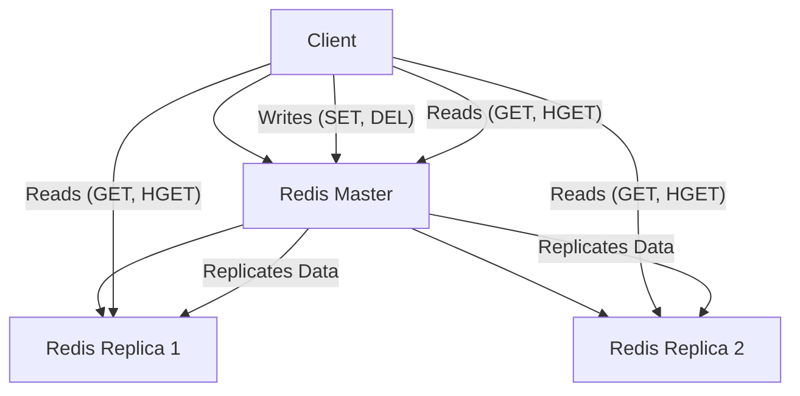

## Replication (Master-Slave Architecture)
### Core Concepts
*   **Purpose:** Redis replication is a fundamental mechanism for achieving **High Availability (HA)** and **Read Scalability**. It allows data to be copied from a primary Redis instance (the "master") to one or more secondary instances (the "replicas" or "slaves").
*   **Architecture:** Follows a classic master-replica (formerly master-slave) pattern.
    *   **Master:** Handles all write operations and propagates data changes to its replicas.
    *   **Replicas:** Maintain an exact copy of the master's dataset. They are read-only and serve read requests, offloading the master.
*   **Asynchronous Nature:** Replication in Redis is asynchronous. The master does not wait for replicas to acknowledge writes before confirming to the client. This provides low latency for writes but introduces eventual consistency.

### Key Details & Nuances
*   **Data Synchronization:**
    *   **Full Synchronization (RDB Snapshot):** When a replica connects for the first time or after a network partition prevents partial sync, the master performs a full resynchronization.
        1.  Master creates an RDB snapshot of its current dataset.
        2.  Transfers the RDB file to the replica.
        3.  Replica loads the RDB file.
        4.  Master continues sending new commands (from the replication backlog) that occurred during the RDB transfer.
    *   **Partial Resynchronization (Replication Backlog):** For short disconnections, Redis attempts a partial resynchronization using a fixed-size circular buffer (the replication backlog) on the master. Replicas provide their replication offset and ID, and the master sends only the missing commands.
*   **Read Scaling:** Replicas can serve read requests, effectively distributing the read load and increasing overall read throughput.
*   **Write Operations:** All write operations **must** go to the master. Replicas reject write commands by default.
*   **Failover:** If the master fails, a replica can be manually promoted to a new master using `REPLICAOF NO ONE`. For automatic failover, Redis Sentinel or Redis Cluster is required.
*   **Replication IDs and Offsets:** The master maintains a `replid` and an `offset` for its data stream. Replicas track these to know where they are in the stream, enabling partial resynchronization.

### Practical Examples

**1. Setting up Replication (using `redis-cli`)**

```sh
# On Replica 1 (e.g., port 6380), connect to Master (e.g., port 6379)
redis-cli -p 6380
127.0.0.1:6380> REPLICAOF 127.0.0.1 6379

# To stop a replica from replicating and make it a master (or standalone instance)
# 127.0.0.1:6380> REPLICAOF NO ONE

# Check replication status on master or replica
# redis-cli -p 6379 INFO replication
```

**2. Client Read/Write Flow with Master-Replica**



### Common Pitfalls & Trade-offs

*   **Eventual Consistency:** Due to asynchronous replication, there's a delay between a write on the master and its propagation to replicas. A read from a replica immediately after a write to the master might return stale data (read-after-write consistency issues).
*   **Single Point of Failure (SPOF) for Writes:** The master is the only instance that accepts writes. If it fails and no automatic failover mechanism (Sentinel/Cluster) is in place, writes will halt.
*   **Manual Failover Complexity:** Without Sentinel or Cluster, manual failover requires monitoring, promoting a replica, and reconfiguring clients, which is error-prone and causes downtime.
*   **Network Bandwidth:** Full synchronizations can consume significant network bandwidth, especially for large datasets, potentially impacting performance during resyncs.
*   **Memory Overhead:** The replication backlog on the master consumes memory. If it's too small, frequent partial resynchronizations can degrade to full synchronizations.

### Interview Questions

1.  **How does Redis master-replica replication work internally, including full and partial synchronization?**
    *   **Answer:** Explain the handshake: `REPLICAOF` command. Master starts a background RDB save, sends it to the replica. Meanwhile, it buffers new write commands. After RDB transfer, it sends buffered commands. For subsequent disconnections, if the replica's offset is within the master's replication backlog (circular buffer), partial sync occurs. Otherwise, a full sync is triggered again.
2.  **What are the primary advantages and disadvantages of using Redis master-replica replication for a production application?**
    *   **Answer:** **Advantages:** Read scalability (distribute read load), High Availability (can promote a replica if master fails), data redundancy (protection against master failure). **Disadvantages:** Eventual consistency (stale reads on replicas), master is SPOF for writes, manual failover is complex, network/memory overhead for replication, increased infrastructure complexity.
3.  **A client writes data to the Redis master and immediately tries to read it from a replica. What consistency issues might arise, and how can they be mitigated?**
    *   **Answer:** This introduces "read-after-write" consistency issues. Due to asynchronous replication, the write might not have propagated to the replica yet, leading to the client reading stale or missing data. **Mitigation:**
        *   **Read-Your-Writes:** Direct all critical read-after-write operations to the master.
        *   **Sticky Sessions:** For session data, always route a user's requests to the same Redis instance (e.g., the master).
        *   **Application-Level Caching/Retries:** Application can store a small local cache of recent writes or implement retries with delays.
        *   **Stronger Consistency Models:** If strong consistency is paramount, Redis replication alone is insufficient; consider using Redis Cluster with specific consistency settings or a different database type.
4.  **If a Redis master fails in a replicated setup, what steps would you take to recover the service and ensure data integrity, assuming you're not using Sentinel or Cluster?**
    *   **Answer:** This is a manual failover process:
        1.  **Detect Failure:** Identify the master is down.
        2.  **Elect New Master:** Choose the most up-to-date replica (check `INFO replication` output for `master_repl_offset`).
        3.  **Promote Replica:** On the chosen replica, execute `REPLICAOF NO ONE`.
        4.  **Reconfigure Other Replicas:** Point all other active replicas to the new master using `REPLICAOF <new_master_ip> <new_master_port>`.
        5.  **Update Clients:** Reconfigure client applications to connect to the new master for writes.
        6.  **Recover Old Master (Optional):** Once the old master is back online, configure it as a replica of the new master (`REPLICAOF <new_master_ip> <new_master_port>`).
        *   **Data Integrity:** Acknowledge potential data loss for writes not yet replicated before the master failed. Rely on `REPLICAOF NO ONE` on the *most up-to-date* replica to minimize loss.
5.  **Under what circumstances would you choose Redis master-replica replication over Redis Cluster for scalability and high availability?**
    *   **Answer:** Master-replica is simpler to set up and manage, suitable when:
        *   **Scaling reads is the primary concern, not writes or dataset size.** All writes still go to a single master.
        *   **The dataset fits comfortably on a single Redis instance** (RAM constraints are not an issue).
        *   **Simplicity and lower operational overhead are preferred.** Cluster adds complexity (sharding, distributed consensus).
        *   **The application requires strong consistency for all writes** (as all writes go to master).
        *   **You can tolerate manual failover or use Sentinel for HA, but don't need distributed sharding.**