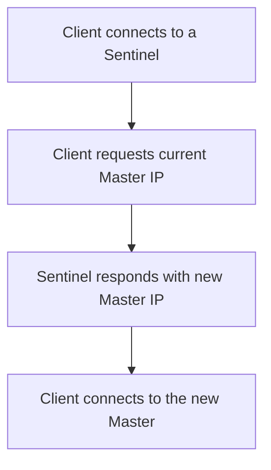

## Redis Sentinel for High Availability
### Core Concepts
*   **Purpose:** Redis Sentinel is a distributed system that provides High Availability (HA) for Redis. It monitors Redis master and replica instances, performs automatic failover when a master fails, and reconfigures instances accordingly.
*   **Components:** A Sentinel system consists of one or more Sentinel processes that run independently. These Sentinels collectively monitor the Redis instances.
*   **Key Responsibilities:**
    *   **Monitoring:** Continuously check if master and replica instances are behaving as expected.
    *   **Notification:** Alert system administrators or other applications when a Redis instance is not working as expected.
    *   **Automatic Failover:** Initiate and perform the failover process when a master is detected as failed.
    *   **Configuration:** Update the configuration of Redis clients and other Redis instances to point to the new master after a failover.

### Key Details & Nuances
*   **Quorum:** The minimum number of Sentinels that must agree that a master is down before a failover can be initiated. This prevents false positives and split-brain scenarios.
*   **Fault Detection:**
    *   **`sdown` (Subjectively Down):** A single Sentinel believes a master (or any instance) is unreachable or not responding.
    *   **`odown` (Objectively Down):** A sufficient number of Sentinels (defined by `quorum`) agree that the master is `sdown`. Only then does a failover proceed.
*   **Failover Process:**
    1.  **Detection:** Master is detected as `odown` by the required quorum of Sentinels.
    2.  **Leader Election:** Sentinels elect one among themselves to be the leader for the failover task.
    3.  **Replica Selection:** The elected Sentinel leader picks the best replica to promote to master (based on replication offset, priority, etc.).
    4.  **Promotion:** The chosen replica is promoted to master using `REPLICAOF NO ONE`.
    5.  **Reconfiguration:** Remaining replicas are reconfigured to replicate from the new master. The old master (if it comes back) is also reconfigured as a replica of the new master.
*   **Client Discovery:** Clients don't connect directly to the master's IP. Instead, they connect to any Sentinel in the cluster and ask for the current master's address. Sentinels provide the authoritative current master address, updating clients automatically after a failover.
*   **Configuration (`sentinel.conf`):**
    *   `sentinel monitor <master-name> <ip> <port> <quorum>`: Defines the master to monitor and the quorum needed for `odown`.
    *   `sentinel down-after-milliseconds <master-name> <milliseconds>`: Time after which a master is considered `sdown`.
    *   `sentinel failover-timeout <master-name> <milliseconds>`: Max time for a failover to complete.
    *   `sentinel parallel-syncs <master-name> <num-replicas>`: Number of replicas to reconfigure in parallel during failover.

### Practical Examples

**1. Client Master Discovery Flow**



**2. Basic `sentinel.conf` Configuration**

```conf
# Monitor a master called 'mymaster' located at 127.0.0.1:6379,
# with a quorum of 2 Sentinels required to agree it's down.
sentinel monitor mymaster 127.0.0.1 6379 2

# Consider master sdown after 5000 milliseconds of no response.
sentinel down-after-milliseconds mymaster 5000

# Timeout for failover operation.
sentinel failover-timeout mymaster 10000

# Number of replicas Sentinel will reconfigure in parallel.
sentinel parallel-syncs mymaster 1
```

**3. Client Connection using `ioredis` (TypeScript/JavaScript)**

```typescript
import Redis from 'ioredis';

const sentinelHost1 = '127.0.0.1';
const sentinelPort1 = 26379;
const sentinelHost2 = '127.0.0.1';
const sentinelPort2 = 26380;
const sentinelHost3 = '127.0.0.1';
const sentinelPort3 = 26381;

const redis = new Redis({
  sentinels: [
    { host: sentinelHost1, port: sentinelPort1 },
    { host: sentinelHost2, port: sentinelPort2 },
    { host: sentinelHost3, port: sentinelPort3 },
  ],
  name: 'mymaster', // The name of the master Redis instance as configured in Sentinel
  enableReadyCheck: true, // Ensures client waits until Redis is ready
});

redis.on('error', (err) => {
  console.error('Redis client error:', err);
});

redis.on('+switch_master', (channel, masterName, oldIp, oldPort, newIp, newPort) => {
  console.log(`Sentinel detected master switch for ${masterName}: ${oldIp}:${oldPort} -> ${newIp}:${newPort}`);
  // Client automatically reconnects to the new master, but this event can be useful for logging/metrics.
});

async function runExample() {
  try {
    await redis.set('mykey', 'Hello, Sentinel!');
    const value = await redis.get('mykey');
    console.log(`Retrieved value: ${value}`);
  } catch (err) {
    console.error('Redis operation failed:', err);
  } finally {
    redis.quit();
  }
}

runExample();
```

### Common Pitfalls & Trade-offs

*   **Odd Number of Sentinels:** Always deploy an odd number of Sentinels (e.g., 3, 5). This prevents ties when determining `odown` and electing a leader, ensuring a strict majority can always be achieved.
*   **Split-Brain Scenarios:** While Sentinel mitigates split-brain, it doesn't entirely prevent it. In complex network partitions, it's possible for two separate groups of Sentinels to elect different masters. Redis's "min-replicas-to-write" configuration can help prevent writes to a partitioned master that has lost its replicas.
*   **Data Loss:** Sentinel prioritizes availability over strict data consistency. During a failover, if the old master had un-replicated writes before going down, those writes might be lost. This is an inherent trade-off.
*   **Complexity:** Sentinel adds a layer of complexity to the Redis deployment, requiring more processes to manage and monitor compared to a standalone Redis instance.
*   **Single Point of Failure (SPF) Elimination:** While Sentinels eliminate the master as an SPF, the Sentinels themselves need to be resilient. A single Sentinel process going down is fine, but multiple going down can prevent failovers.
*   **Network Latency:** The `down-after-milliseconds` and `failover-timeout` values should be tuned based on network latency and application tolerance for downtime.

### Interview Questions

1.  **How does Redis Sentinel achieve high availability, and what are its core responsibilities?**
    *   **Answer:** Redis Sentinel provides HA by continuously monitoring Redis master and replica instances. Its core responsibilities include: detecting master failures (`sdown`, `odown`), performing automatic failovers by promoting a replica to master, reconfiguring remaining replicas, and providing the current master address to clients.

2.  **Explain the concepts of `quorum`, `sdown`, and `odown` in Redis Sentinel. How do they relate to a failover?**
    *   **Answer:**
        *   `sdown` (Subjectively Down) is when a single Sentinel believes a Redis instance is unreachable.
        *   `odown` (Objectively Down) is achieved when a `quorum` (configured number) of Sentinels agree that an instance is `sdown`.
        *   A failover is only initiated when the master instance transitions from `sdown` to `odown`, signifying a widespread agreement among Sentinels that the master is truly down. The `quorum` prevents false positives.

3.  **Describe the typical failover process orchestrated by Redis Sentinel, from detection to completion.**
    *   **Answer:**
        1.  **Detection:** Master is marked `odown` by the configured `quorum` of Sentinels.
        2.  **Leader Election:** Sentinels elect a leader among themselves to manage the failover.
        3.  **Replica Selection:** The elected leader chooses the best replica to promote (e.g., based on replication offset, priority).
        4.  **Promotion:** The chosen replica is promoted to master (`REPLICAOF NO ONE`).
        5.  **Reconfiguration:** Other replicas are reconfigured to replicate from the new master. The old master, if it recovers, is also reconfigured as a replica of the new master.
        6.  **Client Notification:** Sentinels inform subscribed clients about the new master.

4.  **What are some potential downsides or trade-offs when deploying Redis Sentinel for high availability?**
    *   **Answer:**
        *   **Potential Data Loss:** Sentinel prioritizes availability; un-replicated writes on a failed master might be lost during failover.
        *   **Increased Operational Complexity:** More processes to manage (multiple Sentinels, master, replicas) compared to a standalone setup.
        *   **Split-Brain Risk (mitigated, not eliminated):** While quorum helps, severe network partitions can still lead to two masters. Redis's `min-replicas-to-write` can mitigate this further.
        *   **Quorum Size:** Choosing an incorrect quorum (e.g., even number or too small/large) can hinder failover or increase false positives.

5.  **How do Redis clients discover the current master in a Sentinel-managed setup, especially after a failover?**
    *   **Answer:** Redis clients don't connect directly to the master's static IP. Instead, they are configured with a list of Sentinel node addresses and the name of the master service (e.g., `mymaster`). The client connects to any available Sentinel and queries it for the current master's address. Sentinels will always provide the authoritative current master. After a failover, Sentinels publish updates, and clients automatically reconnect to the new master, ensuring seamless operation.