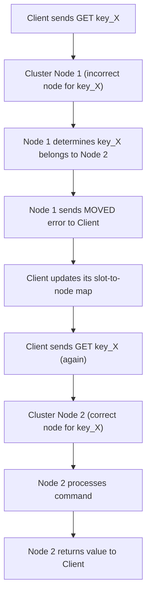

## Redis Cluster (Sharding/Data Partitioning)
### Core Concepts
*   **Sharding (Data Partitioning):** Redis Cluster automatically partitions data across multiple Redis nodes. This allows for horizontal scaling, distributing the dataset and read/write load among many servers.
*   **High Availability:** Each shard (a range of hash slots) typically has a master node and one or more replica nodes. If a master node fails, one of its replicas can be automatically promoted to master, ensuring data availability.
*   **Distributed System:** The cluster operates as a single logical database, but data is physically distributed. Clients interact with the cluster as if it were a single instance, but are redirected to the correct node internally.

### Key Details & Nuances
*   **Hash Slots:** Redis Cluster uses 16384 hash slots. Each key is mapped to a hash slot using `CRC16(key) % 16384`.
*   **Slot Ownership:** Each master node in the cluster is responsible for a subset of the 16384 hash slots.
*   **Client Redirection (`MOVED`/`ASK`):**
    *   Clients are "smart" and maintain a mapping of hash slots to nodes.
    *   If a client sends a command for a key to the wrong node, that node responds with a `MOVED` error, indicating the correct node. Clients then update their internal map and retry the command on the correct node.
    *   `ASK` redirection is used during re-sharding operations for temporary migrations.
*   **Gossip Protocol:** Nodes communicate using a gossip protocol to share cluster state information (node availability, slot ownership, replica assignments).
*   **Replication & Failover:**
    *   Each master node can have multiple replica nodes.
    *   If a master node fails, cluster nodes detect it (via heartbeats/gossip) and initiate a failover process, where a replica is elected and promoted to become the new master for its slots.
*   **Resharding:** Hash slots can be dynamically moved between nodes without downtime, allowing for scaling up or down of the cluster.

### Practical Examples
**Client Data Access Flow in Redis Cluster (with `MOVED` redirection)**

### Common Pitfalls & Trade-offs
*   **Multi-key Operations:**
    *   Commands like `MGET`, `MSET`, `DEL` across keys are only atomic and efficient if all keys reside in the *same* hash slot.
    *   If keys are in different slots, the client must perform multiple individual operations, which are not atomic and incur network overhead.
    *   **Solution:** Use **hash tags** (`{tag}`) to force keys into the same hash slot (e.g., `user:{id}:profile` and `user:{id}:cart` will map to the same slot).
*   **Transactions & Lua Scripts:** Redis transactions (using `MULTI`/`EXEC`) and Lua scripts are atomic only for operations within a *single* hash slot.
*   **Increased Operational Complexity:** Setting up, monitoring, and maintaining a Redis Cluster is significantly more complex than a standalone or master-replica setup.
*   **Cost:** Requires more instances/VMs than a single Redis instance or simple master-replica setup.

### Interview Questions
1.  **How does Redis Cluster achieve both scalability and high availability?**
    *   **Answer:** Scalability is achieved through sharding (data partitioning) via 16384 hash slots, distributing data and load across multiple master nodes. High availability is achieved by having replicas for each master node; if a master fails, a replica is automatically promoted to ensure continuous service for its assigned hash slots.
2.  **Describe the client's role when interacting with a Redis Cluster. What happens if a client tries to access a key on the wrong node?**
    *   **Answer:** Clients are "smart" and maintain a cached mapping of hash slots to nodes. When accessing a key, the client first calculates its hash slot and tries to send the command to the responsible node. If it hits the wrong node, the node will return a `MOVED` redirection error, indicating the correct node. The client then updates its internal map and retries the command on the correct node.
3.  **What are the limitations of Redis Cluster regarding multi-key operations or transactions, and how can these be mitigated?**
    *   **Answer:** Multi-key operations (e.g., `MGET`, `DEL`) and transactions (`MULTI`/`EXEC`), as well as Lua scripts, are only atomic and efficient if all involved keys hash to the *same* slot. If keys are in different slots, operations are not atomic, and the client must make multiple network calls. This can be mitigated by using "hash tags" (`{}` in the key name) to ensure related keys are co-located in the same hash slot (e.g., `user:{id}:profile` and `user:{id}:cart`).
4.  **When would you choose Redis Cluster over a simple master-replica setup?**
    *   **Answer:** Redis Cluster is chosen when the dataset size exceeds the memory capacity of a single Redis instance, or when the read/write throughput required exceeds what a single instance (even with replicas for reads) can provide. It offers true horizontal scalability and automated failover for individual shards, providing higher availability than a single master-replica pair.
5.  **Explain the purpose of hash tags in Redis Cluster and provide an example.**
    *   **Answer:** Hash tags are a mechanism to force multiple keys to be stored in the same hash slot within a Redis Cluster. This is achieved by enclosing a part of the key name within curly braces `{}`. Redis will only hash the content within the curly braces to determine the slot. This is crucial for enabling multi-key operations, transactions, or Lua scripts that require atomicity or co-location for a group of related keys. For example, `user:{123}:profile` and `user:{123}:preferences` will both map to the same hash slot because only `{123}` is hashed.