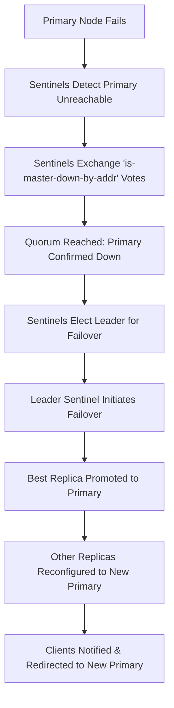

## Sentinel vs. Cluster: When to use which
### Core Concepts

*   **Redis Sentinel:** Provides High Availability (HA) for Redis instances. It monitors primary and replica instances, performs automatic failover when a primary is no longer available, and updates clients with the new primary's address. It does *not* provide horizontal scaling/sharding.
*   **Redis Cluster:** Provides both High Availability (HA) and horizontal scalability. It shards data across multiple Redis nodes using hash slots, allowing a dataset to be split across different instances, and handles automatic failover for individual shards.

### Key Details & Nuances

*   **Redis Sentinel**
    *   **Purpose:** HA for a *single logical primary-replica set*. All data resides on one primary instance.
    *   **Architecture:**
        *   **Distributed Monitoring:** Multiple Sentinel processes constantly monitor Redis instances.
        *   **Quorum & Majority:** A configurable `quorum` of Sentinels must agree a primary is down before failover, and a `majority` selects the new primary.
        *   **Client Discovery:** Clients connect to Sentinels to discover the current primary's address, and are notified upon failover.
    *   **Use Cases:**
        *   Medium-sized datasets that fit within a single Redis primary's memory limits.
        *   When high availability is the primary concern, and horizontal scaling/sharding is either not needed or managed by the application layer.
        *   Simpler to set up and manage than Redis Cluster.

*   **Redis Cluster**
    *   **Purpose:** HA *and* horizontal scaling through sharding. Distributes data across up to 16384 hash slots.
    *   **Architecture:**
        *   **Peer-to-Peer:** Nodes communicate directly via a gossip protocol to maintain cluster state, detect failures, and manage failovers.
        *   **Hash Slots:** Data is partitioned across nodes using 16384 hash slots. Each node owns a subset of these slots.
        *   **Client Redirection:** Clients connect to any node. If a key belongs to a different node, the current node responds with `MOVED` (permanent redirection) or `ASK` (temporary redirection during resharding), and cluster-aware clients redirect the request.
        *   **Automatic Resharding:** Slots can be moved between nodes dynamically without downtime.
    *   **Use Cases:**
        *   Large datasets that exceed the memory capacity of a single Redis instance.
        *   Applications requiring high write throughput that cannot be handled by a single primary.
        *   When native sharding and horizontal scaling are critical requirements.

*   **Key Distinctions Summary:**
    *   **Scalability:** Sentinel offers HA for a single point; Cluster offers HA *and* horizontal scaling.
    *   **Data Partitioning:** Sentinel does not partition data; Cluster partitions data using hash slots.
    *   **Client Complexity:** Sentinel clients get primary info from Sentinels; Cluster clients handle `MOVED`/`ASK` redirections.
    *   **Multi-Key Operations:** Sentinel allows multi-key operations across all keys. Cluster limits multi-key operations (e.g., `MGET`, `MSET`) to keys within the *same* hash slot.

### Practical Examples

**Redis Sentinel `sentinel.conf` Snippet:**

```conf
port 26379
daemonize yes
logfile "/var/log/redis/sentinel.log"
dir "/var/lib/redis/sentinel"

# Monitor a master named 'mymaster' at 127.0.0.1:6379.
# Needs 2 Sentinels to agree for failover initiation.
sentinel monitor mymaster 127.0.0.1 6379 2
sentinel down-after-milliseconds mymaster 5000
sentinel parallel-syncs mymaster 1
sentinel failover-timeout mymaster 10000
```

**Connecting to Redis Cluster with `redis-cli`:**

```sh
redis-cli -c -p 7000 # The -c flag enables cluster mode, handling MOVED/ASK redirects.
```

**Redis Sentinel Failover Process Diagram:**



### Common Pitfalls & Trade-offs

*   **Redis Sentinel:**
    *   **No Horizontal Write Scaling:** All write load funnels through the single primary, which can become a bottleneck for high-throughput applications.
    *   **Application-Level Sharding:** If data grows beyond a single instance, sharding must be handled by the application, increasing complexity.
    *   **Data Consistency:** While robust, during a failover, there's a brief window where data committed to the old primary might not have replicated to the new primary, potentially leading to minor data loss or inconsistency if not handled carefully by the application.

*   **Redis Cluster:**
    *   **Operational Complexity:** More nodes to manage, monitor, and troubleshoot. Network topology and node-to-node communication are critical.
    *   **Client Requirements:** Requires cluster-aware clients. Standard Redis clients will not work correctly.
    *   **Multi-Key Command Limitation:** Commands operating on multiple keys (e.g., `MGET`, `MSET`, `SUNION`) are only allowed if all keys reside in the *same* hash slot. This often necessitates "hash tags" (e.g., `{user123}:profile`, `{user123}:cart`) in key names to force co-location.
    *   **No Multi-Database:** Redis Cluster only supports database 0, unlike standalone Redis.
    *   **Transactions (MULTI/EXEC):** Limited to keys within the same hash slot.

*   **When to Use Which:**
    *   **Choose Sentinel** if your primary need is **high availability** for a Redis instance whose dataset fits comfortably within the memory limits of a single server, and you don't require horizontal write scaling or native sharding. Simplicity is a key benefit.
    *   **Choose Cluster** if you need to scale your Redis dataset beyond a single server's memory, require **high throughput** distributed across multiple nodes, and need **horizontal scalability** with built-in sharding and HA. You accept increased operational complexity and client-side considerations.

### Interview Questions

1.  **"Describe a scenario where Redis Sentinel would be a better choice than Redis Cluster, and vice-versa."**
    *   **Sentinel Better:** For a small-to-medium sized session cache or a lookup table where the entire dataset fits in RAM on one server, and the main concern is ensuring continuous availability via automatic failover (e.g., if the primary server crashes). Simplicity of setup and less operational overhead are key advantages.
    *   **Cluster Better:** For a large-scale e-commerce platform's product catalog or a real-time analytics system where the data volume far exceeds a single server's capacity, and high read/write throughput requires distributing data and operations across many nodes. The need for horizontal scalability and native sharding outweighs the increased complexity.

2.  **"How does Redis Cluster handle client requests for keys that are not on the connected node? What is the role of hash slots?"**
    *   Redis Cluster uses 16384 hash slots to distribute data. Each key is mapped to a specific slot using a hashing algorithm (e.g., `CRC16(key) % 16384`).
    *   When a client sends a request for a key to a node, if that node does not own the hash slot for the requested key, it responds with a `MOVED <slot> <IP>:<port>` redirection error. Cluster-aware clients then automatically update their internal mapping and redirect the request to the correct node.
    *   `ASK <slot> <IP>:<port>` is a temporary redirection used during resharding operations when a slot is in the process of migrating, signaling the client to try the target node once for that specific key.

3.  **"What are the main architectural differences between how Sentinel provides HA and how Cluster provides HA?"**
    *   **Sentinel HA:** Achieved through external, independent Sentinel processes that actively monitor primary and replica instances. Sentinels form a consensus (quorum) to declare a primary dead, then elect a leader Sentinel to orchestrate failover (promote a replica, reconfigure other replicas, notify clients). It's an *orchestrated external HA system*.
    *   **Cluster HA:** Achieved internally by the cluster nodes themselves. Nodes communicate via a gossip protocol to detect failures. If a primary node fails, its replicas detect this, and one replica will be elected by the other nodes in its shard (using Paxos-like algorithm) to become the new primary. It's a *self-healing, distributed HA system* built into the cluster protocol.

4.  **"What are the implications for application design when choosing Redis Cluster over Sentinel, especially regarding multi-key operations?"**
    *   The primary implication is that **multi-key commands (e.g., `MGET`, `MSET`, `DEL` with multiple keys, transactions like `MULTI`/`EXEC`) are only allowed if all involved keys reside within the *same* hash slot**.
    *   Application designers must strategically name keys using **hash tags** (e.g., `{user123}:profile`, `{user123}:cart`) to ensure related keys that need to be accessed together are co-located on the same node. This can complicate data modeling and key management. Without hash tags, multi-key operations across different slots will result in a `CROSSSLOT` error.