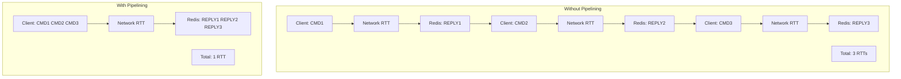

## Pipelining to Reduce Latency
### Core Concepts
*   **Definition**: Redis Pipelining is a network optimization technique that allows a client to send multiple commands to the Redis server without waiting for the reply to each command. The server then processes these commands in order and sends all replies back to the client in a single response batch.
*   **Primary Goal**: Drastically reduce the Round-Trip Time (RTT) latency associated with sending individual commands over a network. For high-throughput applications, network latency is often the dominant factor, not server processing time.
*   **Mechanism**: The client buffers multiple commands and sends them as a single payload. The server processes them sequentially and buffers the replies, sending them back to the client in a single bulk reply.

### Key Details & Nuances
*   **Latency Reduction**: The primary benefit is reducing the number of network RTTs from `N` (for N commands) to `1`.
*   **Not Atomic**: Unlike Redis Transactions (using `MULTI`/`EXEC`), pipelining does *not* guarantee atomicity. If other clients interleave commands between your pipelined commands on the server, those interleaved commands will be executed. Pipelining only ensures the server processes your batch sequentially.
*   **Client-Side Implementation**: Pipelining is primarily a client-side feature. Client libraries typically provide an API (e.g., `pipeline()` or `batch()`) to facilitate this.
*   **Server Processing Order**: Commands within a pipeline are processed by the Redis server in the exact order they are received.
*   **Buffered Replies**: The Redis server buffers all replies for pipelined commands until all commands in the batch are executed.
*   **Use Cases**: Ideal for bulk data insertion, fetching multiple keys, or executing many independent commands where the result of one command does not depend on the result of a preceding command within the same batch.
*   **Pipelining vs. Transactions (`MULTI`/`EXEC`)**:
    *   **Pipelining**: Optimizes network efficiency. Not atomic. Suitable for independent commands.
    *   **Transactions**: Guarantees atomicity (all or nothing) and isolation. Can include `WATCH` for optimistic locking. Often implicitly uses pipelining internally for efficiency, but its primary purpose is atomicity.

### Practical Examples

**1. Conceptual Flow (Network Round Trips)**



**2. TypeScript/JavaScript Example (using `ioredis`)**

```typescript
import Redis from 'ioredis';

const redis = new Redis();

async function demonstratePipelining() {
    console.log("--- Without Pipelining (N RTTs) ---");
    const startTimeIndividual = Date.now();
    await redis.set('key1', 'value1');
    await redis.get('key1');
    await redis.incr('counter');
    console.log(`Individual commands took ${Date.now() - startTimeIndividual} ms`);

    console.log("\n--- With Pipelining (1 RTT) ---");
    const startTimePipelined = Date.now();
    const pipeline = redis.pipeline(); // Start a pipeline

    pipeline.set('keyP1', 'valueP1');
    pipeline.get('keyP1');
    pipeline.incr('counter');
    pipeline.expire('keyP1', 60); // Set expiry

    const results = await pipeline.exec(); // Execute all commands in one go

    console.log(`Pipelined commands took ${Date.now() - startTimePipelined} ms`);
    console.log("Pipelined Results:", results);
    // results is an array of [error, result] tuples for each command
    // Example: [[null, "OK"], [null, "valueP1"], [null, 2], [null, 1]]
}

demonstratePipelining().catch(console.error);
```

### Common Pitfalls & Trade-offs
*   **Memory Usage**: Pipelining large numbers of commands can consume significant server memory to buffer replies before sending them back. If a pipeline is excessively large, it might lead to OOM errors or performance degradation on the server.
*   **Blocking Client**: The client is blocked until all commands in the pipeline are processed and replies are received. For very long-running pipelines, this can introduce client-side latency.
*   **Error Handling**: If an error occurs for one command in a pipeline, subsequent commands *might* still be processed. The error will be returned as part of the result array for that specific command. You need to iterate and check for errors in the `results` array.
*   **Interdependent Commands**: Do not use pipelining for commands where a subsequent command's input depends on the output of a preceding command within the *same* pipeline, as the client doesn't receive the reply until `exec()` is called. Use `MULTI`/`EXEC` with `WATCH` for transactional, dependent operations.

### Interview Questions
1.  **Question**: Explain the core problem that Redis Pipelining aims to solve. How does it achieve this?
    *   **Answer**: It primarily solves the problem of network latency (RTT) for high-frequency Redis operations. By allowing clients to batch multiple commands into a single network request, it reduces `N` individual round trips to just `1`, significantly improving throughput, especially over high-latency networks.

2.  **Question**: Is Redis Pipelining atomic? How does it differ from a Redis Transaction (`MULTI`/`EXEC`)?
    *   **Answer**: No, pipelining is *not* atomic. Commands within a pipeline are processed sequentially, but other client commands can be interleaved between them. A Redis Transaction (`MULTI`/`EXEC`) *does* guarantee atomicity (all commands are executed as a single, isolated operation, or none are) and prevents interleaving of commands from other clients within the transaction block. Pipelining is for network optimization, while transactions are for data consistency.

3.  **Question**: When would you choose to use Redis Pipelining over sending individual commands, and what are potential downsides or considerations?
    *   **Answer**: Choose pipelining when you need to execute many independent commands quickly, and the network RTT is a significant performance bottleneck (e.g., bulk insertions, fetching multiple keys). Downsides include increased memory usage on the Redis server for large pipelines (to buffer replies), the client being blocked until all replies are received, and the fact that it's not suitable for commands where a later command depends on the result of an earlier one in the same batch.

4.  **Question**: Imagine you need to increment 10,000 different counters in Redis. Describe two ways to do this, explaining the performance characteristics of each approach. Which would you recommend and why?
    *   **Answer**:
        1.  **Individual `INCR` commands**: Each `INCR` command would incur a separate network RTT. This would result in 10,000 RTTs, making it very slow due to network latency overhead.
        2.  **Pipelined `INCR` commands**: All 10,000 `INCR` commands would be sent in a single batch. This would only incur one network RTT for sending and one for receiving all replies.
        **Recommendation**: The pipelined approach is strongly recommended. It drastically reduces network overhead, leading to significantly higher throughput and much faster execution, even though Redis still processes each `INCR` command sequentially on the server. The individual approach would be practically unusable in many real-world scenarios due to latency.