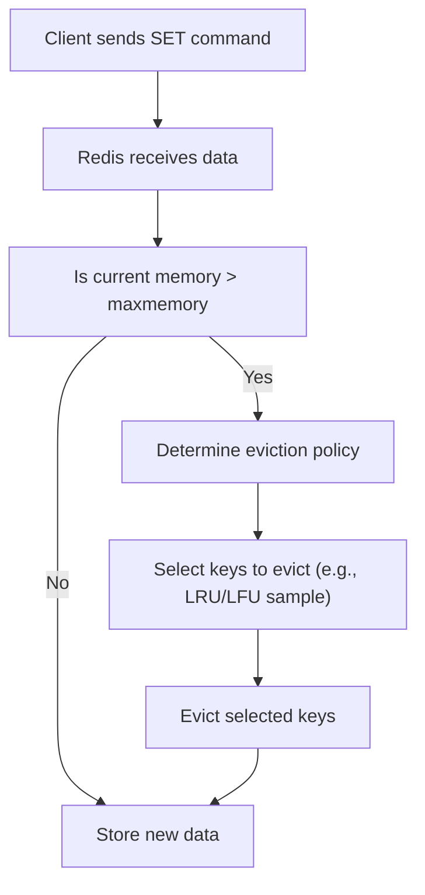

## Memory Eviction Policies (LRU, LFU)
### Core Concepts

*   **Memory Eviction:** When a Redis instance reaches its configured `maxmemory` limit, it needs to remove existing keys to free up space for new data. This process is called eviction.
*   **Eviction Policies (`maxmemory-policy`):** Redis offers various strategies to determine which keys to evict. The most common and interview-relevant are:
    *   **Least Recently Used (LRU):** Evicts keys that haven't been accessed (read or written) for the longest time. Assumes past access predicts future access.
    *   **Least Frequently Used (LFU):** Evicts keys that have been accessed the fewest times. Prioritizes keeping frequently accessed items.

### Key Details & Nuances

*   **`maxmemory` Setting:** Defines the maximum amount of memory Redis will use for data. Crucial for stability and performance.
*   **Redis LRU/LFU are Approximate:**
    *   Redis does not implement a perfect LRU or LFU algorithm due to the high CPU and memory overhead of tracking every key perfectly.
    *   It uses a sampling approach: It randomly samples a small number of keys (`maxmemory-samples` — default 5) and evicts the best candidate among them according to the policy. This provides a good approximation with minimal overhead.
*   **LRU Implementations (`maxmemory-policy` variants):**
    *   `noeviction`: New writes fail if `maxmemory` is reached (default).
    *   `allkeys-lru`: Evicts any key from the dataset based on LRU algorithm.
    *   `volatile-lru`: Evicts only keys that have an `EXPIRE` set, based on LRU. Non-expiring keys are safe.
    *   `allkeys-random`: Evicts random keys from the dataset.
    *   `volatile-random`: Evicts random keys from the dataset that have an `EXPIRE` set.
    *   `volatile-ttl`: Evicts keys with an `EXPIRE` set, prioritizing those closest to their time-to-live expiration.
*   **LFU Implementation (`maxmemory-policy` variants):**
    *   `allkeys-lfu`: Evicts any key from the dataset based on LFU algorithm.
    *   `volatile-lfu`: Evicts only keys that have an `EXPIRE` set, based on LFU.
    *   LFU tracks a `freq` counter for each key. This counter is incremented on each access and decays over time to adapt to changing access patterns (`lfu-log-factor`, `lfu-decay-time`).

### Practical Examples

**1. Configuring Eviction Policy and Memory Limit:**

```sh
# Set max memory to 1GB
redis-cli CONFIG SET maxmemory 1gb

# Set eviction policy to allkeys-lru
redis-cli CONFIG SET maxmemory-policy allkeys-lru

# Set maxmemory-samples (e.g., to 10 for better approximation, higher CPU)
redis-cli CONFIG SET maxmemory-samples 10

# View current configuration
redis-cli CONFIG GET maxmemory
redis-cli CONFIG GET maxmemory-policy
redis-cli CONFIG GET maxmemory-samples
```

**2. Conceptual Eviction Flow:**



### Common Pitfalls & Trade-offs

*   **Choosing the Right Policy:**
    *   **LRU:** Good general-purpose choice. Works well when older data becomes less relevant over time (e.g., caching recent articles).
    *   **LFU:** Better when some data is consistently popular over long periods, regardless of recent access (e.g., user profiles, frequently requested static assets). More complex and higher CPU cost than LRU due to frequency counter updates and decay.
    *   **`volatile-*` vs. `allkeys-*`:** If you mix expiring and non-expiring keys and want to guarantee non-expiring keys are never evicted, use `volatile-*`. If all keys are equally disposable, use `allkeys-*`.
*   **`maxmemory-samples` Impact:**
    *   Higher `maxmemory-samples` leads to a better approximation of true LRU/LFU but increases CPU overhead during eviction.
    *   Lower samples reduce CPU but can lead to less optimal evictions.
*   **CPU Overhead:** Eviction itself consumes CPU cycles. Frequent evictions on a busy system can impact latency.
*   **Data Loss:** Eviction means data is removed. Ensure your application logic handles potential cache misses gracefully (e.g., fetching from the primary data source).
*   **Persistent Data:** Eviction policies only apply to in-memory data. They do not affect how data is written to disk (RDB/AOF).

### Interview Questions

1.  **Explain the difference between Redis's LRU and LFU eviction policies. When would you choose one over the other?**
    *   **Answer:** LRU evicts keys not accessed for the longest time, suitable for data with decaying relevance. LFU evicts keys accessed the fewest times, better for data with consistent but varied popularity. Choose LRU when recency is the primary factor, LFU when frequency (overall popularity) is more important and recent spikes shouldn't save a key. LFU has slightly higher CPU overhead due to frequency counter management.

2.  **How does Redis implement LRU and LFU given it's a high-performance in-memory store? Does it track exact usage?**
    *   **Answer:** Redis implements an *approximate* LRU/LFU. It does not track exact usage for every key due to prohibitive memory and CPU overhead. Instead, it samples a small number of keys (`maxmemory-samples`, default 5) and selects the best candidate for eviction among those samples based on the chosen policy (least recently used or least frequently used within the sample). This provides a good balance of accuracy and performance.

3.  **You have a Redis instance used for caching user sessions and also some static configuration data that should never be evicted. Which `maxmemory-policy` would you use and why?**
    *   **Answer:** I would use a `volatile-lru` or `volatile-lfu` policy. This ensures that only keys that have an explicit `EXPIRE` set (like session data) are considered for eviction. The static configuration data, if set without an expiry, would remain in memory and never be evicted, preserving its availability even under memory pressure.

4.  **What happens if you set `maxmemory-policy` to `noeviction` and your Redis instance reaches its `maxmemory` limit?**
    *   **Answer:** If `maxmemory-policy` is `noeviction` and the `maxmemory` limit is reached, all subsequent write operations (like `SET`, `INCR`, `LPUSH`, etc.) will return an error (e.g., `OOM command not allowed when used memory > 'maxmemory'`). Read operations (`GET`) will continue to work. This policy is useful when data consistency is paramount and data loss due to eviction is unacceptable.

5.  **What are the trade-offs of increasing the `maxmemory-samples` configuration parameter?**
    *   **Answer:** Increasing `maxmemory-samples` will lead to a more accurate approximation of the true LRU or LFU algorithm, as Redis has a larger pool of keys to choose from when deciding what to evict. However, this comes at the cost of increased CPU utilization during the eviction process, as Redis needs to perform more comparisons and access more key metadata for each eviction decision. For most workloads, the default of 5 is a good balance.