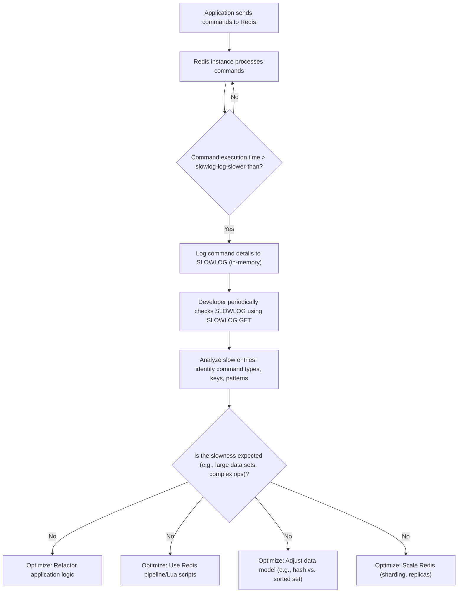

## Identifying and Debugging Slow Commands (SLOWLOG)
### Core Concepts

*   **What is Redis SLOWLOG?**
    *   A built-in Redis feature that logs commands exceeding a specified execution time threshold.
    *   It's a memory-only log, meaning entries are not persisted to disk across Redis restarts by default.
    *   Primarily used for **performance debugging and identification of bottlenecks** within a Redis instance.
*   **Purpose:**
    *   Helps pinpoint specific commands or client behaviors causing high latency or blocking the Redis event loop.
    *   Essential for optimizing application interaction with Redis and ensuring stable performance.

### Key Details & Nuances

*   **Configuration Parameters:**
    *   `slowlog-log-slower-than <microseconds>`:
        *   Defines the threshold for logging slow commands. Only commands executing longer than this value (in microseconds) are logged.
        *   `0`: Logs all commands.
        *   Negative value (`-1`): Disables slow logging.
        *   **Interview Tip:** This is critical for practical debugging. Start with a higher value (e.g., 10000 µs = 10ms) and decrease if needed.
    *   `slowlog-max-len <entries>`:
        *   Sets the maximum number of slow log entries Redis stores in memory. When the log reaches this limit, older entries are automatically evicted.
        *   **Trade-off:** Larger values consume more memory but retain more history. Keep it reasonable (e.g., 128-1024 entries).
*   **Log Entry Structure:** Each entry typically contains:
    *   Unique ID
    *   Timestamp of command execution
    *   Execution time (in microseconds)
    *   Command arguments (e.g., `SET mykey myvalue`)
    *   Client IP address and port (since Redis 4.0)
    *   Client name (since Redis 5.0)
*   **Performance Impact:** SLOWLOG itself has minimal overhead. Logging is an append-only operation, and Redis is single-threaded, so the logging operation itself is quick. The overhead comes from the command execution time, not the logging.
*   **Execution Time Definition:** The logged time is the actual time the command took to execute *after* it was queued and *before* the reply was sent back to the client. It excludes network latency, command queuing time, or client-side processing.

### Practical Examples

**1. Basic SLOWLOG Operations:**

```sh
# Connect to Redis CLI
redis-cli

# Get the current slowlog configuration
CONFIG GET slowlog-log-slower-than
CONFIG GET slowlog-max-len

# Set the threshold to 10 milliseconds (10000 microseconds)
CONFIG SET slowlog-log-slower-than 10000

# Set the max length to 256 entries
CONFIG SET slowlog-max-len 256

# Simulate a slow command (using DEBUG SLEEP for demonstration)
# This command will block Redis for 100ms, which is > 10ms threshold
DEBUG SLEEP 0.1

# Retrieve the slow log entries
SLOWLOG GET

# Example output for SLOWLOG GET:
# 1) 1) (integer) 1           # Unique ID
#    2) (integer) 1678886400  # Unix timestamp
#    3) (integer) 100005      # Execution time in microseconds (approx 100ms)
#    4) 1) "DEBUG"           # Command and arguments
#       2) "SLEEP"
#       3) "0.1"
#    5) "127.0.0.1:51694"     # Client IP and port
#    6) ""                  # Client name (empty if not set)

# Get the number of entries in the slow log
SLOWLOG LEN

# Reset (clear) the slow log
SLOWLOG RESET
```

**2. Identifying and Debugging Workflow:**



### Common Pitfalls & Trade-offs

*   **Misinterpreting `slowlog-log-slower-than`:** Setting it too low (e.g., 0 or 100 µs) in a busy production environment can overwhelm the log with non-critical entries, making it hard to find true bottlenecks. Set it meaningfully high initially.
*   **Assuming Persistence:** SLOWLOG is purely in-memory. After a Redis restart, the log is cleared. For persistent logging, integrate with external monitoring systems.
*   **Memory Usage of `slowlog-max-len`:** A very large `slowlog-max-len` can consume significant memory, especially if log entries contain large command arguments.
*   **Not the Full Picture:** SLOWLOG only captures execution time. It doesn't show:
    *   Network latency between client and server.
    *   Time spent blocked waiting for memory or other resources (though high execution time might indicate this).
    *   Client-side processing time.
    *   Overall system load or context switches.
*   **Security Risk:** If sensitive data is passed as command arguments, it will appear in the `SLOWLOG` output. Restrict access to `SLOWLOG` commands.

### Interview Questions

1.  **What is the purpose of Redis SLOWLOG, and how does it help in performance tuning?**
    *   **Answer:** SLOWLOG is an in-memory log of Redis commands that exceed a configurable execution time threshold. Its primary purpose is to identify and debug command-level bottlenecks. It helps us pinpoint specific commands, arguments, and client origins that are consuming excessive server-side processing time, allowing us to optimize application logic, data models, or Redis configurations.

2.  **How do you configure Redis SLOWLOG, and what are the key parameters to consider?**
    *   **Answer:** SLOWLOG is configured via two main parameters in `redis.conf` or using `CONFIG SET` at runtime:
        *   `slowlog-log-slower-than`: The minimum execution time (in microseconds) for a command to be logged. A value of `0` logs all commands, `-1` disables it.
        *   `slowlog-max-len`: The maximum number of entries to keep in the in-memory log. Older entries are evicted when the limit is reached.
        *   When setting these, it's crucial to balance capturing useful data with not consuming excessive memory or logging too much noise.

3.  **What are the limitations of Redis SLOWLOG, and when might you need other monitoring tools?**
    *   **Answer:** SLOWLOG has several limitations: it's in-memory only (not persistent across restarts), it only captures server-side execution time (ignoring network latency or client-side processing), and it can consume memory if `slowlog-max-len` is too high. It also exposes command arguments which could be a security concern. For comprehensive monitoring, one would need additional tools like Redis `LATENCY MONITOR`, `INFO` command output, Prometheus/Grafana for metrics, or APM tools to track end-to-end request latency and system resource utilization.

4.  **Describe a scenario where you would use SLOWLOG to debug a production performance issue with Redis.**
    *   **Answer:** Imagine users report slow response times from a feature relying heavily on Redis. My first step would be to SSH into the Redis server and use `redis-cli`. I'd set `slowlog-log-slower-than` to a reasonable threshold (e.g., 5000-10000 microseconds or 5-10ms) and `slowlog-max-len` to a few hundred. Then, I'd immediately run `SLOWLOG GET` to see if any recent slow commands exist. If not, I'd monitor it for a few minutes or hours during peak load. Once I find slow entries, I'd analyze the command types (e.g., `KEYS`, `LRANGE` on huge lists, complex `ZINTERSTORE`), the specific keys involved, and the client IPs. This would guide me to either optimize the application's Redis usage (e.g., fetching smaller ranges, using pipelines), optimize the Redis data model, or potentially identify a client misusing Redis.

5.  **How does Redis SLOWLOG differ from `LATENCY MONITOR` or general system monitoring metrics (e.g., CPU, network I/O)?**
    *   **Answer:**
        *   **SLOWLOG:** Focuses on individual command execution times *within* Redis. It tells you *which* specific command was slow and *how long* it took on the server side. It's granular for command-level debugging.
        *   **LATENCY MONITOR:** Tracks event loop latency at a higher level, measuring how often Redis gets blocked or delayed in processing commands due to internal events (e.g., AOF rewrite, saving RDB). It provides insights into the *overall responsiveness* of the Redis server, not specific commands.
        *   **System Monitoring (CPU, network I/O, memory):** These provide high-level resource utilization metrics for the entire server. They tell you *if* there's a resource bottleneck, but not *what* Redis operation is causing it directly. You might see high CPU, but SLOWLOG would tell you if it's due to many `SORT` commands.
    *   Together, these tools offer a comprehensive view: System monitoring tells you "is there a problem?", `LATENCY MONITOR` tells you "is Redis itself struggling?", and SLOWLOG tells you "which specific commands are causing the slowness?".