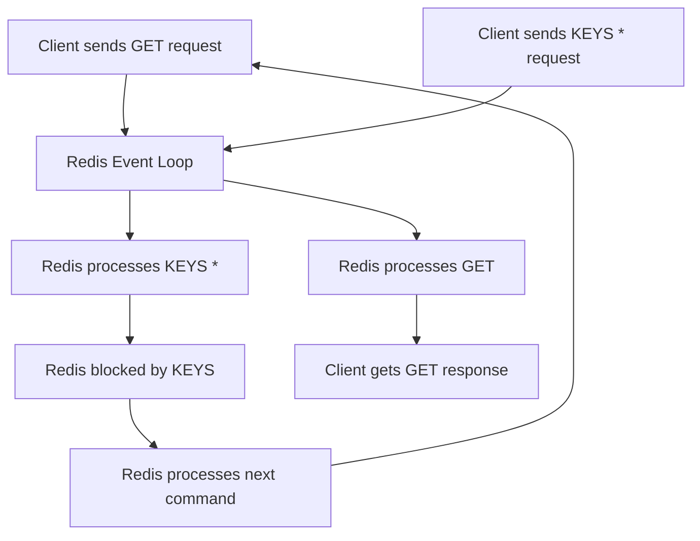

## Common Bottlenecks (e.g., KEYS command)
### Core Concepts

*   **Redis Single-Threaded Model:** Redis processes commands sequentially in a single main thread. This design simplifies concurrency control and avoids locking overhead, but means any long-running command will block all subsequent commands, increasing latency.
*   **`KEYS` Command Purpose:** `KEYS pattern` is a command used for debugging, development, and administrative tasks. It retrieves all keys matching a given pattern.
*   **`KEYS` Bottleneck:** `KEYS` operates with O(N) time complexity, where N is the total number of keys in the database. When N is large, this command can block the Redis server for a significant duration, causing high latency for all concurrent operations and potentially leading to client timeouts. It scans the *entire keyspace* to find matches.

### Key Details & Nuances

*   **Blocking Nature:** `KEYS` is a blocking command. During its execution, no other Redis command can be processed. This is critical in production environments.
*   **Time Complexity:** O(N) - directly proportional to the total number of keys in the database, not just the matching keys.
*   **Memory Impact:** While `KEYS` itself doesn't directly manage memory, retrieving a huge list of keys can consume significant network bandwidth and client-side memory if the response is large.
*   **`SCAN` Command as Alternative:** `SCAN` is designed to safely iterate over the keyspace in production without blocking the server for extended periods. It works by returning a small batch of keys and an `iterator` (cursor) for the next call.
    *   **Iterator-based:** `SCAN` takes a cursor as an argument and returns an updated cursor along with a subset of keys.
    *   **Non-blocking:** Each `SCAN` call is O(1) complexity per call, ensuring Redis remains responsive.
    *   **Guarantees:** `SCAN` guarantees that all elements present in the dataset at the start of the iteration will eventually be returned. It doesn't guarantee an atomic snapshot; elements added or removed during the iteration might or might not be returned.

### Practical Examples

**1. Danger of `KEYS` (Illustrative, do NOT run in production):**

```sh
# Connect to redis-cli
redis-cli

# Add many keys (for demonstration)
for i in {1..100000}; do redis-cli SET "mykey:$i" "value:$i" > /dev/null; done

# Execute KEYS command - this will block Redis!
KEYS mykey:*
```

**2. Safe Iteration with `SCAN` (Recommended):**

```typescript
import { createClient } from 'redis';

async function scanKeys(pattern: string) {
    const client = createClient();
    await client.connect();

    let cursor = '0';
    let keysFound: string[] = [];

    do {
        // Use SCAN command with a specific COUNT for performance
        // COUNT is a hint, not a guarantee of returned elements
        const reply = await client.scan(cursor, { MATCH: pattern, COUNT: 1000 });
        
        cursor = reply.cursor;
        keysFound = keysFound.concat(reply.keys);
        
        console.log(`Scanned ${reply.keys.length} keys. Total found: ${keysFound.length}. Cursor: ${cursor}`);
        
        // Optional: Add a small delay for extremely large datasets
        // await new Promise(resolve => setTimeout(resolve, 10)); 

    } while (cursor !== '0');

    console.log(`Finished scanning. Total keys matching '${pattern}': ${keysFound.length}`);
    await client.disconnect();
    return keysFound;
}

// Example usage:
scanKeys('user:*').then(keys => {
    // Process keys here
    // console.log("All user keys:", keys);
}).catch(err => {
    console.error("Error during scan:", err);
});
```

**3. `KEYS` Blocking the Event Loop:**



### Common Pitfalls & Trade-offs

*   **Using `KEYS` in Production:** The most common and severe pitfall. Never use `KEYS` in production environments for operational tasks due to its blocking nature. It's strictly for development/debugging.
*   **Misunderstanding `SCAN` Guarantees:** `SCAN` does not provide an atomic snapshot. If keys are added, modified, or deleted during an iteration, you might miss some keys or see duplicates. This is an acceptable trade-off for non-blocking behavior.
*   **Over-optimizing `SCAN COUNT`:** The `COUNT` option in `SCAN` is a hint for the number of elements to return per call. Too high a `COUNT` can lead to longer individual `SCAN` calls (though still far better than `KEYS`). Too low, and you might make too many round trips. A value of 1000-5000 is often a good starting point.
*   **Large Value Sizes:** While `KEYS` and `SCAN` deal with key names, if your Redis values are extremely large, operations like `GET` or `SET` on those keys can also become bottlenecks due to network transfer time and memory allocation/deallocation on the Redis server and client.

### Interview Questions

1.  **Explain why `KEYS` is considered an anti-pattern for production Redis instances. What are the specific performance implications?**
    *   **Answer:** `KEYS` is O(N) and blocking. In a single-threaded Redis, it freezes the entire server until completion, causing high latency for all other commands. This leads to client timeouts and degraded application performance, especially with large datasets.

2.  **You need to perform a task that requires iterating over all keys matching a specific pattern in a production Redis cluster. How would you accomplish this safely and efficiently? Provide a high-level pseudo-code or command structure.**
    *   **Answer:** Use the `SCAN` command. It's iterative and non-blocking.
        *   Initialize `cursor = '0'`.
        *   Loop while `cursor !== '0'`:
            *   Execute `SCAN cursor MATCH pattern COUNT <batch_size>`.
            *   Process the returned keys.
            *   Update `cursor` with the new cursor returned by `SCAN`.
        *   This ensures each `SCAN` call is O(1) and the server remains responsive.

3.  **Compare and contrast `KEYS` and `SCAN`. When would you choose one over the other, and why?**
    *   **Answer:**
        *   **`KEYS`**: Blocking, O(N), returns all matches in one go, provides an atomic snapshot (of keys present at command start). Suitable only for development, debugging, or very small, non-production datasets.
        *   **`SCAN`**: Non-blocking (iterative), O(1) per call, does not provide an atomic snapshot (keys can be added/removed during iteration), requires multiple calls. Essential for production environments to iterate keys safely without impacting performance. Choose `SCAN` for any production scenario requiring key iteration.

4.  **Beyond the `KEYS` command, what are other common performance bottlenecks you might encounter in Redis, and how would you approach diagnosing and mitigating them?**
    *   **Answer:**
        *   **Large Values:** Storing very large strings or complex data structures can lead to increased memory usage, network latency, and CPU for serialization/deserialization.
            *   **Mitigation:** Break down large objects into smaller keys, use Redis Hashes for structured data, compress data before storing, use `GETRANGE`/`SETRANGE` for partial updates.
        *   **High Latency Operations:** Commands like `LRANGE` on very long lists, `SMEMBERS` on very large sets, or complex Lua scripts can also be O(N) and blocking.
            *   **Mitigation:** Use `LRANGE` with reasonable limits, `SSCAN` for large sets, or optimize Lua scripts. Profile slow commands using `SLOWLOG GET`.
        *   **Memory Usage:** High memory usage can lead to swapping (if not configured `noeviction`), OOM errors, or trigger eviction policies, impacting performance.
            *   **Mitigation:** Set `maxmemory` and appropriate eviction policies (`volatile-lru`, `allkeys-lru`), use more memory-efficient data structures (e.g., hyperloglogs, bitmaps), enable `maxmemory-samples`, optimize key names/value sizes. Use `INFO memory` and `MEMORY USAGE` command.
        *   **Network Bottlenecks:** High command rates or large data transfers can saturate network interfaces.
            *   **Mitigation:** Use pipelining for multiple commands, consider client-side sharding or clustering, optimize application network topology.
        *   **CPU Saturation:** Too many complex operations or high command rates can max out a single core.
            *   **Mitigation:** Distribute load across multiple Redis instances (sharding), optimize data structures, use pipelining.