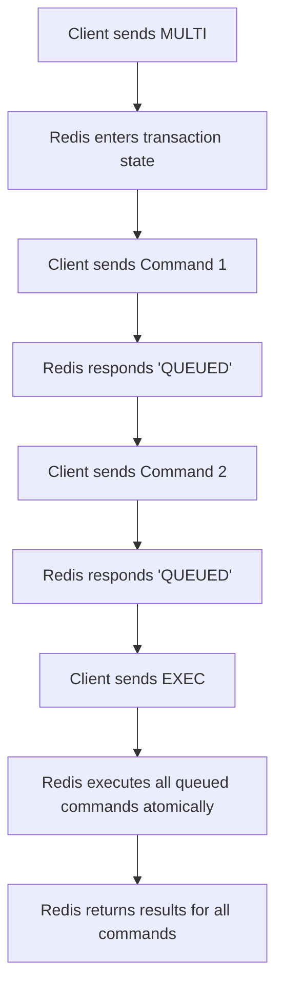

## Transactions (MULTI/EXEC)
### Core Concepts
*   **Atomic Command Execution:** Redis transactions, initiated by `MULTI` and concluded by `EXEC`, group a sequence of commands to be executed as a single, isolated operation.
*   **All-or-Nothing Guarantee:** All commands within a `MULTI`/`EXEC` block are queued and then executed sequentially without interruption by other client commands. Either all commands are executed, or none are (if `DISCARD` is called or the client disconnects before `EXEC`).
*   **No Rollback on Command Failure:** Unlike traditional relational databases, Redis transactions do *not* automatically roll back if a command within the transaction fails (e.g., wrong data type operation). Failed commands within a transaction still return an error, but subsequent commands in the transaction are still executed.

### Key Details & Nuances
*   **Queuing, Not Execution:** Commands sent between `MULTI` and `EXEC` are not executed immediately. Instead, they are enqueued. Redis responds with `QUEUED` for each command.
*   **Single Round-Trip:** All queued commands are sent in one batch after `EXEC`, reducing network latency for multiple operations.
*   **Optimistic Locking with `WATCH`:**
    *   `WATCH key [key ...]` allows monitoring one or more keys for changes before a transaction.
    *   If any watched key is modified by another client between `WATCH` and `EXEC`, the `EXEC` command aborts, and the transaction is not performed. It returns `(nil)` in `redis-cli` or an empty array.
    *   This is crucial for implementing "check-and-set" atomic operations.
    *   `UNWATCH` can be used to clear all watched keys.
*   **Transactional Guarantees:**
    *   **Atomicity:** All commands in the queue are executed together, or none.
    *   **Isolation:** No other client commands can interleave with the transaction once `EXEC` is called.
    *   **Durability & Consistency:** Depend on Redis persistence configuration.

### Practical Examples

**1. Basic `MULTI`/`EXEC` using `redis-cli`**

```sh
127.0.0.1:6379> MULTI
OK
127.0.0.1:6379> INCR mycounter
QUEUED
127.0.0.1:6379> SET mykey "hello"
QUEUED
127.0.0.1:6379> GET mykey
QUEUED
127.0.0.1:6379> EXEC
1) (integer) 1
2) OK
3) "hello"
```

**2. Optimistic Locking with `WATCH` (TypeScript using `ioredis`)**

```typescript
import { Redis } from 'ioredis';

async function updateBalance(userId: string, amount: number) {
    const redis = new Redis();
    const balanceKey = `user:${userId}:balance`;
    let retries = 5;

    while (retries > 0) {
        try {
            // Watch the balance key for changes
            await redis.watch(balanceKey);

            // Get the current balance
            const currentBalanceStr = await redis.get(balanceKey);
            const currentBalance = currentBalanceStr ? parseInt(currentBalanceStr, 10) : 0;

            const newBalance = currentBalance + amount;

            // Start a transaction
            const transactionResult = await redis.multi()
                .set(balanceKey, newBalance)
                .exec();

            // If transactionResult is null, it means WATCHed key changed
            if (transactionResult === null) {
                console.log(`Balance for user ${userId} changed by another client. Retrying...`);
                retries--;
                continue; // Retry the transaction
            } else {
                console.log(`Successfully updated balance for user ${userId} to ${newBalance}`);
                await redis.unwatch(); // Clear watch (optional, as it's cleared after EXEC)
                break; // Success
            }

        } catch (error) {
            console.error("Transaction error:", error);
            await redis.unwatch(); // Ensure watch is cleared on error
            throw error; // Propagate critical errors
        }
    }

    if (retries === 0) {
        console.error(`Failed to update balance for user ${userId} after multiple retries.`);
    }

    redis.disconnect();
}

// Example usage
// await updateBalance('user123', 100);
// await updateBalance('user123', -50);
```

**3. Transaction Flow Diagram**



### Common Pitfalls & Trade-offs
*   **No Rollback on Application/Syntax Errors:** If a command within `MULTI`/`EXEC` is syntactically invalid (e.g., `LPUSH` on a string key) or operates on a wrong data type, Redis still queues it. `EXEC` will then execute it, and the specific command will fail (return an error in its position in the result array), but subsequent commands *will still execute*. This is a critical distinction from RDBMS transactions.
*   **Blocking Nature:** While the transaction is pending (between `MULTI` and `EXEC`), the client is effectively "blocked" from executing other non-transactional commands until `EXEC` is sent or `DISCARD` is used.
*   **`WATCH` Overhead:** Using `WATCH` introduces potential for retries if the watched key changes, which can increase latency and CPU usage under high contention.
*   **Complexity vs. Lua Scripts:** For very complex logic or conditional execution that cannot be handled by simple `WATCH` semantics, Lua scripting (with `EVAL` or `EVALSHA`) might be a better choice as it executes server-side, preventing race conditions entirely without `WATCH`/retries. Transactions are better suited for "optimistic locking" patterns.

### Interview Questions

1.  **What level of atomicity do Redis transactions (MULTI/EXEC) provide, and how does it differ from traditional relational database transactions?**
    *   **Answer:** Redis transactions ensure that a group of commands is executed atomically: either all commands are processed, or none (if `DISCARD` or `WATCH` fails). However, unlike RDBMS, Redis transactions do *not* provide automatic rollback if a command within the transaction fails at runtime (e.g., attempting `LPUSH` on a string key). The failing command returns an error, but subsequent commands in the transaction still proceed.

2.  **How do you handle race conditions or ensure data consistency when performing read-modify-write operations atomically in Redis? Provide an example.**
    *   **Answer:** Race conditions for read-modify-write patterns are handled using `WATCH`. Before `MULTI`, keys involved in the operation are `WATCH`ed. If any watched key is modified by another client before `EXEC` is called, the transaction is aborted (returns `(nil)`). The client then typically retries the entire operation. This is an optimistic locking mechanism.
        *Example:* Incrementing a counter based on its current value: `WATCH mycounter`, `GET mycounter`, `MULTI`, `SET mycounter new_value`, `EXEC`. If `EXEC` returns `(nil)`, retry.

3.  **What happens if a command within a `MULTI`/`EXEC` block has a syntax error or attempts an operation on an incorrect data type?**
    *   **Answer:** If there's a *syntax error* in a command *before* `EXEC` is called, Redis immediately returns an error for that command and the transaction is typically discarded. However, if the command is syntactically valid but semantically incorrect (e.g., trying to `INCR` a string that isn't an integer, or `LPUSH` on a key that holds a string), Redis *queues* the command. When `EXEC` is called, the transaction proceeds, and that specific command will fail and return an error in its position in the result array, but the *rest of the commands in the transaction will still execute*.

4.  **When might you choose Redis transactions (`MULTI`/`EXEC`) over Lua scripting for atomic operations, and vice versa?**
    *   **Answer:**
        *   **Choose `MULTI`/`EXEC` when:**
            *   The logic is primarily a sequence of simple, independent commands that need to be atomic.
            *   Optimistic locking with `WATCH` is sufficient for handling concurrency (e.g., read-modify-write where retries are acceptable).
            *   The transaction involves data that might be modified by other clients *between* the `WATCH` and `EXEC` steps, and you want to detect this.
        *   **Choose Lua scripting (`EVAL`) when:**
            *   The atomic operation involves complex conditional logic, loops, or multiple decision points based on data, which is difficult or inefficient to implement with `WATCH`/retry loops.
            *   You need to guarantee that no other client can interfere *at any point* during the entire operation, eliminating the need for client-side retries.
            *   Performance is extremely critical, as Lua scripts execute entirely server-side in a single atomic step, minimizing network round-trips and context switching.