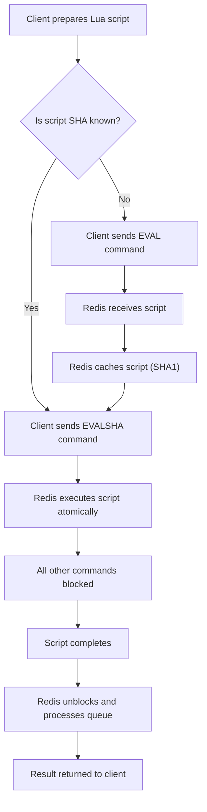

## Lua Scripting for Atomic Operations
### Core Concepts

*   **Atomic Execution**: Redis Lua scripting allows you to execute a block of Lua code directly on the Redis server. Due to Redis's single-threaded nature, an entire Lua script is guaranteed to execute atomically, meaning no other Redis commands or scripts can run concurrently while the script is active.
*   **Custom Server-Side Logic**: It enables implementing complex, multi-step operations (e.g., conditional updates, rate limiting, distributed locks) that require reading data, performing logic, and writing data, all as a single, indivisible operation.
*   **Efficiency**: Reduces round-trip network latency by executing multiple commands in a single server call.

### Key Details & Nuances

*   **Blocking Nature**: While a Lua script is running, the Redis server is blocked and cannot process any other commands from other clients. This ensures atomicity but can lead to high latency if scripts are long-running.
*   **`KEYS` and `ARGV`**:
    *   Arguments passed to a Lua script are strictly separated into `KEYS` (for Redis keys the script operates on) and `ARGV` (for other arguments like values or limits).
    *   Access keys in Lua via `KEYS[1]`, `KEYS[2]`, etc.
    *   Access other arguments via `ARGV[1]`, `ARGV[2]`, etc.
    *   This separation is critical for Redis Cluster and sharding, allowing the system to ensure all keys accessed by the script reside on the same shard.
*   **Script Caching (`EVAL` vs. `EVALSHA`)**:
    *   `EVAL` sends the full script content to Redis. Redis compiles and caches it (keyed by SHA1 hash).
    *   `EVALSHA` sends only the SHA1 hash of a previously loaded script. This is preferred for subsequent calls as it saves network bandwidth and processing overhead (no need to re-parse).
    *   Clients typically use `EVAL` once to load a script and then `EVALSHA` for all subsequent calls.
*   **Determinism**: Scripts must be deterministic. Their output must depend solely on their input arguments and the Redis dataset, not on external factors like current time (`time()` in Lua) or random numbers (`math.random()`). Non-deterministic scripts break Redis's AOF persistence and replication consistency. (Note: Redis 5+ improved handling of `TIME` within scripts for determinism).
*   **Error Handling (`SCRIPT KILL`)**: If a script gets stuck (e.g., an infinite loop), `SCRIPT KILL` can be used to terminate it if it hasn't performed any writes. If it has performed writes, `SCRIPT KILL` will fail, and a `SHUTDOWN NOSAVE` might be required, risking data loss.

### Practical Examples

**Scenario: Atomic Conditional Increment and Reset**
A common pattern for rate limiting or resource counting where a counter increments, but if it exceeds a maximum, it resets to zero and indicates failure. This requires reading (INCR), conditional logic, and writing (SET, EXPIRE) to be atomic.

```lua
-- Lua Script: increment_and_reset.lua
-- KEYS[1]: The Redis key for the counter (e.g., 'user:123:req_count')
-- ARGV[1]: The maximum allowed count (e.g., '5')
-- ARGV[2]: The expiry time for the key in seconds (e.g., '60')

local current_count = redis.call('INCR', KEYS[1])

-- If this is the first increment (counter was 0 or didn't exist), set expiry
if current_count == 1 then
    redis.call('EXPIRE', KEYS[1], ARGV[2])
end

local max_count = tonumber(ARGV[1])

-- Check if the count exceeds the maximum
if current_count > max_count then
    redis.call('SET', KEYS[1], 0) -- Reset the counter
    return 0 -- Indicate failure (exceeded)
else
    return current_count -- Return the current count
end
```

**TypeScript/JavaScript Client Usage (using `ioredis`)**

```typescript
import Redis from 'ioredis';

const redis = new Redis();

// The Lua script content
const ATOMIC_INCREMENT_SCRIPT = `
    local current_count = redis.call('INCR', KEYS[1])
    if current_count == 1 then
        redis.call('EXPIRE', KEYS[1], ARGV[2])
    end

    local max_count = tonumber(ARGV[1])

    if current_count > max_count then
        redis.call('SET', KEYS[1], 0)
        return 0
    else
        return current_count
    end
`;

let scriptSha: string | null = null;

async function atomicConditionalIncrement(
    key: string,
    maxCount: number,
    expirySeconds: number
): Promise<number> {
    if (!scriptSha) {
        // Load the script once and store its SHA1 hash
        scriptSha = await redis.script('LOAD', ATOMIC_INCREMENT_SCRIPT);
        console.log(`Script loaded, SHA: ${scriptSha}`);
    }

    // Execute the script using EVALSHA for efficiency
    // The '1' indicates the number of KEYS arguments (KEYS[1] is 'key')
    return await redis.evalsha(scriptSha, 1, key, maxCount.toString(), expirySeconds.toString());
}

// --- Example Usage ---
(async () => {
    const userKey = 'user:123:api_requests';
    const maxAllowedRequests = 3;
    const windowSeconds = 60; // Reset after 60 seconds

    console.log(`Testing atomic increment for key: ${userKey}, max: ${maxAllowedRequests}`);

    // Simulate multiple requests
    for (let i = 1; i <= 5; i++) {
        const currentCount = await atomicConditionalIncrement(userKey, maxAllowedRequests, windowSeconds);
        console.log(`Request ${i}: Current count = ${currentCount} (0 means exceeded)`);
    }

    // Clean up
    await redis.del(userKey);
    await redis.disconnect();
})();
```

**Execution Flow (Mermaid Diagram)**



### Common Pitfalls & Trade-offs

*   **Long-running Scripts:** The most significant pitfall. A script that runs for too long will block the entire Redis instance, leading to high latency for all other clients.
    *   **Mitigation:** Keep scripts extremely short and fast. Avoid complex computations or loops over large data sets. Monitor `SLOWLOG` for long-running scripts.
*   **Non-deterministic Operations:** Using Lua `math.random()`, `os.time()`, or iterating over unordered sets/hashes can lead to non-deterministic behavior, which breaks replication and AOF persistence.
    *   **Mitigation:** Avoid these functions or ensure their use is outside the replicated critical path. Redis 5+ introduced `redis.call('TIME')` which is deterministic.
*   **Debugging Complexity:** Debugging server-side Lua scripts can be challenging. Redis provides `redis-cli --ldb` for a simple debugger.
*   **Memory Usage:** Cached scripts consume memory. While typically small, a large number of unique scripts could accumulate.
*   **Complexity vs. `MULTI/EXEC`**: While Lua scripts offer more power, they add complexity. For simple, unconditional batch operations, `MULTI/EXEC` is often sufficient and easier to reason about. Lua is for true atomic logic.

### Interview Questions

1.  **When would you choose a Redis Lua script over a `MULTI/EXEC` transaction for an atomic operation, and what are the key differences in their guarantees?**
    *   **Answer**: Choose Lua scripts when your atomic operation requires conditional logic, loops, or reading intermediate results to inform subsequent commands *within* the single atomic block. `MULTI/EXEC` provides atomicity for a sequence of commands but does not allow for conditional logic or reading results within the transaction itself; all commands are queued and then executed. Lua offers true server-side procedural atomicity.

2.  **What are the primary performance considerations when deploying Redis Lua scripts in a high-throughput environment, and how do you mitigate potential issues?**
    *   **Answer**: The main consideration is that Lua scripts execute atomically, blocking the entire Redis server. Long-running scripts cause increased latency for all other connected clients. Mitigation strategies include keeping scripts extremely short and efficient, monitoring Redis `SLOWLOG` for script execution times, and using `EVALSHA` to reduce network overhead. For truly complex logic, consider offloading to application-level processing or asynchronous queues.

3.  **Explain the role of `KEYS` and `ARGV` in Redis Lua scripting, particularly in the context of Redis Cluster.**
    *   **Answer**: `KEYS` represents the Redis keys that the script will operate on, while `ARGV` contains additional arguments or values. This distinction is critical for Redis Cluster: all keys passed in `KEYS` must hash to the same cluster slot (i.e., reside on the same Redis instance) for the script to execute successfully. This allows Redis Cluster to route the script to the correct shard. If keys are on different shards, the script cannot run.

4.  **Why must Redis Lua scripts be deterministic? Provide an example of a non-deterministic operation and explain its consequence.**
    *   **Answer**: Scripts must be deterministic because Redis's persistence (AOF) and replication mechanisms record the script itself, not the individual commands it executes. If a script's output varies across runs with the same input (e.g., using Lua's `math.random()` or `os.time()`), then the replicated instances or an AOF replay could diverge from the primary, leading to data inconsistency.

5.  **How do you handle a "runaway" or stuck Lua script in a production Redis instance?**
    *   **Answer**: For scripts that are running too long but haven't performed any write operations, the `SCRIPT KILL` command can be used to terminate them. If the script *has* performed writes, `SCRIPT KILL` will fail to prevent partial writes. In such severe cases, the only way to stop it is `SHUTDOWN NOSAVE`, which forcibly terminates Redis without saving changes, potentially leading to data loss. This highlights the importance of rigorous testing and keeping scripts minimal.