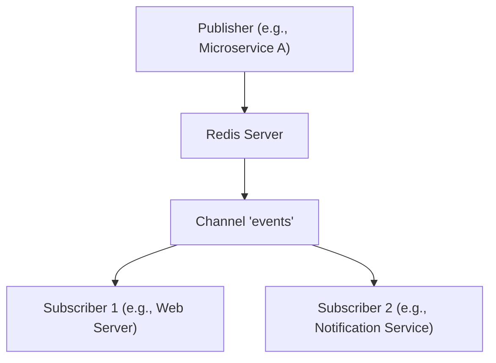

## Pub/Sub Messaging Paradigm
### Core Concepts
*   **Definition**: Redis Pub/Sub (Publish/Subscribe) is a messaging paradigm where senders (publishers) do not send messages directly to specific receivers (subscribers). Instead, publishers categorize messages into **channels**, and subscribers express interest in one or more channels, receiving all messages published to them.
*   **Decoupling**: It provides loose coupling between publishers and subscribers, enhancing system flexibility and scalability.
*   **Fire-and-Forget**: Messages are broadcast to all currently connected subscribers. If no subscribers are listening to a channel when a message is published, the message is lost. Redis does not persist messages for Pub/Sub.

### Key Details & Nuances
*   **Commands**:
    *   `PUBLISH <channel> <message>`: Sends a message to a specific channel.
    *   `SUBSCRIBE <channel> [<channel> ...]`: Subscribes the client to one or more channels.
    *   `PSUBSCRIBE <pattern> [<pattern> ...]`: Subscribes the client to channels matching specified glob-style patterns (e.g., `chat.*`, `notifications:user:*`).
    *   `UNSUBSCRIBE [<channel> ...]`: Unsubscribes from specific channels.
    *   `PUNSUBSCRIBE [<pattern> ...]`: Unsubscribes from specific patterns.
    *   A client in `SUBSCRIBE` or `PSUBSCRIBE` mode cannot issue any other commands except `SUBSCRIBE`, `PSUBSCRIBE`, `UNSUBSCRIBE`, `PUNSUBSCRIBE`, `PING`, and `QUIT`. It requires a dedicated connection.
*   **Message Delivery**: Redis Pub/Sub offers **at-most-once** delivery semantics. Messages are delivered to *active* subscribers, but there's no guarantee of delivery if a subscriber is disconnected or slow. No message queue or durable storage is involved.
*   **Scalability**: Redis itself is single-threaded, but Pub/Sub operations are very fast. For high-volume Pub/Sub, Redis can handle millions of messages per second. However, all messages must pass through a single Redis instance for a given channel, which can become a bottleneck if subscribers cannot consume fast enough.
*   **Pattern Matching (`PSUBSCRIBE`)**: Allows subscribing to multiple channels efficiently (e.g., all user-specific notification channels `user:123:notifications`, `user:456:notifications` via `user:*:notifications`).

### Practical Examples

#### 1. Pub/Sub Flow Diagram



#### 2. Node.js Example (using `ioredis`)

```typescript
// publisher.ts
import Redis from 'ioredis';

const publisher = new Redis();

async function publishMessage() {
  const channel = 'user_updates';
  const message = JSON.stringify({ userId: '123', status: 'online', timestamp: Date.now() });

  console.log(`Publishing message "${message}" to channel "${channel}"`);
  await publisher.publish(channel, message);

  publisher.quit();
}

publishMessage().catch(console.error);
```

```typescript
// subscriber.ts
import Redis from 'ioredis';

const subscriber = new Redis();

const channel = 'user_updates';

subscriber.on('message', (channel, message) => {
  console.log(`Received message on channel "${channel}": ${message}`);
  // Process the message, e.g., update user status in a UI, send a push notification
  try {
    const data = JSON.parse(message);
    console.log(`Parsed data: User ID ${data.userId}, Status: ${data.status}`);
  } catch (e) {
    console.error("Failed to parse message:", e);
  }
});

subscriber.subscribe(channel, (err, count) => {
  if (err) {
    console.error("Failed to subscribe:", err);
  } else {
    console.log(`Subscribed to ${count} channel(s). Listening for messages on "${channel}"...`);
  }
});

// Example for pattern subscription:
// subscriber.psubscribe('user_*:updates', (err, count) => {
//   if (err) console.error(err);
//   console.log(`PSubscribed to ${count} pattern(s).`);
// });
// subscriber.on('pmessage', (pattern, channel, message) => {
//   console.log(`Received message on channel "${channel}" matching pattern "${pattern}": ${message}`);
// });

// Keep the process alive to listen for messages
process.on('SIGINT', () => {
  console.log('Shutting down subscriber...');
  subscriber.quit();
  process.exit();
});
```

### Common Pitfalls & Trade-offs
*   **No Message Persistence**: Messages are *not* stored. If a subscriber is offline or disconnects, it will miss messages published during its downtime. This is a critical distinction from traditional message queues (Kafka, RabbitMQ, SQS).
*   **No Message Durability/Guarantees**: Redis Pub/Sub does not guarantee delivery. It's a "fire-and-forget" mechanism. There's no acknowledgment from subscribers.
*   **No Consumer Groups**: Unlike Kafka Streams, Redis Pub/Sub doesn't have built-in consumer groups to distribute messages among a group of consumers for a channel, meaning every subscriber gets *every* message.
*   **Limited Backpressure**: If publishers send messages faster than subscribers can process them, Redis will queue messages in the client's output buffer. If this buffer grows too large, Redis might disconnect the slow client to prevent memory exhaustion, leading to message loss for that client.
*   **Alternatives**: For scenarios requiring persistence, durability, explicit message queues, consumer groups, or message replay, consider:
    *   **Redis Streams**: A more robust, log-like data structure within Redis that provides persistence, consumer groups, and message replay. Excellent for event sourcing or durable message queues.
    *   **Kafka**: A distributed streaming platform for high-throughput, fault-tolerant, durable event streams with strong ordering guarantees and consumer groups.
    *   **RabbitMQ**: A general-purpose message broker supporting various messaging patterns, with strong guarantees and persistent queues.

### Interview Questions
1.  **Question**: When would you choose Redis Pub/Sub over a more robust message broker like Kafka or RabbitMQ, and what are the key considerations?
    **Answer**: Choose Redis Pub/Sub for real-time, broadcast-style, fire-and-forget messaging where message loss is acceptable for disconnected clients. It's excellent for chat applications (real-time notifications), real-time analytics updates, or cache invalidation. The key considerations are its simplicity, extremely low latency, and high throughput. However, the trade-off is the lack of persistence, message guarantees, and consumer groups. If any of those are critical, Kafka, RabbitMQ, or even Redis Streams would be preferred.
2.  **Question**: Describe a scenario where Redis Pub/Sub would be an ideal solution.
    **Answer**: An ideal scenario is a real-time notification system where users receive updates about events (e.g., "new comment," "friend online"). When a new comment is posted, a service publishes to a channel like `post:<post_id>:comments`. All currently active clients subscribed to that post's channel instantly receive the update. If a user is offline, they will simply see the new comment upon their next page load (which might fetch data from a database), but the real-time push is primarily for immediate, non-critical updates. Another example is real-time dashboards or live leaderboards.
3.  **Question**: What happens to messages published to a Redis Pub/Sub channel if there are no active subscribers?
    **Answer**: The messages are lost. Redis Pub/Sub is a "fire-and-forget" mechanism. It does not store messages or queue them for disconnected subscribers. It only delivers messages to clients that are actively subscribed to the channel at the moment of publication.
4.  **Question**: How would you handle a "slow subscriber" problem in Redis Pub/Sub, and what are the implications?
    **Answer**: Redis buffers outgoing messages for subscribers. If a subscriber cannot consume messages fast enough, its output buffer will grow. If it exceeds configurable limits (`client-output-buffer-limit pubsub`), Redis will forcefully disconnect the slow subscriber. The implication is that the slow subscriber will miss all messages published while it was disconnected, highlighting the lack of message guarantees. To mitigate, ensure subscribers are highly performant, distribute load across multiple subscribers (if applicable and logic allows), or consider switching to Redis Streams (which offer consumer groups and persistence) or a full-fledged message queue if message loss is unacceptable.
5.  **Question**: Differentiate between `SUBSCRIBE` and `PSUBSCRIBE` commands in Redis Pub/Sub.
    **Answer**:
    *   `SUBSCRIBE` allows a client to subscribe to one or more *exact* channel names. Messages are only received if published directly to one of the subscribed exact channel names.
    *   `PSUBSCRIBE` allows a client to subscribe to channels based on *glob-style patterns*. This means a single subscription can match multiple channels (e.g., `PSUBSCRIBE user:*:updates` would receive messages from `user:123:updates`, `user:456:updates`, etc.). This is efficient for dynamic or numerous channels following a naming convention.
    Both commands put the client into a Pub/Sub dedicated mode, restricting other command usage.