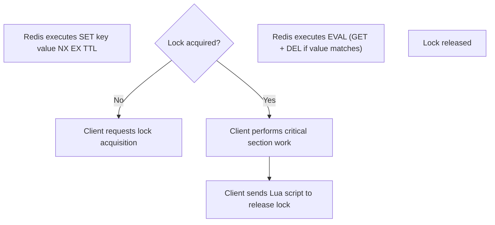

## Implementing Distributed Locks
### Core Concepts
*   **Purpose:** Enable atomic operations and prevent race conditions across multiple processes or machines accessing shared resources in a distributed system.
*   **Mechanism:** Leverage Redis's atomic commands and single-threaded nature to implement a mutual exclusion primitive.
*   **Basic Idea:** A client attempts to "acquire" a lock by setting a key in Redis. If successful, it proceeds; otherwise, it waits or retries. Once done, it "releases" the lock.

### Key Details & Nuances
*   **Atomic Lock Acquisition:**
    *   Use the `SET` command with the `NX` (Not Exists) and `EX` (Expire) or `PX` (Expire Milliseconds) options.
    *   `SET resource_name unique_value NX EX ttl_seconds`
        *   `resource_name`: The key representing the locked resource.
        *   `unique_value`: A client-specific, randomly generated string (e.g., UUID) to identify the lock owner. Crucial for safe release.
        *   `NX`: Ensures the command only sets the key if it does not already exist, guaranteeing atomicity for acquisition.
        *   `EX ttl_seconds`: Sets an expiration time (Time To Live). Prevents deadlocks if a client crashes before releasing the lock. Choosing an appropriate TTL is critical.
*   **Atomic Lock Release:**
    *   A simple `DEL resource_name` is **unsafe** because a client might delete a lock acquired by another client (e.g., if its own lock expired and was re-acquired by someone else).
    *   **Correct Release:** Use a Lua script to atomically check the `unique_value` and delete the key **only if** it matches the current client's value. This prevents one client from prematurely releasing another's valid lock.
*   **Expiration (TTL):**
    *   **Importance:** Crucial for fault tolerance. If a client holding a lock crashes or becomes unresponsive, the lock will eventually expire, preventing a permanent deadlock.
    *   **Trade-offs:** Too short a TTL risks the lock expiring prematurely while the client is still working (leading to concurrent access). Too long risks prolonged deadlocks.
    *   **Extension:** For long-running operations, clients might periodically "extend" the lock's TTL (a "heartbeat" mechanism), but this adds complexity and risk.
*   **Idempotency:** Lock acquisition should be idempotent (repeated attempts by the same client with the same `unique_value` don't break anything, though `NX` means only the first `SET` would truly succeed).
*   **Single Redis Instance Vulnerability:** A single Redis instance is a Single Point of Failure (SPOF). If it goes down, all locks are lost, potentially leading to race conditions.
*   **Redlock Algorithm:**
    *   Proposed by Salvatore Sanfilippo (Redis creator) to address the SPOF issue by requiring a majority of independent Redis masters to agree on lock acquisition.
    *   **Controversies:** Highly debated in distributed systems literature regarding its safety guarantees under network partitions and clock skew. Often considered overly complex for common use cases and not universally safer than a well-designed single-instance solution.
    *   **Interview Context:** Mentioning Redlock shows depth of knowledge but be prepared to discuss its pros/cons and when it might be overkill.

### Practical Examples

**1. Basic Distributed Lock Flow**



**2. TypeScript/JavaScript Example with `ioredis`**

```typescript
import Redis from 'ioredis';
import { v4 as uuidv4 } from 'uuid';

const redis = new Redis(); // Connects to localhost:6379 by default

// Lua script for atomic release: check value and delete
const releaseLockScript = `
  if redis.call("get", KEYS[1]) == ARGV[1] then
    return redis.call("del", KEYS[1])
  else
    return 0
  end
`;

async function acquireLock(
  lockName: string,
  ttlSeconds: number
): Promise<string | null> {
  const identifier = uuidv4();
  try {
    const result = await redis.set(lockName, identifier, 'NX', 'EX', ttlSeconds);
    if (result === 'OK') {
      console.log(`Lock "${lockName}" acquired with ID: ${identifier}`);
      return identifier;
    } else {
      console.log(`Failed to acquire lock "${lockName}". Already held.`);
      return null;
    }
  } catch (error) {
    console.error(`Error acquiring lock "${lockName}":`, error);
    return null;
  }
}

async function releaseLock(lockName: string, identifier: string): Promise<boolean> {
  try {
    // KEYS[1] is lockName, ARGV[1] is identifier
    const result = await redis.eval(releaseLockScript, 1, lockName, identifier);
    if (result === 1) {
      console.log(`Lock "${lockName}" released with ID: ${identifier}`);
      return true;
    } else {
      console.log(`Failed to release lock "${lockName}". Identifier mismatch or lock expired.`);
      return false;
    }
  } catch (error) {
    console.error(`Error releasing lock "${lockName}":`, error);
    return false;
  }
}

// --- Example Usage ---
async function runWithLock() {
  const resourceKey = 'my_shared_resource';
  const lockTTL = 10; // Lock expires in 10 seconds

  const myLockIdentifier = await acquireLock(resourceKey, lockTTL);

  if (myLockIdentifier) {
    try {
      console.log('Performing critical operation...');
      await new Promise(resolve => setTimeout(resolve, 3000)); // Simulate work
      console.log('Critical operation finished.');
    } finally {
      await releaseLock(resourceKey, myLockIdentifier);
    }
  } else {
    console.log('Could not obtain lock. Skipping critical operation.');
  }

  redis.quit();
}

runWithLock();
```

### Common Pitfalls & Trade-offs
*   **Deadlock Risk:** Forgetting to set a TTL (expiration) on the lock key. If the client crashes, the lock is never released.
*   **Unsafe Release:** Releasing another client's lock by using a simple `DEL` command without checking the unique identifier.
*   **Premature Expiration:** If the operation takes longer than the lock's TTL, the lock can expire while the client is still working, allowing another client to acquire it and leading to race conditions. This is a hard problem to solve robustly.
*   **Performance Overhead:** Distributed locks introduce network latency and contention, which can reduce the throughput of shared resources compared to highly concurrent, lock-free designs.
*   **Network Partitions:** In the event of network splits, clients might incorrectly believe they hold a lock or that a lock has expired, leading to consistency issues.
*   **Clock Skew:** A significant problem for algorithms like Redlock, where reliance on synchronized clocks across multiple machines can lead to incorrect lock decisions.
*   **Redis as SPOF:** A basic single-instance Redis setup for locks is vulnerable if the Redis server crashes. Redundancy (sentinel, cluster) helps with availability but not necessarily with strict consistency guarantees for locks during failovers.

### Interview Questions
1.  **Describe how you would implement a distributed lock using Redis, highlighting atomic operations and safe release mechanisms.**
    *   **Answer:** I'd use `SET <key> <unique_value> NX EX <ttl>` for atomic acquisition. `NX` ensures I only set if the key doesn't exist, `EX` provides an expiration. For release, I'd use a Lua script (`EVAL`) that atomically retrieves the key's value, checks if it matches my `unique_value`, and only then deletes the key. This prevents me from deleting a lock that another client re-acquired after my original lock expired.
2.  **What are the critical considerations when choosing the TTL (Time To Live) for a Redis-based distributed lock? What happens if the chosen TTL is too short or too long?**
    *   **Answer:** The TTL must be longer than the maximum expected duration of the critical section. If too short, the lock might expire prematurely while the client is still working, allowing another client to acquire it, leading to race conditions. If too long, a client crash results in a prolonged deadlock for the resource. It's a trade-off between resilience to crashes and the risk of concurrent access.
3.  **Explain the purpose of the `unique_value` when acquiring a Redis lock. Why is a simple `DEL <key>` insufficient for releasing a lock, and how do you ensure atomicity during release?**
    *   **Answer:** The `unique_value` (e.g., UUID) identifies the specific client instance that acquired the lock. A simple `DEL` is unsafe because if my client's operation takes longer than the TTL, my lock might expire and another client might acquire it. If I then call `DEL`, I'd delete their valid lock. The `unique_value` ensures that I only delete *my own* lock. Atomicity during release is achieved by using a Lua script executed via `EVAL`, which performs the `GET` and `DEL` operations as a single, indivisible unit on the Redis server, preventing race conditions between the check and delete.
4.  **Discuss the challenges and potential issues with a single Redis instance acting as a lock manager. How might you address them, and what are the trade-offs of those solutions?**
    *   **Answer:** The main challenge is Single Point of Failure (SPOF). If the Redis instance crashes or becomes unavailable, all locks are lost, potentially leading to multiple clients simultaneously accessing critical sections. This can be addressed by using Redis Sentinel for high availability (automatic failover to a replica), or Redis Cluster for sharding and availability. However, during failovers or network partitions, these setups can still momentarily violate strong consistency guarantees, as a replica might be promoted before it fully syncs, or a split-brain scenario could occur. Redlock attempts to solve this with multiple independent masters but introduces its own complexity and debates regarding safety.
5.  **When would you choose a Redis-based distributed lock over a database-based approach (e.g., using `SELECT FOR UPDATE`) or a dedicated coordination service like ZooKeeper?**
    *   **Answer:** I'd choose Redis for its **high performance** and **simplicity** for common, high-volume scenarios where the locking mechanism needs to be fast and lightweight. It's great for mutual exclusion around non-persistent state or where a short period of inconsistency after a failure is acceptable. Database-based locks (`SELECT FOR UPDATE`) are more appropriate when the lock is intrinsically tied to a database transaction and data consistency is paramount, leveraging the database's ACID properties. ZooKeeper (or etcd, Consul) offers stronger consistency guarantees, better handling of network partitions, and more complex coordination primitives (e.g., leader election, watch mechanisms). I'd choose ZooKeeper for critical, low-volume operations requiring absolute consistency and resilience in highly distributed systems, but it comes with higher operational complexity and latency.