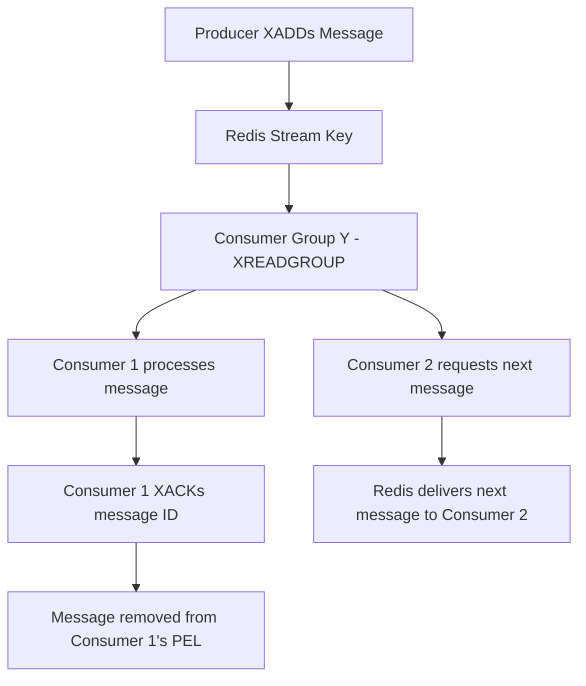

## Advanced Data Structures (Streams, HyperLogLogs, Geospatial)
### Core Concepts

*   **Redis Streams:**
    *   An append-only, durable log data structure acting as a message queue or event store.
    *   Designed for processing real-time event data, enabling features like event sourcing, logging, and inter-service communication.
    *   Supports multiple producers and consumers, including distributed consumption via Consumer Groups.
*   **Redis HyperLogLogs (HLL):**
    *   A probabilistic data structure used for cardinality estimation (counting unique items).
    *   Offers extremely low memory footprint (approx. 12KB per HLL) regardless of the number of unique items counted (up to 2^64).
    *   Sacrifices perfect accuracy for efficiency, with a standard error rate of about 0.81%.
*   **Redis Geospatial:**
    *   Stores geographical latitude-longitude coordinates of points of interest.
    *   Enables efficient distance calculations and radius-based queries to find nearby locations.
    *   Built upon sorted sets, where the score is a geohash representation of the coordinates.

### Key Details & Nuances

*   **Redis Streams:**
    *   **Message IDs:** Each message has a unique ID, typically `timestamp-sequence`, ensuring chronological order.
    *   **Consumer Groups:** Allow multiple consumers to process messages from a stream cooperatively, with each message going to only one consumer in the group. Offsets are tracked per group.
    *   **Pending Entries List (PEL):** Tracks messages delivered to a consumer group member but not yet acknowledged (`XACK`). Essential for fault tolerance and re-processing.
    *   **Blocking Reads:** `XREAD` and `XREADGROUP` commands can block, waiting for new messages, reducing polling overhead.
    *   **Retention:** Streams are append-only. Memory usage grows indefinitely unless explicitly trimmed using `XTRIM`.
*   **Redis HyperLogLogs:**
    *   **Commands:** `PFADD` (add element), `PFCOUNT` (get count), `PFMERGE` (merge multiple HLLs).
    *   **Accuracy:** The probabilistic nature means the count is an approximation. Ideal for dashboards, analytics, or scenarios where exact counts aren't critical.
    *   **Memory:** Fixed size means it's incredibly efficient for counting very large sets of unique items where other data structures would consume vast amounts of memory.
*   **Redis Geospatial:**
    *   **Geohash Encoding:** Internally, coordinates are converted to Geohashes, which are then used as scores in a sorted set. This allows efficient range queries to approximate circular regions.
    *   **Commands:** `GEOADD` (add members), `GEODIST` (calculate distance), `GEOSEARCH` (find members within a radius or bounding box, preferred over `GEORADIUS`).
    *   **Units:** Distances can be specified in meters (m), kilometers (km), miles (mi), or feet (ft).

### Practical Examples

**1. Redis Stream Consumer Group Workflow**



**2. HyperLogLog for Unique Daily Visitors**

```typescript
import { createClient } from 'redis';

async function trackUniqueVisitors() {
    const client = createClient();
    await client.connect();

    const today = new Date().toISOString().slice(0, 10); // e.g., '2023-10-27'
    const key = `unique_visitors:${today}`;

    // Simulate users visiting
    await client.pfAdd(key, 'user:101', 'user:102', 'user:103');
    await client.pfAdd(key, 'user:102', 'user:104'); // user:102 is a repeat

    const uniqueCount = await client.pfCount(key);
    console.log(`Unique visitors today: ${uniqueCount}`); // Expected: 4 (user:101, 102, 103, 104)

    // Merge yesterday's HLL into today's (for weekly/monthly counts if needed)
    // await client.pfAdd(`unique_visitors:${yesterday}`, 'user:200');
    // await client.pfMerge('unique_visitors:daily_total', `unique_visitors:${yesterday}`, key);

    await client.disconnect();
}

trackUniqueVisitors();
```

**3. Geospatial Search for Nearby Locations**

```typescript
import { createClient } from 'redis';

async function findNearbyCafes() {
    const client = createClient();
    await client.connect();

    const cafesKey = 'my_cafes';

    // Add some cafes (longitude, latitude, member_name)
    await client.geoAdd(cafesKey, { longitude: -122.4194, latitude: 37.7749, member: 'CafeA' }); // San Francisco
    await client.geoAdd(cafesKey, { longitude: -122.4100, latitude: 37.7800, member: 'CafeB' });
    await client.geoAdd(cafesKey, { longitude: -122.3900, latitude: 37.7900, member: 'CafeC' });
    await client.geoAdd(cafesKey, { longitude: -74.0060, latitude: 40.7128, member: 'CafeD' }); // New York

    // Find cafes within 2km of a specific point (e.g., Golden Gate Park entrance)
    const myLat = 37.7691;
    const myLon = -122.4862; // A point near Golden Gate Park, SF

    const nearbyCafes = await client.geoSearch(
        cafesKey,
        { longitude: myLon, latitude: myLat },
        { radius: 2, unit: 'km' },
        { WITHDIST: true, COUNT: 5, ASC: true } // Include distance, limit to 5, sort ascending by distance
    );

    console.log(`Nearby cafes (within 2km of [${myLon}, ${myLat}]):`);
    nearbyCafes.forEach(cafe => {
        console.log(`- ${cafe.member} (Distance: ${cafe.distance?.toFixed(2)} km)`);
    });

    await client.disconnect();
}

findNearbyCafes();
```

### Common Pitfalls & Trade-offs

*   **Redis Streams:**
    *   **Memory Growth:** Without `XTRIM` or `MAXLEN` caps, streams can consume vast amounts of memory over time as they are append-only.
    *   **Lack of Advanced Features:** Not a full-fledged Kafka replacement; lacks complex message transformations, long-term archival, or built-in exactly-once processing (requires careful application-level design).
    *   **Error Handling:** Unacknowledged messages remain in PEL. Requires `XCLAIM` for manual re-assignment or `XAUTOCLAIM` for automatic re-processing by healthy consumers if a consumer crashes.
*   **Redis HyperLogLogs:**
    *   **Approximate Counts:** Do not use when 100% accurate, exact counts are required (e.g., financial transactions, critical inventory).
    *   **No Item Retrieval:** HLLs only count; they do not store the actual unique items. You cannot retrieve the elements that were added.
*   **Redis Geospatial:**
    *   **CPU Intensive Queries:** For very large datasets or very wide search radii, `GEOSEARCH` operations can become CPU-intensive, as they involve sorting and distance calculations.
    *   **Spherical Earth Model:** Assumes a spherical Earth, which is usually sufficient for most applications but might not be perfectly precise for very large distances or highly specialized GIS applications.
    *   **Single Key Bottleneck:** Storing all geospatial data in a single Redis key might become a bottleneck for extremely high write/read throughput on that specific key. Consider sharding if necessary.

### Interview Questions

1.  **Q:** When would you choose Redis Streams over a dedicated message broker like Kafka or RabbitMQ, and what are the main trade-offs?
    **A:** Redis Streams are excellent for simpler event sourcing, real-time logging, or time-series data where you benefit from Redis's simplicity, speed, and co-location with other data structures. They offer good performance for typical use cases and integrate well into existing Redis setups. The main trade-offs are that Kafka provides higher throughput, stronger durability guarantees, long-term message retention, and more advanced ecosystem tools (e.g., Kafka Connect, Streams API) for complex data pipelines. RabbitMQ excels in complex routing scenarios and fine-grained message delivery options. Choose Redis Streams when the added complexity of a separate message broker is overkill and Redis's features suffice.
2.  **Q:** Explain the core concept behind Redis HyperLogLogs. For what kind of real-world problems are they best suited, and what are their limitations?
    **A:** HyperLogLogs (HLLs) are probabilistic data structures designed for approximating the number of unique elements (cardinality) in a large dataset with a very small, fixed memory footprint (around 12KB per HLL). They are best suited for problems like counting unique website visitors, distinct search queries, unique active users in an application, or unique IP addresses, where an exact count isn't strictly necessary but memory efficiency is critical. Their main limitation is their probabilistic nature, meaning the count is an approximation with a small error rate (typically <1%). Therefore, they should not be used for scenarios requiring 100% accuracy, such as financial transactions or inventory management.
3.  **Q:** How do Redis Geospatial commands (like `GEOADD` and `GEOSEARCH`) work under the hood, and what makes them efficient for proximity queries?
    **A:** Redis Geospatial data is stored internally as a Sorted Set. When you `GEOADD` a longitude/latitude pair, Redis converts it into a Geohash, which is a single, base32 string representation of the 2D coordinates. This Geohash is then used as the score in the Sorted Set, and the member is your item (e.g., "CafeA"). Geohashes have the property that spatially close locations tend to have similar Geohash prefixes. `GEOSEARCH` leverages this by converting the query radius/box into a set of Geohash ranges. It then performs efficient range queries on the underlying Sorted Set, drastically reducing the number of points that need exact distance calculations, making it very efficient for finding nearby locations.
4.  **Q:** You're using a Redis Stream for a critical message queue. A consumer processes messages but sometimes crashes before acknowledging. How do you ensure messages are not lost and are eventually processed?
    **A:** Redis Streams use a Consumer Group's Pending Entries List (PEL) to track messages that have been delivered but not yet acknowledged (`XACK`). If a consumer crashes, its unacknowledged messages remain in its PEL. To ensure messages are processed, you can:
    *   **Manual Reclaiming:** Another consumer (or a restarted one) can periodically use `XPENDING` to inspect messages in the PEL of failed consumers and then `XCLAIM` those messages. `XCLAIM` reassigns the message to the claiming consumer, moving it from the original consumer's PEL to the claiming one's.
    *   **Automatic Reclaiming:** Use `XAUTOCLAIM` with an idle time. This command automatically identifies and claims messages that have been pending for longer than a specified idle time, facilitating more robust fault tolerance.
    This mechanism ensures messages are eventually processed, even in the face of consumer failures, by allowing other healthy consumers to take over.
5.  **Q:** Describe a scenario where you might combine Redis Streams and HyperLogLogs. How would you design this, and what insights would it provide?
    **A:** A common scenario is real-time unique event counting from a stream of application events.
    *   **Design:**
        1.  Application events (e.g., user clicks, page views, video watches) are added to a Redis Stream (`XADD`). Each event includes a `user_id` and a `timestamp`.
        2.  A Redis Stream consumer group processes these events in real-time.
        3.  For each event, the consumer extracts the `user_id` and the time (e.g., current minute, hour).
        4.  The `user_id` is then added to a HyperLogLog key specific to that time window (e.g., `hll:unique_users:202310271035` for the current minute) using `PFADD`.
    *   **Insights:** This design provides a real-time, memory-efficient way to monitor the approximate number of unique active users (or unique events of any type) per minute, hour, or day. It's excellent for dashboards and quick operational insights where 100% accuracy isn't paramount, but real-time data and low memory footprint are. You can `PFCOUNT` these HLLs at any time to get the approximate unique count for the desired period.