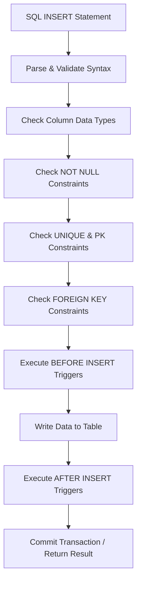

## `INSERT INTO`: Adding new rows
### Core Concepts
*   **Purpose**: `INSERT INTO` is a SQL statement used to add one or more new rows (records) into a specified table within a database.
*   **Basic Syntax (Single Row)**:
    ```sql
    INSERT INTO table_name (column1, column2, column3, ...)
    VALUES (value1, value2, value3, ...);
    ```
    *   The order of `values` must match the order of `columns` listed.
    *   Values must be compatible with the data types of their respective columns.
*   **Basic Syntax (All Columns)**: If inserting values for *all* columns in the table in their *default declared order*, the column list can be omitted (though often discouraged for robustness):
    ```sql
    INSERT INTO table_name
    VALUES (value1, value2, value3, ...);
    ```

### Key Details & Nuances
*   **Explicit vs. Implicit Column Lists**:
    *   **Explicit (Recommended)**: Always specify columns (`INSERT INTO table (col1, col2)`). This makes statements resilient to schema changes (e.g., adding new columns) and clearer about which data goes where.
    *   **Implicit (All Columns)**: Omitting columns (`INSERT INTO table VALUES(...)`) requires *all* table columns to be provided values in their exact creation order. Fragile if schema changes.
*   **Handling Missing Values**:
    *   **`NULL`**: For nullable columns, you can explicitly insert `NULL`.
    *   **`DEFAULT`**: Use the `DEFAULT` keyword to insert the column's default value.
    *   **Omitting Columns**: If a column is omitted from the column list, and it's either `NULLABLE` or has a `DEFAULT` value, the database will use `NULL` or the default value, respectively. `NOT NULL` columns without a default *must* be included.
*   **Auto-increment/Identity Columns**: Columns defined with auto-incrementing properties (e.g., `SERIAL` in PostgreSQL, `AUTO_INCREMENT` in MySQL, `IDENTITY` in SQL Server) are typically *omitted* from the `INSERT` statement's column list and `VALUES` clause, allowing the database to generate the value.
*   **Constraint Checks**: Before a row is permanently added, the database enforces various constraints:
    *   `NOT NULL`: Ensures required columns receive a value.
    *   `PRIMARY KEY`: Ensures uniqueness and non-nullability for the primary key.
    *   `UNIQUE`: Ensures uniqueness for specified columns.
    *   `FOREIGN KEY`: Ensures referential integrity by checking if the foreign key value exists in the referenced table.
    *   `CHECK`: Enforces domain integrity based on a boolean expression.
*   **Transactionality**: `INSERT` operations are typically atomic and occur within database transactions. If an `INSERT` fails (e.g., due to constraint violation), the entire operation within the current transaction can be rolled back.

### Practical Examples

**1. Basic Single Row Insertion**
```sql
INSERT INTO Products (ProductID, ProductName, Price, StockQuantity)
VALUES (101, 'Laptop Pro', 1200.00, 50);
```

**2. Inserting with Default Values / Omitting Auto-increment**
Assume `ProductID` is `AUTO_INCREMENT` and `StockQuantity` has a `DEFAULT` of `0`.
```sql
INSERT INTO Products (ProductName, Price)
VALUES ('Gaming Mouse', 75.50);
-- ProductID will be auto-generated, StockQuantity will be 0
```

**3. Inserting Multiple Rows (Single Statement)**
```sql
INSERT INTO Customers (CustomerID, FirstName, LastName, Email)
VALUES
    (1, 'Alice', 'Smith', 'alice.s@example.com'),
    (2, 'Bob', 'Johnson', 'bob.j@example.com'),
    (3, 'Charlie', 'Brown', 'charlie.b@example.com');
```

**4. Inserting Rows from a `SELECT` Statement (Batch Insertion)**
This is highly efficient for populating tables or archiving data.
```sql
-- Create an 'ArchivedProducts' table with a similar schema to 'Products'
INSERT INTO ArchivedProducts (ProductID, ProductName, Price, StockQuantity, ArchiveDate)
SELECT ProductID, ProductName, Price, StockQuantity, CURRENT_DATE
FROM Products
WHERE StockQuantity = 0;
```

**5. Flow of an `INSERT` Operation (Simplified)**


### Common Pitfalls & Trade-offs
*   **Omitting Column Names**: While convenient for simple cases, it makes the `INSERT` statement brittle. If a new column is added to the table, or the column order changes, the statement will break or insert incorrect data. Always specify columns unless truly trivial.
*   **Data Type Mismatches**: Providing a value that cannot be implicitly converted to the target column's data type will result in an error.
*   **Constraint Violations**: Attempting to insert a row that violates any table constraint (e.g., duplicate primary key, non-existent foreign key, `NULL` into `NOT NULL` column) will cause the `INSERT` operation to fail.
*   **Performance of Single vs. Batch Inserts**: Inserting rows one-by-one in separate statements (e.g., in a loop from application code) incurs high network overhead and transactional costs. For large datasets, using `INSERT INTO ... VALUES (...), (...), ...` or `INSERT INTO ... SELECT` is significantly more efficient as it reduces round-trips and allows the database to optimize.

### Interview Questions
1.  **Question**: Explain the difference between `INSERT INTO table VALUES (...)` and `INSERT INTO table (col1, col2) VALUES (...)`. When would you choose one over the other?
    **Answer**: The first form inserts values into *all* columns in their default order. It's concise but brittle; if the table schema changes (e.g., a new column is added), the statement will break. The second form explicitly names the columns to insert into. This is safer and more robust, as it's unaffected by schema changes to other columns or their order. Always prefer the explicit form for production code, unless dealing with very small, stable tables or quick ad-hoc inserts.
2.  **Question**: How would you insert multiple rows into a table efficiently using a single `INSERT` statement? Provide an example.
    **Answer**: You can insert multiple rows by listing multiple `VALUES` tuples separated by commas, or by using an `INSERT INTO ... SELECT` statement. The `VALUES` syntax is good for a fixed, small set of rows. `INSERT INTO ... SELECT` is ideal for populating a table from the results of a query on another table, offering much better performance for large datasets than individual `INSERT` statements.
    *Example `VALUES`*: `INSERT INTO Users (Name, Email) VALUES ('A', 'a@e.com'), ('B', 'b@e.com');`
    *Example `SELECT`*: `INSERT INTO AuditLog SELECT * FROM OldLogs WHERE LogDate < '2023-01-01';`
3.  **Question**: Describe how `INSERT` operations interact with database constraints (e.g., `PRIMARY KEY`, `FOREIGN KEY`, `NOT NULL`). What happens if a constraint is violated?
    **Answer**: During an `INSERT`, the database checks all relevant constraints (e.g., `NOT NULL` for required columns, `UNIQUE`/`PRIMARY KEY` for uniqueness, `FOREIGN KEY` for referential integrity, `CHECK` for domain-specific rules). If any constraint is violated, the `INSERT` operation will fail, and the database will typically raise an error, preventing the invalid row from being added to the table. The entire transaction containing the `INSERT` might be rolled back, depending on the error handling.
4.  **Question**: When might you use `INSERT INTO ... SELECT`? Provide a practical scenario.
    **Answer**: `INSERT INTO ... SELECT` is used when you need to populate a table with data derived directly from an existing query result. Practical scenarios include:
    *   **Archiving Data**: Moving old or inactive data from a "hot" table to an "archive" table.
    *   **Populating a Staging Table**: Loading transformed data from a source table into an intermediate staging table before final processing.
    *   **Data Migration/Transformation**: Copying and transforming data from one schema or table structure to another.
    *   **Creating Reports/Snapshots**: Generating a snapshot of current data for reporting purposes.
5.  **Question**: What are the performance considerations when inserting a large number of rows? How would you optimize this?
    **Answer**:
    *   **Performance Hit**: Inserting rows one-by-one (single `INSERT` statements in a loop) is inefficient due to high network latency (multiple round-trips to the DB) and transactional overhead (each `INSERT` might imply a mini-transaction or commit).
    *   **Optimization Strategies**:
        *   **Batch Inserts**: Use `INSERT INTO ... VALUES (...), (...), ...` to send multiple rows in a single statement.
        *   **`INSERT INTO ... SELECT`**: For inserting from another table, this is highly optimized as it avoids transferring data to the client and back to the server.
        *   **Disable Indexes/Constraints (Temporarily)**: For very large bulk loads, temporarily dropping non-unique indexes and disabling non-essential constraints (like foreign keys) before insertion and rebuilding/enabling them after can speed up the process significantly, as the database doesn't need to update/check them per row. Requires careful re-validation.
        *   **Transactions**: Wrap multiple inserts in a single transaction. This reduces commit overhead and ensures atomicity.
        *   **Loading Tools**: Use database-specific bulk loading utilities (e.g., `COPY` in PostgreSQL, `LOAD DATA INFILE` in MySQL, `BULK INSERT` in SQL Server) which are often the fastest.