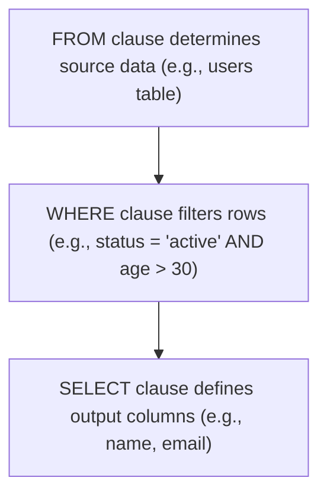

## `SELECT, FROM, WHERE`: Basic data retrieval and filtering
### Core Concepts
*   **`SELECT`**: Specifies which columns (or expressions) to retrieve from the dataset.
    *   `SELECT *`: Retrieves all columns. Generally discouraged in production code due to performance and maintenance issues.
    *   `SELECT column1, column2`: Retrieves specific columns.
    *   `SELECT DISTINCT column1`: Retrieves unique values from `column1`.
*   **`FROM`**: Indicates the table or view from which data will be retrieved. This is the starting point of data access.
*   **`WHERE`**: Filters the rows returned by the `FROM` clause based on specified conditions. Only rows for which the condition evaluates to `TRUE` are included in the result set.

### Key Details & Nuances
*   **Logical Processing Order**: SQL queries are logically processed in a specific order, which is crucial for understanding how clauses interact:
    1.  `FROM`: Identifies the source tables/views and determines the raw dataset.
    2.  `WHERE`: Filters rows from the dataset produced by `FROM`.
    3.  `SELECT`: Specifies which columns to include in the final result set from the filtered rows.
    This order means column aliases defined in `SELECT` cannot be directly referenced in the `WHERE` clause.
*   **Case Sensitivity**: Database (and OS) dependent for table/column names and string comparisons in `WHERE` clauses. Standard SQL is case-insensitive for keywords.
*   **`NULL` Handling**:
    *   `NULL` represents an unknown or missing value. It is **not** equal to zero or an empty string.
    *   Comparisons with `NULL` using standard operators (`=`, `<`, `>`) always result in `UNKNOWN` (which behaves like `FALSE` in `WHERE` clauses).
    *   Use `IS NULL` or `IS NOT NULL` to check for `NULL` values.
    *   `NULL` values in `IN` or `NOT IN` clauses can lead to unexpected results; `NULL` elements effectively make the condition `UNKNOWN`.
*   **Operators in `WHERE`**:
    *   **Comparison**: `=`, `!=`/`<>`, `>`, `<`, `>=`, `<=`.
    *   **Logical**: `AND`, `OR`, `NOT`. Parentheses `()` for precedence.
    *   **Range**: `BETWEEN value1 AND value2` (inclusive).
    *   **Set Membership**: `IN (value1, value2, ...)` and `NOT IN`.
    *   **Pattern Matching**: `LIKE 'pattern'`, `NOT LIKE 'pattern'`.
        *   `%`: Matches zero or more characters.
        *   `_`: Matches exactly one character.
    *   **Existence**: `EXISTS` (for subqueries, though less common with basic `SELECT/FROM/WHERE`).

### Practical Examples

**1. Basic Data Retrieval and Filtering**

```sql
-- Retrieve the name and email of active users older than 30
SELECT name, email
FROM users
WHERE status = 'active' AND age > 30;
```

**2. Using `LIKE`, `IN`, and Column Aliases**

```sql
-- Select product ID, name, and current stock for products
-- that contain 'Widget' in their name OR are in the 'Electronics' or 'Tools' category,
-- and have more than 10 units in stock.
SELECT
    product_id AS "ProductID",
    product_name AS "ItemName",
    stock_quantity AS "CurrentStock"
FROM
    products
WHERE
    (product_name LIKE '%Widget%' OR category IN ('Electronics', 'Tools'))
    AND stock_quantity > 10;
```

**3. Logical Order of Operations (Conceptual Flow)**



### Common Pitfalls & Trade-offs
*   **Using `SELECT *`**:
    *   **Pitfall**: Retrieves all columns, even unneeded ones. This increases network traffic, memory consumption, and potentially disk I/O. If table structure changes (e.g., new large columns are added), your application's performance might degrade unexpectedly.
    *   **Trade-off**: Convenience vs. Performance/Maintainability. Useful for quick ad-hoc queries, but specify columns explicitly in production code.
*   **Inefficient `WHERE` clauses**:
    *   **Pitfall**: Applying functions to columns in the `WHERE` clause (e.g., `WHERE YEAR(order_date) = 2023`) prevents the database from using indexes on that column, leading to full table scans.
    *   **Trade-off**: Readability vs. Index Utilization. Rewrite conditions to be "sargable" (Search Argument Able) when possible (e.g., `WHERE order_date BETWEEN '2023-01-01' AND '2023-12-31'`).
*   **Misunderstanding `NULL`**:
    *   **Pitfall**: Using `=` or `!=` with `NULL` (e.g., `WHERE email = NULL`) will never return true (or false), resulting in empty sets or unexpected filtering.
    *   **Trade-off**: Correctness vs. Intuition. Always use `IS NULL` or `IS NOT NULL`.

### Interview Questions
1.  **Question**: Explain the logical order of execution for `FROM`, `WHERE`, and `SELECT` clauses in a basic SQL query. Why is this order important?
    **Answer**: The logical order is `FROM` -> `WHERE` -> `SELECT`. `FROM` identifies the source data. `WHERE` then filters rows from *that source data*. Finally, `SELECT` determines which columns from the *filtered rows* are included in the result. This order is crucial because it dictates which operations can be performed at each stage (e.g., column aliases defined in `SELECT` are not available in `WHERE` because `WHERE` runs first).
2.  **Question**: When should you use `SELECT *` versus specifying individual column names? Discuss the trade-offs.
    **Answer**: Use `SELECT *` for quick, ad-hoc exploration or when prototyping if you truly need all columns and performance isn't critical. For production code, always specify individual column names. The trade-offs are convenience vs. performance, network overhead, and maintainability. `SELECT *` can lead to retrieving unnecessary data, breaking applications if table schemas change, and less optimized query plans.
3.  **Question**: How do you handle `NULL` values in a `WHERE` clause, particularly when checking for equality or non-equality? Provide an example.
    **Answer**: `NULL` represents an unknown value, so standard comparison operators (`=`, `!=`, `>`, `<`) will evaluate to `UNKNOWN` when compared with `NULL`, effectively excluding the row from the result. Instead, use `IS NULL` or `IS NOT NULL`. For example, `WHERE email IS NULL` or `WHERE status IS NOT NULL`.
4.  **Question**: You need to find all customers whose last name starts with 'Smith' or contains 'son'. How would you write the `WHERE` clause for this, and what common pitfall should you be aware of if your database is case-sensitive?
    **Answer**: `WHERE last_name LIKE 'Smith%' OR last_name LIKE '%son%'`. If the database is case-sensitive, `LIKE` would also be case-sensitive. To ensure case-insensitivity, one might use a function like `LOWER(last_name) LIKE 'smith%'` or database-specific functions/collations, which could inhibit index usage.
5.  **Question**: Describe a scenario where a seemingly simple `WHERE` clause could lead to poor query performance, and suggest a way to optimize it.
    **Answer**: A common scenario is applying a function to an indexed column in the `WHERE` clause, e.g., `WHERE DATE(order_timestamp) = '2023-01-01'` if `order_timestamp` is indexed. This prevents the database from using the index effectively, leading to a full table scan. Optimization involves rewriting the condition to be "sargable", such as `WHERE order_timestamp >= '2023-01-01 00:00:00' AND order_timestamp < '2023-01-02 00:00:00'`.