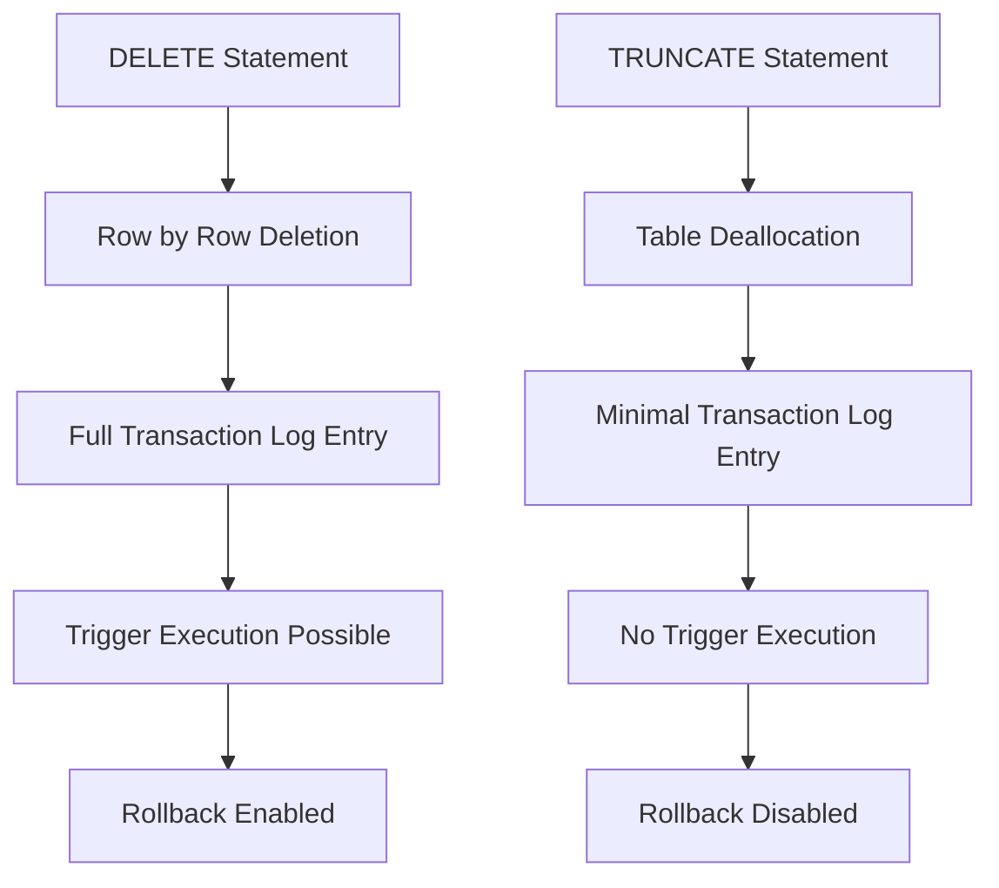

## `TRUNCATE` vs. `DELETE`: Key differences
### Core Concepts

*   **`DELETE` (Data Manipulation Language - DML):** A DML command used to remove rows from a table.
    *   Can include a `WHERE` clause to specify which rows to delete.
    *   If no `WHERE` clause is provided, all rows are removed.
*   **`TRUNCATE` (Data Definition Language - DDL):** A DDL command used to remove all rows from a table, effectively resetting the table to its initial empty state.
    *   Cannot include a `WHERE` clause.
    *   Operates on the table as a whole, not individual rows.

### Key Details & Nuances

*   **Transactionality & Rollback:**
    *   `DELETE`: Is a transactional operation. It can be wrapped in a `BEGIN TRANSACTION`/`COMMIT`/`ROLLBACK` block. Changes are recorded in the transaction log, allowing rollback.
    *   `TRUNCATE`: Is typically a non-transactional or minimally logged operation. It usually *cannot* be rolled back (though some database systems like PostgreSQL allow it within a transaction block, it's still less granular).
*   **Logging:**
    *   `DELETE`: Performs row-by-row logging. Each deleted row's record is written to the transaction log. This ensures recoverability and rollback capability but can be slow for large tables.
    *   `TRUNCATE`: Performs minimal logging. It deallocates data pages rather than logging individual row deletions. This makes it significantly faster, especially for large tables, but sacrifices granular recoverability.
*   **Performance:**
    *   `DELETE`: Slower for large tables due to row-by-row logging and processing.
    *   `TRUNCATE`: Much faster for large tables as it deallocates entire data pages.
*   **Space Reclamation:**
    *   `DELETE`: May not immediately reclaim disk space. The space might be marked as reusable but not released back to the operating system until other operations occur (e.g., table rebuilds).
    *   `TRUNCATE`: Typically reclaims disk space immediately by deallocating pages associated with the table.
*   **Identity/Auto-increment Columns:**
    *   `DELETE`: Does **not** reset the identity (auto-increment) counter. The next inserted row will continue from the last generated ID.
    *   `TRUNCATE`: **Resets** the identity (auto-increment) counter to its seed value. The next inserted row will start from 1 (or the configured seed).
*   **Triggers:**
    *   `DELETE`: Fires `DELETE` triggers (e.g., `FOR EACH ROW` triggers).
    *   `TRUNCATE`: Does **not** fire `DELETE` triggers because it's a DDL operation that bypasses row-level processing.
*   **Permissions:**
    *   `DELETE`: Requires `DELETE` permission on the table.
    *   `TRUNCATE`: Typically requires `DROP` permission on the table, `ALTER` permission, or ownership of the table, as it's a DDL command.

### Practical Examples

```sql
-- Assuming a table named 'Products' with an 'id' (auto-increment) and 'name' column

-- 1. DELETE specific rows
DELETE FROM Products
WHERE id = 5;

-- 2. DELETE all rows (equivalent to TRUNCATE functionally, but different internally)
DELETE FROM Products;

-- 3. TRUNCATE the table
TRUNCATE TABLE Products;
-- After this, the 'id' auto-increment sequence will reset.
```



### Common Pitfalls & Trade-offs

*   **Accidental Irreversible Data Loss:** Using `TRUNCATE` when `DELETE` with `ROLLBACK` was intended can lead to unrecoverable data loss in systems not allowing `TRUNCATE` rollback.
*   **Performance vs. Granularity:** Choosing `DELETE` for performance-critical scenarios on large tables (when all rows need removing) is a common mistake; `TRUNCATE` is superior here. Conversely, using `TRUNCATE` when row-level triggers or rollback are essential will lead to incorrect behavior.
*   **Identity Column Mismatch:** Forgetting that `TRUNCATE` resets identity columns can lead to duplicate keys or unexpected ID sequences if not planned for.
*   **Ignoring Transaction Logs:** Overlooking the heavy I/O implications of `DELETE` on transaction logs for very large tables, potentially leading to performance bottlenecks or log file growth issues.

### Interview Questions

1.  **When would you prefer `TRUNCATE` over `DELETE`?**
    *   **Answer:** Prefer `TRUNCATE` when you need to remove *all* rows from a table, want the fastest possible performance (especially for large tables), need to reclaim disk space immediately, and do not need to roll back the operation or fire `DELETE` triggers. It's also ideal when you want to reset auto-incrementing identity columns.

2.  **Can `TRUNCATE` be rolled back? Explain why or why not.**
    *   **Answer:** Generally, `TRUNCATE` cannot be rolled back in most RDBMS (like SQL Server or MySQL's InnoDB outside a transaction block for SQL Server). This is because it's a DDL operation that deallocates data pages with minimal logging, rather than logging individual row deletions. Some RDBMS (e.g., PostgreSQL, Oracle) do allow `TRUNCATE` within an explicit transaction block to be rolled back, but it's still distinct from `DELETE`'s row-level logging and rollback. The key is its DDL nature and minimal logging.

3.  **How do `TRUNCATE` and `DELETE` (without a `WHERE` clause) affect auto-incrementing IDs?**
    *   **Answer:** `DELETE` (even without a `WHERE` clause, removing all rows) does **not** reset the auto-increment (identity) counter; the next insert will continue from the highest previous ID plus one. `TRUNCATE` **resets** the auto-increment counter to its seed value, meaning the next inserted row will typically get `1` (or the configured starting value) as its ID.

4.  **Discuss the impact on triggers for both commands.**
    *   **Answer:** `DELETE` is a DML command that processes rows individually, thus it **fires** any `FOR EACH ROW` (or `AFTER`/`BEFORE`) `DELETE` triggers defined on the table. `TRUNCATE` is a DDL command that deallocates entire data pages and bypasses row-level processing, so it **does not fire** `DELETE` triggers. This is a critical distinction for data integrity and application logic.

5.  **Explain the difference in locking mechanisms and transaction log usage between `TRUNCATE` and `DELETE`.**
    *   **Answer:** `DELETE` acquires row-level or page-level locks, depending on the number of rows and isolation level, and records each deleted row in the transaction log. This leads to higher overhead in terms of locking and log space, but allows granular rollback. `TRUNCATE` typically acquires an exclusive table lock (or schema lock) for the duration of the operation. It logs the deallocation of data pages rather than individual rows, resulting in significantly less transaction log usage and faster execution, but at the cost of granular rollback.