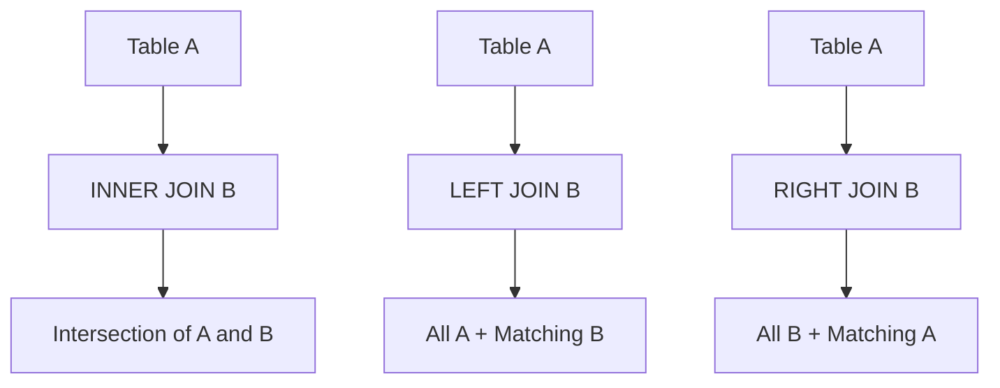

## JOINs: `INNER`, `LEFT`/`RIGHT` `OUTER`
### Core Concepts

*   **Relational Joins:** Operations that combine rows from two or more tables based on a related column between them. They are fundamental for querying normalized relational databases.
*   **`INNER JOIN`**:
    *   Returns only the rows where there is a match in *both* tables based on the join condition.
    *   Effectively filters out rows from either table that do not have a corresponding entry in the other.
*   **`LEFT (OUTER) JOIN`**:
    *   Returns all rows from the *left* table (the first table specified in the `FROM` clause) and the matching rows from the *right* table.
    *   If there is no match in the right table, `NULL` values are returned for the columns of the right table.
    *   Often used to find "missing" data (e.g., customers without orders).
*   **`RIGHT (OUTER) JOIN`**:
    *   Returns all rows from the *right* table (the second table specified in the `FROM` clause) and the matching rows from the *left* table.
    *   If there is no match in the left table, `NULL` values are returned for the columns of the left table.
    *   Functionally symmetric to `LEFT JOIN`; a `RIGHT JOIN B ON C` can usually be rewritten as `B LEFT JOIN A ON C`. `LEFT JOIN` is generally preferred for readability and consistency.

### Key Details & Nuances

*   **Join Condition (`ON` vs. `USING`)**:
    *   `ON <condition>`: The most common and flexible way to specify join conditions. Allows complex conditions (e.g., `A.id = B.id AND A.status = 'active'`).
    *   `USING (column_name)`: A shorthand when joining on identically named columns in both tables. Less flexible than `ON` but can be cleaner for simple equality joins. E.g., `FROM TableA JOIN TableB USING (ID)`.
*   **Null Handling in Outer Joins**: Non-matching rows from the non-retained side of an `OUTER JOIN` will have `NULL` values for columns from that table. This is crucial for filtering and understanding results.
*   **Performance Considerations**:
    *   **Indexing**: Efficient joins heavily rely on appropriate indexes (B-tree indexes are common) on the join columns. Without indexes, a full table scan may be required for one or both tables (e.g., nested loops, hash joins, merge joins), which can be very slow.
    *   **Join Order**: The order of tables in complex multi-join queries can sometimes impact performance, as the query optimizer chooses an execution plan.
    *   **Cardinality**: Joining high-cardinality columns (many unique values) generally benefits more from indexing than low-cardinality columns.
*   **`FULL OUTER JOIN` (Implicit)**: Although not explicitly in the prompt, `FULL OUTER JOIN` returns all rows when there is a match in either the left or right table. If there's no match, `NULL`s are returned for the side without a match. It's the union of `LEFT JOIN` and `RIGHT JOIN` results.

### Practical Examples

Consider two tables:
*   `Customers`: `CustomerID (PK)`, `Name`
*   `Orders`: `OrderID (PK)`, `CustomerID (FK)`, `OrderDate`, `Amount`

```sql
-- INNER JOIN: Get customers who have placed at least one order.
-- Returns only rows where CustomerID exists in both tables.
SELECT
    c.CustomerID,
    c.Name,
    o.OrderID,
    o.OrderDate
FROM
    Customers c
INNER JOIN
    Orders o ON c.CustomerID = o.CustomerID;

-- LEFT JOIN: Get all customers and their orders.
-- If a customer has no orders, their order columns will be NULL.
SELECT
    c.CustomerID,
    c.Name,
    o.OrderID,
    o.OrderDate
FROM
    Customers c
LEFT JOIN
    Orders o ON c.CustomerID = o.CustomerID;

-- RIGHT JOIN: Get all orders and the customer who placed them.
-- If an order has no matching customer (e.g., data inconsistency), customer columns will be NULL.
SELECT
    c.CustomerID,
    c.Name,
    o.OrderID,
    o.OrderDate
FROM
    Customers c
RIGHT JOIN
    Orders o ON c.CustomerID = o.CustomerID;
```

**Conceptual Diagram of Join Types:**



### Common Pitfalls & Trade-offs

*   **Accidental Cartesian Product**: Forgetting a `JOIN ON` condition results in a Cartesian product (every row from table A joined with every row from table B), leading to massive, incorrect result sets and potential system crashes.
*   **Misinterpreting `NULL`s**: Not understanding that `OUTER JOIN`s produce `NULL`s for non-matching columns can lead to incorrect filtering (e.g., `WHERE o.OrderID IS NULL` in a `LEFT JOIN` to find customers without orders) or data analysis.
*   **Performance Degradation**:
    *   Joining on unindexed columns or columns with low selectivity can force full table scans.
    *   Excessive use of `OUTER JOIN`s can be slower than `INNER JOIN`s, especially if not needed, due to the need to process non-matching rows.
*   **Overuse of `RIGHT JOIN`**: While syntactically valid, `RIGHT JOIN` can often be rewritten as a `LEFT JOIN` by swapping table order. Sticking to `LEFT JOIN` for consistency generally improves code readability and maintainability.

### Interview Questions

1.  **Question**: Explain the fundamental difference between `INNER JOIN` and `LEFT JOIN` with a real-world example.
    *   **Answer**: `INNER JOIN` returns only rows where there is a match in *both* tables based on the join condition. It's like finding the intersection. For example, finding all customers who *have placed* an order. `LEFT JOIN`, on the other hand, returns *all* rows from the left table and matching rows from the right table; if no match exists in the right table, `NULL` values are returned for the right table's columns. This is useful for finding customers *and* their orders, including those who have placed no orders (who would show `NULL` for order details).

2.  **Question**: When would you choose a `RIGHT JOIN` over a `LEFT JOIN`, or vice versa? Is there a common preference?
    *   **Answer**: Functionally, a `RIGHT JOIN` can always be rewritten as a `LEFT JOIN` by simply swapping the order of the tables in the `FROM` clause. For example, `A RIGHT JOIN B ON A.id = B.id` is equivalent to `B LEFT JOIN A ON A.id = B.id`. Due to this equivalency, `LEFT JOIN` is generally preferred in practice for consistency and readability across teams and codebases, as most developers read SQL queries left-to-right. There's rarely a technical reason to prefer `RIGHT JOIN`.

3.  **Question**: You perform a `LEFT JOIN` between `Customers` and `Orders`. How would you find all customers who have *never* placed an order using the result of this join?
    *   **Answer**: After performing the `LEFT JOIN` (e.g., `SELECT c.Name, o.OrderID FROM Customers c LEFT JOIN Orders o ON c.CustomerID = o.CustomerID`), customers who have no matching orders will have `NULL` values in the `o.OrderID` column (or any other column from the `Orders` table). Therefore, you would add a `WHERE` clause: `WHERE o.OrderID IS NULL`.

4.  **Question**: What are the key performance considerations when working with `JOIN` operations on large tables, and how would you optimize them?
    *   **Answer**: The primary performance consideration is the absence or inefficiency of **indexes** on the join columns. Without indexes, the database may resort to full table scans, leading to very slow execution.
        *   **Optimization**: Ensure appropriate B-tree indexes are created on columns used in `ON` clauses (often foreign keys).
        *   **Join Order**: For complex multi-table joins, the database's query optimizer usually determines the most efficient join order, but sometimes hints or query rewrites can help.
        *   **Filtering Early**: Apply `WHERE` clause filters *before* joins if possible, to reduce the number of rows being joined.
        *   **Limit Columns**: Select only the necessary columns to reduce data transfer.
        *   **Understand Data Distribution**: Skewed data or very low cardinality columns can sometimes affect index efficiency.