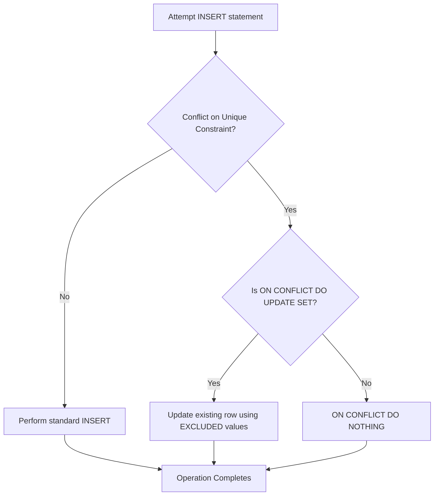

## `INSERT ... ON CONFLICT` (Upsert)
### Core Concepts
*   **Upsert (Update or Insert):** `INSERT ... ON CONFLICT` (PostgreSQL syntax) is an atomic operation that attempts to insert a row. If the insertion would violate a unique constraint (e.g., a primary key or unique index), it instead executes an alternative action: either updates the existing row (`DO UPDATE SET`) or does nothing (`DO NOTHING`).
*   **Purpose:**
    *   **Atomicity:** Ensures that the insert and potential update occur as a single, indivisible operation, preventing race conditions inherent in a `SELECT` then `INSERT`/`UPDATE` sequence.
    *   **Concurrency:** Essential in multi-user environments to manage data consistency without complex locking mechanisms or retries.
    *   **Simplicity:** Provides a cleaner, more robust way to handle "item already exists" scenarios.

### Key Details & Nuances
*   **Conflict Target:** You must specify *which* unique constraint or column set should trigger the conflict action:
    *   `ON CONFLICT (column_name, ...)`: Targets a specific set of columns covered by a unique index.
    *   `ON CONFLICT ON CONSTRAINT constraint_name`: Targets a named unique constraint.
    *   If omitted, PostgreSQL attempts to infer the unique index based on the columns in the `INSERT` statement, which can sometimes lead to unexpected behavior. Explicitly defining is best practice.
*   **`DO UPDATE SET` Clause:**
    *   Allows updating the existing row when a conflict occurs.
    *   **`EXCLUDED` Table:** A pseudo-table available within the `DO UPDATE SET` clause. It contains the values that *would have been inserted* if there were no conflict. This is crucial for updating the existing row with the *new* data.
    *   **`WHERE` Clause:** Can be added to `DO UPDATE SET` to apply the update only if additional conditions are met. If the `WHERE` condition is false, the row is not updated.
*   **`DO NOTHING` Clause:**
    *   If a conflict occurs, the operation simply does nothing, and the existing row remains unchanged. Useful when you only care about inserting new records and want to silently ignore duplicates.
*   **Atomic Operation:** The entire `INSERT ... ON CONFLICT` statement is executed as a single, atomic operation within the database, guaranteeing data integrity even under high concurrency.
*   **`RETURNING` Clause:** Can be used to return the full row (either inserted or updated) after the operation completes.

### Practical Examples

```sql
-- Assume a 'users' table exists with a UNIQUE constraint on 'email'
CREATE TABLE users (
    id SERIAL PRIMARY KEY,
    name VARCHAR(255) NOT NULL,
    email VARCHAR(255) UNIQUE NOT NULL,
    last_login TIMESTAMP DEFAULT CURRENT_TIMESTAMP,
    login_count INT DEFAULT 1
);

-- Example 1: INSERT with DO UPDATE SET (Upserting a user)
-- If 'john.doe@example.com' exists, update their name, last_login, and increment login_count.
-- Otherwise, insert a new user.
INSERT INTO users (name, email) VALUES ('John Doe', 'john.doe@example.com')
ON CONFLICT (email) DO UPDATE SET
    name = EXCLUDED.name, -- Update name to the new name provided
    last_login = NOW(),    -- Update last login to current timestamp
    login_count = users.login_count + 1 -- Increment existing login_count
RETURNING id, name, email, login_count;

-- Example 2: INSERT with DO NOTHING (Ignoring duplicates)
-- If 'jane.doe@example.com' exists, do nothing.
-- Otherwise, insert a new user.
INSERT INTO users (name, email) VALUES ('Jane Doe', 'jane.doe@example.com')
ON CONFLICT (email) DO NOTHING
RETURNING id, name, email; -- RETURNING will only yield a row if an INSERT occurred
```



### Common Pitfalls & Trade-offs
*   **Performance:** While atomic, an `UPSERT` can sometimes be marginally slower than a simple `INSERT` or `UPDATE` because it involves conflict detection logic. However, it's generally *faster and safer* than a client-side `SELECT` then `INSERT`/`UPDATE` due to reduced network round trips and atomicity.
*   **Implicit Conflict Target:** Forgetting to specify the `ON CONFLICT (column_name)` or `ON CONSTRAINT` clause. The database might default to the primary key or pick an unexpected unique index, leading to incorrect behavior. Always be explicit.
*   **`EXCLUDED` Misunderstanding:** Incorrectly using `users.name` instead of `EXCLUDED.name` in the `DO UPDATE SET` clause when you intend to use the *new* value. `EXCLUDED` refers to the proposed new row, while table-qualified names (`users.name`) refer to the existing row.
*   **Database Specifics:** Be aware that `UPSERT` syntax varies significantly across SQL databases (e.g., MySQL uses `ON DUPLICATE KEY UPDATE`, SQL Server uses `MERGE`). While the concept is similar, the implementation details are not portable.

### Interview Questions

1.  **Explain the core problem that `INSERT ... ON CONFLICT` solves, and how it addresses atomicity and concurrency concerns compared to a traditional `SELECT` then `INSERT`/`UPDATE` approach.**
    *   **Answer:** It solves the race condition inherent in checking for a record's existence then inserting/updating. A `SELECT` then `INSERT`/`UPDATE` is two operations, leaving a window for another transaction to modify the data between them. `ON CONFLICT` is a single, atomic database operation. The database handles the logic internally, typically by acquiring necessary locks (e.g., row-level locks on the conflicting row), ensuring that only one transaction can successfully operate on that row at a time without external coordination, thus preventing integrity violations and ensuring data consistency.

2.  **Describe the role of the `EXCLUDED` pseudo-table within an `ON CONFLICT DO UPDATE SET` clause. Provide a scenario where its usage is critical.**
    *   **Answer:** `EXCLUDED` represents the row that *would have been inserted* if there hadn't been a conflict. It allows you to access the values from the `INSERT` statement that triggered the conflict. Its usage is critical when you want to update the existing row with *new* data provided in the `INSERT` statement. For example, if you're upserting a user record where `email` is the unique key, and you want to update the `name` or `last_login` field based on the new `INSERT` values, you'd use `SET name = EXCLUDED.name, last_login = EXCLUDED.last_login` (or `NOW()` for `last_login`).

3.  **What are the prerequisites for using `INSERT ... ON CONFLICT` effectively? Can you use it on any column, or does it require specific database structures?**
    *   **Answer:** It requires a unique constraint to exist on the table, which could be a primary key, a unique index, or a unique constraint defined on one or more columns. The `ON CONFLICT` clause uses this constraint to detect whether an "insertion" would lead to a conflict. Without a unique constraint, the database would simply insert duplicate rows, and the `ON CONFLICT` logic would never be triggered.

4.  **Consider a scenario where you're implementing a leader board system. How would you use `INSERT ... ON CONFLICT` to update user scores, ensuring that if a user submits a score for the first time, it's inserted, and if they submit again, their score is updated only if it's higher?**
    *   **Answer:** Assuming a `leaderboard` table with `user_id` (unique key) and `score`:
        ```sql
        INSERT INTO leaderboard (user_id, score) VALUES (:new_user_id, :new_score)
        ON CONFLICT (user_id) DO UPDATE SET
            score = GREATEST(leaderboard.score, EXCLUDED.score)
        WHERE EXCLUDED.score > leaderboard.score; -- Optional: only update if new score is higher
        ```
        This uses `EXCLUDED.score` for the incoming score and `leaderboard.score` for the current score. The `WHERE` clause can further refine the update condition.

5.  **What are the potential performance implications or trade-offs of using `UPSERT` operations frequently in a high-concurrency system, compared to separate `SELECT` and `UPDATE`/`INSERT` statements managed by application logic?**
    *   **Answer:** `UPSERT` is generally preferred for high-concurrency because it's atomic, eliminating race conditions. While it might have a slightly higher overhead than a simple `INSERT` or `UPDATE` due to conflict detection, this is typically negligible compared to the overhead of multiple network round-trips for separate `SELECT`, `INSERT`, `UPDATE` operations and the complexity of managing application-level locking or retry logic for race conditions. The primary trade-off is often the database-specific syntax (less portable) and potentially harder debugging if the conflict logic is complex, but these are outweighed by the robustness and atomicity benefits in concurrent environments.