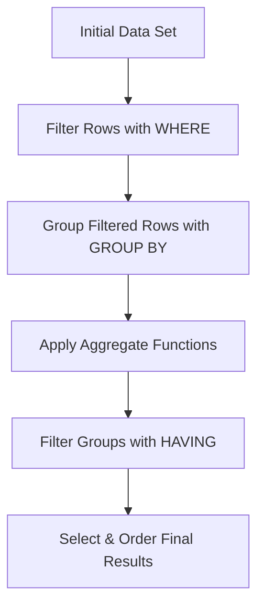

## Aggregate Functions (`COUNT`, `SUM`, `AVG`) with `GROUP BY`
### Core Concepts

*   **Aggregate Functions (`COUNT`, `SUM`, `AVG`)**: Functions that perform a calculation on a set of rows and return a single summary value.
    *   `COUNT()`: Returns the number of rows that match a specified criterion. `COUNT(*)` counts all rows, `COUNT(column)` counts non-NULL values, `COUNT(DISTINCT column)` counts unique non-NULL values.
    *   `SUM(column)`: Returns the total sum of a numeric column's values.
    *   `AVG(column)`: Returns the average value of a numeric column.
*   **`GROUP BY` Clause**: Used in conjunction with aggregate functions to group rows that have the same values in specified columns into summary rows. It allows you to perform calculations on each group independently.
    *   **Purpose**: To generate summary reports per category (e.g., total sales per product, average score per student).

### Key Details & Nuances

*   **Logical Order of Operations**: SQL queries are processed in a specific logical order, crucial for understanding `WHERE` vs. `HAVING`.
    1.  `FROM`
    2.  `WHERE` (filters individual rows *before* grouping)
    3.  `GROUP BY` (groups the filtered rows)
    4.  Aggregate Functions (calculated *after* grouping)
    5.  `HAVING` (filters groups *after* aggregation)
    6.  `SELECT`
    7.  `ORDER BY`
*   **`SELECT` List and `GROUP BY` Interaction**:
    *   Any non-aggregated column in the `SELECT` list **must** also appear in the `GROUP BY` clause. This ensures that for each group created, there's a unique value for that column.
    *   Aggregated columns (e.g., `SUM(sales)`) do *not* appear in the `GROUP BY` clause.
*   **`HAVING` vs. `WHERE`**:
    *   `WHERE`: Filters individual rows *before* they are grouped. Cannot use aggregate functions.
    *   `HAVING`: Filters groups *after* rows have been grouped and aggregate functions have been calculated. Can use aggregate functions.
*   **`NULL` Handling**:
    *   `SUM()`, `AVG()`, `COUNT(column)`: `NULL` values are ignored during calculation.
    *   `COUNT(*)`: Counts all rows, including those with `NULL` values in some columns.
*   **Performance**: `GROUP BY` operations can be resource-intensive, especially on large datasets, as they often involve sorting or hashing the data to form groups.

### Practical Examples

**Scenario:** We have a `Orders` table with columns `OrderID`, `CustomerID`, `OrderDate`, `Amount`, `Status`.

```sql
-- Table: Orders
-- +-----------+------------+------------+--------+----------+
-- | OrderID   | CustomerID | OrderDate  | Amount | Status   |
-- +-----------+------------+------------+--------+----------+
-- | 101       | 1          | 2023-01-05 | 100.00 | Completed|
-- | 102       | 2          | 2023-01-06 | 150.00 | Pending  |
-- | 103       | 1          | 2023-01-07 | 200.00 | Completed|
-- | 104       | 3          | 2023-01-07 |  50.00 | Cancelled|
-- | 105       | 2          | 2023-01-08 | 300.00 | Completed|
-- +-----------+------------+------------+--------+----------+

-- Example 1: Total amount and number of orders for each customer
SELECT
    CustomerID,
    SUM(Amount) AS TotalSpent,
    COUNT(OrderID) AS NumberOfOrders
FROM
    Orders
GROUP BY
    CustomerID
ORDER BY
    TotalSpent DESC;

-- Expected result for the sample data:
-- +------------+------------+----------------+
-- | CustomerID | TotalSpent | NumberOfOrders |
-- +------------+------------+----------------+
-- | 2          | 450.00     | 2              |
-- | 1          | 300.00     | 2              |
-- | 3          | 50.00      | 1              |
-- +------------+------------+----------------+

-- Example 2: Average order amount for customers who placed more than one order
SELECT
    CustomerID,
    AVG(Amount) AS AverageOrderAmount,
    COUNT(OrderID) AS NumberOfOrders
FROM
    Orders
WHERE
    Status = 'Completed' -- Filter rows before grouping
GROUP BY
    CustomerID
HAVING
    COUNT(OrderID) > 1 -- Filter groups after aggregation
ORDER BY
    AverageOrderAmount DESC;

-- Expected result for the sample data (considering only 'Completed' orders):
-- Customer 1: Orders (101, 103), Amounts (100, 200) -> Avg=150, Count=2
-- Customer 2: Orders (105), Amount (300) -> Avg=300, Count=1
-- Customer 3: No completed orders.
-- Result:
-- +------------+--------------------+----------------+
-- | CustomerID | AverageOrderAmount | NumberOfOrders |
-- +------------+--------------------+----------------+
-- | 1          | 150.00             | 2              |
-- +------------+--------------------+----------------+
```



### Common Pitfalls & Trade-offs

*   **Misunderstanding `WHERE` vs. `HAVING`**: A common mistake is trying to use `WHERE` to filter on an aggregate result (e.g., `WHERE SUM(Amount) > 1000`) or `HAVING` to filter individual rows. Remember their logical processing order.
*   **`SELECT` Clause Violation**: Forgetting that all non-aggregated columns in the `SELECT` list *must* be in the `GROUP BY` clause. This results in an error (e.g., "column `X` must appear in the `GROUP BY` clause or be used in an aggregate function").
*   **Performance on Large Datasets**: `GROUP BY` can be slow. Databases might need to sort the entire dataset to group it. Consider adding appropriate indexes on `GROUP BY` columns if performance is critical.
*   **`NULL` Ambiguity**: Forgetting that `COUNT(column_name)` excludes `NULL` values, whereas `COUNT(*)` includes them. This can lead to incorrect counts.
*   **Misuse of `DISTINCT`**: Using `DISTINCT` on an aggregate function (e.g., `SUM(DISTINCT column)`) can dramatically change the result and performance. Only use it when truly necessary to sum unique values.

### Interview Questions

1.  **Explain the difference between `WHERE` and `HAVING` clauses, and provide a scenario where you would use each.**
    *   **Answer**: `WHERE` filters individual rows *before* they are grouped and aggregates are calculated. It cannot use aggregate functions. `HAVING` filters groups of rows *after* they have been grouped and aggregates are calculated. It *can* use aggregate functions.
        *   **Scenario (`WHERE`)**: "Find all orders placed *before* a specific date and then group them." (`WHERE OrderDate < '2023-01-01'`)
        *   **Scenario (`HAVING`)**: "Find all customers whose *total order amount* exceeds $1000." (`HAVING SUM(Amount) > 1000`)

2.  **When using `GROUP BY`, what's the rule regarding columns in the `SELECT` statement that are not aggregate functions? Why does this rule exist?**
    *   **Answer**: Any non-aggregated column in the `SELECT` statement must also be present in the `GROUP BY` clause. This rule exists because `GROUP BY` collapses multiple rows into a single summary row for each group. If a non-aggregated column isn't in `GROUP BY`, the database wouldn't know which value to display for that column (as there might be multiple distinct values within the group). By including it in `GROUP BY`, you ensure that each "group" uniquely identifies the value for that column.

3.  **Describe how `NULL` values are handled by `COUNT(*)`, `COUNT(column_name)`, and `SUM(column_name)` aggregate functions.**
    *   **Answer**:
        *   `COUNT(*)`: Counts all rows in a group, regardless of `NULL` values in any column.
        *   `COUNT(column_name)`: Counts only the non-`NULL` values in the specified `column_name` within each group.
        *   `SUM(column_name)`: Ignores `NULL` values in the specified `column_name` when calculating the sum for each group. Only non-`NULL` numeric values contribute to the sum.

4.  **Imagine you have a large `Transactions` table. What performance considerations or optimizations might you think about when using `GROUP BY` on a column like `CustomerID`?**
    *   **Answer**: For a large table, `GROUP BY` can be slow because the database often needs to sort the entire dataset by the `GROUP BY` columns to bring identical values together.
        *   **Optimizations**:
            *   **Indexing**: Add an index to the `CustomerID` column. This can significantly speed up the grouping process by allowing the database to quickly locate and group related rows without a full table scan or sort.
            *   **Filtering First**: Use a `WHERE` clause to reduce the number of rows *before* `GROUP BY` processes them, minimizing the data set that needs grouping.
            *   **Materialized Views/Pre-aggregation**: For frequently accessed aggregated data, consider creating a materialized view that pre-calculates and stores the aggregated results, reducing query time.
            *   **Hardware**: Ensure sufficient memory (RAM) for sorting operations, as excessive disk I/O for temp files can degrade performance.