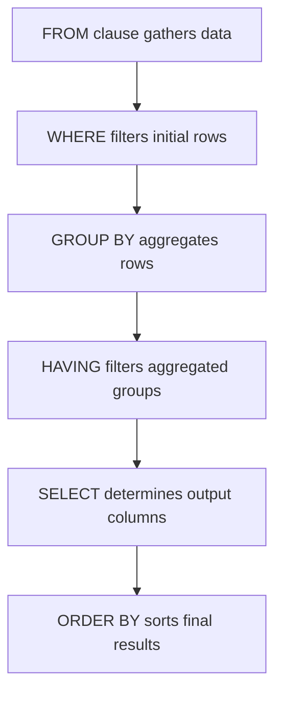

## Filtering Groups with `HAVING`
### Core Concepts

*   **Purpose:** `HAVING` is used to filter groups of rows, much like `WHERE` filters individual rows.
*   **Context:** It is always used in conjunction with the `GROUP BY` clause.
*   **Distinction from `WHERE`:**
    *   `WHERE` filters individual rows *before* aggregation (i.e., before `GROUP BY` is applied).
    *   `HAVING` filters aggregated groups *after* aggregation (i.e., after `GROUP BY` and aggregate functions have been computed).
*   **Key Capability:** `HAVING` can use aggregate functions (e.g., `COUNT()`, `SUM()`, `AVG()`, `MAX()`, `MIN()`) in its conditions, which `WHERE` cannot.

### Key Details & Nuances

*   **Logical Execution Order:** Understanding the order of operations is critical:
    1.  `FROM` / `JOIN` (determine data source)
    2.  `WHERE` (filter individual rows)
    3.  `GROUP BY` (group filtered rows into sets)
    4.  `HAVING` (filter these aggregated groups)
    5.  `SELECT` (choose which columns/expressions to output)
    6.  `ORDER BY` (sort the final result set)
*   **Access to Columns:**
    *   `WHERE` can access any column from the `FROM`/`JOIN` clause.
    *   `HAVING` can access:
        *   Aggregate function results (e.g., `COUNT(order_id) > 5`).
        *   Columns that are part of the `GROUP BY` clause (e.g., `GROUP BY department_id, department_name HAVING department_name = 'Sales'`).
*   **Efficiency:** Conditions that can be applied at the `WHERE` stage should generally be applied there, as it reduces the number of rows processed by `GROUP BY` and subsequent stages, leading to better performance. `HAVING` should only be used for conditions involving aggregate functions or properties of the grouped sets themselves.

### Practical Examples

**Scenario:** Find departments where the average employee salary is above $60,000 and there are more than 5 employees.

```sql
SELECT
    department_id,
    AVG(salary) AS avg_dept_salary,
    COUNT(employee_id) AS num_employees
FROM
    Employees
GROUP BY
    department_id
HAVING
    AVG(salary) > 60000 AND COUNT(employee_id) > 5
ORDER BY
    avg_dept_salary DESC;
```

**Query Processing Flow:**



### Common Pitfalls & Trade-offs

*   **Confusing `WHERE` and `HAVING`:** A common mistake is trying to use aggregate functions in `WHERE` or non-aggregated conditions (that could be in `WHERE`) in `HAVING`.
    *   **Anti-pattern:** `SELECT department_id FROM Employees WHERE COUNT(employee_id) > 5;` (Incorrect, `COUNT` cannot be in `WHERE`)
    *   **Anti-pattern:** `SELECT department_id, AVG(salary) FROM Employees GROUP BY department_id HAVING department_id = 10;` (While syntactically valid, `department_id = 10` should ideally be in `WHERE` for better performance as it filters before grouping).
*   **Performance:** Using `HAVING` for conditions that could be in `WHERE` often leads to less efficient queries because the filtering happens on a larger, already-aggregated dataset. Always push conditions as far left (earlier in the execution plan) as possible.
*   **Forgetting `GROUP BY`:** `HAVING` clauses require a preceding `GROUP BY` clause, unless the entire query is a single aggregate group (in which case `HAVING` acts on the entire result set, effectively replacing a `WHERE` clause on aggregates).

### Interview Questions

1.  **"Explain the fundamental difference between the `WHERE` clause and the `HAVING` clause in SQL, and when would you use one over the other?"**
    *   **Answer:** `WHERE` filters individual rows *before* grouping and aggregation. It cannot use aggregate functions. `HAVING` filters aggregated groups *after* grouping and aggregation, and *can* use aggregate functions. Use `WHERE` for row-level conditions; use `HAVING` for group-level conditions (especially those involving aggregates).

2.  **"Describe the logical order of operations for `SELECT` statements that include `FROM`, `WHERE`, `GROUP BY`, `HAVING`, and `ORDER BY` clauses. Why is this order important to understand?"**
    *   **Answer:** The logical order is `FROM/JOIN` -> `WHERE` -> `GROUP BY` -> `HAVING` -> `SELECT` -> `ORDER BY`. Understanding this order is crucial because it dictates when conditions are applied, what data is available at each stage, and critically impacts query performance and correctness. Filtering early with `WHERE` reduces the data volume for subsequent operations.

3.  **"Can you use a non-aggregated column in a `HAVING` clause? If so, under what circumstances?"**
    *   **Answer:** Yes, a non-aggregated column can be used in a `HAVING` clause if that column is also included in the `GROUP BY` clause. For example, `GROUP BY department_id, department_name HAVING department_name = 'Sales'`. However, for performance, if the condition on the non-aggregated column could be applied at the row level, it's generally better to use `WHERE`.

4.  **"You need to find customers who have placed at least 5 orders and whose total order value exceeds $1000. Write the SQL query snippet including `GROUP BY` and `HAVING`."**
    *   **Answer:**
        ```sql
        SELECT
            customer_id,
            COUNT(order_id) AS total_orders,
            SUM(order_value) AS total_value
        FROM
            Orders
        GROUP BY
            customer_id
        HAVING
            COUNT(order_id) >= 5 AND SUM(order_value) > 1000;
        ```