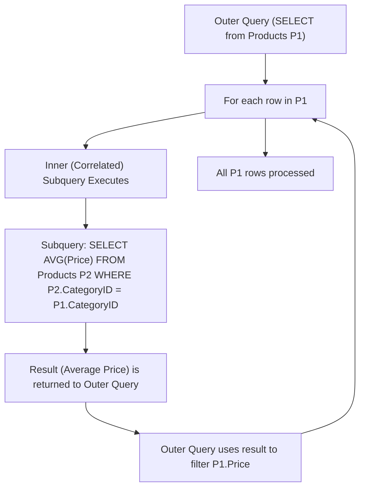

## Subqueries (Scalar, Multi-row, Correlated)
### Core Concepts

*   **Subquery (Inner Query / Nested Query):** A query nested inside another SQL query. It executes first, and its result is used by the outer query.
    *   Can return a single value, a single column of multiple rows, or multiple columns of multiple rows.
    *   Used in `SELECT` (as a column), `FROM` (as a derived table), `WHERE`/`HAVING` (for filtering), and `INSERT`/`UPDATE`/`DELETE` statements.
*   **Scalar Subquery:** Returns a single row and a single column (a single value).
    *   Can be used anywhere a single value is expected (e.g., `SELECT` list, `WHERE` clause comparison).
*   **Multi-row Subquery:** Returns one or more rows, typically a single column.
    *   Used with operators like `IN`, `NOT IN`, `ANY`, `ALL`, `EXISTS`, `NOT EXISTS` in `WHERE` or `HAVING` clauses.
*   **Correlated Subquery:** A subquery that depends on the outer query for its values. It executes once for each row processed by the outer query.
    *   Often used for row-by-row processing logic that cannot be easily achieved with simple joins.
    *   Can be significantly less performant than equivalent JOINs due to its iterative nature.

### Key Details & Nuances

*   **Purpose:** Subqueries allow for complex filtering, aggregation, and data manipulation that might be difficult or impossible with standard JOINs alone. They break down complex problems into smaller, manageable parts.
*   **Readability vs. Performance:**
    *   Subqueries, especially multi-row and correlated ones, can sometimes be less readable than equivalent JOINs, but also more intuitive for specific logic.
    *   Performance can be a major concern, particularly for correlated subqueries on large datasets, as they effectively iterate through the outer result set.
*   **Operators with Multi-row Subqueries:**
    *   `IN`/`NOT IN`: Checks if a value is present/not present in the set returned by the subquery. Handles `NULL` values in the subquery result set carefully (`NULL`s are ignored by `IN`, but `NOT IN` with a `NULL` in the subquery set will return no rows).
    *   `EXISTS`/`NOT EXISTS`: Checks for the existence of *any* rows returned by the subquery. Returns `TRUE` if the subquery returns at least one row, `FALSE` otherwise. Generally preferred over `IN` for performance with large subquery result sets because it can stop evaluating as soon as one row is found. Ignores `NULL`s in the subquery result set.
    *   `ANY`/`SOME`: Compares a value to *any* value in the subquery result set (e.g., `> ANY` means greater than at least one value).
    *   `ALL`: Compares a value to *all* values in the subquery result set (e.g., `> ALL` means greater than every value).
*   **Subquery in `FROM` (Derived Table/Inline View):** The subquery acts as a temporary table. This is often optimized well by database engines and can improve query organization.
*   **Subquery in `SELECT` (Scalar Subquery):** Adds a computed column to the result set. Can cause performance issues if the subquery is complex and executed for every row, similar to correlated subqueries.

### Practical Examples

```sql
-- Example 1: Scalar Subquery in SELECT clause
-- Get product name and the average price of all products in the same category
SELECT
    ProductName,
    Price,
    (SELECT AVG(Price) FROM Products WHERE CategoryID = P.CategoryID) AS AverageCategoryPrice
FROM
    Products AS P;

-- Example 2: Multi-row Subquery with IN in WHERE clause
-- Find customers who have placed orders
SELECT
    CustomerID,
    CustomerName
FROM
    Customers
WHERE
    CustomerID IN (SELECT DISTINCT CustomerID FROM Orders);

-- Example 3: Correlated Subquery (find products more expensive than the average in their category)
-- This subquery executes for each row of the outer Products table.
SELECT
    ProductName,
    Price,
    CategoryID
FROM
    Products P1
WHERE
    Price > (SELECT AVG(Price) FROM Products P2 WHERE P2.CategoryID = P1.CategoryID);
```



### Common Pitfalls & Trade-offs

*   **Performance Degradation with Correlated Subqueries:** The biggest pitfall. As the outer table grows, the number of subquery executions grows proportionally, leading to `O(N*M)` complexity in worst cases (N=outer rows, M=inner rows/complexity), often slower than well-indexed JOINs.
*   **`NULL` Handling with `IN`/`NOT IN`:**
    *   `A IN (SELECT B FROM ...)`: If the subquery returns `NULL`, `A IN (..., NULL, ...)` might not behave as expected. `IN` implicitly treats `NULL` as "unknown" and can cause unexpected results or exclude rows.
    *   `A NOT IN (SELECT B FROM ...)`: If the subquery result set contains *any* `NULL` value, the entire `NOT IN` condition will evaluate to `UNKNOWN` for all rows, resulting in no rows being returned by the outer query. Use `NOT EXISTS` or filter `NULL`s from the subquery if this is not desired.
*   **Readability vs. Complexity:** While subqueries can simplify specific logic, overuse or deeply nested subqueries can make queries very hard to read, debug, and maintain.
*   **Optimization Challenges:** Optimizers might struggle with complex subqueries, especially correlated ones, potentially leading to inefficient execution plans compared to equivalent JOINs.

### Interview Questions

1.  **What is a subquery, and what are the main types? Provide a scenario where each type would be useful.**
    *   **Answer:** A subquery is a query nested inside another SQL statement.
        *   **Scalar:** Returns a single value. Useful for adding a derived aggregate column (e.g., product price vs. category average) or single-value comparisons in `WHERE`.
        *   **Multi-row:** Returns multiple rows (typically one column). Useful for filtering based on a list of values (e.g., `IN`, `EXISTS`) from another table.
        *   **Correlated:** Depends on the outer query, executing per outer row. Useful for row-by-row comparisons or finding rows that relate to *themselves* within a group (e.g., finding employees who earn more than their department's average).

2.  **Explain the difference between `IN` and `EXISTS` when used with subqueries. When would you prefer one over the other, particularly regarding performance and `NULL` values?**
    *   **Answer:**
        *   `IN`: Checks if a value *equals* any value in the subquery's result set. The subquery is executed fully first to build the set. If the subquery returns `NULL`s, `IN` generally ignores them for comparison, but `NOT IN` will return no rows if the subquery returns any `NULL`.
        *   `EXISTS`: Checks if the subquery returns *any* rows. The subquery can stop executing as soon as the first row is found. It's often more performant than `IN` when the subquery returns a large number of rows because it doesn't need to build the full set. `EXISTS` inherently handles `NULL`s gracefully as it only cares about row existence, not values.
        *   **Preference:** `EXISTS` is generally preferred for performance when the subquery is large, or when `NULL` handling is a concern with `NOT IN`. `IN` might be more readable for smaller, fixed lists of values or when the distinct values are directly relevant to the comparison.

3.  **Describe a correlated subquery. What are its performance characteristics, and how might you refactor a query using a correlated subquery for better performance?**
    *   **Answer:** A correlated subquery is dependent on the outer query; it's re-executed for each row processed by the outer query. This makes its performance `O(N*M)` in the worst case (N = outer rows, M = inner query execution cost), which can be very slow for large datasets.
    *   **Refactoring:** Most correlated subqueries can be refactored into a `JOIN` (often `LEFT JOIN` or `INNER JOIN`) combined with `GROUP BY` and/or window functions. For example, finding products more expensive than their category's average can be done by joining `Products` with a subquery that calculates `AVG(Price) GROUP BY CategoryID`, or by using `AVG(Price) OVER (PARTITION BY CategoryID)`. This allows the average to be computed once per category instead of once per product row.

4.  **Can a subquery return multiple columns? If so, how can it be used, and what are the limitations?**
    *   **Answer:** Yes, a subquery can return multiple columns.
        *   **Usage:** Primarily when used in the `FROM` clause as a derived table (inline view). The outer query then treats this derived table as if it were a regular table, accessing its columns.
        *   **Limitations:**
            *   Cannot be used directly in a `WHERE` clause comparison (e.g., `WHERE (col1, col2) = (SELECT col_a, col_b FROM ...)`) directly with operators like `=`, `<`, etc., unless the database specifically supports row constructors in comparisons.
            *   Cannot be used in the `SELECT` list as a scalar subquery, as scalar subqueries must return a single value (one row, one column).

5.  **When might you choose a subquery over a JOIN, even if a JOIN could achieve the same result? Are there scenarios where a subquery is strictly necessary?**
    *   **Answer:**
        *   **Readability/Simplicity:** For very specific, contained filtering logic, a subquery might feel more intuitive and readable than a complex JOIN and `GROUP BY`.
        *   **Contextual Filtering:** When a condition needs to reference values from the outer query on a row-by-row basis (e.g., finding all employees whose salary is above the average *in their specific department*), a correlated subquery might be the most direct SQL expression, even if a window function or `JOIN`/`GROUP BY` is more performant.
        *   **Distinct Aggregates:** If you need to calculate an aggregate for a subset of data and then use that aggregate to filter the main table without implicitly grouping the main table's rows.
        *   **Strictly Necessary Scenarios:** While most subqueries can be refactored into JOINs or window functions, there are rare complex cases where a subquery simplifies the logic significantly or is the most straightforward way to express a condition that depends on an aggregate or existence check on related data within a specific scope for each outer row. For instance, finding "the employee with the highest salary in each department" might naturally lead to a subquery in the `WHERE` clause if window functions aren't available or preferred.