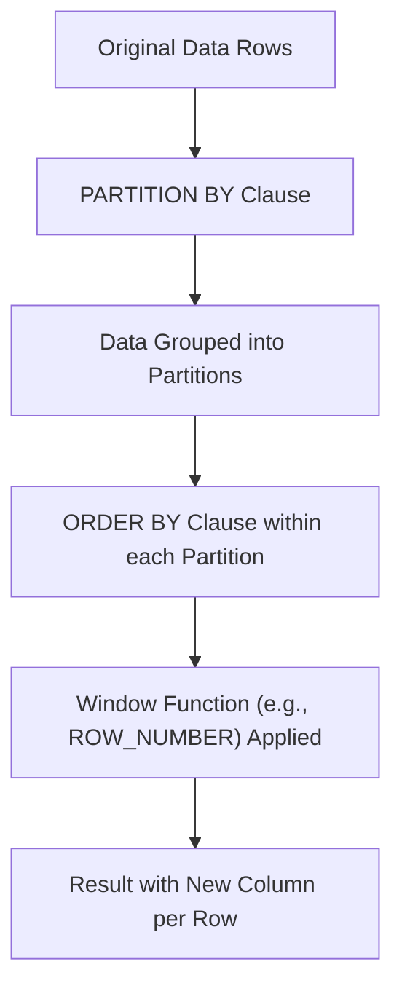

## Window Functions (`OVER`, `PARTITION BY`, `ROW_NUMBER`, `RANK`)
### Core Concepts

*   **Definition:** Window functions perform calculations across a set of table rows that are related to the current row (the "window"). Unlike aggregate functions with `GROUP BY`, window functions do not collapse rows; they return a single result for each row in the original query result set.
*   **Key Components:**
    *   **`OVER()` Clause:** Defines the window of rows on which the function operates.
    *   **`PARTITION BY`:** Divides the rows into logical groups (partitions). The window function is applied independently to each partition. Conceptually similar to `GROUP BY` but preserves individual rows.
    *   **`ORDER BY` (within `OVER()`):** Sorts the rows *within each partition*. Crucial for ranking functions (`ROW_NUMBER`, `RANK`, `DENSE_RANK`) and for defining the order for cumulative calculations.
    *   **Window Frame (Implicit/Explicit):** Defines the subset of rows *within* the current partition that the function considers. For ranking functions, the frame is usually implied (from the start of the partition up to the current row).

### Key Details & Nuances

*   **Difference from `GROUP BY`:**
    *   `GROUP BY` collapses rows into a single summary row for each group.
    *   Window functions operate on a window of rows and return a result for *each individual row*, enriching the dataset without aggregation.
*   **Common Ranking Functions:**
    *   **`ROW_NUMBER()`:** Assigns a unique, sequential integer to each row within its partition, based on the `ORDER BY` clause. Does *not* account for ties; if two rows have the same values for the `ORDER BY` columns, their order (and thus `ROW_NUMBER`) is non-deterministic unless additional `ORDER BY` columns are specified to break ties.
    *   **`RANK()`:** Assigns a rank to each row within its partition. If two or more rows have the same value for the `ORDER BY` clause, they receive the same rank, and the next rank (for the subsequent distinct value) is skipped. (e.g., 1, 2, 2, 4)
    *   **`DENSE_RANK()`:** Similar to `RANK()`, but if rows have the same value, it assigns them the same rank and *does not skip* the next rank. (e.g., 1, 2, 2, 3)
*   **Execution Order:** Window functions are evaluated *after* `FROM`, `WHERE`, `GROUP BY`, and `HAVING` clauses, but *before* `SELECT`, `DISTINCT`, `ORDER BY`, and `LIMIT`. This means you cannot directly filter on the result of a window function in the `WHERE` clause; you need to use a Common Table Expression (CTE) or subquery.
*   **Analytic vs. Aggregate Window Functions:**
    *   **Analytic (e.g., ranking):** `ROW_NUMBER()`, `RANK()`, `DENSE_RANK()`, `NTILE()`, `LAG()`, `LEAD()`.
    *   **Aggregate (used with `OVER`):** `SUM() OVER (...)`, `AVG() OVER (...)`, `COUNT() OVER (...)`, `MAX() OVER (...)`, `MIN() OVER (...)`. These compute aggregates over the specified window.

### Practical Examples

**Scenario:** Find the top 3 highest-paid employees in each department.

```sql
-- Sample Data (Conceptual)
-- | employee_id | department   | salary |
-- |-------------|--------------|--------|
-- | 1           | Engineering  | 90000  |
-- | 2           | HR           | 70000  |
-- | 3           | Engineering  | 100000 |
-- | 4           | HR           | 75000  |
-- | 5           | Engineering  | 90000  |
-- | 6           | HR           | 60000  |
-- | 7           | Marketing    | 85000  |

-- SQL Query using ROW_NUMBER and a CTE to find top 3 per department
WITH RankedEmployees AS (
    SELECT
        employee_id,
        department,
        salary,
        ROW_NUMBER() OVER(PARTITION BY department ORDER BY salary DESC) AS rn,
        RANK() OVER(PARTITION BY department ORDER BY salary DESC) AS rk,
        DENSE_RANK() OVER(PARTITION BY department ORDER BY salary DESC) AS drk
    FROM
        employees
)
SELECT
    employee_id,
    department,
    salary,
    rn,
    rk,
    drk
FROM
    RankedEmployees
WHERE
    rn <= 3 -- Filter for top 3 based on row number
ORDER BY
    department, rn;
```

**Conceptual Flow of Window Functions:**



### Common Pitfalls & Trade-offs

*   **Performance:**
    *   `PARTITION BY` and `ORDER BY` clauses within `OVER()` often require sorting large datasets, which can be resource-intensive (CPU, memory, I/O).
    *   Excessive use or very complex window definitions can degrade performance.
    *   **Trade-off:** Readability and analytical power vs. potential performance overhead. Often, the expressive power and single-pass nature outweigh the cost of complex multi-step queries.
*   **Filtering Results:** A common mistake is trying to filter by the result of a window function directly in the `WHERE` clause. This won't work due to execution order. Always use a CTE or subquery for such filtering.
*   **`ROW_NUMBER` vs. `RANK` vs. `DENSE_RANK`:** Misunderstanding their behavior with ties can lead to incorrect results, especially when dealing with scenarios where tie-breaking matters or where specific gaps in rankings are expected/not expected.

### Interview Questions

1.  **Explain the fundamental difference between `GROUP BY` and `PARTITION BY`. Provide a scenario where you'd prefer one over the other.**
    *   **Answer:** `GROUP BY` aggregates rows, collapsing them into a single result row per group, losing individual row detail. `PARTITION BY` defines a window for analytic functions, allowing calculations over a group of rows while retaining all original rows in the result set. You'd use `GROUP BY` for simple aggregates (e.g., total sales per product). You'd use `PARTITION BY` for ranking, running totals, or finding previous/next values for each row within a group (e.g., rank employees by salary within each department).

2.  **You need to get the Nth highest value within a specific category, handling potential ties gracefully by including all tied values. Which window function would you use and why?**
    *   **Answer:** I would use `DENSE_RANK()`. `DENSE_RANK()` assigns consecutive ranks to unique values, meaning if there are ties, they all receive the same rank, and no ranks are skipped. This ensures all tied Nth highest values are included, and the subsequent ranks are not gapped. If I used `ROW_NUMBER()`, I might arbitrarily exclude some tied values. If I used `RANK()`, I would include tied values but would create gaps in the rank sequence, which might be undesirable if I literally want the "Nth" set of values without rank skipping.

3.  **Describe a real-world scenario where window functions are essential, and outline the SQL query structure you'd use.**
    *   **Answer:** A common scenario is calculating running totals or moving averages over time series data, or identifying the "top N" items within a category. For example, calculating a 7-day moving average of daily active users (DAU). The query structure would involve:
        ```sql
        SELECT
            date,
            daily_active_users,
            AVG(daily_active_users) OVER (ORDER BY date ROWS BETWEEN 6 PRECEDING AND CURRENT ROW) AS seven_day_moving_avg
        FROM
            user_activity;
        ```
        This avoids complex self-joins or subqueries for such calculations.

4.  **Can you filter the results of a query based on the output of a window function directly in the `WHERE` clause? If not, how would you achieve this?**
    *   **Answer:** No, you cannot. Window functions are evaluated *after* the `WHERE` clause in the SQL query execution order. To filter based on a window function's result, you must wrap the query using a Common Table Expression (CTE) or a subquery. The window function is computed in the inner query/CTE, and the outer query then applies the filter on the computed window function column.

5.  **What are the performance considerations when using window functions on very large datasets, and how might you mitigate them?**
    *   **Answer:** The primary performance consideration is the sorting required for `PARTITION BY` and `ORDER BY` clauses within the `OVER()` function. For large datasets, this can be memory-intensive and lead to disk spills, significantly slowing down the query.
    *   **Mitigation strategies:**
        *   **Filtering early:** Apply `WHERE` clauses *before* window functions to reduce the number of rows that need to be processed.
        *   **Indexing:** Ensure relevant columns in `PARTITION BY` and `ORDER BY` clauses are indexed. This can make the initial data sorting more efficient.
        *   **Optimizing `ORDER BY`:** Use only necessary columns in `ORDER BY` to make the sort key as small as possible.
        *   **Reviewing window frame:** For aggregate window functions, ensure the window frame is appropriately defined and not overly broad if a smaller window suffices.
        *   **Hardware/Configuration:** Ensure the database server has sufficient RAM and I/O capacity.