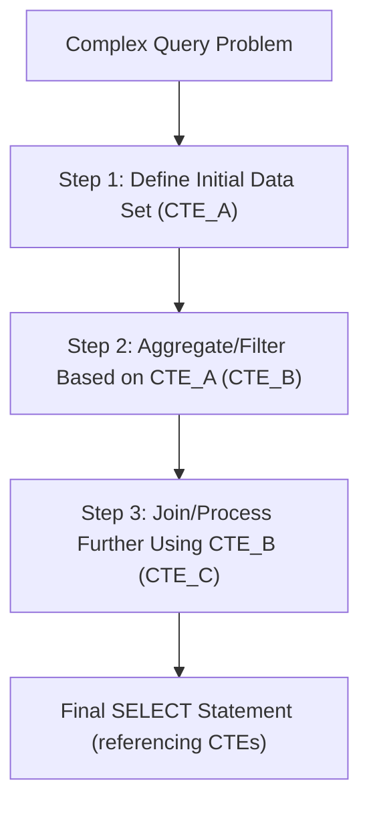

## Common Table Expressions (CTEs) (`WITH` clause)
### Core Concepts
*   **Definition:** A Common Table Expression (CTE), defined using the `WITH` clause, creates a named, temporary result set that can be referenced within a single `SELECT`, `INSERT`, `UPDATE`, or `DELETE` statement.
*   **Scope:** The CTE is only valid for the duration of the query it's part of. It is not stored permanently in the database.
*   **Purpose:** Primarily used to improve query readability, modularity, and to handle complex, multi-step calculations.

### Key Details & Nuances
*   **Readability & Modularity:** Break down complex queries into logical, digestible steps, making the SQL easier to understand, debug, and maintain.
*   **Recursion:** CTEs are essential for handling hierarchical or graph-like data structures (e.g., organizational charts, bill of materials, social network connections) through **recursive CTEs** (using `WITH RECURSIVE`).
*   **Referencing Other CTEs:** Multiple CTEs can be defined within a single `WITH` clause, separated by commas. A CTE can reference any CTE defined *before* it in the same `WITH` clause.
*   **Non-Materialized (Generally):** By default, CTEs are typically treated as an inline view or a subquery by the query optimizer and are *not* materialized into a temporary table. The optimizer might choose to materialize them based on the query plan, but it's not guaranteed.
*   **Compared to Subqueries:**
    *   **Clarity:** CTEs are often more readable, especially for multi-level nesting.
    *   **Reusability (within query):** A CTE can be referenced multiple times within the same subsequent query without repeating its definition, unlike a non-aliased subquery.
*   **Compared to Temporary Tables:**
    *   **Scope:** Temporary tables exist for the session or connection; CTEs exist only for the query.
    *   **Performance:** Temporary tables are explicitly materialized, incurring I/O costs. CTEs are often optimized away or materialized only if beneficial for the query plan.

### Practical Examples

#### 1. Basic CTE for Readability
Breaks down a query to find top-selling products by region.

```sql
WITH RegionalSales AS (
    SELECT
        Region,
        ProductID,
        SUM(SalesAmount) AS TotalSales
    FROM
        Orders
    GROUP BY
        Region, ProductID
),
TopProductsByRegion AS (
    SELECT
        Region,
        ProductID,
        TotalSales,
        ROW_NUMBER() OVER (PARTITION BY Region ORDER BY TotalSales DESC) as rn
    FROM
        RegionalSales
)
SELECT
    Region,
    ProductID,
    TotalSales
FROM
    TopProductsByRegion
WHERE
    rn = 1;
```

#### 2. Conceptual Flow for Complex Query Decomposition
This diagram illustrates how CTEs help in breaking down a complex problem into manageable, logical steps.



### Common Pitfalls & Trade-offs
*   **Performance Misconception:** CTEs are *not* a silver bullet for performance. They primarily aid readability. The optimizer treats them similar to derived tables/subqueries. A complex CTE that is referenced multiple times might be re-computed if the optimizer doesn't materialize it, potentially leading to performance issues.
*   **Overuse:** For simple queries, a CTE can add unnecessary verbosity. Use them when the query logic truly benefits from modularization or requires recursion.
*   **Debugging:** Debugging errors within nested CTEs can sometimes be trickier than step-by-step debugging with temporary tables.

### Interview Questions

1.  **"What is a CTE and why would you use one over a subquery or a temporary table?"**
    *   **Answer:** A CTE is a named, temporary result set defined by a `WITH` clause. Use it for improved readability, modularity, and managing complex query logic. Unlike a subquery, a CTE can be referenced multiple times within the same statement without re-defining its logic. Unlike a temporary table, a CTE is typically not materialized, is scoped only to the immediate query, and avoids DDL/DML overhead.
2.  **"Explain the difference between a CTE and a VIEW."**
    *   **Answer:** A CTE is a temporary, non-persistent construct available only for the query it precedes. A VIEW is a persistent database object, stored in the schema, which can be queried by multiple statements and users, similar to a virtual table. Views are for reusable, stored query definitions, while CTEs are for one-off query simplification.
3.  **"When would you use a recursive CTE? Provide an example scenario."**
    *   **Answer:** Recursive CTEs are used to query hierarchical or graph-like data. A classic example is an organizational chart (employees and their managers), where you need to find all direct and indirect reports of a given employee, or trace the reporting line upwards to a top-level manager.
4.  **"Discuss the performance implications of using CTEs. Are they always faster than a complex subquery?"**
    *   **Answer:** CTEs are not inherently faster. The query optimizer generally treats them similarly to derived tables or subqueries. Their primary benefit is readability. Performance depends on the specific query, data, and database optimizer. In some cases, a CTE might allow the optimizer to find a better plan due to clearer logic, but in others, especially if the CTE is complex and referenced multiple times without materialization, it could lead to re-computation and slower performance than an optimized single-pass subquery.
5.  **"Can one CTE refer to another CTE defined earlier in the same `WITH` clause? How about one defined after it?"**
    *   **Answer:** Yes, a CTE can refer to another CTE that was defined *earlier* in the same `WITH` clause (sequential dependency). This allows building complex logic step-by-step. However, a CTE **cannot** refer to another CTE that is defined *after* it in the same `WITH` clause.