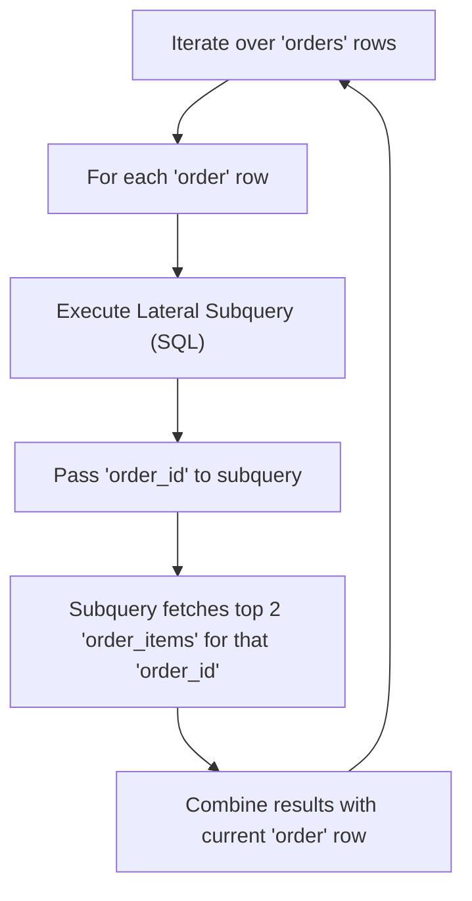

## Lateral Joins
### Core Concepts

*   **Definition:** `LATERAL JOIN` is a SQL construct that allows a subquery (or a `TABLE` expression) on the right side of the `LATERAL` keyword to reference columns from the table(s) on its left.
*   **Row-by-Row Execution:** Unlike standard joins, the lateral subquery is evaluated *for each row* of the table(s) it is joining with. This enables correlation between the outer query's rows and the inner query's results.
*   **Primary Use Case:** Essential for scenarios where you need to perform a calculation or retrieve related data that depends on values from *each individual row* of another table, and the related data itself might consist of multiple rows.

### Key Details & Nuances

*   **Correlation:** Explicitly enables what is often referred to as a "correlated subquery" but allows the subquery to return multiple rows, which a standard correlated subquery in a `SELECT` clause cannot directly do.
*   **Syntax Variants:**
    *   `[INNER] JOIN LATERAL`: Behaves like an `INNER JOIN`. If the lateral subquery produces no rows for a given outer row, that outer row is excluded from the result.
    *   `LEFT [OUTER] JOIN LATERAL`: Behaves like a `LEFT JOIN`. All rows from the left table are included. If the lateral subquery produces no rows, the columns from the lateral result set will be `NULL`.
    *   `CROSS JOIN LATERAL`: Combines each row from the left table with each row produced by the lateral subquery for that row.
*   **Equivalents/Synonyms:**
    *   **SQL Server:** Uses the `APPLY` operator (`CROSS APPLY` for `INNER JOIN LATERAL`, `OUTER APPLY` for `LEFT JOIN LATERAL`).
    *   **Oracle:** Achieved using `TABLE(subquery)` with correlation.
    *   **PostgreSQL:** Directly supports `LATERAL JOIN`.
*   **Power over Window Functions:** While window functions (`ROW_NUMBER()`, `RANK()`) are often used for "Top N per Group," `LATERAL JOIN` offers greater flexibility. The lateral subquery can involve complex logic, multiple joins, or different ordering criteria that might be cumbersome or impossible with a single window function.

### Practical Examples

**Scenario:** Find the two most expensive products for each order.

```sql
-- Sample Schema (PostgreSQL/SQL Standard)
CREATE TABLE orders (
    order_id INT PRIMARY KEY,
    order_date DATE,
    customer_id INT
);

CREATE TABLE order_items (
    item_id INT PRIMARY KEY,
    order_id INT REFERENCES orders(order_id),
    product_name VARCHAR(100),
    price DECIMAL(10, 2)
);

-- Sample Data
INSERT INTO orders (order_id, order_date, customer_id) VALUES
(101, '2023-01-05', 1),
(102, '2023-01-06', 2),
(103, '2023-01-07', 1);

INSERT INTO order_items (item_id, order_id, product_name, price) VALUES
(1, 101, 'Laptop', 1200.00),
(2, 101, 'Mouse', 25.00),
(3, 101, 'Keyboard', 75.00),
(4, 101, 'Monitor', 300.00),
(5, 102, 'Desk', 500.00),
(6, 102, 'Chair', 200.00),
(7, 103, 'Webcam', 150.00),
(8, 103, 'Microphone', 100.00);

-- LATERAL JOIN to get top 2 most expensive items per order
SELECT
    o.order_id,
    o.order_date,
    items.product_name,
    items.price
FROM
    orders o
JOIN LATERAL (
    SELECT
        oi.product_name,
        oi.price
    FROM
        order_items oi
    WHERE
        oi.order_id = o.order_id -- Crucial correlation
    ORDER BY
        oi.price DESC
    LIMIT 2 -- Get top 2 items for the current order (o.order_id)
) AS items ON TRUE; -- ON TRUE is common when the lateral join acts like a CROSS APPLY or for an inner join when correlation is enough.

```

**Conceptual Flow:**



### Common Pitfalls & Trade-offs

*   **Performance Overhead:** Since the lateral subquery executes for *each row* of the left table, performance can degrade significantly on very large datasets if the inner query is not highly optimized (e.g., lacking appropriate indexes).
*   **Alternatives vs. Flexibility:**
    *   For simple "Top N per Group" (like the example above), window functions (`ROW_NUMBER() OVER (PARTITION BY ... ORDER BY ...)`) are often more performant as they can process the entire dataset in a single pass.
    *   However, `LATERAL JOIN` provides much greater flexibility for complex aggregations, conditional logic, or joining with multiple tables within the "per-row" context.
*   **Readability:** Can become less readable than simpler join types if the lateral subquery is very complex or nested.
*   **Debugging:** Debugging performance issues might require understanding query plans to see how many times the lateral subquery is executed and its cost per execution.

### Interview Questions

1.  **Explain `LATERAL JOIN` and when you would prefer it over a standard `JOIN` or a correlated subquery.**
    *   **Answer:** `LATERAL JOIN` allows a subquery to reference columns from a table *before* it in the `FROM` clause, executing the subquery once for each row of the preceding table. You'd prefer it over a standard `JOIN` when the right-side table's data selection depends on each row of the left-side table (i.e., correlation). It's preferred over a simple correlated subquery in the `SELECT` list when the correlated logic needs to return *multiple rows* (e.g., "top N per group") or involves complex join logic.

2.  **Describe a common use case for `LATERAL JOIN` and provide a conceptual query example.**
    *   **Answer:** A common use case is "Top N per Group". For instance, finding the top 3 selling products for each product category.
        ```sql
        SELECT
            c.category_name,
            p.product_name,
            p.sales_amount
        FROM
            categories c
        JOIN LATERAL (
            SELECT
                p_inner.product_name,
                p_inner.sales_amount
            FROM
                products p_inner
            WHERE
                p_inner.category_id = c.category_id
            ORDER BY
                p_inner.sales_amount DESC
            LIMIT 3
        ) AS p ON TRUE;
        ```

3.  **What are the performance considerations when using `LATERAL JOIN`? Are there alternatives for common scenarios?**
    *   **Answer:** The primary performance consideration is that the lateral subquery runs *for each row* of the outer table, which can be inefficient on large datasets, especially if the subquery itself is complex or lacks proper indexing. For simple "Top N per Group" problems, window functions (`ROW_NUMBER() OVER (PARTITION BY ... ORDER BY ...)`) are often more performant as they can process the entire result set in a single pass. However, `LATERAL JOIN` is more flexible for scenarios that go beyond simple ranking.

4.  **How does `LATERAL JOIN` relate to SQL Server's `CROSS APPLY` and `OUTER APPLY`?**
    *   **Answer:** `LATERAL JOIN` is the SQL standard equivalent for what SQL Server implements as the `APPLY` operator.
        *   `CROSS APPLY` is functionally equivalent to `INNER JOIN LATERAL`. It only returns rows from the left table if the `APPLY` subquery returns at least one row for that outer row.
        *   `OUTER APPLY` is functionally equivalent to `LEFT JOIN LATERAL`. It returns all rows from the left table, and if the `APPLY` subquery returns no rows for a given outer row, the columns from the `APPLY`'s result set will be `NULL`.