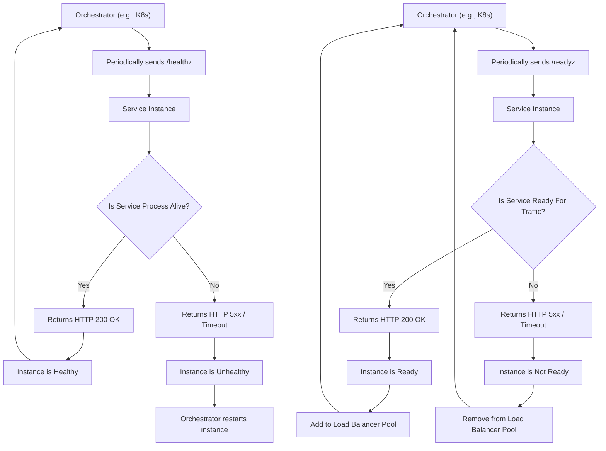

## Health Monitoring
### Core Concepts
*   **Purpose:** To verify the operational status, responsiveness, and readiness of individual service instances and overall system components. It goes beyond simple "is it running?" to "is it capable of serving traffic?"
*   **Scope:** Ranges from low-level resource checks (CPU, Memory) to application-level health (API response times, error rates) and end-to-end business transaction health.
*   **Key Distinction:** Health monitoring is a subset of observability. While observability provides insights into *why* something is happening, health monitoring focuses on *if* something is working correctly and *when* it's not.

### Key Details & Nuances
*   **Types of Health Checks:**
    *   **Liveness Probe:** Determines if a service instance is alive and responsive. If it fails, the orchestrator (e.g., Kubernetes) typically restarts the instance.
        *   *Example:* An HTTP endpoint (`/healthz`) returning `200 OK` if the process is running.
    *   **Readiness Probe:** Determines if a service instance is ready to accept incoming traffic. If it fails, the orchestrator removes it from the load balancing pool but doesn't necessarily restart it.
        *   *Example:* An HTTP endpoint (`/readyz`) that checks database connectivity, external API reachability, and internal queue status.
    *   **Startup Probe:** For applications with long startup times, this delays liveness and readiness checks until the application has finished its initial setup.
*   **Metrics for Health:**
    *   **System-level:** CPU Utilization, Memory Consumption, Disk I/O, Network Throughput/Errors.
    *   **Application-level:** Request Latency, Error Rates (HTTP 5xx, application errors), Throughput (Requests Per Second), Queue Lengths, Concurrent Connections.
    *   **Dependency Health:** Status of external databases, caches, message queues, and third-party APIs.
    *   **Custom/Business Logic:** Checks specific to the application's domain (e.g., "number of payments processed successfully in last minute").
*   **Monitoring Strategies:**
    *   **Pull (Scraping):** A monitoring system (e.g., Prometheus) periodically pulls metrics from exposed endpoints on services.
        *   *Pros:* Services don't need to know about the monitoring system.
        *   *Cons:* Requires services to expose endpoints, firewalls might be an issue.
    *   **Push:** Services actively push metrics to a central collector (e.g., StatsD, Graphite, Kafka).
        *   *Pros:* Good for ephemeral services, services control push frequency.
        *   *Cons:* Collector must handle potential spikes, requires client-side libraries.
*   **Alerting:** Defining thresholds, severity levels, notification channels (email, Slack, PagerDuty), and on-call rotation schedules.
*   **Integration with Orchestrators/Load Balancers:** Health checks are critical for automated scaling, rolling deployments, and ensuring traffic is routed only to healthy instances.

### Practical Examples

#### 1. Node.js/Express Health Check Endpoint

```typescript
// app.ts or app.js
import express from 'express';

const app = express();
const PORT = process.env.PORT || 3000;

let isAppReady = false; // Simulates an application readiness state

// Simulate a resource initialization that takes time
setTimeout(() => {
    isAppReady = true;
    console.log('Application is now ready to serve traffic.');
}, 5000); // Becomes ready after 5 seconds

// Liveness Probe: Checks if the application process is running and responsive.
app.get('/healthz', (req, res) => {
    // A simple check indicating the server process is alive.
    // In a real app, this might also check for deadlocks or critical thread pools.
    res.status(200).send('OK');
});

// Readiness Probe: Checks if the application is ready to accept new requests.
// This is typically more comprehensive, checking dependencies.
app.get('/readyz', async (req, res) => {
    // Example: Check if a database connection is established
    // In a real app, you'd perform an actual DB ping or query.
    const isDbConnected = true; // For demonstration, assume true after some logic

    if (isAppReady && isDbConnected) {
        res.status(200).send('Ready');
    } else {
        res.status(503).send('Not Ready'); // Service Unavailable
    }
});

app.listen(PORT, () => {
    console.log(`Server listening on port ${PORT}`);
});
```

#### 2. Health Check Flow with Orchestrator



### Common Pitfalls & Trade-offs
*   **False Positives/Negatives:**
    *   *Too sensitive:* Alerts for transient issues (alert fatigue). Mitigate with retries, exponential backoff, and more robust thresholds.
    *   *Not sensitive enough:* Misses critical issues. Mitigate by making health checks comprehensive enough (e.g., checking internal states, not just `200 OK`).
*   **Overhead of Checks:** Frequent, complex health checks consume resources.
    *   *Trade-off:* Granularity vs. performance. Balance detailed checks with lightweight execution. Cache internal health states when possible.
*   **Dependency Chains:** A service is only as healthy as its unhealthiest critical dependency.
    *   *Trade-off:* Direct dependency checks vs. synthetic transactions. Direct checks are faster but might miss external issues; synthetic transactions are end-to-end but can be slower and more complex.
*   **Alert Fatigue:** Too many non-actionable alerts lead to ignored critical alerts.
    *   *Mitigation:* Define clear alert severities, use escalation policies, and ensure alerts provide context (links to dashboards, logs).
*   **Stateful Services:** Health checking services with persistent state (e.g., databases) is more complex.
    *   *Considerations:* Read-only queries for health, replicating monitoring to replica sets, separate monitoring for data integrity vs. availability.

### Interview Questions

1.  **Q:** Explain the difference between liveness and readiness probes in a distributed system, and provide a scenario where distinguishing between them is critical.
    *   **A:** Liveness probes ascertain if an application is running and able to continue basic operation; a failure typically leads to restarting the container. Readiness probes determine if an application is ready to handle requests; a failure removes it from the load balancer pool. A critical scenario is during deployment or startup: an application might be "live" (process running) but not "ready" (e.g., still loading configuration, connecting to a database, or warming caches). Sending traffic to an unready instance causes errors for users. By differentiating, orchestrators ensure traffic is only routed to fully functional instances, enabling zero-downtime deployments and graceful scaling.

2.  **Q:** Design a comprehensive health monitoring strategy for a new microservice that processes financial transactions. What metrics would you prioritize, and how would you ensure actionable alerts?
    *   **A:** For a financial transaction service, critical metrics include:
        *   **Application:** Request latency (P95, P99), error rate (especially 5xx), transaction success rate, queue lengths (for async processing), external API call failures/latency.
        *   **System:** CPU/Memory utilization, Disk I/O (for logs/data), Network I/O.
        *   **Dependencies:** Database connection status, message queue connectivity, third-party payment gateway health.
    *   I'd use a **pull-based system** like Prometheus for application and system metrics, exposing `/metrics` endpoints. For structured logs (errors, warnings), I'd use a **push-based system** like an ELK stack. Distributed tracing (e.g., OpenTelemetry) would monitor end-to-end transaction flows.
    *   **Actionable alerts** would be based on:
        *   **Thresholds:** e.g., transaction success rate < 99.5%, 5xx error rate > 0.1%.
        *   **Severity:** Critical for immediate outage, Warning for degradation.
        *   **Escalation:** PagerDuty for critical, Slack for warnings, email for informational.
        *   **Context:** Alerts must link to relevant dashboards (Grafana), logs, and tracing data to aid debugging.

3.  **Q:** Your health check for a critical microservice includes a call to an external, rate-limited third-party API. How would you design this check to be robust and avoid issues like rate limit exhaustion or false negatives?
    *   **A:** Directly calling a rate-limited external API on every health check is problematic. I'd implement:
        1.  **Asynchronous/Cached Checks:** Instead of making the API call directly within the `/readyz` endpoint, have a background task (e.g., a scheduled job) periodically call the third-party API. The `/readyz` endpoint would then return the *cached result* of this background check. This decouples the health check from the potentially slow or rate-limited external dependency. The cache should have a TTL of, say, 30-60 seconds.
        2.  **Circuit Breaker Integration:** The service itself should use a circuit breaker pattern (e.g., via Hystrix or equivalent library) for calls to the third-party API. The health check could then inspect the state of the circuit breaker: if it's "open" (meaning calls are currently failing), the readiness probe might report "unready" or "degraded" for that specific dependency.
        3.  **Graceful Degradation:** If the service can still operate in a degraded mode without the third-party API, the health check might reflect this (e.g., `status: DEGRADED` instead of `UNHEALTHY`), allowing the load balancer to potentially prioritize other instances but not remove it entirely.

4.  **Q:** When might a simple HTTP 200 OK on a `/health` endpoint be insufficient for a service, and what deeper checks might you include?
    *   **A:** A simple HTTP 200 OK only confirms the web server process is running. It's insufficient if:
        *   **Internal dependencies are down:** The service might be running, but its connection to its database, cache, or message queue could be broken.
        *   **External dependencies are inaccessible:** It relies on third-party APIs that are down or unresponsive.
        *   **Resource exhaustion:** The service could be experiencing CPU/memory starvation or disk full, making it functionally impaired despite responding to basic requests.
        *   **Logical errors:** Business logic or background processing might be failing, even if the HTTP endpoint works.
    *   Deeper checks to include:
        *   **Database Connectivity:** Perform a simple `SELECT 1` query.
        *   **Cache Connectivity:** Ping the Redis/Memcached instance.
        *   **Message Queue Connectivity:** Check connection status or attempt to publish a dummy message.
        *   **External API Connectivity:** A lightweight, non-rate-limited check (e.g., an `OPTIONS` call) if available, or rely on asynchronous checks as discussed.
        *   **Internal State:** Check critical thread pool sizes, queue depths, or the status of background jobs.