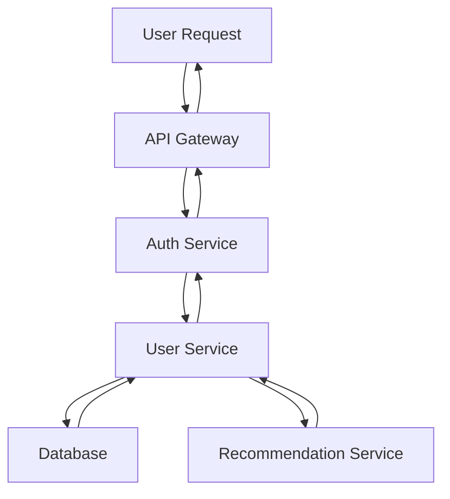

## Performance Monitoring
### Core Concepts
*   **Definition:** The continuous process of collecting, analyzing, and visualizing data related to an application's or system's performance, resource utilization, and user experience to identify bottlenecks, ensure reliability, and optimize efficiency.
*   **Goals:**
    *   **Proactive Issue Detection:** Identify problems before they impact users.
    *   **Root Cause Analysis:** Pinpoint the exact source of performance degradation.
    *   **Capacity Planning:** Understand resource needs for scaling.
    *   **SLA/SLO Adherence:** Verify service level objectives are met.
    *   **Performance Optimization:** Guide improvements and validate changes.
*   **Key Metrics (The "RED" and "USE" Methods):**
    *   **RED Method (for Requests):**
        *   **Rate (Throughput):** Number of requests/transactions per second.
        *   **Errors:** Number of failed requests (e.g., HTTP 5xx responses).
        *   **Duration (Latency):** Time taken to complete a request (e.g., P90, P99 latency).
    *   **USE Method (for Resources):**
        *   **Utilization:** Percentage of time a resource is busy (e.g., CPU, memory, disk, network).
        *   **Saturation:** Amount of work a resource has to do, and cannot yet (e.g., CPU run queue length).
        *   **Errors:** Number of errors reported by a resource (e.g., disk I/O errors).

### Key Details & Nuances
*   **Observability Pillars:** Performance monitoring is a subset of observability, which typically includes:
    *   **Metrics:** Aggregated numerical data over time (e.g., CPU usage, request count).
    *   **Logs:** Discrete, immutable records of events (e.g., error messages, request details).
    *   **Traces (Distributed Tracing):** End-to-end view of a request's path through a distributed system, showing latency at each service hop.
*   **Data Collection Methods:**
    *   **Instrumentation (Agents/SDKs):** Code-level integration using libraries or language-specific agents (e.g., OpenTelemetry, Prometheus client libraries).
        *   **Auto-instrumentation:** Agents automatically hook into common frameworks/libraries.
        *   **Manual instrumentation:** Developers explicitly add code to collect custom metrics or span details.
    *   **Agentless Monitoring:** Collecting data via standard protocols (e.g., SNMP, JMX, SSH) or system APIs.
    *   **Log Scrapers/Parsers:** Extracting metrics from existing log files.
*   **Data Storage & Analysis:**
    *   **Time-Series Databases (TSDBs):** Optimized for storing and querying time-stamped data (e.g., Prometheus, InfluxDB, VictoriaMetrics).
    *   **Distributed Tracing Systems:** Specialized systems for trace storage and visualization (e.g., Jaeger, Zipkin, Tempo).
    *   **Log Management Systems:** For logs (e.g., Elasticsearch/Kibana, Splunk, Loki).
*   **Context Propagation (for Tracing):** Essential for distributed tracing. Unique trace and span IDs are propagated across service boundaries, often via HTTP headers (e.g., `traceparent`, `x-request-id`).
*   **Real User Monitoring (RUM) vs. Synthetic Monitoring:**
    *   **RUM:** Measures actual user experience directly from their browsers/devices. Provides real-world performance data.
    *   **Synthetic Monitoring:** Simulates user interactions from various locations using automated scripts. Ensures baseline performance and availability even with no user traffic.

### Practical Examples

**1. Basic Metric Collection (Manual Instrumentation)**

```typescript
import { performance } from 'perf_hooks'; // Node.js specific for high-resolution timing

function measureFunctionExecution<T extends (...args: any[]) => any>(
  func: T,
  metricName: string
): (...args: Parameters<T>) => ReturnType<T> {
  return (...args: Parameters<T>): ReturnType<T> => {
    const start = performance.now();
    try {
      const result = func(...args);
      const end = performance.now();
      const duration = end - start;
      console.log(`METRIC: ${metricName}_duration_ms: ${duration.toFixed(2)}`);
      // In a real system, send this to a metrics collector (e.g., Prometheus, Datadog)
      return result;
    } catch (error) {
      const end = performance.now();
      const duration = end - start;
      console.error(`METRIC: ${metricName}_error_duration_ms: ${duration.toFixed(2)}`);
      // Increment an error counter metric
      throw error;
    }
  };
}

// Example usage:
class UserService {
  getUserById(id: string): string {
    // Simulate some work
    for (let i = 0; i < 1e6; i++) {}
    return `User-${id}`;
  }
}

const userService = new UserService();
const getUserByIdMonitored = measureFunctionExecution(userService.getUserById.bind(userService), 'user_service_get_user_by_id');

getUserByIdMonitored('123');
// Expected output: METRIC: user_service_get_user_by_id_duration_ms: X.XX
```

**2. Distributed Trace Flow**


*Description: A single user request ("Trace") flows through multiple services. Each arrow represents a "Span," indicating a unit of work or an RPC call. The total time for the user request is the trace duration, and individual span durations show latency per service.*

### Common Pitfalls & Trade-offs
*   **Monitoring Overhead:**
    *   **Pitfall:** Excessive instrumentation or high-frequency data collection can itself degrade application performance.
    *   **Trade-off:** Balance between data granularity (how detailed/frequent) and the performance impact of collection.
*   **Alert Fatigue:**
    *   **Pitfall:** Too many alerts, false positives, or poorly configured thresholds lead to ignored warnings.
    *   **Trade-off:** Fine-tune alerting rules (e.g., P99 latency, rate of change, correlation with other metrics) and use alert suppression.
*   **Cardinality Explosion:**
    *   **Pitfall:** Too many unique label combinations for metrics (e.g., user ID, specific product SKU) can overwhelm time-series databases, leading to high storage costs and slow queries.
    *   **Trade-off:** Aggregate metrics at higher levels (e.g., per endpoint, per service, per tenant) and use logs/traces for high-cardinality analysis.
*   **Lack of Context:**
    *   **Pitfall:** Having metrics for individual services but no way to correlate them across a distributed transaction.
    *   **Trade-off:** Emphasize distributed tracing for end-to-end visibility, integrating it with metrics and logs.
*   **Sampling in Distributed Tracing:**
    *   **Pitfall:** Sampling too aggressively might miss critical edge cases or rare errors. Not sampling leads to massive data volumes and costs.
    *   **Trade-off:** Implement intelligent sampling strategies (e.g., head-based, tail-based, error-only) to balance data completeness with cost/overhead.

### Interview Questions
1.  **How would you design a system to monitor the performance of a microservices application running on Kubernetes?**
    *   **Answer:** I'd start by defining key SLIs/SLOs (e.g., latency, error rate, uptime). For data collection, I'd use **Prometheus** for metrics (with `kube-state-metrics` and `node-exporter`), **OpenTelemetry** for distributed tracing across services (propagating trace context via headers), and a centralized logging solution like **Loki** or **ELK stack**. **Grafana** would be used for dashboards and visualization. Services would be instrumented using OpenTelemetry SDKs (auto/manual). Alerting would be set up in Prometheus Alertmanager for critical thresholds (e.g., P99 latency spikes, 5xx error rates).
2.  **Explain the difference between metrics, logs, and traces, and how they contribute to observability.**
    *   **Answer:**
        *   **Metrics:** Aggregated numerical measurements over time, useful for high-level trends, dashboards, and alerting (e.g., CPU utilization, requests/second).
        *   **Logs:** Discrete, immutable records of events or messages at a specific point in time, excellent for debugging specific issues and context (e.g., error stack traces, user login records).
        *   **Traces:** Represent the end-to-end flow of a single request through multiple services, showing the latency breakdown at each service boundary. They connect logs and metrics across a distributed system.
        Together, these three pillars provide comprehensive observability: Metrics tell you *what* is wrong, Logs tell you *why* it's wrong in a specific instance, and Traces tell you *where* the problem occurred in the request flow.
3.  **What are the key challenges in implementing distributed tracing, and how do you address them?**
    *   **Answer:** Key challenges include **context propagation** (ensuring trace IDs/span IDs are passed across all service boundaries, requiring consistent instrumentation), **sampling** (managing data volume and storage costs while retaining useful traces), and **instrumentation consistency** (all services need to use compatible tracing libraries/standards like OpenTelemetry). We address these by adopting a unified standard (e.g., OpenTelemetry) for all services, using frameworks/libraries with built-in auto-instrumentation, and implementing intelligent sampling strategies (e.g., probabilistic, or tail-based sampling for errors).
4.  **Describe a scenario where active (synthetic) monitoring would be preferred over passive (RUM) monitoring.**
    *   **Answer:** Synthetic monitoring is preferred when you need to **ensure baseline availability and performance** regardless of actual user traffic, or to **monitor specific critical user flows** that might not always be used by real users. For example, ensuring that a login flow, payment gateway, or a core API endpoint is always available and performing well, even during low-traffic periods (like overnight). It's also vital for testing from specific geographic locations or network conditions that your real users might not cover. RUM, while providing real-world data, depends on actual user traffic and might not immediately reveal issues in rarely used, but critical, paths.
5.  **How do you ensure performance monitoring doesn't negatively impact the application's performance?**
    *   **Answer:** This is a crucial trade-off. We ensure minimal impact by:
        1.  **Efficient Instrumentation:** Using highly optimized and asynchronous agents/libraries (e.g., OpenTelemetry SDKs are designed for low overhead).
        2.  **Sampling:** Especially for traces and high-volume logs, collecting only a representative subset of data instead of every single event.
        3.  **Batching & Asynchronous Export:** Sending collected metrics/logs/traces in batches to the monitoring backend asynchronously, minimizing blocking calls.
        4.  **Minimizing High-Cardinality Metrics:** Avoiding excessively granular labels that bloat the TSDB and slow down queries.
        5.  **Dedicated Infrastructure:** Running monitoring backends (Prometheus, Jaeger, etc.) on separate, well-provisioned infrastructure to prevent resource contention with the application being monitored.