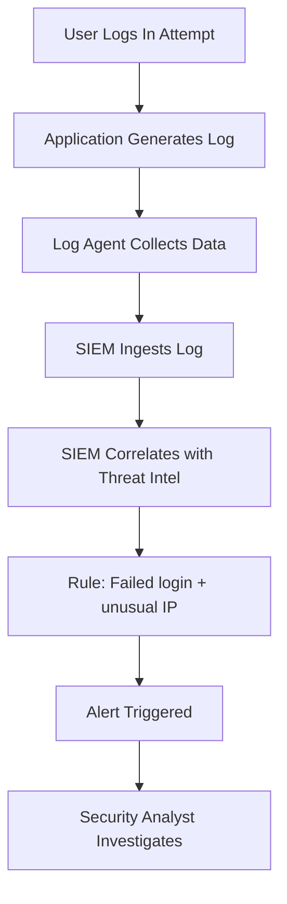

## Security Monitoring
### Core Concepts

*   **Definition:** Security monitoring is the continuous process of collecting, analyzing, and correlating security-relevant data from various sources across an IT environment to detect, prevent, and respond to cyber threats and vulnerabilities.
*   **Goal:** Proactive identification of anomalous behavior, policy violations, and attack patterns to minimize impact and improve an organization's security posture. It's a critical component of incident response and compliance.
*   **Relationship to Observability:** While observability focuses on understanding system health and performance, security monitoring specifically targets abnormal or malicious activity. It leverages similar data ingestion and analysis pipelines but with a security-centric lens.

### Key Details & Nuances

*   **Data Sources:**
    *   **Application Logs:** Authentication attempts (success/failure), authorization events, data access, critical business logic events (e.g., financial transactions).
    *   **System Logs:** OS events, kernel activity, process execution, file system changes.
    *   **Network Logs:** Firewall logs (denies/accepts), IDS/IPS alerts, DNS queries, network flow data (NetFlow, sFlow), proxy logs.
    *   **Security Device Logs:** WAF, Anti-malware, Endpoint Detection & Response (EDR) agents.
    *   **Cloud & SaaS Logs:** CloudTrail/CloudWatch, Azure Monitor, GCP Audit Logs, identity provider logs (Okta, Azure AD).
*   **Monitoring Tools & Categories:**
    *   **SIEM (Security Information and Event Management):** Centralized log collection, normalization, correlation, and alerting. Core for holistic security visibility.
    *   **IDS/IPS (Intrusion Detection/Prevention System):** Detects/prevents known attack signatures (network or host-based).
    *   **WAF (Web Application Firewall):** Protects web applications from common attacks (e.g., SQL injection, XSS) by filtering/monitoring HTTP traffic.
    *   **EDR (Endpoint Detection and Response):** Monitors endpoint activity (processes, file I/O, network connections) for suspicious behavior.
    *   **CSPM/CWPP (Cloud Security Posture Management/Cloud Workload Protection Platform):** Cloud-native security monitoring and enforcement.
*   **Detection Methods:**
    *   **Rule-based:** Predefined rules (e.g., "3 failed logins from same IP in 5 minutes"). Effective for known threats.
    *   **Signature-based:** Matching against known attack patterns (e.g., malware signatures, IDS rules).
    *   **Anomaly Detection:** Baselines normal behavior and flags deviations using statistical models or machine learning (e.g., "user logs in from unusual geo-location").
    *   **Threat Intelligence:** Correlating internal events with external threat feeds (IP blacklists, C2 servers).
*   **Correlation & Context:** A single log entry is often insufficient. Security monitoring excels by correlating events across different sources to build a complete picture of an attack chain. Context (user, role, asset criticality) is vital for prioritization.

### Practical Examples

**Security Event Flow:**



**Example Log Entry (JSON for SIEM ingestion):**

```json
{
  "timestamp": "2023-10-27T10:30:00Z",
  "event_id": "AUTH_FAILED_LOGIN",
  "source_ip": "192.168.1.100",
  "user_agent": "Mozilla/5.0 (Windows NT 10.0; Win64; x64) AppleWebKit/537.36",
  "username": "jdoe",
  "status": "failed",
  "reason": "Incorrect password",
  "application": "WebAppA",
  "service": "authentication",
  "log_level": "WARN"
}
```
A SIEM rule might trigger an alert if `event_id` is `AUTH_FAILED_LOGIN` from the same `source_ip` more than 5 times in 60 seconds, especially if the `user_agent` is suspicious or the `source_ip` is from a known VPN/TOR exit node.

### Common Pitfalls & Trade-offs

*   **Alert Fatigue:** Overly noisy or poorly tuned alerts lead to analysts ignoring critical warnings. Trade-off: Precision vs. Recall.
*   **False Positives/Negatives:** Too many false positives (benign activity flagged) or false negatives (actual threats missed). Requires continuous tuning of rules and models.
*   **Data Volume & Cost:** Ingesting, storing, and processing security logs from all sources can be prohibitively expensive and resource-intensive. Trade-off: Comprehensive visibility vs. budget.
*   **Performance Overhead:** Agents and network taps can introduce latency or consume significant resources if not properly managed.
*   **Lack of Context:** Raw logs without sufficient metadata (user, service, asset criticality) make analysis difficult and slow.
*   **Siloed Data:** Security data spread across disparate systems (cloud, on-prem, SaaS) hinders holistic threat detection. Integration is key.

### Interview Questions

1.  **"How would you design a security monitoring system for a distributed microservices architecture running on Kubernetes in a cloud environment?"**
    *   **Answer:** Focus on distributed log collection (Fluentd/Fluent Bit to Kafka/Kinesis), centralized SIEM (Splunk, Elastic SIEM, Exabeam, Azure Sentinel, AWS Security Hub) for correlation. Emphasize sidecar logging, network policies (Calico), API gateway logging, cloud-native security services (WAF, GuardDuty, Security Hub), and EDR on worker nodes. Discuss service mesh (Istio) for mTLS and traffic visibility.

2.  **"Explain the difference between an IDS and an IPS. When would you use each, or both?"**
    *   **Answer:** An **IDS (Intrusion Detection System)** *detects* suspicious activity and *alerts* but doesn't block. It operates out-of-band or via copies of traffic. An **IPS (Intrusion Prevention System)** *detects* and *actively blocks* or mitigates the threat in real-time. Use **IDS** for high-risk, low-tolerance environments where blocking might cause service disruption, or for deep packet inspection without impact. Use **IPS** when immediate blocking is critical (e.g., known exploits). Often, both are used: IDS for broad monitoring and IPS for specific, high-confidence threats at choke points.

3.  **"Describe a strategy to minimize alert fatigue in a security operations center."**
    *   **Answer:** Prioritize alerts based on asset criticality, threat severity, and potential impact. Implement robust correlation rules to reduce individual alerts into fewer, high-fidelity incidents. Use machine learning for anomaly detection to filter out noise. Leverage threat intelligence to enrich alerts and reduce false positives. Continuously review and tune alert thresholds and suppression rules. Automate responses for low-risk, high-volume alerts (SOAR).

4.  **"What are the key challenges of security monitoring in a serverless or FaaS environment, and how would you address them?"**
    *   **Answer:** Challenges include ephemeral nature of functions, lack of persistent hosts for agents, distributed logging, cold start impact on monitoring, and difficulty in correlating events across many small functions. Address by: leveraging native cloud logging (CloudWatch Logs, Azure Monitor Logs) with structured logging, utilizing cloud security services (e.g., AWS GuardDuty, Lambda security extensions), applying least privilege IAM policies, and focusing on API gateway logs and event source logs (SQS, S3). Instrumentation within function code for security-relevant events is also crucial.

5.  **"How would you measure the effectiveness of your security monitoring system?"**
    *   **Answer:** Key metrics include:
        *   **Mean Time To Detect (MTTD):** How quickly threats are identified.
        *   **Mean Time To Respond (MTTR):** How quickly incidents are contained and resolved.
        *   **False Positive Rate:** Percentage of alerts that are benign. Lower is better.
        *   **True Positive Rate (Detection Rate):** Percentage of actual threats successfully detected. Higher is better.
        *   **Coverage:** What percentage of assets/threats are monitored.
        *   **Compliance Adherence:** Ensuring monitoring meets regulatory requirements.
        *   **Cost vs. Value:** Analyzing the ROI of the monitoring investment.
    *   Regularly conduct purple team exercises (red team attacks, blue team defense) and penetration tests to validate detection capabilities.