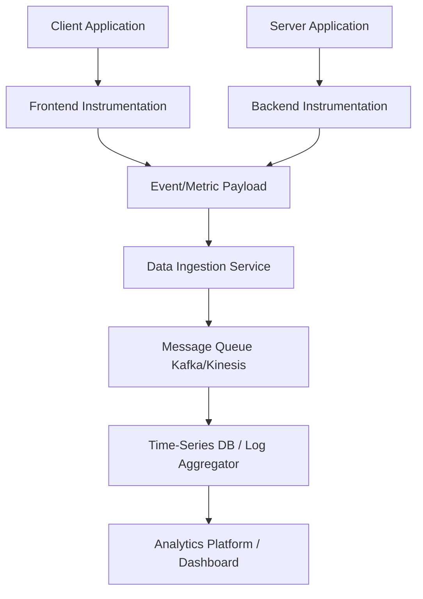

## Usage Monitoring & Instrumentation
### Core Concepts
*   **Usage Monitoring:** The process of collecting data about how users interact with a software system. This includes user journeys, feature adoption, engagement levels, and overall system utilization. It's crucial for understanding user behavior, business impact, and product adoption.
*   **Instrumentation:** The act of adding code or configuration to an application to emit telemetry data (metrics, logs, traces) about its internal operations and external interactions. It's the technical mechanism that enables monitoring and observability.
*   **Key Goals:**
    *   **User Behavior Analysis:** What features are used most? Where do users drop off?
    *   **Performance & Bottleneck Identification:** Is a specific user flow slow?
    *   **Business Impact:** How do system changes affect key performance indicators (KPIs) like conversions or retention?
    *   **Capacity Planning:** Predicting future resource needs based on usage trends.
    *   **A/B Testing:** Measuring the impact of feature variations on user engagement.

### Key Details & Nuances
*   **Types of Instrumentation:**
    *   **Manual (Code-based):** Developers explicitly add calls to logging frameworks or metric libraries (e.g., `logger.info()`, `metrics.increment()`). Provides high control and context.
    *   **Automatic (Agent-based):** APM (Application Performance Monitoring) tools or frameworks inject code at runtime (e.g., bytecode instrumentation in Java) or via middleware/plugins to capture common operations (HTTP requests, database calls). Less developer effort, but potentially less specific context.
    *   **Synthetic Monitoring:** Automated scripts simulate user interactions (e.g., login, search, checkout) from external locations to proactively detect availability and performance issues before real users are affected.
*   **Data Collection Methods:**
    *   **Client-Side (Frontend):**
        *   Collected directly in the user's browser or mobile app.
        *   Commonly tracks page views, clicks, form submissions, front-end errors, UI performance.
        *   Uses JavaScript SDKs (e.g., Google Analytics, Mixpanel, custom event emitters) to send data to a collection endpoint.
        *   **Challenge:** Can be blocked by ad-blockers, impacted by network issues, or manipulated by users.
    *   **Server-Side (Backend):**
        *   Collected directly from application servers, APIs, and databases.
        *   Tracks API calls, database queries, business logic execution, background job completions.
        *   Uses logging frameworks, metric libraries (e.g., Prometheus client, OpenTelemetry SDKs).
        *   **Advantage:** More reliable, less prone to client-side interference, can capture sensitive business logic.
*   **Data Transport & Processing:**
    *   **Asynchronous Processing:** Data is typically sent to a dedicated ingestion service (e.g., a simple HTTP endpoint, message queue) to avoid impacting application performance. Batching events reduces network overhead.
    *   **Data Pipelines:** Ingestion services forward data to message queues (Kafka, Kinesis) for high-throughput, fault-tolerant delivery to downstream processing systems.
    *   **Storage:**
        *   **Time-Series Databases (TSDBs):** For metrics (e.g., Prometheus, InfluxDB). Optimized for numerical data over time.
        *   **Log Aggregators:** For structured logs (e.g., ELK stack - Elasticsearch, Logstash, Kibana; Splunk). For full-text search and analysis.
        *   **Data Warehouses:** For complex analytics and reporting (e.g., Snowflake, BigQuery).
*   **Granularity & Sampling:** Decide whether to collect every event or sample data. High-volume events might require sampling to manage storage costs and processing overhead, but this can impact statistical accuracy.
*   **Contextualization:** Metrics are most powerful when combined with logs (for detail) and traces (for end-to-end flow). Implementing OpenTelemetry can unify these signals.
*   **Privacy & Compliance (GDPR, CCPA):** Crucial considerations when collecting user data. Implement anonymization, pseudonymization, consent management, and strict data retention policies. Avoid collecting Personally Identifiable Information (PII) where possible.

### Practical Examples

#### 1. Frontend Usage Instrumentation (TypeScript)

```typescript
// analytics.ts
interface AnalyticsEvent {
    eventName: string;
    properties?: Record<string, any>;
}

class AnalyticsService {
    private endpoint: string;
    private queue: AnalyticsEvent[] = [];
    private isSending: boolean = false;
    private debounceTimer: ReturnType<typeof setTimeout> | null = null;

    constructor(endpoint: string) {
        this.endpoint = endpoint;
        // Send events in batches every 5 seconds
        setInterval(() => this.sendEventsBatch(), 5000); 
    }

    // Capture a user event
    track(eventName: string, properties?: Record<string, any>): void {
        this.queue.push({ eventName, properties: { ...properties, timestamp: new Date().toISOString() } });
        this.debounceSend(); // Trigger a send after a short debounce
    }

    // Debounce immediate sends for burst events
    private debounceSend(): void {
        if (this.debounceTimer) {
            clearTimeout(this.debounceTimer);
        }
        this.debounceTimer = setTimeout(() => {
            if (!this.isSending) {
                this.sendEventsBatch();
            }
        }, 500); // Wait 500ms before attempting to send
    }

    // Send the accumulated events as a batch
    private async sendEventsBatch(): Promise<void> {
        if (this.queue.length === 0 || this.isSending) {
            return;
        }

        this.isSending = true;
        const eventsToSend = [...this.queue];
        this.queue = []; // Clear the queue immediately

        try {
            await fetch(this.endpoint, {
                method: 'POST',
                headers: { 'Content-Type': 'application/json' },
                body: JSON.stringify({ events: eventsToSend })
            });
            console.log(`Sent ${eventsToSend.length} events.`);
        } catch (error) {
            console.error('Failed to send analytics events:', error);
            // Re-queue failed events if necessary, or log for later retry
            this.queue.unshift(...eventsToSend); // Add back to front of queue
        } finally {
            this.isSending = false;
        }
    }
}

// Usage in a React component or vanilla JS application
const analytics = new AnalyticsService('/api/v1/analytics');

// Example usage:
document.getElementById('buy-button')?.addEventListener('click', () => {
    analytics.track('ProductPurchased', { productId: 'P123', price: 99.99 });
});

window.addEventListener('load', () => {
    analytics.track('PageView', { page: window.location.pathname });
});
```

#### 2. Usage Monitoring Data Flow



### Common Pitfalls & Trade-offs
*   **Over-Instrumentation vs. Under-Instrumentation:**
    *   **Over-Instrumentation:** Can lead to performance overhead (increased CPU, network I/O), excessive data volume (storage costs, processing load), and "noise" in dashboards, making it hard to find meaningful signals.
    *   **Under-Instrumentation:** Results in blind spots, making it impossible to diagnose issues, understand user behavior, or measure business impact.
    *   **Trade-off:** Start with essential, high-level metrics and add more granular instrumentation as specific questions or issues arise. Focus on "why" a metric is needed.
*   **Performance Impact:** Synchronous collection and transmission of telemetry can block application threads, leading to slow response times.
    *   **Trade-off:** Always prefer asynchronous, non-blocking methods (e.g., background threads, message queues, batched sends) for telemetry.
*   **Cost:** Storing and processing large volumes of data (especially logs) can be very expensive.
    *   **Trade-off:** Implement effective data retention policies, use sampling for high-volume, low-criticality data, and utilize efficient storage solutions (e.g., object storage for raw logs).
*   **Data Consistency & Accuracy:** Client-side data can be unreliable (ad-blockers, network issues, user manipulation). Server-side data is generally more trustworthy for business-critical metrics.
    *   **Trade-off:** Use server-side instrumentation for billing, critical conversions, or sensitive data. Supplement with client-side for user experience and frontend performance.
*   **Privacy Violations:** Accidentally collecting PII without consent or proper handling can lead to legal issues.
    *   **Trade-off:** Establish clear data governance policies, perform regular audits, and leverage anonymization/pseudonymization techniques.

### Interview Questions
1.  **Question:** You're launching a new e-commerce product feature (e.g., a "Buy Now" button). What specific metrics would you instrument and why, to understand its success and potential issues?
    *   **Answer:**
        *   **Conversion Rate:** Clicks on "Buy Now" leading to successful purchase (server-side for reliability). Measures feature effectiveness.
        *   **Click-through Rate:** Impressions of the button vs. clicks (client-side). Indicates visibility/desirability.
        *   **Latency/Errors:** Time taken for the purchase API call, number of failed purchases (server-side API metrics). Identifies performance bottlenecks or bugs.
        *   **Abandonment Rate:** Users who click "Buy Now" but don't complete the purchase (tracked through a multi-step funnel via client/server events). Pinpoints where users drop off.
        *   **Unique Users:** Number of distinct users interacting with the button. Helps understand adoption breadth.
        *   **Why:** These metrics cover business impact, user experience, and system health, providing a holistic view of the feature's performance.

2.  **Question:** Describe the architectural components and data flow for a robust, scalable usage monitoring system designed for a high-traffic SaaS application.
    *   **Answer:**
        *   **Instrumentation Layer:** Client-side SDKs (JS/Mobile) and Server-side libraries (OpenTelemetry, custom emitters) to capture events/metrics.
        *   **Ingestion Service:** A highly available, horizontally scalable API gateway/service (e.g., Nginx + custom service) receiving telemetry data. It should handle high write throughput and perform initial validation.
        *   **Message Queue:** A distributed, fault-tolerant message queue (e.g., Kafka, Kinesis) to decouple ingestion from processing, buffer spikes, and ensure durability.
        *   **Processing Layer:** Consumers from the message queue (e.g., Flink, Spark Streaming, Lambda functions) to transform, enrich (e.g., geo-locate IP, join user metadata), aggregate, and filter data.
        *   **Storage Layer:**
            *   Time-series database (Prometheus, InfluxDB) for aggregated metrics.
            *   Log aggregation system (Elasticsearch/Splunk) for detailed event logs.
            *   Data warehouse (Snowflake, BigQuery) for long-term storage and complex analytical queries.
        *   **Visualization/Alerting:** Dashboards (Grafana, Kibana), reporting tools, and alerting systems (PagerDuty, custom notifications) built on top of the storage layers.

3.  **Question:** How would you minimize the performance overhead of comprehensive instrumentation in a latency-sensitive microservice architecture?
    *   **Answer:**
        *   **Asynchronous Processing:** Telemetry data should be collected and sent asynchronously, ideally in a separate thread or non-blocking I/O, to avoid impacting the main request path.
        *   **Batching:** Aggregate multiple events/metrics into a single network call before sending them to the ingestion service.
        *   **Sampling:** For very high-volume events, implement intelligent sampling (e.g., head-based for traces, tail-based for logs, or probabilistic sampling) to reduce data volume without losing too much fidelity.
        *   **Efficient Libraries:** Use highly optimized, low-overhead instrumentation libraries (e.g., native OpenTelemetry SDKs).
        *   **Push vs. Pull:** For metrics, consider a pull model (Prometheus) where the monitoring system scrapes metrics at intervals, reducing application-side push burden.
        *   **Hardware Acceleration:** For very high-throughput logging, consider dedicated logging appliances or offloading logging to specialized services or sidecars (e.g., Fluentd, Logstash).
        *   **Profile Before Optimizing:** Use profiling tools to identify the actual overhead of instrumentation and optimize only where necessary.