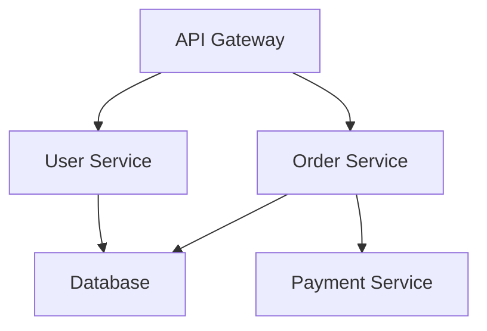

## Visualization & Alerts
### Core Concepts

*   **Visualization:** Transforming raw monitoring data (logs, metrics, traces) into human-readable formats (dashboards, graphs) to understand system behavior, performance, and health.
*   **Alerting:** Proactively notifying relevant teams or individuals when specific conditions or anomalies are detected in the system, indicating potential issues or failures.

### Key Details & Nuances

*   **Metrics Visualization:**
    *   **Time-series data:** Aggregated numerical data over time (e.g., CPU usage, request latency, error rate).
    *   **Common visualizations:** Line graphs, bar charts, heatmaps, gauge charts.
    *   **Key metrics:** Latency (p95, p99), throughput (requests/sec), error rate, resource utilization (CPU, memory, network).
    *   **Dashboards:** Collections of related visualizations, often grouped by service, component, or user journey. Designed for quick system health overview.
*   **Log Visualization:**
    *   **Structured vs. Unstructured logs:** Structured logs (e.g., JSON) are easier to query and visualize.
    *   **Common visualizations:** Tables, log search interfaces, error distribution charts.
    *   **Log aggregation:** Centralizing logs from distributed systems (e.g., ELK stack, Splunk, Loki).
*   **Trace Visualization:**
    *   **Distributed tracing:** Tracking requests as they flow through multiple services.
    *   **Common visualizations:** Gantt charts (waterfall diagrams) showing service call duration and dependencies.
    *   **Key data:** Span duration, parent-child relationships, service names, metadata.
*   **Alerting Mechanisms:**
    *   **Threshold-based alerts:** Triggered when a metric crosses a predefined static or dynamic threshold.
    *   **Anomaly detection alerts:** Triggered when a metric deviates significantly from its expected pattern (often using ML).
    *   **Event-based alerts:** Triggered by specific log messages or trace events (e.g., critical error logged).
    *   **Alert routing:** Directing alerts to the correct team or individual based on severity, service, or time of day (e.g., PagerDuty, Opsgenie).
    *   **Alert fatigue:** A critical problem where too many non-actionable alerts lead to ignoring important ones.
*   **Correlation:** Ability to correlate different data sources (metrics, logs, traces) within a visualization or alert to quickly pinpoint root causes.

### Practical Examples

*   **Alerting on High Latency:**
    *   **Metric:** `http_request_duration_seconds_bucket` (e.g., from Prometheus using histogram metrics).
    *   **Condition:** `histogram_quantile(0.99, sum by (le, path) (rate(http_request_duration_seconds_bucket[5m]))) > 1.5` (99th percentile latency > 1.5 seconds for the last 5 minutes).

*   **Dashboard for Service Health:**
    *   A dashboard showing key metrics for a specific microservice:
        *   **Graph 1:** Request rate (line chart).
        *   **Graph 2:** P95/P99 latency (line chart with multiple lines).
        *   **Graph 3:** Error rate (line chart).
        *   **Table:** Top 10 recent error logs.

*   **Trace Visualization:**
    *   Visualizing a slow API call that involves multiple backend services.
    *   The waterfall diagram clearly shows which service contributed most to the overall latency.

### Common Pitfalls & Trade-offs

*   **Alerting Pitfalls:**
    *   **Too noisy:** Alerts fire too frequently for minor, non-impactful events.
    *   **Not sensitive enough:** Alerts fire too late, or not at all, for critical failures.
    *   **Lack of context:** Alerts don't provide enough information to diagnose the problem.
    *   **No clear owner:** Alerts go unaddressed because it's unclear who is responsible.
*   **Visualization Pitfalls:**
    *   **Information overload:** Dashboards are cluttered with too many graphs, making it hard to find relevant information.
    *   **Misleading scales:** Graphs with inappropriate Y-axis scales can hide significant changes or exaggerate minor ones.
    *   **Lack of aggregation:** Displaying raw data instead of aggregated metrics makes it hard to spot trends.
*   **Trade-offs:**
    *   **Granularity vs. Cost/Performance:** Higher granularity (more frequent metrics, detailed logs) leads to more data to store and process, increasing costs and potentially impacting system performance.
    *   **Alerting Sensitivity vs. False Positives:** Setting thresholds too sensitive increases the risk of false positives (alert fatigue), while being too lenient can lead to missing actual issues.
    *   **Tooling Complexity vs. Features:** Powerful observability platforms offer rich features but can be complex to set up and manage.

### Interview Questions

1.  **Question:** How would you design a system to monitor the health of a distributed e-commerce platform, and what key metrics would you focus on?
    *   **Answer:** I'd focus on a layered approach: infrastructure (CPU, memory, network), application-level (request rate, latency, error rate per service), and business-level (orders per minute, conversion rate). For visualization, I'd use Grafana with Prometheus for metrics, Elasticsearch/Kibana for logs, and Jaeger for tracing. Key metrics would include p99 latency for critical user flows, error rates across services, queue lengths for asynchronous processing, and end-to-end transaction success rates. Alerts would be tiered based on severity, with clear runbooks for each.

2.  **Question:** You've noticed a spike in P99 latency for a critical API. How would you use observability tools to diagnose the root cause?
    *   **Answer:** I'd start by checking the P99 latency graph in Grafana. Then, I'd pivot to logs for that specific time window, filtering by the affected service and looking for error messages, timeouts, or high resource utilization. Simultaneously, I'd examine trace data for slow requests, identifying which downstream service or database call is causing the bottleneck. Correlating these (e.g., seeing high DB query times in traces and corresponding slow query logs) would point to the root cause.

3.  **Question:** What are the challenges of implementing effective alerting in a microservices environment, and how can you mitigate alert fatigue?
    *   **Answer:** Challenges include the sheer number of services, varying criticality, and transient issues. To mitigate alert fatigue:
        *   **Actionable Alerts:** Ensure every alert has a clear severity, impact, and associated runbook.
        *   **Deduplication & Grouping:** Group related alerts to avoid redundant notifications.
        *   **Smart Thresholds:** Use dynamic thresholds or anomaly detection instead of static ones where appropriate.
        *   **Tiered Alerting:** Route alerts based on severity and on-call schedules.
        *   **Regular Review:** Periodically review and tune alerting rules to remove noisy or irrelevant alerts.
        *   **Integrate SLOs:** Alert when Service Level Objectives (SLOs) are at risk, focusing on user impact.