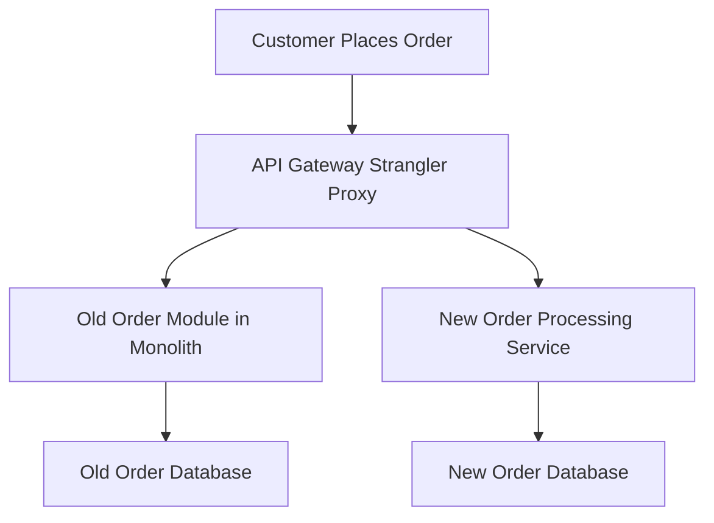

## Strangler Fig Pattern
### Core Concepts
*   **Definition:** An architectural pattern for incrementally refactoring a monolithic application into microservices or a new system by gradually diverting traffic from the old system to the new one.
*   **Analogy:** Named after the strangler fig vine, which grows around a host tree, eventually consuming and replacing it. The "strangler" acts as a facade or proxy.
*   **Primary Use Case:** Ideal for safely migrating legacy monolithic applications to modern, distributed architectures (e.g., microservices) without a costly, high-risk "big bang" rewrite.

### Key Details & Nuances
*   **Incremental Migration:** Functionality is moved piece by piece, allowing for continuous deployment and testing, minimizing risk and downtime.
*   **Proxy Layer (The "Strangler"):** An intermediary service (often an API Gateway or a dedicated routing layer) that intercepts all incoming requests.
    *   It determines whether to route the request to the existing legacy system or the newly built service.
    *   This layer is the "strangler" that gradually takes over the functionality.
*   **Co-existence:** The old and new systems operate simultaneously during the transition period.
*   **Data Migration Strategy:** Critical aspect. Data may need to be replicated, synchronized, or fully migrated as functionality shifts. Often involves dual-writing to both old and new databases during the transition.
*   **Service Granularity:** Deciding which pieces of functionality to "strangle" and how to define their boundaries in the new system is crucial.

### Practical Examples
*   **Scenario:** Migrating an e-commerce monolith's order processing module to a new microservice.
*   **Request Flow:**

*   **Conceptual Proxy Routing (TypeScript):**
```typescript
class StranglerProxy {
    private legacyServiceUrl: string;
    private newOrderServiceUrl: string;

    constructor(legacyUrl: string, newUrl: string) {
        this.legacyServiceUrl = legacyUrl;
        this.newOrderServiceUrl = newUrl;
    }

    async handleRequest(path: string, payload: any): Promise<any> {
        // Example: If path starts with /v2/orders, route to new service
        if (path.startsWith('/v2/orders')) {
            console.log("Routing to new order service...");
            return this.routeToNewService(path, payload);
        }
        // Otherwise, route to legacy monolith
        console.log("Routing to legacy service...");
        return this.routeToLegacyService(path, payload);
    }

    private async routeToNewService(path: string, payload: any): Promise<any> {
        // In a real scenario, this would involve HTTP requests
        // For example: await fetch(`${this.newOrderServiceUrl}${path}`, { method: 'POST', body: JSON.stringify(payload) });
        return { status: 200, message: "Handled by new service" };
    }

    private async routeToLegacyService(path: string, payload: any): Promise<any> {
        // For example: await fetch(`${this.legacyServiceUrl}${path}`, { method: 'POST', body: JSON.stringify(payload) });
        return { status: 200, message: "Handled by legacy service" };
    }
}

// Usage Example
const proxy = new StranglerProxy("http://legacy-app.com", "http://new-order-service.com");
proxy.handleRequest("/v1/products", { productId: "123" }); // Routes to legacy
proxy.handleRequest("/v2/orders/create", { items: ["itemA"] }); // Routes to new
```

### Common Pitfalls & Trade-offs
*   **Pitfalls:**
    *   **Data Consistency:** Ensuring data integrity between the old and new systems during the transition is complex and critical.
    *   **Complex Routing Logic:** The proxy can become a bottleneck or overly complex if routing rules are not managed carefully.
    *   **"Never-Ending Strangler":** The migration may stall, leaving an indefinitely complex hybrid system where both systems coexist.
    *   **Performance Overhead:** The proxy introduces an additional hop, potentially increasing latency, though often negligible.
*   **Trade-offs:**
    *   **Pros:**
        *   **Reduced Risk:** Avoids risky "big bang" rewrites.
        *   **Business Continuity:** Allows the legacy system to remain operational during migration.
        *   **Faster Time-to-Market (for new features):** New features can be built directly in the new architecture.
        *   **Learning & Iteration:** Allows teams to learn about the new architecture and adjust incrementally.
    *   **Cons:**
        *   **Increased Operational Complexity:** Maintaining two systems simultaneously (the monolith and the new services) can be resource-intensive.
        *   **Temporary Architecture:** The proxy and dual-running systems are temporary, adding architectural overhead during the transition.
        *   **Data Migration Challenges:** Can be the most difficult aspect, especially with large, intertwined datasets.

### Interview Questions
*   **Q1:** Explain the Strangler Fig Pattern and its primary use case in system modernization.
    *   **Answer:** It's an incremental approach to refactor a monolithic application by gradually replacing old functionalities with new services. A proxy routes requests either to the old monolith or the new service, allowing safe, piecemeal migration without a "big bang" rewrite, primarily used for transitioning to microservices or a new architecture.
*   **Q2:** What are the key components involved in implementing a Strangler Fig migration, and how do they interact?
    *   **Answer:** The main components are the **legacy monolith**, the **new services/system**, and a **strangler proxy/API gateway**. The proxy intercepts all incoming requests, routing them to either the old system (for unmigrated functionalities) or the new services (for migrated functionalities). This allows the new system to "strangle" the old one by taking over its responsibilities piece by piece.
*   **Q3:** Discuss the main advantages and disadvantages of using the Strangler Fig Pattern.
    *   **Answer:** **Advantages** include reduced risk (no "big bang"), business continuity, continuous delivery of new features, and the ability to learn/iterate on the new architecture. **Disadvantages** involve increased operational complexity (managing two systems), potential performance overhead from the proxy, challenges with data migration and consistency, and the risk of the migration never fully completing.
*   **Q4:** How do you typically handle data migration and ensure data consistency when applying the Strangler Fig Pattern?
    *   **Answer:** Data migration is often the trickiest part. Strategies include: **Dual writes** (writing to both old and new databases during transition for new data), **data replication** (asynchronously copying data from old to new), **backfilling** (migrating historical data), and ensuring **eventual consistency** or strong consistency depending on the specific use case. The goal is to ensure the new service has the data it needs while the old service still operates.
*   **Q5:** In what scenarios would the Strangler Fig Pattern *not* be the ideal choice for modernizing a legacy system?
    *   **Answer:** It might not be ideal if the monolith is very small and can be rewritten quickly and safely; if the application's functionality is so tightly coupled that extracting pieces is prohibitively complex; if there's no continuous development or immediate business need for new features on the old system; or if a complete architectural overhaul is mandated with a hard deadline and a new, clean slate approach is preferred over incremental transition.