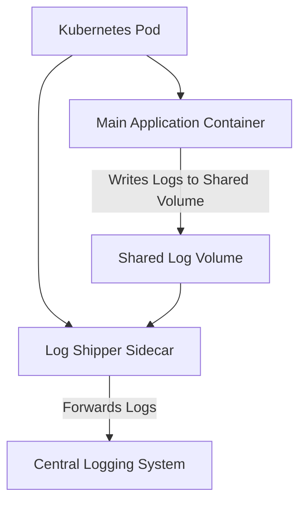

## Sidecar Pattern
### Core Concepts
*   **Definition:** An architectural design pattern where a "sidecar" helper container runs alongside a primary application container within the same execution unit (e.g., a Kubernetes Pod, a VM).
*   **Purpose:** To augment the primary application with additional functionalities without modifying its core code, thereby decoupling concerns.
*   **Analogy:** Similar to a sidecar attached to a motorcycle – it accompanies the main vehicle and adds functionality, but is separate.
*   **Key Characteristic:** Sidecar containers share the same network namespace, IPC namespace, and often shared volumes with the main application container, allowing them to communicate via `localhost` or shared file systems.

### Key Details & Nuances
*   **Decoupling:** Separates cross-cutting concerns (e.g., logging, monitoring, networking) from the main application's business logic.
*   **Shared Lifecycle:** The sidecar container shares the lifecycle of the main application container; they are deployed, started, and stopped together within the same pod/environment.
*   **Technology Heterogeneity:** Allows sidecar functionality to be implemented in a different language or technology stack than the main application.
*   **Key Use Cases:**
    *   **Service Mesh Proxy:** Most prominent use case (e.g., Envoy proxy in Istio). Handles traffic management (routing, load balancing), circuit breaking, retries, mTLS encryption, and observability without application code changes.
    *   **Centralized Logging:** Running a logging agent (e.g., Fluentd, Logstash-forwarder, Filebeat) that collects logs from the main application's shared volume or stdout/stderr and ships them to a centralized logging system.
    *   **Metrics Collection:** Deploying a metrics agent (e.g., Prometheus Node Exporter, custom collector) alongside the application.
    *   **Configuration Management:** A sidecar that dynamically fetches and updates application configuration.
    *   **External API Adapters:** Handling authentication, transformation, or caching for external API calls made by the main application.

### Practical Examples
#### Kubernetes Pod with Sidecar for Log Collection
A common scenario is using a sidecar to collect application logs from a shared volume and forward them to a centralized logging service.



#### Conceptual Kubernetes Pod YAML
This illustrates how a sidecar container (`log-shipper`) runs alongside the `main-app` container within a single pod.

```yaml
apiVersion: v1
kind: Pod
metadata:
  name: my-app-pod
spec:
  volumes:
    - name: app-logs
      emptyDir: {} # A temporary volume for logs
  containers:
    - name: main-app
      image: my-company/my-app:1.0
      volumeMounts:
        - name: app-logs
          mountPath: /var/log/app # Main app writes logs here
      ports:
        - containerPort: 8080
    - name: log-shipper
      image: fluentd/fluentd:v1.14 # Example log shipper
      volumeMounts:
        - name: app-logs
          mountPath: /var/log/app # Sidecar reads logs from here
      env:
        - name: LOG_TARGET
          value: "http://log-aggregator.internal/api/logs"
```

### Common Pitfalls & Trade-offs
*   **Benefits:**
    *   **Loose Coupling & Modularity:** Separates concerns, simplifies main application development.
    *   **Reusability:** The same sidecar can be reused across multiple different applications.
    *   **Independent Scaling (of functionality):** While the sidecar scales with the main app instance, its *development* and *deployment* are independent.
    *   **Reduced Development Overhead:** Developers can focus on business logic, offloading infrastructure concerns.
    *   **Technology Freedom:** Sidecar can use a different tech stack than the main application.
*   **Drawbacks:**
    *   **Resource Overhead:** Each sidecar consumes its own resources (CPU, memory), increasing the overall resource footprint per instance.
    *   **Increased Operational Complexity:** Managing multiple containers within a pod (e.g., health checks, logging).
    *   **Shared Failure Domain:** A crash in the sidecar can cause the entire pod (and thus the main application) to restart.
    *   **Network Communication Overhead:** While `localhost` is fast, there's still inter-process communication overhead.
    *   **Increased Attack Surface:** More components within the same boundary might increase attack vectors if not secured properly.

### Interview Questions
1.  **What problem does the Sidecar pattern solve, and when would you choose to implement it over a shared library?**
    *   **Answer:** It solves the problem of separating cross-cutting concerns (e.g., logging, monitoring, network proxies) from the core application logic without forcing changes to the application's code. Choose it over a shared library when:
        *   The functionality requires a different runtime environment or technology stack.
        *   The functionality needs to be independently updated or versioned from the main application.
        *   The functionality is highly generic and can be reused across many heterogeneous applications.
        *   You need to abstract infrastructure concerns (e.g., service mesh functionality like mTLS, traffic shaping) from application developers.

2.  **Describe a real-world scenario where the Sidecar pattern is extensively used and explain its benefits there.**
    *   **Answer:** A prime example is in **Service Mesh architectures (e.g., Istio with Envoy proxy)**. An Envoy sidecar is injected into every application pod.
    *   **Benefits:** Envoy handles all inbound/outbound network traffic, providing capabilities like load balancing, retries, circuit breaking, mTLS encryption, traffic routing, and detailed telemetry, all transparently to the application. This offloads complex networking logic from application developers, standardizes network policy enforcement, and provides centralized observability.

3.  **What are the main trade-offs to consider when adopting the Sidecar pattern in a microservices architecture?**
    *   **Answer:**
        *   **Benefits:** Loose coupling, reusability of infrastructure components, independent development/deployment of sidecar, technology stack flexibility.
        *   **Drawbacks:** Increased resource consumption per pod (CPU, memory for each sidecar), increased operational complexity (managing multiple containers, ensuring inter-container communication), shared failure domain (sidecar crash impacts main app).

4.  **How do the main application and the sidecar communicate with each other within the same execution environment (e.g., Kubernetes Pod)?**
    *   **Answer:** They communicate primarily through:
        *   **`localhost` (Network Interface):** Since they share the same network namespace, they can directly communicate over `localhost` using TCP/UDP sockets (e.g., the main app calls the sidecar's API endpoint, or vice versa).
        *   **Shared Volumes:** For file-based communication, like a logging sidecar reading logs written by the main application to a shared `emptyDir` volume.
        *   **Inter-Process Communication (IPC):** Though less common for general use, mechanisms like named pipes or shared memory could theoretically be used.

5.  **When might the Sidecar pattern *not* be the best choice, and what alternatives exist?**
    *   **Answer:** It might not be the best choice when the overhead (resource consumption, operational complexity) outweighs the benefits, especially for very simple services or environments with strict resource constraints.
    *   **Alternatives:**
        *   **Shared Libraries/SDKs:** For reusable code components where runtime coupling is acceptable and the functionality is not infrastructure-level.
        *   **Node Agents/DaemonSets (Kubernetes):** For cluster-wide concerns where one agent per node is sufficient (e.g., a node-level log collector or monitoring agent) rather than one per pod.
        *   **Service Proxies (Traditional):** External proxies or API Gateways, though these often operate at a higher level and don't share the direct co-location benefits of a sidecar.