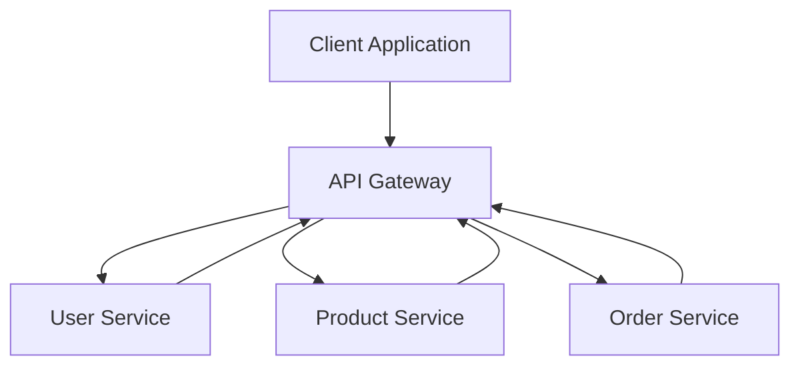

## Gateway Patterns
### Core Concepts

*   **Definition:** Gateway Patterns are architectural styles used in distributed systems, especially microservices, to manage, route, and secure external access to internal services. They act as a single entry point for clients, abstracting the complexity of the underlying microservice architecture.
*   **Primary Goal:** Simplify client-server interactions by aggregating requests, handling cross-cutting concerns (e.g., authentication, rate limiting), and providing a stable API for various client types.

### Key Details & Nuances

*   **API Gateway:**
    *   **Purpose:** A centralized component that acts as a reverse proxy for all client requests, routing them to the appropriate microservices. It handles concerns like request routing, composition, protocol translation, caching, and applies common policies.
    *   **Client Abstraction:** Hides the internal microservice structure from clients, allowing services to evolve independently without impacting external consumers.
    *   **Cross-Cutting Concerns:** Offloads functionalities from individual microservices, such as:
        *   **Authentication & Authorization:** Verifying client identity and permissions.
        *   **Rate Limiting/Throttling:** Protecting services from overload.
        *   **Request/Response Transformation:** Adapting data formats for client needs.
        *   **Load Balancing:** Distributing requests among service instances.
        *   **Logging & Monitoring:** Centralized collection of access logs and metrics.
        *   **Caching:** Reducing load on backend services.
        *   **Circuit Breakers/Bulkheads:** Improving resilience.
*   **Backend-for-Frontend (BFF):**
    *   **Purpose:** A specialized API Gateway pattern where a separate gateway is built for *each type of client application* (e.g., web, mobile, admin dashboard).
    *   **Client-Specific Optimization:** Tailors API responses and request aggregation specifically for the needs of a particular frontend, reducing over-fetching or under-fetching of data by the client.
    *   **Decoupling:** Allows frontend teams to iterate independently of each other and backend service teams.
*   **Service Mesh (Distinction):**
    *   **Purpose:** Primarily handles *inter-service communication* within the microservices ecosystem, focusing on reliability, observability, and security for service-to-service calls.
    *   **Not a Gateway:** While it shares some cross-cutting concerns (e.g., routing, retries, circuit breakers), it operates at a different layer (data plane for internal traffic) and is not typically exposed directly to external clients. An API Gateway often sits *in front of* a service mesh.

### Practical Examples

#### **1. API Gateway Routing Flow**


*   **Description:** A client sends a request to the API Gateway. The Gateway then routes the request to the appropriate internal microservice (User, Product, or Order Service) based on predefined rules.

#### **2. Conceptual API Gateway Middleware (TypeScript)**

```typescript
// --- Simplified Conceptual API Gateway ---

// Middleware function type
type Middleware = (req: Request, res: Response, next: Function) => void;

// Simple Request/Response types
interface Request {
    path: string;
    method: string;
    headers: Record<string, string>;
    body?: any;
}

interface Response {
    statusCode: number;
    body: any;
}

// Represents a handler for a specific microservice endpoint
type MicroserviceHandler = (req: Request) => Promise<Response>;

class ApiGateway {
    private routes: Map<string, MicroserviceHandler>;
    private globalMiddlewares: Middleware[];

    constructor() {
        this.routes = new Map();
        this.globalMiddlewares = [];
    }

    // Register a middleware to be applied to all requests
    use(middleware: Middleware) {
        this.globalMiddlewares.push(middleware);
    }

    // Register a route to a specific microservice handler
    registerRoute(path: string, handler: MicroserviceHandler) {
        this.routes.set(path, handler);
    }

    async processRequest(req: Request): Promise<Response> {
        let currentReq = { ...req }; // Copy to allow middleware modification
        let currentRes: Response = { statusCode: 200, body: {} };

        // Execute global middlewares
        for (const mw of this.globalMiddlewares) {
            let nextCalled = false;
            await new Promise((resolve) => {
                mw(currentReq, currentRes, () => {
                    nextCalled = true;
                    resolve(null);
                });
            });
            if (!nextCalled) { // Middleware decided to short-circuit
                return currentRes;
            }
        }

        const handler = this.routes.get(currentReq.path);
        if (!handler) {
            return { statusCode: 404, body: { message: "Not Found" } };
        }

        try {
            return await handler(currentReq);
        } catch (error: any) {
            console.error(`Error processing request for ${currentReq.path}:`, error.message);
            return { statusCode: 500, body: { message: "Internal Server Error" } };
        }
    }
}

// --- Example Usage ---

const gateway = new ApiGateway();

// 1. Authentication Middleware
gateway.use((req, res, next) => {
    console.log(`[Middleware] Authenticating request for ${req.path}...`);
    const authHeader = req.headers['authorization'];
    if (!authHeader || !authHeader.startsWith('Bearer ')) {
        res.statusCode = 401;
        res.body = { message: "Unauthorized" };
        return; // Do not call next()
    }
    // In a real scenario, validate token and attach user info to req
    console.log("Authentication successful.");
    next(); // Proceed to next middleware or route handler
});

// 2. Logging Middleware
gateway.use((req, res, next) => {
    console.log(`[Middleware] Incoming request: ${req.method} ${req.path}`);
    next();
});

// Example Microservice Handlers
const userServiceHandler: MicroserviceHandler = async (req) => {
    console.log("-> Calling User Microservice");
    // Simulate calling a backend user service
    return { statusCode: 200, body: { id: "user123", name: "Alice" } };
};

const productServiceHandler: MicroserviceHandler = async (req) => {
    console.log("-> Calling Product Microservice");
    // Simulate calling a backend product service
    return { statusCode: 200, body: [{ id: "prod001", name: "Laptop" }] };
};

gateway.registerRoute('/api/users', userServiceHandler);
gateway.registerRoute('/api/products', productServiceHandler);

// Simulate requests
async function runSimulations() {
    console.log("\n--- Simulating Unauthorized Request ---");
    let res1 = await gateway.processRequest({
        path: '/api/users',
        method: 'GET',
        headers: {} // No auth header
    });
    console.log("Response:", res1);

    console.log("\n--- Simulating Authorized User Request ---");
    let res2 = await gateway.processRequest({
        path: '/api/users',
        method: 'GET',
        headers: { 'authorization': 'Bearer fake-token-user' }
    });
    console.log("Response:", res2);

    console.log("\n--- Simulating Authorized Product Request ---");
    let res3 = await gateway.processRequest({
        path: '/api/products',
        method: 'GET',
        headers: { 'authorization': 'Bearer fake-token-product' }
    });
    console.log("Response:", res3);

    console.log("\n--- Simulating Non-Existent Route ---");
    let res4 = await gateway.processRequest({
        path: '/api/orders',
        method: 'GET',
        headers: { 'authorization': 'Bearer fake-token' }
    });
    console.log("Response:", res4);
}

runSimulations();
```

### Common Pitfalls & Trade-offs

*   **Single Point of Failure (SPOF):** A centralized API Gateway becomes a critical component.
    *   **Mitigation:** High availability (active-passive or active-active redundancy), auto-scaling, robust monitoring and alerting.
*   **Increased Latency:** An additional network hop for every request.
    *   **Mitigation:** Optimize Gateway performance, efficient routing, caching at the gateway level. For high-throughput/low-latency scenarios, consider direct calls for internal services.
*   **Development & Deployment Complexity:** Requires careful management, versioning, and deployment of the gateway itself, especially with many services and routes.
    *   **Mitigation:** Automate deployments, use robust configuration management, adopt declarative API definitions (e.g., OpenAPI).
*   **Over-Centralization/Monolith Gateway:** If too much business logic or heavy request aggregation is put into the gateway, it can become a bottleneck or a distributed monolith.
    *   **Trade-off:** Balance common cross-cutting concerns at the gateway vs. service-specific logic within microservices. Use BFFs for client-specific complexities.
*   **Routing Overhead:** Complex routing rules can be difficult to manage and debug.
    *   **Mitigation:** Clear routing strategies, consistent naming conventions for services, automated testing for routing.
*   **Resource Consumption:** The gateway itself consumes CPU, memory, and network resources.

### Interview Questions

1.  **Question:** "What are the primary differences between an API Gateway and a Backend-for-Frontend (BFF), and when would you choose one over the other?"
    *   **Answer:** An **API Gateway** is a single, general-purpose entry point for all clients, handling universal concerns (auth, rate limiting, routing) across all microservices. A **BFF** is client-specific, meaning you'd have separate BFFs for web, mobile, etc., each optimized to serve its specific client's data and interaction patterns, often aggregating data from multiple services to reduce client-side complexity. Choose a **general API Gateway** when a single, uniform API works for all clients, or when your microservices are simple and client-facing. Opt for **BFFs** when you have diverse client types with vastly different data needs, want to avoid "fat clients" (complex client-side data aggregation), or when you want to decouple frontend and backend development teams more effectively.

2.  **Question:** "How does an API Gateway contribute to the security of a microservices architecture?"
    *   **Answer:** An API Gateway enhances security by acting as the system's enforcement point. It centralizes **authentication** (verifying who the client is) and **authorization** (checking what the client is allowed to do) for all incoming requests before they reach internal services. This prevents unauthorized access to individual microservices. It also facilitates **rate limiting** to mitigate DDoS attacks and can implement **IP whitelisting/blacklisting** or **SSL/TLS termination**, reducing the attack surface on backend services. By abstracting internal service details, it also helps prevent direct exposure of sensitive service endpoints.

3.  **Question:** "Describe common challenges when implementing an API Gateway and how to mitigate them."
    *   **Answer:** Key challenges include the **single point of failure** (mitigated by high availability, redundancy, and auto-scaling), **increased latency** (mitigated by optimizing gateway performance, caching, and efficient routing), and **development/operational complexity** (mitigated by automated deployments, robust configuration management, and declarative API definitions). Another challenge is the risk of the gateway becoming a **"distributed monolith"** if too much business logic is pushed into it; this is mitigated by keeping the gateway stateless and focused on cross-cutting concerns, offloading specific aggregation to BFFs or dedicated composition services.

4.  **Question:** "When would you consider *not* using an API Gateway in a distributed system, or what are the alternatives?"
    *   **Answer:** You might consider *not* using a full-blown API Gateway in very simple systems with few services where direct client-to-service communication is manageable and doesn't warrant the extra operational overhead. For internal service-to-service communication, a **Service Mesh** (e.g., Istio, Linkerd) is generally preferred over an API Gateway, as it focuses on internal traffic management, observability, and resilience at the network layer. In some cases, a very lean **load balancer** might suffice for basic routing without the rich features of an API Gateway. However, for externally exposed microservices, an API Gateway almost always adds significant value in terms of security, management, and client abstraction.