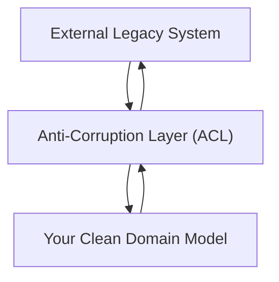

## Anti-Corruption Layer
### Core Concepts
*   **Definition:** An Anti-Corruption Layer (ACL) is a design pattern used to isolate a clean, modern domain model from a complex, legacy, or external system.
*   **Purpose:** It acts as a translation layer, preventing the "corruption" (pollution) of your domain model by the alien concepts, data structures, and behaviors of the integrated system.
*   **Primary Goal:** To allow the new system to evolve independently and maintain its own bounded context and ubiquitous language, without being dictated by the legacy system's model.

### Key Details & Nuances
*   **Translational Role:** The ACL translates concepts between the two distinct models. It transforms data, commands, and events from the legacy system's format into your domain's format, and vice-versa if bidirectional communication is needed.
*   **Strategies:** Can be implemented using various patterns:
    *   **Adapter:** Converts the interface of the legacy system into an interface that your new system expects.
    *   **Facade:** Provides a simplified interface to a complex subsystem (the legacy system).
    *   **Translator:** Specifically maps data structures and conceptual models.
    *   **Decorator:** Adds new responsibilities to an object (e.g., logging, validation) while still using the legacy system.
*   **Location:** Typically resides as a separate component or service between the two systems, often acting as a gateway.
*   **Bounded Contexts:** Strongly associated with Domain-Driven Design (DDD), where an ACL helps maintain the integrity of distinct bounded contexts during integration.
*   **When to Use:** Essential when integrating with:
    *   Legacy systems (e.g., mainframes, monolithic applications).
    *   Third-party APIs/services whose models don't align with yours.
    *   Databases with schema designs that are difficult to map directly to your domain.

### Practical Examples

**Mermaid Diagram: Data Flow with ACL**



**TypeScript Example: User Service Integration**

Imagine a new system needs to fetch user data from an old, unchangeable legacy system with a very different data structure.

```typescript
// --- Legacy System's User Model ---
interface LegacyUserDto {
    id: string;
    username: string;
    email_address: string; // Snake case, different name
    last_login_timestamp: number; // Unix timestamp
    active_status: 'Y' | 'N'; // Char field
}

// --- Your Clean Domain Model ---
interface User {
    userId: string;
    name: string;
    email: string;
    lastLoginAt: Date;
    isActive: boolean;
}

// --- Anti-Corruption Layer (ACL) ---
class LegacyUserAdapter {
    public static toDomain(legacyUser: LegacyUserDto): User {
        return {
            userId: legacyUser.id,
            name: legacyUser.username,
            email: legacyUser.email_address,
            lastLoginAt: new Date(legacyUser.last_login_timestamp * 1000), // Convert seconds to milliseconds
            isActive: legacyUser.active_status === 'Y',
        };
    }

    public static toLegacy(user: User): LegacyUserDto {
        // This direction might be partial or not needed depending on interaction
        return {
            id: user.userId,
            username: user.name,
            email_address: user.email,
            last_login_timestamp: Math.floor(user.lastLoginAt.getTime() / 1000),
            active_status: user.isActive ? 'Y' : 'N',
        };
    }
}

// --- Usage in Your Application ---
// const legacyUserData: LegacyUserDto = fetchFromLegacySystem(); // Assume this fetches data
// const user: User = LegacyUserAdapter.toDomain(legacyUserData);
// console.log(user);
```

### Common Pitfalls & Trade-offs
*   **Increased Complexity:** Introduces an additional layer and mapping logic, which adds to the overall system complexity and maintenance overhead.
*   **Performance Overhead:** Translation can introduce slight latency or resource consumption, especially for high-volume transactions.
*   **Maintenance Burden:** Mappings need to be updated whenever the legacy system's interface changes or your domain model evolves. This can be significant with frequently changing external systems.
*   **Over-Engineering:** Not always necessary for simple integrations or when the external model closely aligns with yours. Consider the cost-benefit.
*   **Bi-directional Complexity:** Translating back to the legacy system can be more challenging, as it often involves handling legacy constraints or specific update patterns.

### Interview Questions
1.  **What problem does an Anti-Corruption Layer (ACL) solve, and why is it important in system design?**
    *   **Answer:** An ACL solves the problem of integrating disparate systems without letting the "alien" model of one system pollute the clean domain model of another. It's crucial for maintaining the conceptual integrity and evolutionary flexibility of your system, especially when dealing with legacy applications or third-party services whose models cannot be changed. It prevents tight coupling and allows your domain to speak its own "ubiquitous language."

2.  **When would you choose to implement an ACL, and when might it be overkill?**
    *   **Answer:** Implement an ACL when integrating with complex legacy systems, external services with significantly different data models, or when preserving the purity of your domain model is paramount in a multi-bounded context architecture (DDD). It's overkill for simple integrations where models are already aligned, or for quick prototypes where long-term maintainability isn't the primary concern, as it adds overhead and complexity.

3.  **Describe how an ACL works in practice, using a concrete example of data transformation.**
    *   **Answer:** An ACL acts as a translator. For instance, when integrating a modern e-commerce system with an old inventory management system, the ACL would transform the legacy system's `PRODUCT_CODE` (string), `QTY_ON_HAND` (integer), and `EXPIRATION_DT` (numeric timestamp) into the e-commerce system's `productId` (UUID), `availableQuantity` (integer), and `expiryDate` (ISO 8601 string or Date object). It defines clear mapping rules, possibly using adapters or mappers, to ensure data consistency and semantic alignment between the two distinct models.

4.  **What are the main trade-offs associated with introducing an ACL into your architecture?**
    *   **Answer:** The primary trade-offs are increased complexity and potential performance overhead. An ACL adds an extra layer, requiring more code for mapping and translation, which increases maintenance burden, especially if external APIs change. There's also a slight runtime cost for the translation logic. However, these are often outweighed by the long-term benefits of a clean, isolated, and evolvable domain model.

5.  **How does the Anti-Corruption Layer relate to Domain-Driven Design (DDD)?**
    *   **Answer:** In DDD, an ACL is a tactical pattern used to manage integration between different Bounded Contexts. When two bounded contexts (e.g., `Sales` and `LegacyCRM`) need to interact but have different ubiquitous languages and domain models, the ACL acts as a barrier, translating concepts from the foreign context into the current context's model, thereby protecting the integrity of each context's core domain. It's a key strategy for implementing `Context Maps` effectively.