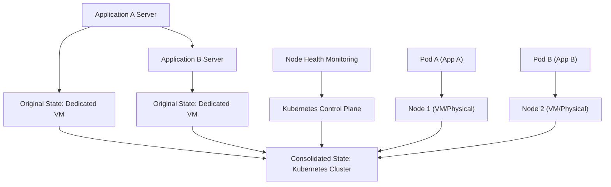

## Compute Resource Consolidation
### Core Concepts

*   **Definition:** Compute resource consolidation involves grouping multiple workloads or applications onto fewer physical or virtual machines to maximize resource utilization.
*   **Goal:** Reduce infrastructure costs, simplify management, and improve resource efficiency.
*   **Contrast:** Opposite of dedicated resource allocation or over-provisioning.

### Key Details & Nuances

*   **Virtualization:** The foundational technology enabling consolidation. Allows multiple OS instances (VMs) or containers to run on a single host.
    *   **Hypervisors:** (e.g., VMware ESXi, KVM, Hyper-V) manage VMs.
    *   **Containers:** (e.g., Docker, Kubernetes) share the host OS kernel, offering lighter-weight isolation.
*   **Resource Pooling:** Centralized management of CPU, memory, storage, and network resources that can be allocated dynamically to consolidated workloads.
*   **Workload Isolation:** Crucial for preventing noisy neighbor problems where one workload starves others of resources. Achieved via:
    *   **Resource Limits:** Setting maximum CPU, memory, and I/O for each workload.
    *   **Quality of Service (QoS):** Prioritizing critical workloads.
    *   **Container Orchestration:** (e.g., Kubernetes) automates scheduling, scaling, and resource management.
*   **Orchestration Platforms:** Kubernetes is the de facto standard for managing containerized consolidated workloads. It handles:
    *   Scheduling pods onto nodes.
    *   Auto-scaling based on load.
    *   Health monitoring and restarts.
    *   Service discovery and load balancing.
*   **Bare-metal Consolidation:** Less common now, but involves running multiple applications on a single OS, often through process isolation or careful configuration. Prone to resource contention.

### Practical Examples

*   **Scenario: Migrating dedicated application servers to a Kubernetes cluster.**



*   **Kubernetes Deployment Snippet (Conceptual):**

```yaml
apiVersion: apps/v1
kind: Deployment
metadata:
  name: my-app
spec:
  replicas: 3 # Number of instances (pods)
  selector:
    matchLabels:
      app: my-app
  template:
    metadata:
      labels:
        app: my-app
    spec:
      containers:
      - name: app-container
        image: my-docker-image:latest
        resources: # Resource Requests and Limits
          requests:
            memory: "64Mi"
            cpu: "250m" # 250 millicpu = 0.25 CPU core
          limits:
            memory: "128Mi"
            cpu: "500m" # 500 millicpu = 0.5 CPU core
```

### Common Pitfalls & Trade-offs

*   **Noisy Neighbor Problem:** One workload consuming excessive resources, impacting others on the same host. Mitigation: strict resource limits and QoS.
*   **Over-consolidation:** Placing too many workloads on a single host, leading to performance degradation and instability due to resource contention (CPU, I/O, network).
*   **Resource Fragmentation:** Inefficient allocation of resources over time, leaving small, unusable chunks of capacity.
*   **Complexity:** Managing a consolidated environment (especially with containers and orchestration) introduces significant operational complexity compared to dedicated servers.
*   **Security Isolation:** Containerization provides process-level isolation, not full OS-level isolation like VMs. Sensitive workloads may require VM-based consolidation or stricter security measures.
*   **Licensing:** Software licensing models might be based on physical cores or sockets, making consolidation financially disadvantageous if not carefully considered.

### Interview Questions

1.  **Question:** How would you decide if consolidating workloads onto fewer machines is a good strategy for a company?
    *   **Answer:** Evaluate current resource utilization (average and peak), identify underutilized servers, analyze workload characteristics (resource demands, burstiness, isolation requirements), and calculate potential cost savings versus the complexity and risk of introducing consolidation technologies like VMs or containers. Prioritize applications with steady, predictable loads and those that are not security-sensitive.

2.  **Question:** What are the main challenges when consolidating databases onto a single powerful server versus running them on dedicated hardware?
    *   **Answer:** The primary challenges are **resource contention** (CPU, memory, I/O, network bandwidth) impacting database performance for all instances, **security isolation** (a compromise in one DB instance could affect others), and **manageability/disaster recovery** (a failure on the consolidated server impacts all databases, making backups and restores more complex). Performance tuning becomes significantly harder.

3.  **Question:** Explain the "noisy neighbor" problem in the context of compute resource consolidation and how you would mitigate it.
    *   **Answer:** The noisy neighbor problem occurs when one application or workload consumes a disproportionate amount of shared resources (CPU, I/O, network), degrading the performance of other workloads on the same host. Mitigation strategies include: **strict resource limits** (CPU shares, memory limits), implementing **Quality of Service (QoS)** policies to prioritize critical workloads, **monitoring resource usage** and rebalancing workloads proactively, and using **container orchestrators** like Kubernetes which have built-in mechanisms for resource management and isolation.

4.  **Question:** When would you choose container consolidation (e.g., Docker/Kubernetes) over VM consolidation (e.g., VMware/KVM) for a new microservices application?
    *   **Answer:** Container consolidation is generally preferred for microservices due to its **lower overhead** (sharing the host OS kernel), **faster startup times**, and **higher density** (more application instances per host). It's ideal for stateless or loosely coupled services where fast scaling and deployment are key. VM consolidation is better suited for workloads requiring strong OS-level isolation, legacy applications that cannot be containerized, or when different operating systems are needed on the same host.